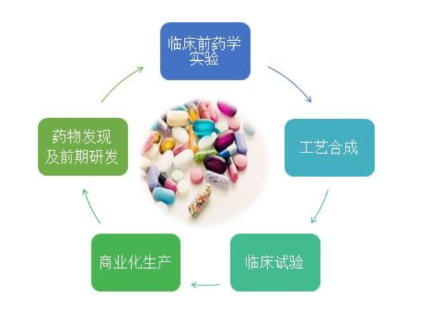
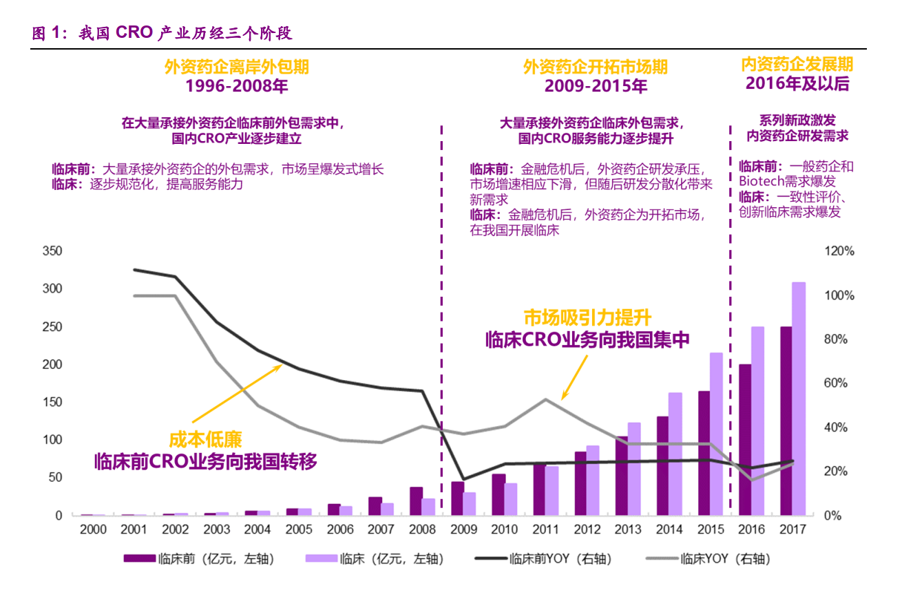
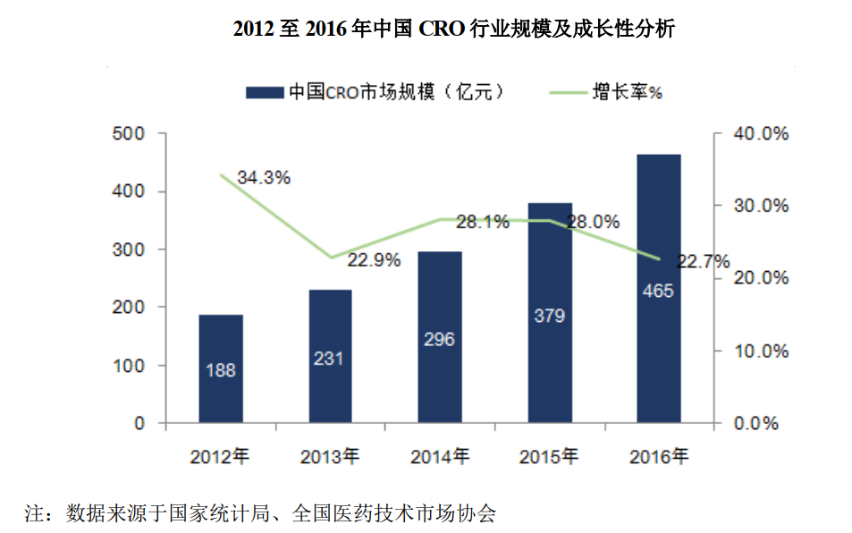
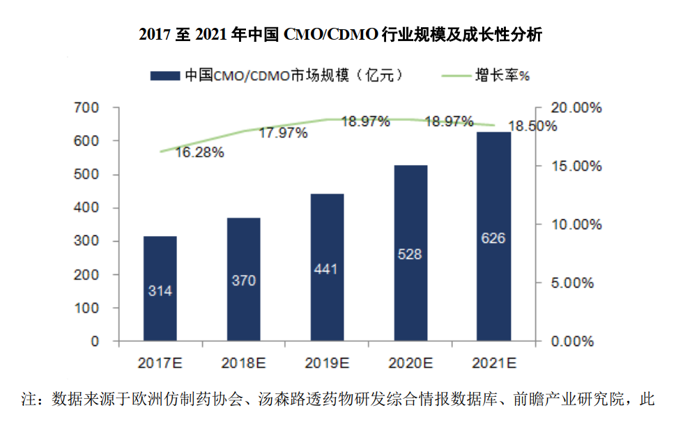
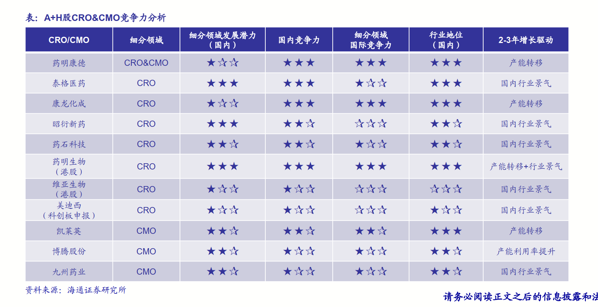
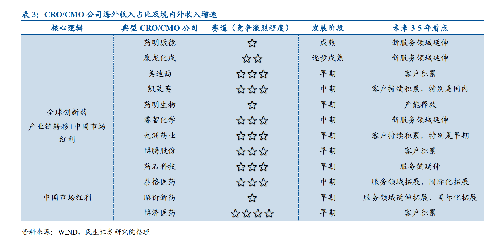

# 医药外包CRO-CMO-CDMO(20190907)

## 一、医药外包行业

### (一) 行业背景

​	新药研发主要分为药物发现及前期研发、临床前药学实验、工艺合成、临床试验及商业化生产等五个主要阶段。 

​	复杂化、长周期、高成本的药物研发： 药物研发外包服务行业源自于新药研发，新药研发从来就是一个复杂、漫长且成本极其高昂的过程。 以化学药为例，初期进入药物研发管道的 5000 至 10000 个先导化合物中，平均只有 250 个能够进入临床，平均只有 1 个能最终获得监管部门的新药批准，大量前期研发工作会以失败告终，从早期药物发现到最终商业化推出的成功率不足万分之一， 平均需要十年以上时间，单个新药的研发平均成本目前已经超过 20 亿美元。 

​	分工专业化促进外包服务行业发展： 面临多重研发困境， 跨国制药企业自身研发模式逐步转变， 药物研发产业链逐步走向分工专业化、精细化， 促进了药物研发外包服务行业的快速发展，产业地位逐步提升。 

​	药物研发外包实现产业链全覆盖： 作为药物研发分工专业化的产物，药物研发服务企业凭借其成本优势、专业高效等特点快速发展壮大，成为药物研发产业链中不可缺少的环节，到目前为止其业务范围基本实现了药物研发产业链全覆盖。根据服务性质的不同，一般分为合同研发服务（ CRO）与合同生产服务/合同研发生产服务（CMO/CDMO）；根据服务阶段的不同， CRO 主要包括临床前 CRO 与临床 CRO，CMO/CDMO 主要包括临床前期阶段与商业化生产阶段。 

#### 1. 合同研发服务组织（CRO） 

​	CRO 企业负责实施药物开发过程所涉及的全部或部分活动，代表药企客户进行全部或部分的科学或医学研究， 主要提供包括新药产品发现、研发、开发等临床前研究及临床数据管理、新药注册申请等专业技术服务支持，以获取商业性或基于委托者与受委托者关系的报酬。 

##### 	临床前 CRO

​	主要提供药物发现和临床前研究服务， 药物发现主要包括前期靶标验证、活性化合和先导化合物的筛选、优化、合成及工艺开发等，临床前研究服务包括临床前安全性评价服务（即法规毒理学试验服务）、药效学研究服务、动物药代动力学研究服务等，国内主要参与者包括药明康德、康龙化成、睿智化学、昭衍新药等。

#####  	临床 CRO

​	主要提供临床研究和部分上市后检测服务， 包括 I 至 IV 期临床试验技术服务、数据管理和统计分析、临床试验现场管理、新药注册申报和上市后药物安全监测服务等，国内主要参与者包括 Covance（科文斯）、 IQVIA（昆泰）、泰格医药、博济医药等。 

#### 2. 合同研发生产服务组织（ CMO/CDMO） 

​	CMO 又名药品委托生产，其基本业务模式为 CMO 企业接受药企委托，为药品生 产涉及的工艺开发、配方开发与生产提供支持，主要涉及临床用药、中间体制造、原料药生产、制剂生产（如粉剂、针剂）以及包装等定制生产制造业务，按照合同的约定获取委托服务收入。 

​	随着药企不断加强对成本控制和效率提升的要求，传统 CMO 企业单纯依靠药企提供的生产工艺及技术支持进行单一代工生产服务已经无法完全满足客户需求。药企希望 CRO/CMO 企业能够利用自身生产设施及技术积累承担更多工艺研发、改进的创新性服务职能，进一步帮助药企改进生产工艺、提高合成效率并最终降低制造成本。高技术附加值的工艺研发及产业化运用的发展趋势推动了资本密集型的CMO 行业向技术与资本复合密集型的 CDMO 行业全面升级。 

​	CDMO 企业将自有高技术附加值的工艺研发能力及规模生产能力深度结合， 可通过临床试生产、商业化生产的供应模式深度对接药企的研发、采购、生产等整个供应链体系，以附加值较高的技术输出取代单纯的产能输出，为药企提供创新药生产时所需要的工艺流程研发及优化、配方开发及试生产服务，并在上述研发、开发等服务的基础上进一步提供从公斤级到吨级的定制生产服务。目前 CMO/CDMO 国内主要参与者包括药明康德（合全药业）、凯莱英、博腾股份、药明生物等。 

### (二) 行业格局

#### 1. CRO 行业与上下游的关联关系 

​	由于 CRO 行业贯穿新药发现、研发、开发的全过程，伴随新药发现、研发、开发全流程提供一体化、全周期服务，因此 CRO 行业不存在明显的上游关联关系。
​	CMO/CDMO 行业为 CRO 研发环节的直接下游环节，是产业链自前端药物研发向后端药物生产的自然延伸。如 CRO 企业已具备研发领域的丰富经验，对新药研发及治疗机理的理解更加深入透彻，则当其决定进入CMO/CDMO 领域时，则可较其他竞争对手将更好地指导药物后期的工艺研发及生产性工作，为客户提供连续稳定的 CMO/CDMO 业务；同时也可以自更早期阶段锁定客户的订单需求，满足客户全方位的业务需要。 

#### 2. CMO/CDMO 行业与上下游的关联关系 

​	CMO/CDMO 行业上游主要包括两个行业，其中之一为 CRO 行业。CMO/CDMO 行业的另一块上游行业为精细化工行业。精细化工行业提供的基础化学原料经过分类加工后可形成专用医药原料，并可由 CMO/CDMO 企业逐渐加工形成原料药起始物料、 cGMP 中间体、原料药和制剂等产品。上游精细化 工产品的质量、价格波动及上游产品的技术水平对 CMO/CDMO 企业的日常经营存在一定的影响。
​	CMO/CDMO 行业下游一般为医药行业产品的常规参与者，即国内外药企、其他医药研究机构等。 

#### (一) CRO 行业竞争格局和市场化程度 

​	欧美 CRO 市场在 20 世纪 90 年代已较为成熟， 21 世纪随着 CRO 巨头的全球扩张和亚洲地区经济科技的崛起， CRO 产业逐渐向亚洲转移。由于拥有世界上最大的人口基数，中国和印度拥有庞大的患者群体，临床试验样本数充足；印度拥有与欧美较为相似的人种和病谱，相同的语言习惯；中国在临床前和临床试验各阶段的研究试验费用仅为发达国家的 30%-60%，具有成本优势；中国、韩国、新加坡、印度等正经历医药产业的迅速崛起，研发支出增长迅速。中国在成本和产业前景等方面的比较优势使中国成为 CRO 行业发展的热点区域。 

​	国内 CRO 市场以大型跨国 CRO 公司和本土 CRO 公司为主。其中大型跨国CRO 企业或其在国内的分支机构，研发实力较强、资金实力雄厚，服务覆盖范围包括临床前和临床试验研究服务，例如 IQVIA（昆泰） 、 Covance（科文斯） 、Parexel（精鼎） 、 药明康德等；本土 CRO 企业，以服务范围主要覆盖临床前 CRO企业的睿智化学、康龙化成、昭衍新药等，及服务范围主要覆盖临床 CRO 企业的泰格医药、博济医药等为代表。相较于跨国 CRO 企业，本土 CRO 企业熟悉国内市场，可提供大部分临床前或临床试验研究服务，大型本土 CRO 也纷纷吸引高端人才，展开跨国并购，拓展国际业务规模，逐渐缩小与国际巨头的差距。 

#### (二) CMO/CDMO 行业竞争格局和市场化程度  

​	CMO/CDMO 行业市场化程度较高。从全世界范围来看， CMO/CDMO 企业的客户主要为欧美和日本等发达地区的制药公司，高标准的客户要求决定了CMO/CDMO 企业高技术含量的特点。目前全世界的 CMO/CDMO 企业主要集中于欧美和亚洲，其中亚洲市场中的 CMO/CDMO 企业主要集中在中国和印度。
​	欧美的 CMO/CDMO 企业发展时间较长，成熟度高，但增长较为缓慢；而中国和印度的 CMO/CDMO 企业属于新兴势力，虽然发展时间相对较短，但增长快且潜力巨大。目前 CMO/CDMO 企业的竞争主要集中于以下核心能力的比拼：研发能力、新技术开发及应用、质量体系、原材料供应保障、成本优化、生产能力（设备、人员、经验）、安全环保以及客户渠道利用能力。 

​	目前全球 CMO/CDMO 市场仍主要集中在欧、美及日本等发达国家市场。但由于上述市场劳动力及环保成本日趋昂贵，叠加以中国为代表的亚洲药品市场需求爆发，以及在药品专利保护制度建设上逐步完善，中国和印度等发展中国家在固有的成本效益优势的基础上，随着科研和制造实力的提升，全球 CMO/CDMO市场已陆续开始从西方成熟市场向亚洲等新兴市场转移。 

​	另一方面，客户在选择 CMO/CDMO 企业时不仅仅关注能否降低生产成本，同样也会关注企业在新技术开发、质量体系、知识产权保护等多个领域的综合能力，进而确定出最终的合作方。相比于其他大多数亚洲国家，中国在以上领域中优势明显，在未来 CMO/CDMO 产业向亚洲地区转移的趋势之中，中国企业有望获得更多份额。
​	在药物的生产过程之中，由于初期的合成路线往往不够成熟，无法进行大规模制备或者成本较高，因此需要 CMO/CDMO 企业进行合成路线设计、工艺优化、中试放大、质量标准标准研究等方面的工作，才能使得药物能够在低成本地进行大规模商业化生产，这要求 CMO/CDMO 企业必须具备较强的研发能力，才能完成上述工作。目前国内 CMO/CDMO 企业承接的订单主要以化学原料药和中间体为主，多数产品需要通过化学合成手段进行制备，因此化学领域科研和技术的先进程度对于 CMO/CDMO 产业的发展尤为重要。在科研实力方面，相对于全球其他地区，中国具有较大的优势 

### (三) 行业空间

#### 1. CRO 市场概况 

##### (1) 全球 CRO 行业

​	随着全球制药企业研发投资成本加大、研发周期变长、研发成功率降低，目前全球已有超过 50%的药企选择聘用专业 CRO 企业协助新药研发服务，以降低自身研发费用并控制风险。根据南方所的统计， 2012 年至 2016 年，全球 CRO行业的销售额由 231 亿美元稳步上升至 326 亿美元，年复合增长率达到 8.78%，呈逐年上升趋势。 

​	预计未来五年，全球 CRO 行业仍将保持快速的增长势头，根据南方所的预测， 2017 年全球 CRO 销售额达 350 亿美元， 2021 年全球 CRO 销售额将达 479亿美元， 2017-2021 年期间年均复合增长率为 8.00%。 

##### (2) 中国 CRO 行业飞速发展，年均增长率 20%以上 

​	在国内医药市场需求持续增长，医药行业细分趋势加剧、一致性评价标准落地、分级诊疗推进及 CRO 行业全球化趋势进一步加强等因素影响下，我国 CRO企业大量涌现，通过投入研发资金、吸引海内外高端研发人才等各种方式增强自身服务竞争力，构建了新药研发产业链中不可或缺的重要组成部分，并成为中国CRO 产业高速发展的驱动力。根据南方所的统计， 2012 年至 2016 年，我国 CRO行业的销售额由 188 亿元迅速上升至 465 亿元，年复合增长率达到 25.41%。 

​	考虑到国际制药企业未来将继续增加 CRO 服务占整体研发投入的比例，中国 CRO 企业将在未来较长一段时间内持续受益于该类业务的转移趋势，预计未来五年国内 CRO 行业仍将在现有基础上继续保持高速增长态势。根据南方所预测， 2017 年中国 CRO 市场销售额达 559 亿元， 2021 年市场销售额将达 1,165 亿元， 2017-2021 年期间年均复合增长率为 20.32%，我国 CRO 产业将实现跨越式发展。 

##### (3) 未来 CRO 行业发展趋势 

（1）新药审批量逐步增加，研发支出增加，为 CRO 行业持续增长奠定基础
	随着世界宏观经济趋势向好，制药企业的研发预算逐渐增加，将有助于从需求层面拉动整个 CRO 行业的快速发展。全球医药研发支出 2015 年达 1,108 亿美元，预计至 2020 年可达到 1,400 亿美元，预计未来医药产业及 CRO 行业的市场容量将进一步扩大。
	同时， FDA 对于新药的审批也开始逐渐加速， 2015 年度 FDA 批准新药数量为 45 个，达到历史峰值，亦有助于提高制药企业主动增加研发费用的积极性。
（2）研发成本及周期压力增大，药企通过聘用外部 CRO 公司以转移固定成本意愿增强
	在研发成本提升与专利悬崖的双重挤压下，新药研发的复杂性和监察负担导致研发成本快速提升。凭借高度专业化的研究网络和新药注册团队， CRO 企业可以使新药研发的资金投入和潜在风险在该行业的整条产业链上得到分散，有助于降低制药企业的研发成本及缩短平均 30%的研发时间，从而加快新药审批及上市速度。
（3）整体行业未来呈现纵向一体化的发展趋势
	新药研发是一个复杂的系统工程，对应的 CRO 业务也覆盖药物发现阶段、临床前研究、临床研究、新药注册申报服务等多个环节。由于不同研究阶段之间最重要的是研究数据的衔接及实验结果的可信任度，仅提供单一阶段医药研发服务的企业无法满足大型药企在全产业链上的研发需求，这就要求未来行业内的参与者不仅要在各自专精的阶段提供高质量的研发生产服务，还需要围绕客户需求不断拓展产业链上下游领域，通过自行设立、合作开展或外延式并购的方式为客户提供全方位、一体化的新药研究、开发、生产类服务 

#### 2. CMO/CDMo市场概况

##### (1) 全球 CMO/CDMO 行业规模逐年增加 

​	为了加快药品上市速度，降低药品研发生产成本，提高内部资产的运营效率，跨国制药公司多数进行了战略调整，不断增加研发支出占比，将内部资源集中于前期研发等具有比较优势的产业链环节。根据南方所统计， 2012-2016 年全球CMO/CDMO 行业市场规模由 357 亿美元增加至 563 亿美元， 2012-2016 年的复合增长率为 12.03% 

​	为寻求更加高效率、低成本的生产方式，药企在未来一段时间内继续向专业CMO/CDMO 公司寻求外部订单支持服务，全球 CMO/CDMO 市场将进一步快速增长。根据南方所的预测，预计 2021 年全球 CMO/CDMO 市场规模将超过 1,025亿美元， 2017-2021 年复合增长率约为 12.73%。 

##### (2) 中国 CMO/CDMO 行业持续呈现高速发展态势 

​	CMO/CDMO 行业的门槛较高，故我国进入该细分领域时间较晚。但凭借人才、基础设施和成本结构等各方面的竞争优势，在国际大型药企的带动和中国鼓 励新药研发政策的大环境下，我国 CMO/CDMO 企业已成为跨国制药公司的战略供应商并起到日益重要的作用。根据南方所统计， 2012-2016 年我国 CMO/CDMO行业市场规模由 138 亿元增加至 270 亿元， 2012-2016 年度年均复合增长率为15.92%。 

​	未来五年，我国 CMO/CDMO 企业仍将持续受益于全球 CMO/CDMO 行业增长及区域性转移等趋势。根据南方所统计及预测， 2017-2021 年我国 CMO/CDMO的市场从 314 亿元增加至约 626 亿元， 2017-2021 年的年均复合增长率为 18.32%。 

##### (3) 未来 CMO/CDMO 行业发展趋势 

（1）地域变化：由发达国家转移至中、印等发展中国家

​	CMO/CDMO 行业主要服务于跨国制药公司和新兴研发公司的创新药，在技术水平、管理能力、知识产权保护等方面具有较高的要求。随着中国、印度等新兴国家的 CMO/CDMO 企业的综合技术水平和综合管理体系不断提升、知识产权法律逐渐完善，中国和印度 CMO/CDMO  企业已经成为北美、欧洲和日本的CMO/CDMO 企业的强有力竞争对手。

（2）政策利好：国家政策支持为 CMO/CDMO 行业发展创造机遇

​	2016  年 6  月，国务院同意并印发《药品上市许可持有人制度试点方案》，采取药品上市许可与生产许可分离的管理模式。持有药品上市许可的企业可以自行生产，也可将产品委托给具备 GMP 条件的生产商生产。这一制度模式下，避免了规模化的固定资产投资却同样能获得足够的药品生产规模。该制度将在市场化程度最高的北京、上海、广东等地区率先进行试点推广，未来逐步完善推广。这项制度的实施将带动 CMO/CDMO 行业进一步快速发展。

（3）技术的纵深变化：由“技术转移+定制生产”变为“合作研发+定制生产”，增添自有协作研发领域的深度渗透合作

​	一些全球领先的 CMO/CDMO  企业的经营模式正由传统的“技术转移+定制生产”变为“合作研发+定制生产”模式转变，因为这些公司发现，通过深度参与客户创新药的研发过程，从创新药研发早期即介入其中，同制药企业的研发、采购、生产等整个供应链体系深度对接。在这样的模式下，CMO/CDMO 企业通过和客户在创新药的整个生命周期中持续合作，双方的技术理念和管理体系不断磨合，能够形成深度的战略合作伙伴关系。这样在创新药上市后，为了保障药品的质量稳定性以及持续、可靠供应，客户会倾向于延续之前与 CMO/CDMO 企业的合作关系从而提高了客户复购率。
（4）合作方式：从单一代工生产拓展至参与药企“研发+生产+商业化推广”的全产业链合作模式
​	为了与客户建立深度战略合作关系，CMO/CDMO  企业不断拓展自身产业链，寻求从生产型公司向服务型公司转变的机会。对于 CMO/CDMO 企业来说，向上游 CRO 领域拓展，在药品生产开发的早期介入可避免后期重复研究，加快药品产业化进程；向下游医药销售推广领域拓展，可提高委托方企业的运营效率，提升服务水平。这些举措最终都能提高客户的粘性和满意度，把客户发展成长期深度的战略合作伙伴

## 二、 商业模式: 订单驱动、强者恒强

​	商业模式：订单驱动、强者恒强。 医药外包行业是依托于医药研发精细化分工产生， CRO&CMO的商业模式清晰：订单驱动和成本加成。由于CRO/CMO的费用与整体研发费用相比，只占了一小部分，大多数药企对于外包服务价格不敏感，但是质量要求高，由于研发试错成本高，选择品牌力强、项目经验丰富的服务商至关重要。头部CRO&CMO项目完成质量高、服务能力强，因此医药外包行业出现强者恒强的竞争格局。 

​	从商业模式来看， 医药外包公司可以分为在在岸外包（ Onshore Outsourcing，一次性、多区域展开）、离岸外包（ Offshore Outsourcing） 。 在岸外包中，比较典型的为临床前的安评业务和临床试验服务业务，（以安评为例，由于 GLP 实验室需要定期的监管，相对于较小的订单体量，飞行检查成本较高，从而使安评外包业务相对具有属地化的特点），受属地化特点所限，目前没有明显的产业转移趋势，其收入主要受中国市场红利驱动， 如泰格医药、昭衍新药。而离岸外包中，比较典型的是早期药物发现 CRO 和 CMO，由于成本、效率上的优势， 表现出较为明显的产业转移趋势， 其收入受全球创新药产业链转移+中国市场红利的双重驱动， 如药明康德、康龙化成和凯莱英。 

### (一) CRO商业模式 

CRO商业模式：订单驱动型行业，价格是成本加成。
CRO收入规模 = 单人产出*人数； CRO的产能是人； CMO收入规模=“坪效”*固定资产，产能是固定资产。 

​	头部CRO公司壁垒：服务区域广、服务领域深、项目经验丰富；
​	对于药企来说：试错成本高，成本敏感性不高： 以VC-start-up生物客户公司为例：此类公司研发费用来自于一级市场股权融资，公司的估值是来自核心品种的临床进度。对于科学家团队或者管理层来说，保证试验又快又好的完成是首要任务。选择口碑好、能力强的CRO协助研发能够得到投资人的信任，毕竟CRO的费用与整体研发费用相比，只占了一小部分；
​	结果：强者恒强的竞争格局

​	CRO产业规模和人数呈现较好的相关性，国内龙头单人产出仅为全球龙头的1/3-1/2之间。 从全球医药CRO产业发展路径看，销售规模的扩张（无论通过并购、内生）都是伴随着人员扩张，除了特别情况外，公司的销售规模和人员数量是匹配的。 全球龙头公司的单人产出基本维持在15-25万美元/人，但唯一挤入全球前十大的国内龙头CRO药明康德（其中CMO占比28%）单人产出仅仅在8万美元/人左右，和全球龙头相比有1-2倍的差距。
​	我们认为药明康德人均产出的差距主要因为主营细分业务的不同： Charles River的临床前CRO服务包括模型建立、安全评价等；药明康德的临床前CRO服务以小分子化合物合成为主，辅以生物测试以及安全性评价等服务。 相对来说，化学合成业务的人均产出更低，直接人力成本更高。
​	泰格医药人均产出（ 2018年） 8.7万美元/人，与业务类型相似的IQVIA、 PRA、 PAREXEL等相比，仍有较大的提升空间。 

### (二) CMO商业模式

​	对于CMO来说，比较单人产出意义不大，毕竟收入规模与生产产能有关，相对于CRO的人均产出，我们认为CMO“坪效” =收入/固定资产原值体现企业生产效率和产能利用率。我们发现，国内CMO企业“坪效” 约0.65-2.05，这一指标并不比欧美企业低。
​	产能的扩建依靠资本开支，当期资本开支反映了未来几年收入规模上限。
​	 凯莱英和药明康德CDMO业务（合全药业） 2018年资本开支大幅增长，在产能利用率没有明显下滑的基础上，我们预计未来2-3年公司订单收入能够较快的增长 

### (三) 股权激励

​	无论是CRO还是CMO，核心技术人员是公司“最宝贵的财富”，如何留住这些人才是公司管理层首先要考虑的问题。 2019年以来， A股上市CRO&CMO纷纷推出股权激励计划（包括限制性股票还有股票期权等），建立长效激励机制，真正做到吸引和留住优秀人才，这对人力技术依赖的CRO&CMO持续发展至关重要 

### (四) 竞争力分析

## 三、核心变量

​	公司所处赛道及发展阶段判断是核心变量，订单、产能、技术是次要变量 

​	我们认为订单、产能、技术，是行业内公司基本进入门槛，不是决定天花板的核心变量——短中期跟踪。 基于医药外包行业公司订单、产能的波动性，其短期业绩会呈现一定的波动性，从而公司或细分领域的估值也随之产生较大的波动性。 然而我们认为， 订单、产能只是一个结果性变量， 不能很好预测未来中期的持续性。此外， 该产业技术是基本入门门槛，不是公司竞争力判断的核心变量，类似质量、环保、安全等要求一样，核心技术的积累要靠客户结构、稳定性、持续性等验证。
​	所处赛道、发展阶段的判断：影响公司天花板逻辑。 ——中长期跟踪、判断行业拐点的关键。 我们认为， 医药外包产业的估值中枢与公司核心的成长逻辑相关，而核心成长逻辑取决于公司所处赛道及发展阶段的判断，这是核心变量，直接决定了公司中期市场空间和成长的持续性。 

## 四、总结：订单驱动，强者恒强

 	CXO的赛道目前包括未来是比较景气的一个行业，总体上，药明的确定性是最高的，泰格是比较受益的，股权激励也是比较自信的，昭衍的弹性，康龙的发力，凯莱英的大分子看点等，都是值得跟踪的好赛道。

​	

