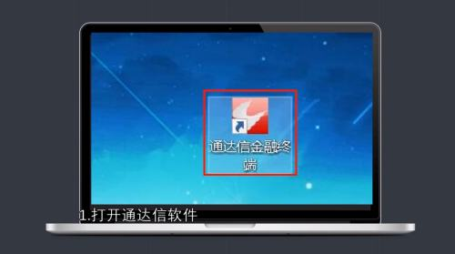
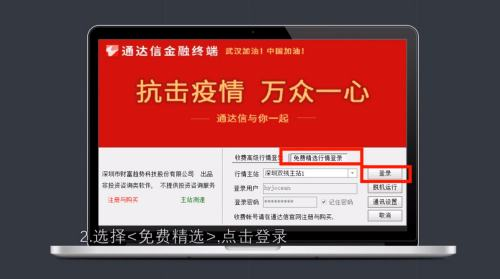
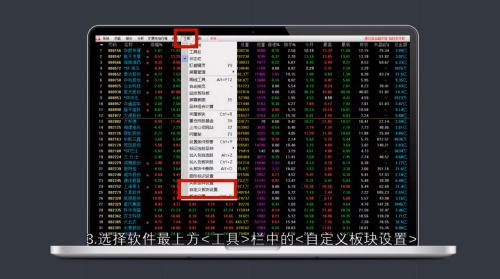
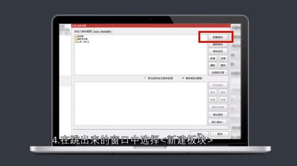
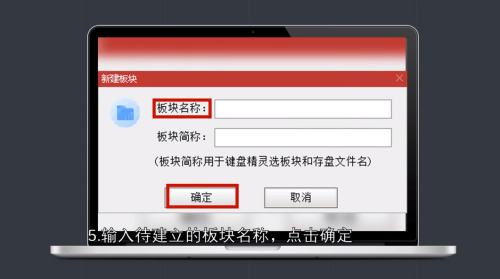

通达信如何添加自定义板块

https://jingyan.baidu.com/article/19020a0af9b42e139c284257.html

很多人都非常喜欢使用通达信软件，如果想要添加自定义板块，该怎样操作呢？下面我们一起来看一下通达信如何添加自定义板块？希望能够帮助到大家。

1. 打开通达信软件。

   

2. 

   选择“免费精选”，点击“登录”。

   

3. 

   选择软件最上方的“工具”栏中的“自定义板块设置”。

   

4. 

   在跳出来的窗口中，选择“新建板块”。

   

5. 

   输入待建立的板块名称，点击“确定”。

   

6. 

   新建板块已制作好，点击“确定”即可。

   

7. 

   总结如下。

   