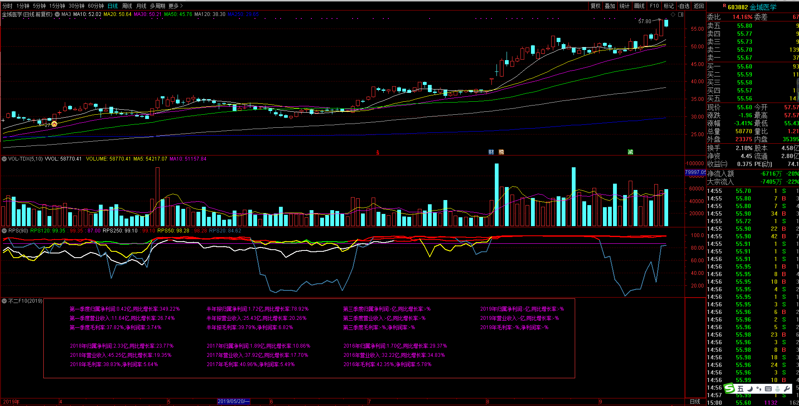
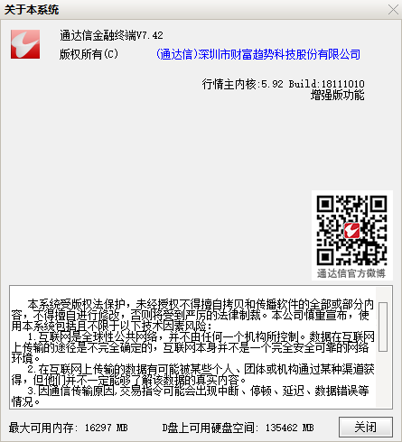
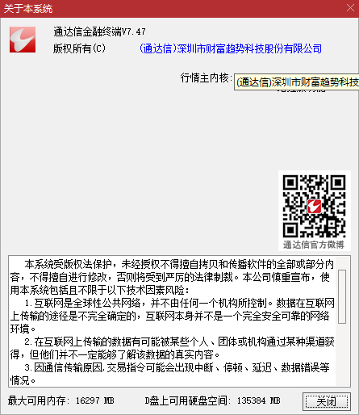
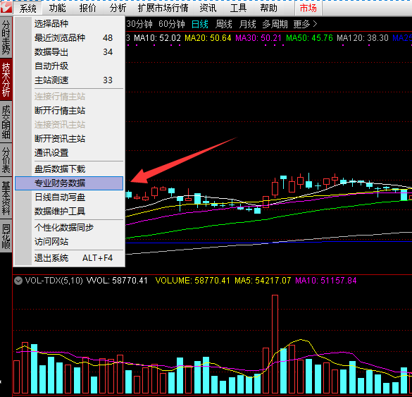
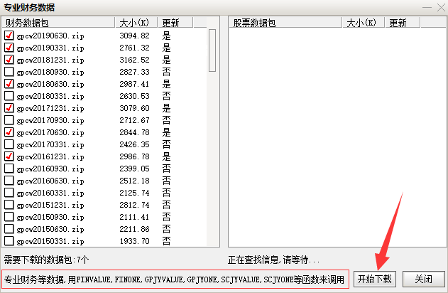
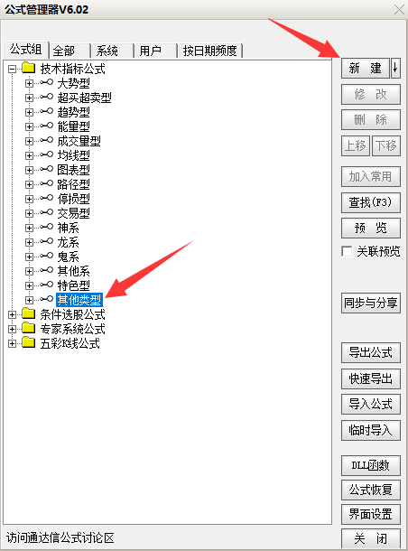
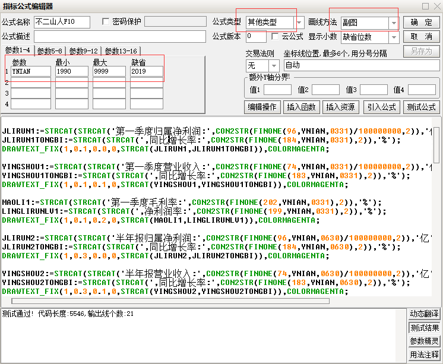
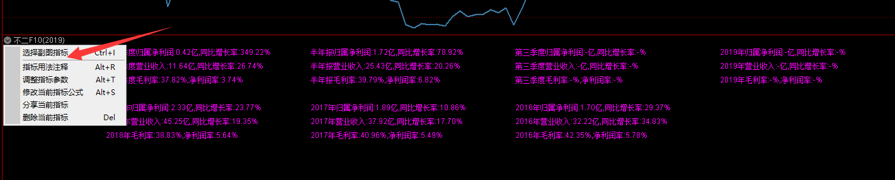

# 不二F10(20190920)




### 一、公式用处

​	不二F10不是什么能淘出牛股的公式，只是作为附图，在K线界面上直接展示净利润，同比增长率，营收，同比增长率，毛利率，净利润率。范围维度上，包括今年四个季度的和前面三年的，如果某个季度还没有数据，则显示为没有。

​	就是这么简单，和你按F10进去看到的是一样的。只是作为简版F10，能一眼看出个股的状态，一眼胖瘦，算是基本面和走势上的结合，互相查看。


### 二、公式由来

​	该公式的来源，一位朋友经常咨询我能不能在K线图上展示净利润。好吧，在这里，我承认我比较佛lan系dou落下很久，最近抽空研究了通达信的财务函数，发现可以取到某个季度的净利润等数据，但是取不到时间，因此并没有达到他的要求，也就是在K线图的上显示业绩出来时是否有净利润断层。

​	后面我就灵chun机qiu一da动meng，换了个思路，用它能取到的数据用在其他方面。平常自己在看到漂亮的K线的走势时，会经常F10去查看个股的财务状态，还有通达信链接到同花顺或者东财等的F10操作。

​	于是，就萌生了，继漂亮图形后，第一关注的基本面信息要素，尝试从财务函数中提取，因此，经过多番修改，就形成了目前的简单F10公式，自己用起来，还算顺手，提升了不少效率。

​	当然，F10只是第一步。


### 三、公式制作

测试背景：

通达信版本：7.42，7.47，其他版本，只要支持财务函数，差别应该不大，低版本不确定，高版本应该没问题。







#### 1. 下载专业财务数据






#### 2. 编写公式

##### (1) 打开公式编辑器

打开路径一：功能 - 公式系统 - 公式管理

打开路径二：Control + F

选中其他类型，点击右边的新建




##### (2) 无脑复制



公式名称自己取一个

公式类型是其他类型，画线方法是附图

参数部分，记得加YNIAN，最小1990，最大9999，缺省2019（如果过了元旦）可以把这个改为2020，每年改一次就可以了。

剩下的下面公式体部分，直接无脑复制下面的。

```

JLIRUN1:=STRCAT(STRCAT('第一季度归属净利润:',CON2STR(FINONE(96,YNIAN,0331)/100000000,2)),'亿');
JLIRUN1TONGBI:=STRCAT(STRCAT(',同比增长率:',CON2STR(FINONE(184,YNIAN,0331),2)),'%');
DRAWTEXT_FIX(1,0.1,0.0,0,STRCAT(JLIRUN1,JLIRUN1TONGBI)),COLORMAGENTA;

YINGSHOU1:=STRCAT(STRCAT('第一季度营业收入:',CON2STR(FINONE(74,YNIAN,0331)/100000000,2)),'亿');
YINGSHOU1TONGBI:=STRCAT(STRCAT(',同比增长率:',CON2STR(FINONE(183,YNIAN,0331),2)),'%');
DRAWTEXT_FIX(1,0.1,0.1,0,STRCAT(YINGSHOU1,YINGSHOU1TONGBI)),COLORMAGENTA;

MAOLI1:=STRCAT(STRCAT('第一季度毛利率:',CON2STR(FINONE(202,YNIAN,0331),2)),'%');
LINGLIRUNLV1:=STRCAT(STRCAT(',净利润率:',CON2STR(FINONE(199,YNIAN,0331),2)),'%');
DRAWTEXT_FIX(1,0.1,0.2,0,STRCAT(MAOLI1,LINGLIRUNLV1)),COLORMAGENTA;

JLIRUN2:=STRCAT(STRCAT('半年报归属净利润:',CON2STR(FINONE(96,YNIAN,0630)/100000000,2)),'亿');
JLIRUN2TONGBI:=STRCAT(STRCAT(',同比增长率:',CON2STR(FINONE(184,YNIAN,0630),2)),'%');
DRAWTEXT_FIX(1,0.3,0.0,0,STRCAT(JLIRUN2,JLIRUN2TONGBI)),COLORMAGENTA;

YINGSHOU2:=STRCAT(STRCAT('半年报营业收入:',CON2STR(FINONE(74,YNIAN,0630)/100000000,2)),'亿');
YINGSHOU2TONGBI:=STRCAT(STRCAT(',同比增长率:',CON2STR(FINONE(183,YNIAN,0630),2)),'%');
DRAWTEXT_FIX(1,0.3,0.1,0,STRCAT(YINGSHOU2,YINGSHOU2TONGBI)),COLORMAGENTA;

MAOLI2:=STRCAT(STRCAT('半年报毛利率:',CON2STR(FINONE(202,YNIAN,0630),2)),'%');
LINGLIRUNLV2:=STRCAT(STRCAT(',净利润率:',CON2STR(FINONE(199,YNIAN,0630),2)),'%');
DRAWTEXT_FIX(1,0.3,0.2,0,STRCAT(MAOLI2,LINGLIRUNLV2)),COLORMAGENTA;

JLIRUN3:=STRCAT(STRCAT('第三季度归属净利润:',CON2STR(FINONE(96,YNIAN,0930)/100000000,2)),'亿');
JLIRUN3TONGBI:=STRCAT(STRCAT(',同比增长率:',CON2STR(FINONE(184,YNIAN,0930),2)),'%');
DRAWTEXT_FIX(1,0.5,0.0,0,STRCAT(JLIRUN3,JLIRUN3TONGBI)),COLORMAGENTA;

YINGSHOU3:=STRCAT(STRCAT('第三季度营业收入:',CON2STR(FINONE(74,YNIAN,0930)/100000000,2)),'亿');
YINGSHOU3TONGBI:=STRCAT(STRCAT(',同比增长率:',CON2STR(FINONE(183,YNIAN,0930),2)),'%');
DRAWTEXT_FIX(1,0.5,0.1,0,STRCAT(YINGSHOU3,YINGSHOU3TONGBI)),COLORMAGENTA;

MAOLI3:=STRCAT(STRCAT('第三季度毛利率:',CON2STR(FINONE(202,YNIAN,0930),2)),'%');
LINGLIRUNLV3:=STRCAT(STRCAT(',净利润率:',CON2STR(FINONE(199,YNIAN,0930),2)),'%');
DRAWTEXT_FIX(1,0.5,0.2,0,STRCAT(MAOLI3,LINGLIRUNLV3)),COLORMAGENTA;

JLIRUN4:=STRCAT(STRCAT(STRCAT(CON2STR(YNIAN,0),'年归属净利润:'),CON2STR(FINONE(96,YNIAN,1231)/100000000,2)),'亿');
JLIRUN4TONGBI:=STRCAT(STRCAT(',同比增长率:',CON2STR(FINONE(184,YNIAN,1231),2)),'%');
DRAWTEXT_FIX(1,0.7,0.0,0,STRCAT(JLIRUN4,JLIRUN4TONGBI)),COLORMAGENTA;

YINGSHOU4:=STRCAT(STRCAT(STRCAT(CON2STR(YNIAN,0),'年营业收入:'),CON2STR(FINONE(74,YNIAN,1231)/100000000,2)),'亿');
YINGSHOU4TONGBI:=STRCAT(STRCAT(',同比增长率:',CON2STR(FINONE(183,YNIAN,1231),2)),'%');
DRAWTEXT_FIX(1,0.7,0.1,0,STRCAT(YINGSHOU4,YINGSHOU4TONGBI)),COLORMAGENTA;

MAOLI4:=STRCAT(STRCAT(STRCAT(CON2STR(YNIAN,0),'年毛利率:'),CON2STR(FINONE(202,YNIAN,1231),2)),'%');
LINGLIRUNLV4:=STRCAT(STRCAT(',净利润率:',CON2STR(FINONE(199,YNIAN,1231),2)),'%');
DRAWTEXT_FIX(1,0.7,0.2,0,STRCAT(MAOLI4,LINGLIRUNLV4)),COLORMAGENTA;

{过去年份}
LAST1:=STRCAT(STRCAT(STRCAT(CON2STR(YNIAN-1,0),'年归属净利润:'),CON2STR(FINONE(96,YNIAN-1,1231)/100000000,2)),'亿');
LAST1TONGBI:=STRCAT(STRCAT(',同比增长率:',CON2STR(FINONE(184,YNIAN-1,1231),2)),'%');
DRAWTEXT_FIX(1,0.1,0.4,0,STRCAT(LAST1,LAST1TONGBI)),COLORMAGENTA;

LAST1YS:=STRCAT(STRCAT(STRCAT(CON2STR(YNIAN-1,0),'年营业收入:'),CON2STR(FINONE(74,YNIAN-1,1231)/100000000,2)),'亿');
LAST1YSTONGBI:=STRCAT(STRCAT(',同比增长率:',CON2STR(FINONE(183,YNIAN-1,1231),2)),'%');
DRAWTEXT_FIX(1,0.1,0.5,0,STRCAT(LAST1YS,LAST1YSTONGBI)),COLORMAGENTA;

LAST1MAOLI:=STRCAT(STRCAT(STRCAT(CON2STR(YNIAN-1,0),'年毛利率:'),CON2STR(FINONE(202,YNIAN-1,1231),2)),'%');
LAST1LIRUNLV:=STRCAT(STRCAT(',净利润率:',CON2STR(FINONE(199,YNIAN-1,1231),2)),'%');
DRAWTEXT_FIX(1,0.1,0.6,0,STRCAT(LAST1MAOLI,LAST1LIRUNLV)),COLORMAGENTA;


LAST2:=STRCAT(STRCAT(STRCAT(CON2STR(YNIAN-2,0),'年归属净利润:'),CON2STR(FINONE(96,YNIAN-2,1231)/100000000,2)),'亿');
LAST2TONGBI:=STRCAT(STRCAT(',同比增长率:',CON2STR(FINONE(184,YNIAN-2,1231),2)),'%');
DRAWTEXT_FIX(1,0.3,0.4,0,STRCAT(LAST2,LAST2TONGBI)),COLORMAGENTA;

LAST2YS:=STRCAT(STRCAT(STRCAT(CON2STR(YNIAN-2,0),'年营业收入:'),CON2STR(FINONE(74,YNIAN-2,1231)/100000000,2)),'亿');
LAST2YSTONGBI:=STRCAT(STRCAT(',同比增长率:',CON2STR(FINONE(183,YNIAN-2,1231),2)),'%');
DRAWTEXT_FIX(1,0.3,0.5,0,STRCAT(LAST2YS,LAST2YSTONGBI)),COLORMAGENTA;

LAST2MAOLI:=STRCAT(STRCAT(STRCAT(CON2STR(YNIAN-2,0),'年毛利率:'),CON2STR(FINONE(202,YNIAN-2,1231),2)),'%');
LAST2LIRUNLV:=STRCAT(STRCAT(',净利润率:',CON2STR(FINONE(199,YNIAN-2,1231),2)),'%');
DRAWTEXT_FIX(1,0.3,0.6,0,STRCAT(LAST2MAOLI,LAST2LIRUNLV)),COLORMAGENTA;

LAST3:=STRCAT(STRCAT(STRCAT(CON2STR(YNIAN-3,0),'年归属净利润:'),CON2STR(FINONE(96,YNIAN-3,1231)/100000000,2)),'亿');
LAST3TONGBI:=STRCAT(STRCAT(',同比增长率:',CON2STR(FINONE(184,YNIAN-3,1231),2)),'%');
DRAWTEXT_FIX(1,0.5,0.4,0,STRCAT(LAST3,LAST3TONGBI)),COLORMAGENTA;

LAST3YS:=STRCAT(STRCAT(STRCAT(CON2STR(YNIAN-3,0),'年营业收入:'),CON2STR(FINONE(74,YNIAN-3,1231)/100000000,2)),'亿');
LAST3YSTONGBI:=STRCAT(STRCAT(',同比增长率:',CON2STR(FINONE(183,YNIAN-3,1231),2)),'%');
DRAWTEXT_FIX(1,0.5,0.5,0,STRCAT(LAST3YS,LAST3YSTONGBI)),COLORMAGENTA;

LAST3MAOLI:=STRCAT(STRCAT(STRCAT(CON2STR(YNIAN-3,0),'年毛利率:'),CON2STR(FINONE(202,YNIAN-3,1231),2)),'%');
LAST3LIRUNLV:=STRCAT(STRCAT(',净利润率:',CON2STR(FINONE(199,YNIAN-3,1231),2)),'%');
DRAWTEXT_FIX(1,0.5,0.6,0,STRCAT(LAST3MAOLI,LAST3LIRUNLV)),COLORMAGENTA;


```


##### (3)  测试

成功后，打开股票的日线图，在下面的附图，选择，你取的公式的名称，然后就可以愉快的查看到个股的财务数据了，省去了到F10再回来的过程




##### (4) 导入

如果不想自己做，可以用我导出的公式，自己导入一下


​	

​	


