# 个人进化史5.0(20190917)


​	诚惶诚恐，最近无线模组的文章，犹豫是否发到雪球，一下子多了不少新朋友，但这里要泼凉水的是，进来的朋友可能要失望了，这是片杂草地，没有代码，没有神奇的公式，没有神奇的信号，没有牛骨，没有高手，只有一个自言自语的不成熟的个人投资者。

​	借着机会，自己也梳理了自2016年来自己的成长过程，也便于大家互相认识，失望的朋友，可以取关，出门左转。


### 一、1.0蒙昧之初

​	知道雪球大概在2015年中6月左右，也是有朋友介绍才知道有这么一个存在，一开始我也只是看别人写的，觉得别人特神特牛。一直到2015年末，才给自己回了一个回顾。

​	[投资首修心，专注成长股](https://xueqiu.com/1570052336/57367883)

​	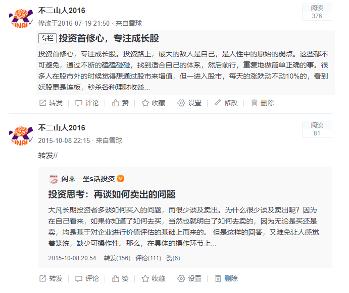

​	经历，和大部分人没差别多少，大三时代，2007年，印象中在5000点左右进去，然后，没有然后呢，2008年的珠穆朗玛还在天上呢。后面大四毕业，就彻底远离股市了，真的删除了APP，NO，那时还没有APP概念。

​	这接触之初，什么都没有感觉，就是听别人说什么就买一下。

​	2015年的牛市，我也是没有经历的，知道股市很牛时候，那时只知道买早餐都有人在说，是同事不断的唆使下，我才想起，自己还有个账号，懒得去营业部，直到后面花了三天才想起来密码。

​	因此，虽然早早接触，但2007年，2015年的两轮牛市都和我没有一毛钱关系。

​	但早期的经历，让我懵懂的意识到心性的重要，因此2015年回顾时，自己浅显的认为投资首修心。

#### 	总结

​	和大部分人一样的偶然接触股票，偶然开始进入。。。

​	

### 二、2.0长牛萌芽

#### 1. 草根研报

​	2015年年末，个人性格还是比较内向的，上雪球也不知道和别人交流，就关注关注大V，读点书，那时还在纠结长线，短线的。

​	[投资先开户](https://xueqiu.com/1570052336/57731221)

​	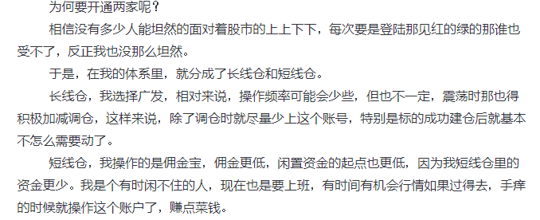

​	当时还在研究开户。。。。

​	[个人研报逻辑](https://xueqiu.com/1570052336/58711624)

​	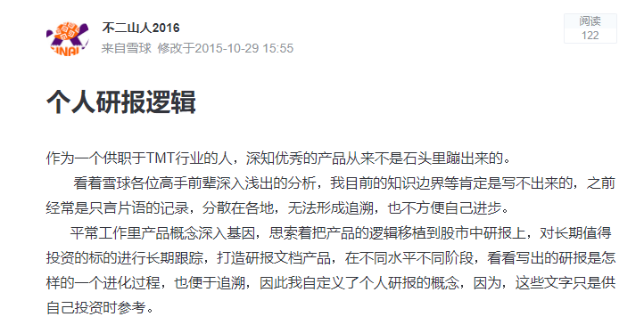

​	当时觉得那些写研报的人特牛，反正觉得遥不可及，就自己摸索，当时有追溯的思维了，也是极好的。

[	【公司研究】【东阿阿胶】【老树开花被低估】](https://xueqiu.com/1570052336/58735800)

​	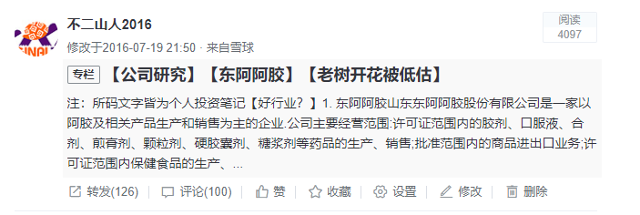

​	因此，当时从最简单的阿胶开始学习，也就有了个人的第一篇草根研报。

#### 2. 从关注的人摸索

​	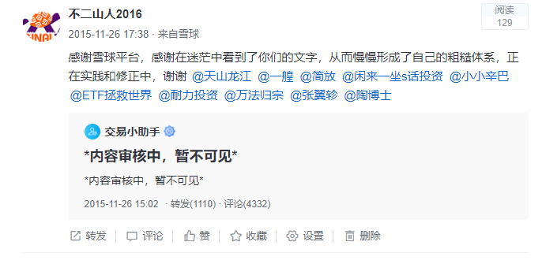

​	无意中看到自己在雪球的感谢，上面感谢的人中，有些人在思维上的差异渐远，大部分大V确实对我，到现在也一直有着比较深远的影响。还是感谢当年的他们。

#### 3. 假装长线

​	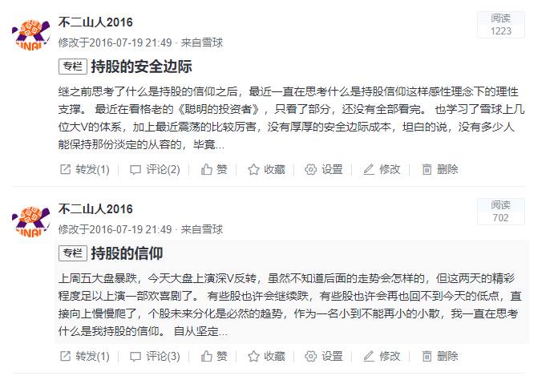

​	现在看那时的发言，其实特傻，很多是错的，还在给自己打气，看看什么信仰啊，安全边际，理念是没错，但看内容一塌糊涂，现在的我也不忍直视当年的自己，放着就是为了继续让自己看看自己的各阶段多么的稚嫩。


#### 4. 手把手教你制作全景表

​	[手把手教你制作全景表](https://xueqiu.com/1570052336/64399878)

​	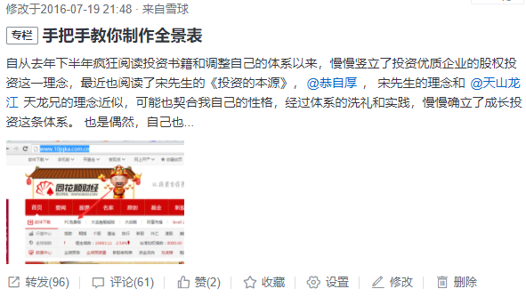

​	当时这文章是看完宋老师的书《投资的本源》后，本着自用的原则，建立的手动版的全景表制作方法介绍，没想到挺受欢迎的。

​	也通过这篇文章，和宋老师算是结缘，2018年在大博医疗的来厦调研，线下第一次和宋老师有了接触，非常和蔼的一个成功投资者，也让自己学习了不少线下调研的理念。

​	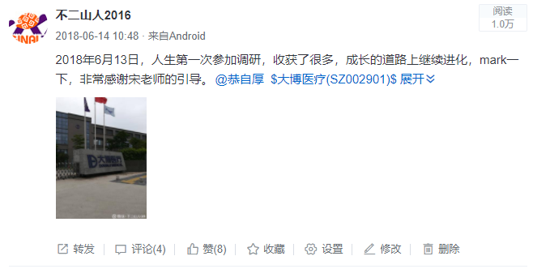

#### 5. 长牛研究-进化之初

​	2016年年中左右，在天山龙江的引领下，开始第一次有意识的学习和研究长牛股，后面自己研究了一部分

​	[长牛股的股价净利润正相关](https://xueqiu.com/1570052336/65205322)

​	[长牛股的行业分布分析](https://xueqiu.com/1570052336/65337670)

​	[长牛股的时间玫瑰](https://xueqiu.com/1570052336/65943493)

​	[庖丁解牛之宋城演艺](https://xueqiu.com/1570052336/66937272)

​	[庖丁解牛之大华股份](https://xueqiu.com/1570052336/67578367)

​	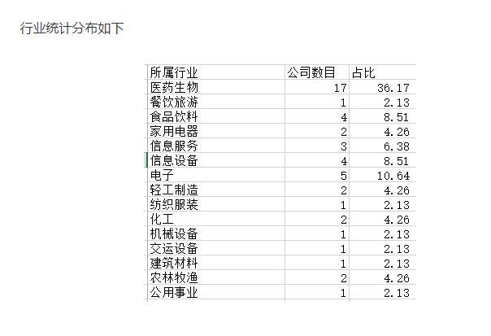

​	当时自己统计的不具有代表性的47只长牛，医药占了绝大多数，这原始的印象深深的影响中，后面的轨迹里医药股也一直占据着自己心中最重要的位置，自己盈利过往统计过的，最大源泉也来自医药 

#### 6. 总结

​	此阶段应该是2016年左右，也是自己开始学习投资的初年，总体上更多的是学习，但长牛股的印象深深的砸进脑海中。

​	遗憾的是，当时只是知之，却不知为何知之，因此当时买了些长牛后，后面，没有后面了。。。悲伤的故事


### 三、3.0 次新魔障

​	在研究了长牛的一些特征之后，我把建些已经成牛骨的叫老牛，后面想当然的，有小牛，小牛从哪里来呢，次新股，一个在2015年前代表的小盘股的摇篮(我也是后面才发现有这样的历史)，因此后面在2017年左右，整天被次新的魔掌盖着，天天做着春秋大梦，抓到所谓的十倍股。

​	当时是看了不少一艎的文章，后面他不知道跑哪里去了。

​	雪球上面，还有着当时的一些短暂的心理脉冲的记录，高兴的是，也有一些长牛确实被自己给相中了

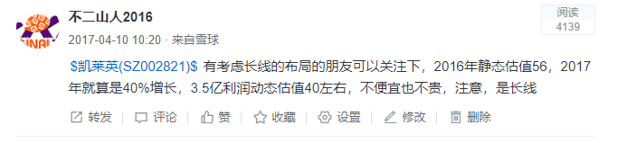

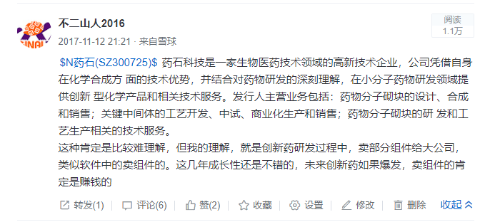

​	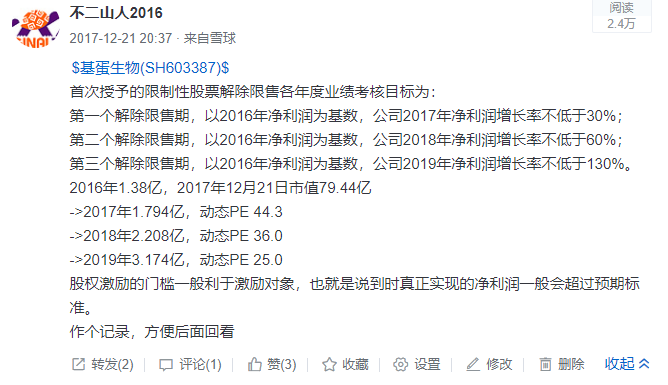

​	当然，也有一些2B式的记录

​	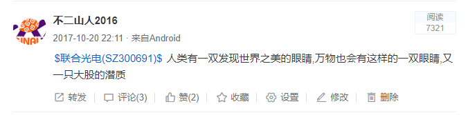


#### 	总结

​	这段经历，又是一段悲伤的故事，没什么奇迹，我们看看深次新股的周线图就知道这是当年的恶梦，我在这样的环境下，七弄八弄，不赚钱，好在也不亏钱


### 四、4.0 陶博士-强势股

​	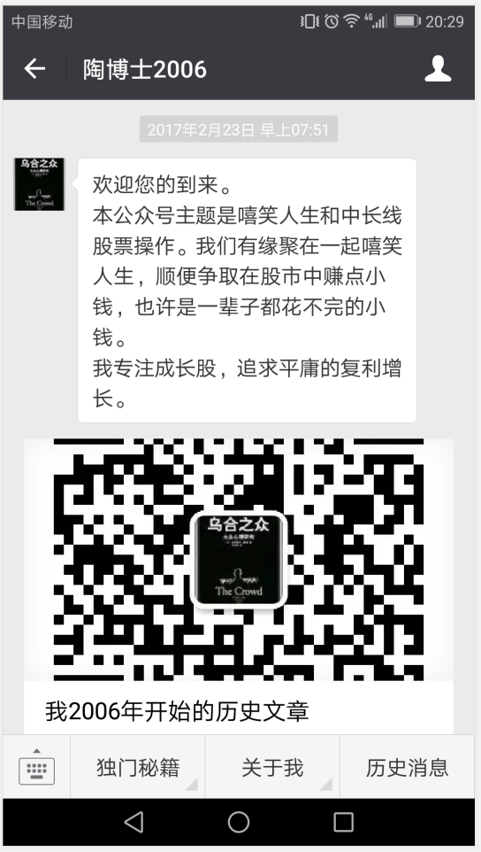

​	2017年年初，关注了陶博士，从欧奈尔，到股魔等等，当时其实比较浅显，觉得陶博士超牛，从RPS，中期信号，净利润断层等等，从泰格，到顺鑫，到金牌，叹为观止。

​	这阶段，更多的是一边看陶博文章，一边在学习股魔等书籍，操作上，也没有抄作业，还是二楞的。

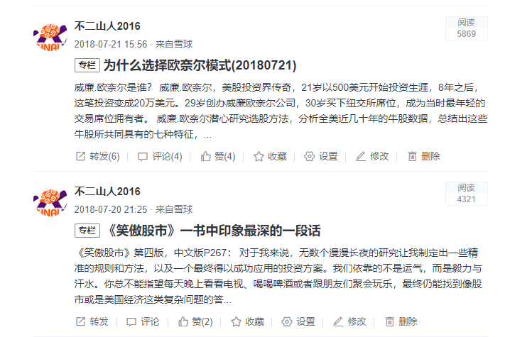

#### 1. 2017年学习

​	2017年总体上都是在学习，一下子接触了比较多的系统性的东西，海龟，欧奈尔，股魔等，因为个人在生活中的其他问题，这一年有点远离股市。

#### 2. 2018年刻意模仿

​	2018年开始，开始比较有意的学习和模仿陶博士的方式，但是选股经常也选出非常多的股，当时又没那么深厚的穿透力，回报没多少，倒是练习了各种坑。。。

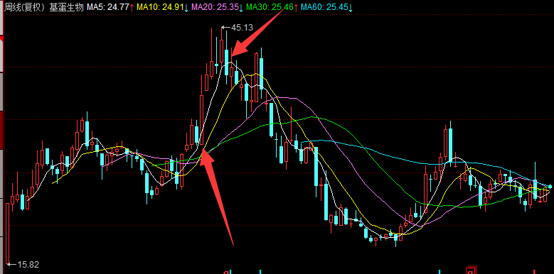

​	上面的对基蛋的操作是个净利润断导的例子，总体上比较成功，好吧，还有好多失败的。

#### 3.  总结

​	这阶段，最大的收获，是让自己从原来的只言片语，学到了怎么系统性的做交易，怎么去探索，但是对陶博能从后宫三千中选中几只的能力还是只能观望。

​	如果仔细观察，此阶段，其实是个人比较迷茫的时期，也不怎么写文章和记录了，就是那种迷雾中的感觉。


### 五、5.0 融合

#### 1. 自我学习

​	时间倒到2018年下半年，随着陶博的各种影响，在文章上也渐渐熄火了，自己感觉到有一天陶博真的收山了，能依靠的就只能自己了。

​	[通达信和同花顺互相导入导出(20181020)](https://xueqiu.com/1570052336/115395877)

​	[指数中期信号跟踪的意义(20181103)](https://xueqiu.com/1570052336/116243979)

​	[海龟交易法则（20181206）](https://xueqiu.com/1570052336/117930883)

​	从研究软件开始，一步步的，周记，自己就没有放到雪球上了，近一年来，自己渐渐的记录自己的理解。

​	从软件，到中期信号，到打脸模型，海龟模型等，自己慢慢完善起了自己的一系列体系。

​	对于基本面的弱势，原来我在雪球上的记录轨迹可以发现，原来喜欢分析一家企业，各种好，到后面慢慢的比较喜欢的是分析整个产业，寻找市场格局下的玩家，守正，包括周记中的古漂池等。

#### 2. 目前个人风格

​	目前，包括未来相当于的一段长时间内，我的定位是自己是一名交易者，长牛是多的梦想，但目前受方面还是受限，达不到这境界。

​	而曾经很迷茫的，长牛，次新，强势股，慢慢的被自己模糊了，也融到一起，不强求，不冲突，理性交易。而随着对整个产业链的整体概览，在投资中，自己也比较应手些。

​	

```
目前，个人风格：

1. 中期信号为晴雨表，对仓位有指示作用，但不是绝对
2. 模式一尽量寻找在中期信号下，有板块效应的群落，最好是自己长期跟踪，跟踪外的话，目前能力还比较欠缺，无法一下相中
3. 寻找到板块效应后，寻找行业龙头，守正持有
4. 中期信号结束后，减仓，甚至清仓
5. 如果模式一没有及时跟到板块效应，进入模式二，寻找净利润断层的企业
6. 如果模式二也无法及时发现，进入模式三，在中期信号期间，交易自己长期跟踪的企业，跟随中期波动
7. 如果中期信号结束，视拉开空间，进入模式四，定投ETF指数
```


#### 3. 未来

​	对于公众号的形式，对于系统化的学习还是比较差的，最近我在整理和搭建自己的知识库，以后万一公众号挂了，自己也有在互联网上的一片阵地。

​	

```
自己考虑要做的是

1. 学习财务知识
2. 更系统的搭建自己的体系
3. 搭建知识库作为备份
4. 有需要自己开发一些小工具来辅助投资
```


