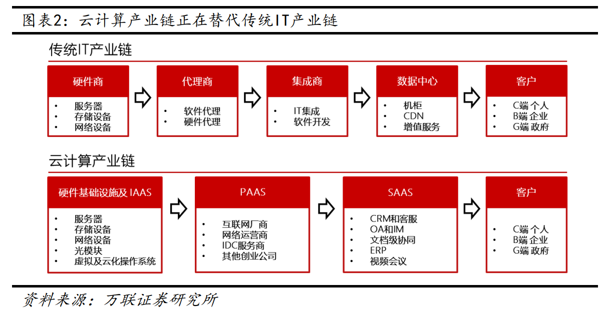
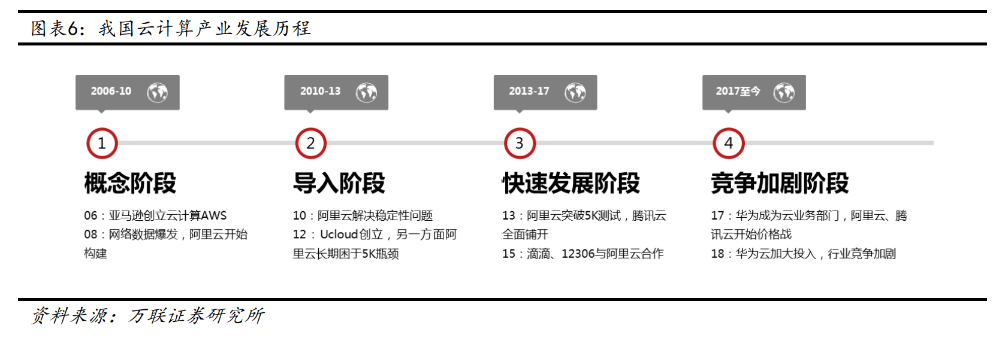
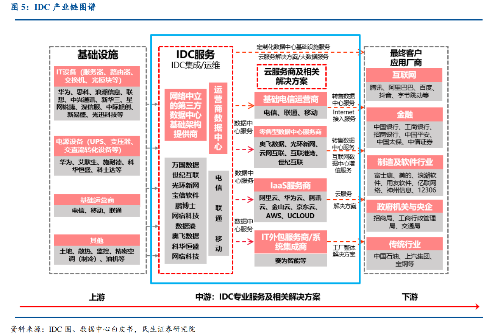
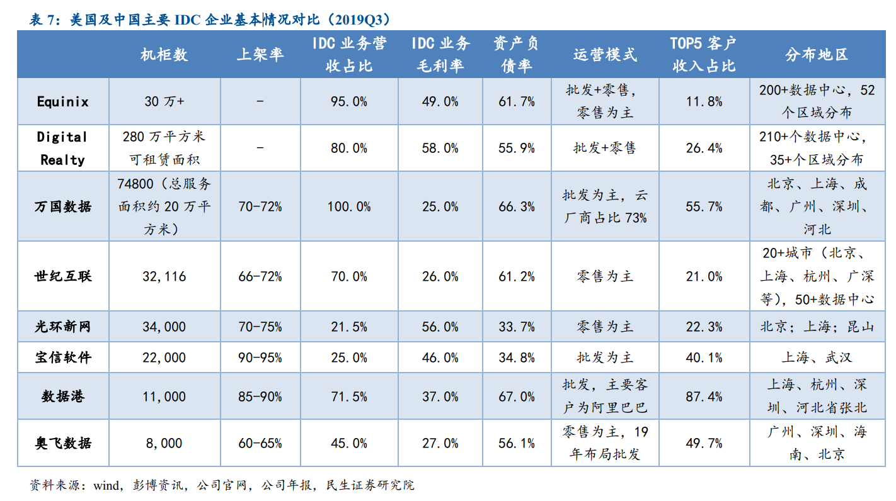
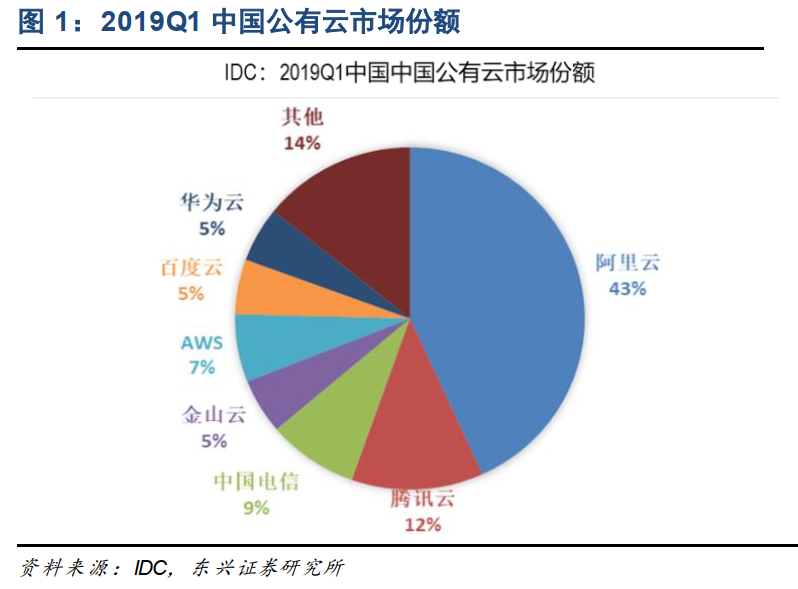
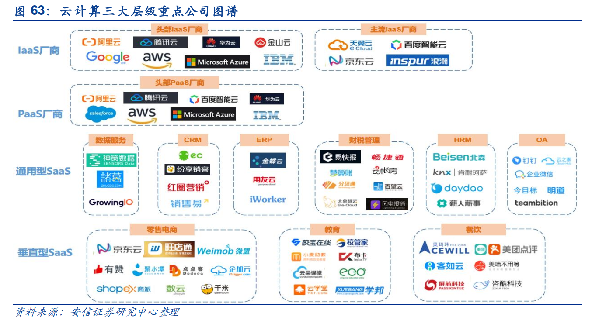
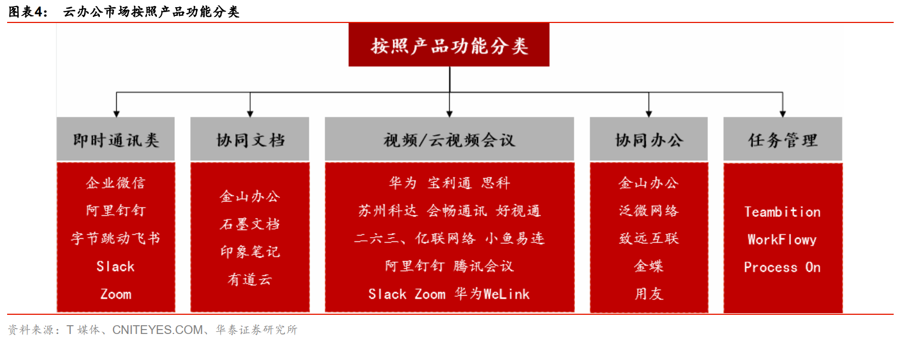

# 云计算(20200209)

### 一、总结

今年春节的某病毒让很多行业损失严重，但是有几个行业受益非常大，远程办公，在线教育，在线医疗，在线娱乐，在线视频等，因为不能出门，在线成了主要的信息交换手段，也催化和提速了数据流量增长。

以下主要梳理了云计算的相关部分，其实这个领域非常大，包括我们前期研究的医疗信息化，云游戏等，都是这个大领域的范围，总之，目前长逻辑有，中短出现催化事件，值得关注。

相关上市公司：

光模块：中际旭创，新易盛，光迅科技，剑桥科技

交换机：星网锐捷

VPN：深信服

服务器：浪潮信息，中科曙光，紫光股份，神州数码

CDN：网宿科技

IDC：宝信软件，光环新网，数据港，奥飞数据，科华恒盛，鹏博士

IAAS：优刻得

系统集成：城地股份

云办公：金山办公，会畅通讯，齐心集团，二六三，苏州科达，亿联网络，泛微网络，致远互联，用友网络

传统软件SAAS：广联达，用友网络，石基信息

### 二、云计算产业链

数据流量增长是 ICT 产业链快速发展背后的核心驱动因素，云厂商资本开支增长是判断产业链景气度的关键指标。传导逻辑：

数据流量增长→计算（云和边缘） 需求增加→IDC 和云厂商 Capex 投入增加→投资数据中心基础设施及相关设备。 

#### 一、当前产业景气度如何？云厂商资本开支上行拐点初现，产业景气度正逐步回升 

海内外互联网云厂商巨头资本开支显著回暖，Intel 数据中心业务增速触底回升，ICT 产业链景气度回升逻辑逐步得到验证。从历史趋势来看，云厂商巨头资本开支投入周期一般经历 1.5-2.0 年，伴随着 5G 商用化进程推进，我们认为此时正是去库存周期的末端，产业景气度正逐步回升，数据流量爆发有望进一步促使云厂商加大资本开支，云基础设施建设提速，IDC 产业链整体受益。我们预计 2020 年将迎来海内外云厂商资本开支大年，我国通信行业发展将迎来“5G+云计算”的双轮驱动 .

#### 二、认识云计算

比较不清楚的朋友可以看看下面文章：

[今天来重新认识云计算](https://mp.weixin.qq.com/s/BTskK3MgH9ice5xIsmfJIw)

https://mp.weixin.qq.com/s/BTskK3MgH9ice5xIsmfJIw

**如果云计算按照服务类型来划分，主要可分为三类：**

**基础结构即服务（IaaS）**：这是云计算服务的最基本类别，用户可通过即用即付的方式从服务提供商处租用 IT 基础结构，如服务器和虚拟机、存储空间、网络和操作系统。形象点来说，是这样：供应商，麻烦给我提供一台云服务器，我准备在上面跑个数据库然后运行我的某某软件。

**平台即服务（PaaS）**：这种类型可按需提供开发、测试、交付和管理软件应用程序所需的环境，旨在让开发人员能够更轻松地快速创建 Web 或移动应用，而无需考虑对开发所必需的服务器、存储空间、网络和数据库基础结构进行设置或管理。形象点来说，是这样：供应商，麻烦给我提供一台云数据库，我准备在这上面运行我的某某软件。

**软件即服务（SaaS）**：是指通过互联网交付软件应用程序的方法，通常以订阅为基础按需提供。这种情况下，云提供商托管并管理软件应用程序和基础结构，并负责软件升级和安全修补等维护工作。用户可通过任何设备借助互联网直接连接到应用程序。形象点来说，是这样：供应商，麻烦给我在你的云上运行某某软件。

#### 三、上下游

云计算产业链日趋成熟，当前产业硬件基础优于软件基础。 经过十余年发展，全球云计算产业生态逐步成熟、产业链条也相对完整，从上中下游来看： 

1）上游企业提供底层硬件设备及基础设施，包括IDC以及服务器、网络设备、存储设备等核心设备，同时也涉及光纤、光模块等关键元器件，电源、机架、空调等周边辅助设备； 

2）中游企业提供软件基础设施、平台及应用相关服务，即IaaS（基础设施即服务）、 PaaS（平台即服务）、 SaaS（软件即服务）；

 3）下游客户则包括企业及个人用户，其中企业用户仍以互联网厂商为主。值得注意的是，由于云计算产业底层硬件基础相比中游软件基础设施建设周期更短，建设进程更快，当前硬件基础优于软件基础。 

#### 四、IDC产业链

##### (一) IDC 成本 

 IDC 成本=Capex+Opex，较大资本开支投入+较高电力成本 

数据中心整体成本（TCO）分为固定资产支出（CAPEX）和运营支出（OPEX）两部分。
Capex：柴油发电机、电力用户站和 UPS 电源设备等基础设施由 IDC 服务商提供，作为建设 IDC 机房的基建设施，发电、冷却等设备必不可少同时也是 Capex 支出最大的部分，对于 IDC 企业来说，Capex 为一次性支出，购买的设备后续摊销（以 10 年为主）影响利润率。
Opex：1）电力成本是 IDC 运营成本中占比最高的部分，大约占公司营业成本的 60%左右，数据港 2016 年 1-6 月电力成本占主营成本的 56.6%，2018 年占比 51.8%，主要取决于数据中心的 PUE 水平。根据《国家绿色数据中心试点工作方案》统计，中国数据中心平均水平 2.2，美国数据中心平均 PUE 为 1.9；万国数据平均 PUE 为 1.3-1.4，数据港2018 年平均 PUE 达到 1.4 

##### (二) 主要 IDC 企业 

#### 五、竞争格局

##### (一) IAAS

在 IaaS 层，中国市场呈现“一超多强”的竞争格局。根据 IDC 的数据，2019 年 Q1 阿里云市场份额占比43%，排名第一；腾讯云市场份额 12%，排名第二；中国电信第三，份额 9%，其后还有金山云、华为云、Ucloud 等。 

相关上市公司：优刻得

##### (二)  传统软件SAAS

1）广联达造价业务转型 SaaS 进展顺利， 2019 年前三季度云收入达到 6.19 亿元，同比增长 169%；前三季度新签云合同 9.58 亿元，同比增长 129%。三季度末云预收 7.54 亿元，相较年初增长 82%。
2）用友网络 2019Q3 总收入 12.5 亿元，同比增长 10.1%，收入增速不及年初预期。收入增长主要来自于云服务及支付业务。不含金融的云服务收入为 3.11 亿元，同比增长 149%。至报告期末，公司云服务业务的企业客户数为 522.22 万家，其中累计付费企业客户数为 46.84 万家, 较 2019 年半年度末增长 9%；云服务相关的预收账款达到了 5.76 亿元。
3）目前，石基信息的部分 SaaS 产品已经取得了一定成绩。酒店辅助系统已经在半岛、洲际等高端酒店使用。而公司下一代 PMS 已经研发完毕，希望能够在 2019 年有项目落地 

##### (三) 新兴SAAS

我国前十大 SaaS 厂商市场份额占比仅为 30%左右，前几大 SaaS 厂商领先优势并不明显。目前来看，在通用型 SaaS 领域，我国客户关系管理（ CRM）市场、企业资源管理（ ERP）市场和协同应用市场（ OA） 发展最为成熟，随着企业对精细化运营的要求日渐提升， 数据服务（ BI）、人力资源管理（ HRM）、财税管理、智能办公等赛道也逐渐兴起；在垂直型 SaaS 领域，目前传统行业的 SaaS 渗透率普遍不高 

#### 六、云办公

随着云办公产品功能不断增强，其应用场景也日渐多元化，如即时通讯（IM）、协同文档、任务管理、视频会议及客户管理、合同管理、员工培训等，均需要对应的协同功能。目前国内的云办公产品，具有单品能力突出的特点，如文档功能或者音视频会议功能或单独的IM 功能，如何集成协同是难点所在。 

 

