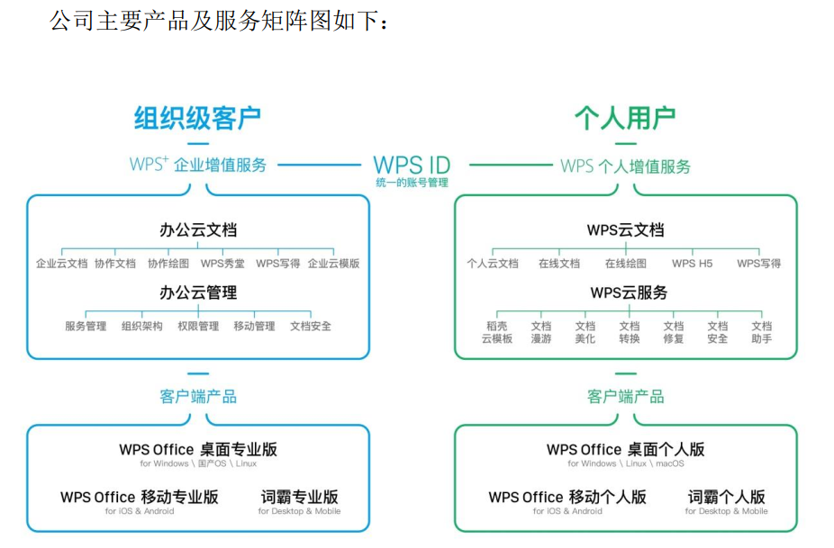
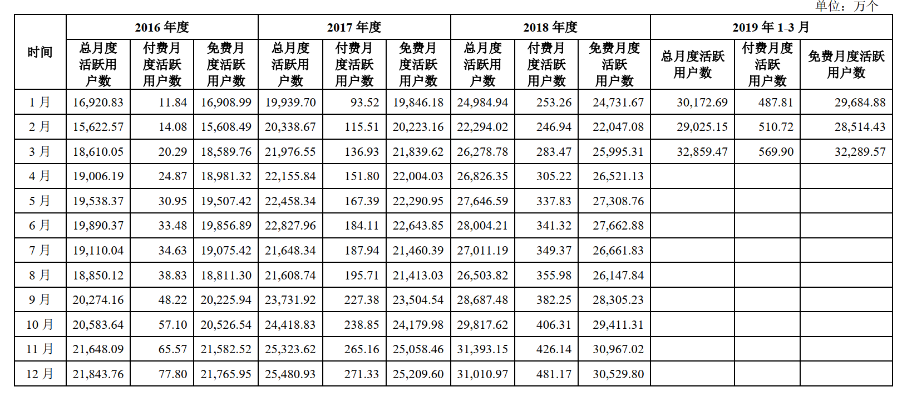
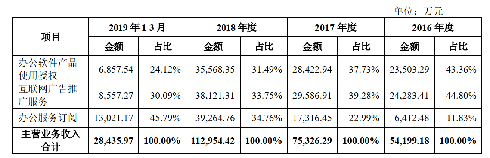

# 金山办公(20191117)

### 总结

金山办公本来没那么快想看了，最近在长线群讨论，有群友抛出了千亿市值口号，吓得我赶紧下载招股说明书，券商研报来看，老担心自己错过了一个亿，O(∩_∩)O哈哈~

金山办公作为我们平常接触的公司，加上我在IT这块，其实招股书看下来，八九不离十，在自己的预期内。

公司业绩保持稳健增长主要得益于三方面： 

1）订阅业务是公司研发和推广的重点，预计未来几年将保持高速增长；

 2）受益于安全可靠体系建设，公司办公软件产品使用授权有望较快发展，呈现加速趋势； 

3）互联网广告业务预计保持较平稳增长。 

**短期内安可带来的业绩脉冲应该是可以预见的，我的了解大概是在2022年前吧，就这几年，中长期稳定增长的基础还是订阅用户带来的SAAS业绩增量。**

业绩上，券商给的预测是公司 2019-2021 年营收分别为 16.06 亿元/22.64 亿元/29.68 亿元，同比增长42.2%/40.9%/31.1%， 归母净利润分别为 3.70 亿/6.04 亿/7.87 亿元，同比增长 19.2%/63.1%/30.2%，  

### 一、主营业务

#### (一) 概述

​	公司是国内领先的办公软件和服务提供商，主要从事 WPS Office 办公软件产品及服务的设计研发及销售推广。
​	公司产品主要包括 WPS Office 办公软件和金山词霸等，可在 Windows、Linux、 MacOS、 Android、 iOS 等众多主流操作平台上应用；公司服务主要包括基于公司产品及相关文档的增值服务以及互联网广告推广服务，为客户提供一站式、多平台应用解决方案。 

​	公司拥有办公软件领域 30 余年研发经验及技术积累，旗下主要产品及服务皆由公司自主研发，对核心技术具有自主知识产权。公司重点针对文字排版技术、电子表格计算技术、动画渲染技术、在线协同编辑、安全文档以及数据协同共享等多种关键技术进行深入研究，通过核心技术的突破，建立互联网云办公应用服务体系，创建智能办公新模式，全面提升用户体验。 

​	2019 年 3 月，公司主要产品月度活跃用户数（MAU）超过 3.28 亿，其中WPS Office 桌面版月度活跃用户数超过 1.32 亿，领先其他国产办公软件； WPS Office 移动版月度活跃用户数超过 1.87 亿；公司其他产品（如金山词霸等）月度活跃用户数接近 0.10 亿。 WPS Office 移动版已覆盖全球超过 220 个国家和地区，在全球 Google Play、中国 App Store 的办公软件应用市场中排名前列，并持续保持领先地位。 

#### (二) 公司的行业地位及市场份额 

​	公司产品及服务在政府、金融、能源、航空等多个重要领域得到广泛应用，在政府部门优势尤其明显，目前已覆盖 30 多个省市自治区政府、 400 多个市县级政府。截至 2019 年 3 月底，《财富》杂志披露的―世界 500 强‖中的 120 家中国企业，公司已服务 69 家，比例达 57.50%；国内 96 家央企中，公司所服务的客户已达 82 家，比例达 85.41%；特别在金融行业，全国五大国有商业银行均为公司客户，在 12 家全国性股份制商业银行中，公司所服务的客户已达 11 家，比例达 91.67%。公司所服务的企业客户有：中国石油天然气集团公司、国家电网公 司、中国工商银行股份有限公司、中国南方航空股份有限公司、中国航天科工集团公司等。
​	为适应客户的安全可靠需求，公司自主研发的 WPS Office Linux 版本已经全面支持国产整机平台（如：龙芯、飞腾、兆芯、申威等芯片）和国产操作系统，并在国家―十二五‖、 ―十三五‖期间的―核高基‖多项重大示范工程项目中完成系统适配和应用推广。 

#### (三) 主要产品和服务

#### (四) 用户数据

发行人同类办公软件主要为微软的 Microsoft Office 及 Office 365系列软件，根据微软披露的 2019 财年第三季度报告（2019 财年起始点为 2018年 7 月 1 日至 2019 年 6 月 30 日）， Office 365 的订阅数约为 3,420 万，未披露其月活数据。 

报告期内，公司办公软件产品主要包括 WPS Office 及金山词霸，其中：
1、总月度活跃用户数=产品付费月度活跃用户数+产品免费月度活跃用户数，包括 PC 端及移动端；
2、付费月度活跃用户数=词霸业务月度活跃用户数+WPS 会员月度活跃用户数+稻壳会员月度活跃用户数，同类付费业务的付费月度活跃用户数已做去重处理；

因付费用户可能为多种业务付费，属于性质不同的会员服务，因此付费月度活跃用户数未做去重处理；
3、免费月度活跃用户数=除付费业务以外各类免费产品的月度活跃用户数，已做去重处理。

月度活跃用户数及其月度变化情况如下： 

**付费用户比例：569/32289=1.8%**

#### (五) 营收占比

​	办公软件产品使用授权： 收入过去三年呈现稳定增长态势，但收入占比逐年下降。办公软件产品销售是公司传统业务，其销售方式分为直销和代理商销售， 2018年直销贡献收入比重29.29%，代理商销售贡献收入比重70.71%。
​	 互联网广告推广服务： 公司互联网广告推广业务 2016-2018 年度平均复合增长率为 25.29%。主要是由于基于多年软件授权业务的用户积累，发行人在报告期内将战略重心转向挖掘用户增值价值，增加广告投放，增强与广告代理商的合作力度，实现了互联网广告推广服务业务收入的快速增长。
​	办公服务订阅：办公服务订阅类收入是公司近三年营收主要驱动力，其占收入比重逐年提升， 16-18年占收入比重分别为11.83%、 22.99%、 34.76%。其中，个人客户订阅类收入增长较快， 主要原因是报告期内发行人着力发展 WPS 会员和稻壳会员业务，通过优化产品服务，引进大量优质资源等吸引个人用户订阅，根据公司招股说明书: 

WPS 会员人数由2016年度的约99万人增长至2018年度的约575万人。
稻壳儿会员人数由2016年度的约106万人增长至2018年度的约357万人，实现了收入的大幅上升。
2016年12月、 2017年12月、 2018年12月及2019年3月，公司付费用户月活分别为 77.80万、 271.33万、 481.17万及569.9万。 

#### (六) 订阅增值服务 - 从用户积累到商业模式变现的质变 

​	订阅增值服务成为公司过去三年营收主要增长动力， 2018年订阅增值服务实现营业收入3.93亿，收入占比为34.76%，过去三年复合增长率达到148%。公司订阅增值服务主要包括个人订阅增值服务和企业订阅增值服务，目前个人订阅增值服务占比较高且增速较快。 

### 二、行业空间和格局

#### (一)办公软件市场稳增长，国产品牌市场份额不断扩大 

办公软件市场稳定增长。 2018 年中国基础办公软件市场规模为 85.34 亿元，较 2017年同比增长 9.7%，预计到 2023 年，行业市场规模将达到 149.04 亿元， 2018-2023 年复合增长率为 11.8%。 

WPS Office 已占据一定市场竞争优势。 聚焦国内市场，除了微软的 Microsoft Office外， WPS Office、永中 Office、中标普华 Office 等是国内市场的主要品牌。 目前公司与微软已取得明显的竞争优势，市场中形成了微软、公司同台竞争，其他品牌跟进发展的竞争态势。 截至 2018 年底，按照 WPS 注册用户总量 2.80 亿计算， WPS 用户占国内市场总规模的 42.75%，已经成长为国内最大的国产办公软件提供商。 考虑到公司有规模较大的免费用户，未来市场拓展空间较大。 

#### (二)国内网络广告市场持续增长，移动广告占据市场主流 

移动广告占据市场主流。 随着移动终端的高速增长，广告市场发展势头十分强劲，移动广告的整体市场增速远高于网络广告市场增速，目前移动端广告市场份额在整体中的占比在 70%左右，未来仍将持续增长。国内互联民数量也从侧面印证了这一增长趋势，据 CNNIC 统计数据显示， 2018 年 12 月中国手机网民规模达 8.17 亿，较 2017 年底增加6433 万人。随着娱乐、消费以及办公等方面业务移动化的需求高速增长，包括移动办公在内更多应用正逐渐加入广告运营阵列。 

公司广告收入来源主要包括第三方平台推广和广告业务。 广告业务分为自营广告业务和第三方平台推广业务， 第三方平台推广主要是公司与淘宝联盟、百度联盟等网络平台分别签署电子平台协议，利用自有产品流量满足第三方平台中广告主的互联网广告展示需求。 公司与广告主或者广告代理商约定展示方式及计费方式，完成约定的互联网广告推广。 按照不同的广告计费方式，主要分为 CPS（Cost per Sale）、 CPT（Cost per Time）、CPA（Cost Per Action）、 CPC（Cost Per Click）四种模式。  

