# 医疗信息化(首次覆盖20191018)


### 一、结论

#### 1. 政策驱动


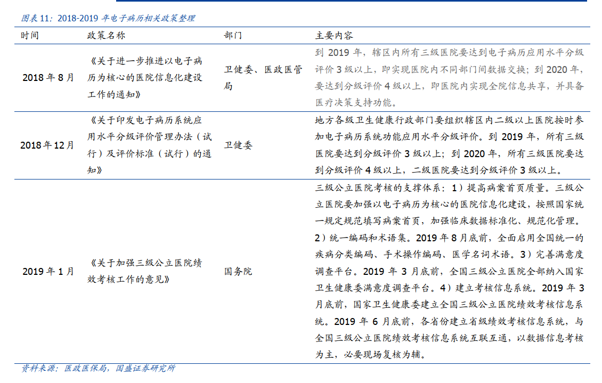

 


#### 2. 中标情况

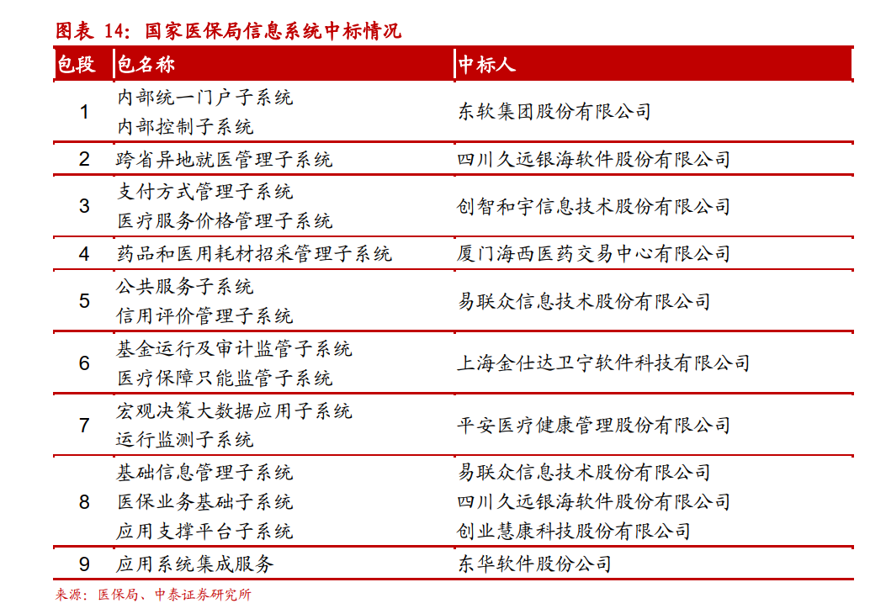

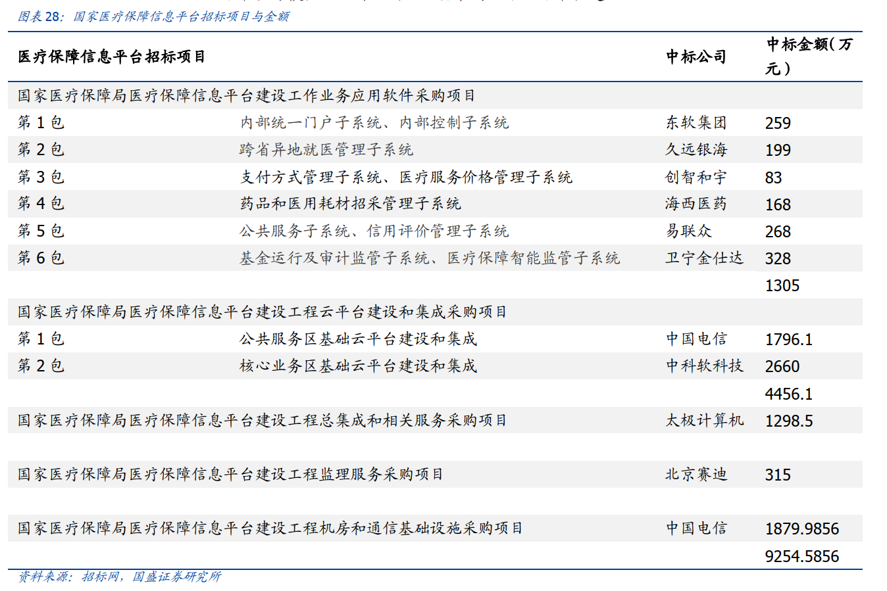


#### 3. 小结

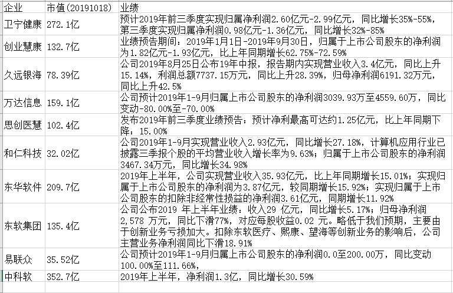

从短期 3-5 年看，电子病历是医疗信息化公司的主要粮仓，长期 5-10年看拥有综合能力的公司具备更强的变现能力。 综合能力更强的头部分公司受益。

医院若要在2020年底之前通过评测，最晚要在2019年年中完成电子病历建设，因此 2019 年及 2020 年上半年为相关公司业绩变现高峰期。 

经过不断的梳理和理解，现在在业绩上的医疗IT确确实实的在推动这些公司的业绩改善，从专注度，专业度，结合业绩等权横。

建议重点关注卫宁健康，创业慧康，久远银海。


### 二、行业概况


#### (一). 电子病历行业政策

电子病历： 2018 年 12 月卫健委发布电子病历应用水平分级管理办法，明确要求，到 2019年，所有三级医院要达到分级评价 3 级以上；到 2020 年，所有三级医院要达到分级评价4 级以上，二级医院要达到分级评价 3 级以上。

我们认为以电子病历评级为契机的医院全面、高质量的信息化，将必然成为医院发展的核心内容。新版电子病历评级要求中增加了数据质量的要求，必将促进信息化流程和管理的真实落地应用。   


##### 1. 电子病历：医保控费基础设施，两年内密集建设 

电子病历评级的核心是促进医疗流程闭环，防止医疗差错，提高医疗安全和质量。数据质量对一致性、完整性、整合性的要求，对于临床大夫而言，将能更便捷地获得患者完整、可追溯的诊疗数据；对医院管理而言，优质的数据使管理效率更有效提升之余，也更加精准。电子病历评级的普及，对提升医疗大数据质量有深远影响。 

根据《电子病历系统应用水平分级评价标准（试行）》， 电子病历系统应用水平划分为 9 个等级。每一等级的标准包括电子病历各个局部系统的要求和对医疗机构整体电子病历系统的要求。 

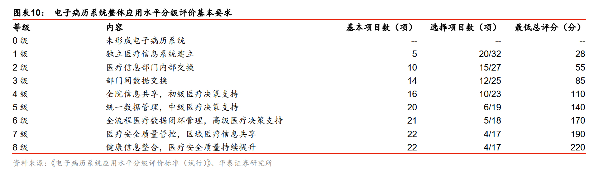


##### 2. 考核压力

信息化纳入三级医院绩效考核，医院紧迫感提升。 2019 年 1 月国务院发布《国务院办公厅关于加强三级公立医院绩效考核工作的意见》（国办发〔 2019〕 4 号）。《意见》专门提出加强三级公立医院绩效考核工作的支撑体系的建设内容，其中包括提高病案首页质量、统一编码和术语集、完善满意度调查平台、建立考核信息系统四方面工作。未来三级医院绩效考核的核心可以概括为“用客观数据说话”。而电子病历系统正是临床信息采集和记录不可或缺的基础设施。国务院和卫健委的政策发布，对医院信息化建设有非常强的促进作用。到期电子病历建设未达标的医院或将面临降级等风险，进而影响收费标准，因此医院有足够紧迫感提升电子病历系统水平。 


#### (二). DRGs(按疾病组付费)行业政策

DRGs（按疾病组付费）： 我们认为医保控费是这一轮医疗信息化建设的核心诉求，而电子病历、 DRGs 付费制度等都是服务于医保控费的信息化基础设施。 

6 月 5 日，国家医保局、财政部、卫健委、中医药局联合印发《按疾病诊断相关分组付费国家试点城市名单》，确
定了 30 个城市作为 DRGs 付费国家试点城市， 2019 年开启 DRGs 全国试点，要求确保2020 年模拟运行， 2021 年启动实际付费。实施 DRGs 付费制度，需要有健全的临床数据作为基础，也就是说电子病历是 DRGs 的基础， 2021 年全国启动 DRGs 实际付费，与 2020年全国三级医院电子病历建设达到 4 级水平的要求具有政策连贯性。此外， DRGs 分组标准确立后，有望催生一波现有 HIS 系统接口改造需求，为医疗信息化厂商带来商机。 


DRGs（Diagnosis Related Groups）是指以出院患者的信息为依据，综合考虑患者的主要诊断和主要治疗方式，结合个体体征如年龄、并发症和伴随病，将疾病的复杂程度和费用相似的病历分到同一个组（DRG）中，从而让不同强度和复杂程度的医疗服务之间有了客观的对比依据。建立 DRGs 分组系统，需要根据病人的年龄、性别、住院天数、临床诊断、病症、手术、疾病严重程度，合并症与并发症及转归等因素把病人分入诊断相关组，相同 DRG 组内疾病的诊疗工作量和医疗费用相近。 

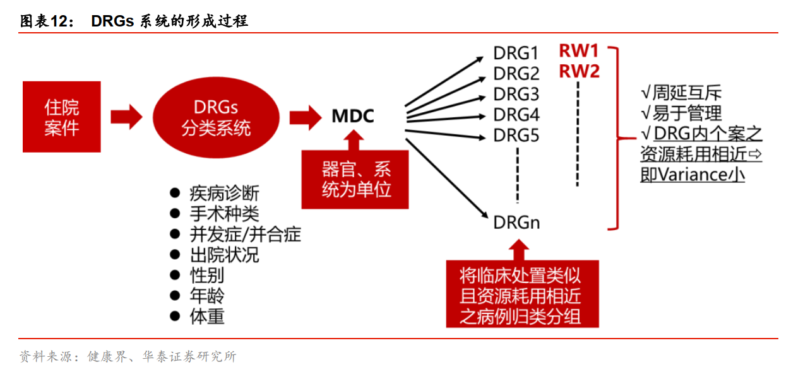


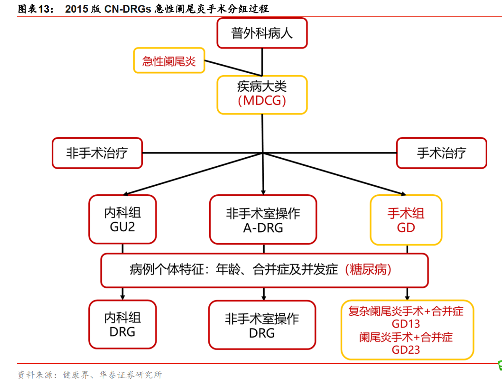


##### 1. 医保控费

DRGs 的最大功能就是医保控费。 在按 DRGs 付费制度下，医疗保险机构就病组付费标准，与医院达成协议，医院在收治参加医疗保险的病人时，医疗保险机构就按病组的付费标准向医院支付费用，合理结余部分归医院，超出部分由医院承担的一种风险共担的付费制度。DRGs 支付制度下，医疗保险的给付方不是按照病人在院的实际花费（即按服务项目）付账，而是按照病人疾病种类、严重程度、治疗手段等条件所分入的疾病相关分组付账。 DRGs
付费相比按量计费、按人头计费和按病种计费，是医保支付方式中比较科学的一种，能够有效控制医疗费用的不合理增长，节约医保资金，引导医疗资源的合理配置，在医保支付方式改革中有重要地位。 DRGs 的病例支付额由基础费率、权重、调整因子三个变量决定，
公式为：
**特定 DRGs 的病例支付额=基础费率×权重×调整因子** 

“基础费率”相当于单位医疗服务产出的价格，对于所有 DRGs 都是一致的。在刚刚引入DRGs 付费时，基础费用可以通过历史数据算得。每个 DRGs 都有特定的“权重”。权重一般认为是不同 DRGs 中病例平均诊疗成本的反映。若某个 DRGs 的权重是 1.0，另一个是 1.5，意味着后者的诊疗成本是前者的 1.5 倍。“调整因子”通常是当 DRGs 付费在多个地区和(或)多种类型医院广泛应用时出现。例如，美国用某个地区可支配收入、是否教学医院作为“调整因子”，收治同类病例，在收入水平较高的地区和教学医院可以获得较高的补偿。 


#### (三). 行业图谱

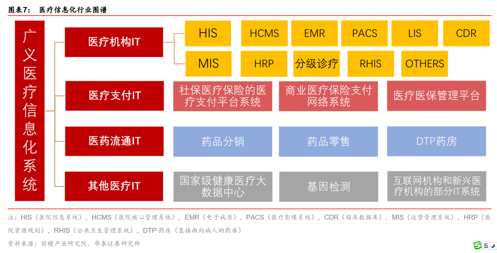


#### (四). 医保控费政策开启医疗信息化新一轮景气周期 

我国医疗信息化建设始于上世纪九十年代，第一轮景气周期以 HIS 系统为核心。 HIS 的功能是财务记账和收费，其核心是财务信息。 HIS 系统不断扩充了药品信息，建立了医生工作站，通过医嘱驱动收费业务和药品业务，成为了当时医院的主要信息系统。

第二轮景气周期以临床信息系统（CIS） 为核心。 进入 21 世纪，城市化进程为城市中心医院带来激增的就诊量，各种医技系统应运而生。如影像存档传输系统（PACS）、放射信息系统（RIS）、检验信息系统（LIS）、超声信息系统（UIS）等。患者的数据分散在这些不同科室的系统内，检查检验结果需要患者进行收集后提供给医生进行诊断。

第三轮景气周期以互联互通为核心。 2010 年后，随着医院各类科室级系统和排队叫号、输液管理等医疗事务辅助系统的不断增加，医院的信息孤岛越来越多。医院的信息化建设发展到这个阶段的状况是各类系统之间是割裂的，数据共享程度低，系统难以有效地按业务流程进行协作，不能体现以患者为中心的“数据一元化”管理。杂乱的医疗数据对医护人员的临床业务支撑能力不足，医患人员急需能够帮助他们提升临床服务水平、减少临床差错、提高工作效率的信息化工具。这带来以互联互通为核心的一轮信息化建设高峰。 

2019 年处于医疗 IT 第四轮景气周期的起点，医保控费推动提质增效。 随着我国老龄化态势日益严峻，医疗需求上升和过度医疗叠加导致医保不堪重负，部分地区存在医保穿底风险。在此背景下国家成立医保局，控费将成为医保局首要任务。医保控费需要以临床数据为抓手，健全的临床信息化系统是医保控费能够落地的基础。我们认为，以电子病历建设和 DRGs 改造为代表的医保控费基础设施将成为本轮景气周期的引子，而人工智能、云计算、物联网等新技术在医疗领域应用，实现提质增效，将是本轮景气周期的高潮。 


### 三、行业空间

#### (一). 电子病历

根据我们测算，二、三级医院电子病历升级空间有望超过 300 亿元。 

根据卫健委数据，截至 2019 年 2 月，我国共有三级医院 2582 所，二级医院 9061 所。根据招标网订单信息，
三级医院升级 3 级电子病历需要投入 200-300 万元，升级 4 级电子病历需要 350-550 万元；二级医院从 2 级升级 3 级电子病历需要投入 100-150 万元，从 1 级升级 2 级电子病历需要投入 10-30 万元。据此测算，中性情景下，政策带来的二、三级医院电子病历升级市场需求超过 300 亿元。 

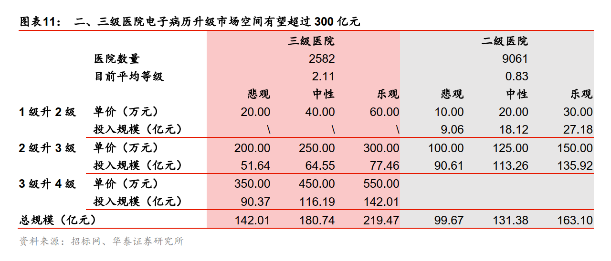

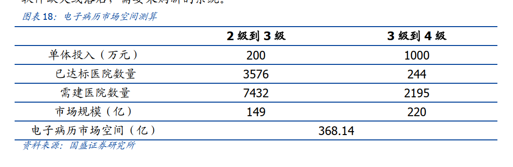

市场以往给予公司创新业务较高的预期和估值溢价。我们对创新业务模式进行了较为深入的研究， 认为创新业务将从低基数、高增速、高投入、高亏损的阶段进入到平稳增长阶段，利润贡献方面，我们认为 2019 年创新业务有望实现盈亏平衡。 在最终的盈利预测中，创新业务短期对公司业绩弹性影响有限， 2019-2021 年， 增长更多来源于传统业务的订单释放。 但考虑到 8 月 30 日医保局发布《关于完善“互联网+”医疗服务价格和医保支付政策的指导意见》，互联网医疗可以开始对接医保支付。我们认为这一政策有望推动国内互联网医疗发展步伐，长期看来，公司创新业务发展空间广阔。 


#### (二) DRGs

全面实施 DRGs 付费制度有望带来 HIS 厂商业务增量。 DRGs 的有效推广需要区域内的医院使用统一的 DRGs 分组器，并且做到入分组器数据标准统一，由分组器产出一致性DRGs 数据指标。 DRGs 分组器需接入医院现有 HIS 系统， DRGs 的大范围应用将带来医院 HIS 系统升级维保的需求，进而为 HIS 厂商带来业务增量。 


医保控费是这一轮医疗信息化建设的核心诉求，而电子病历、 DRGs 付费制度等都是服务于医保控费的信息化基础设施。 国家成立医保局推动医保控费，政策制订方、监管方、受益方集于一体，保障政策得以顺利切实推进。医疗信息化订单实施周期通常在半年到一年左右，这意味着今年中报开始政策催化带来的订单增长开始逐步体现在业绩层面。电子病历建设和 DRGs 接口改造持续带来业务增量，我们认为医疗信息化高景气状态到2021 年仍将持续。 


#### (三) 改造成本

从电子病历 2 级到 3 级， 单体医院投入至少需要 200 万。 

电子病历 2 级的整体要求是

(1)住院、检查、检验、住院药品等至少 3 个以上部门的医疗信息能够通过联网的计算机完成本级局部要求的信息处理功能，但各部门之间未形成数据交换系统，或者部门间数据交换需要手工操作。

(2)部门内有统一的医疗数据字典；

电子病历 3 级的整体要求是

(1)实现医嘱、检查、检验、住院药品、门诊药品、护理至少两类医疗信息跨部门的数据共享。

(2)有跨部门统一的医疗数据字典。 实现电子病历 2 级到 3 级的技术解决方案是完善统一医疗数据字典，增加接口，实现医疗信息跨部门的数据共享。根据我们产业调研和对相关上市公司的订单梳理，单体二级医院实现升级的信息化投入至少在 200 万，不同体量的医院在预算会有较大差异。 


从电子病历 3 级到 4 级，单体医院单体投入在千万以上。

根据政策要求，到 2020 年三级医院要实现院内各诊疗环节信息互联互通，达到医院信息互联互通标准化成熟度测评4 级水平，由院内任一部门任一终端登入，均能按照权限调阅相关诊疗环节的信息。使分布在不同部门的不同信息系统由分散到整合再到嵌合融合，逐步解决信息孤岛、信息烟囱问题，最终形成基于平台的整体统一的电子病历信息系统。电子病历的 3 级和 4 级最大差距是平台和数据中心，以及基于平台的决策支持系统，对于规模达到 2000 张床、一万门诊量以上的三级医院来说，完整的平台的和数据中心并且通过自评测的信息化投入基本需要在 1000—1500 万之间，后续实现诊疗的全流程闭环，则主要是增加基于平台的应用。 


#### (四)医疗信息化竞争格局十分分散 

由于医院的信息化建设定制化程度较高， 对于本地化服务的需求也比较高，销售模式基本为直销。导致医疗信息化公司业务区域性较强，医疗 信息化行业竞争格局十分分散 

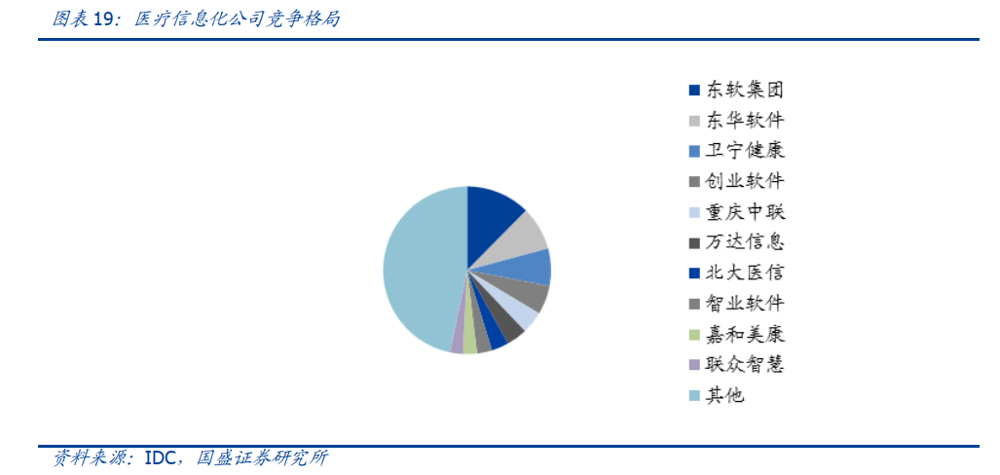

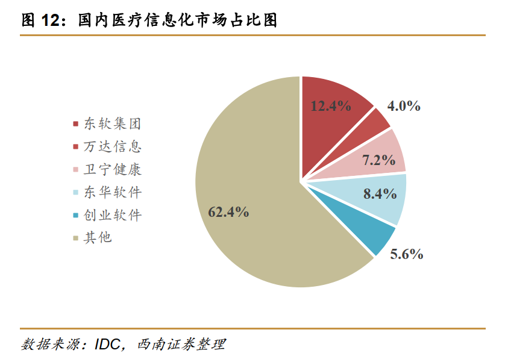

在行业订单集中释放的情况下，具备三种能力的公司将脱颖而出： 1）产品能力突出，产品线齐全且研发能力突出； 2）具备大量医院客户，具备丰富项目经验； 3）渠道资源完备，直销模式下覆盖全国大部分区域 


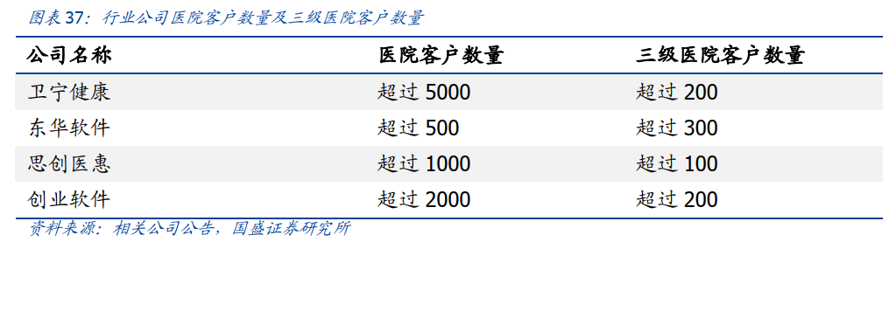

#### (五)医疗信息化产业链公司一览 

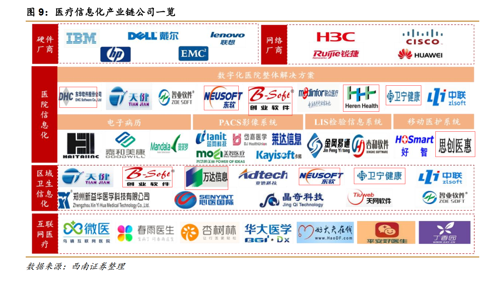


### 四、行业格局

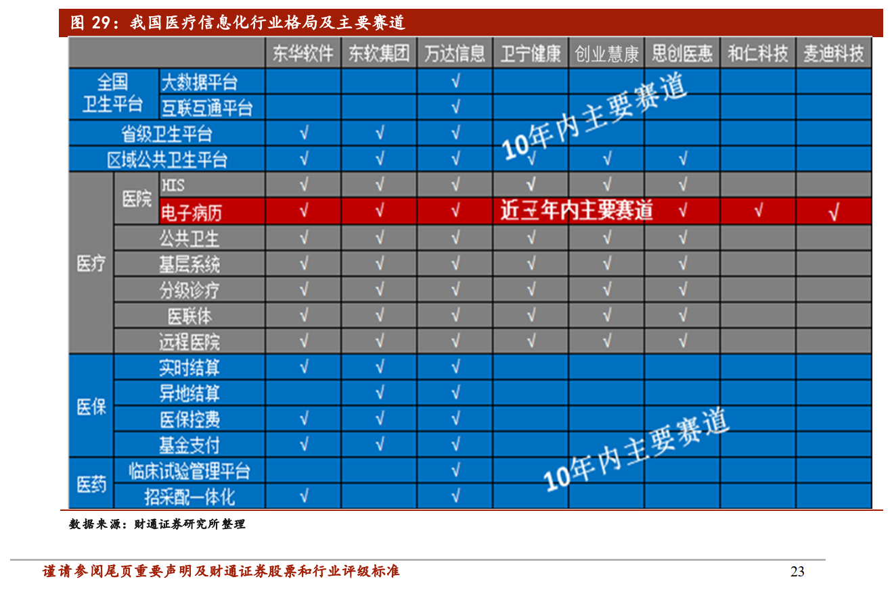


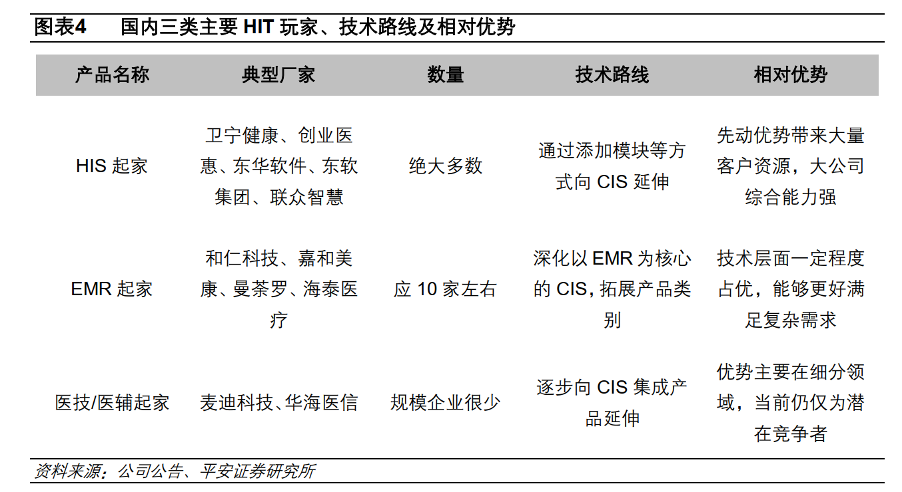


#### (一) 卫宁健康

##### 1. 核心竞争力一：一站式医疗信息化方案提供能力 

卫宁健康具备医疗信息化一站式解决方案提供能力。 医疗行业数字化转型对于提升医疗效率，合理分配医疗资源，优化医疗服务体验都具有重要意义。 根据下游建设主体的不同，医疗信息化可大致细分为医院信息化、区域公共卫生信息化、 医保信息化和药品流通信息化四个细分领域。卫宁健康是医疗信息化市场中业务覆盖面最广的厂商之一，除药品流通信息化涉足较少外，其他领域均处于行业领军地位。 


##### 2.核心竞争力二：卓越的产品化能力 

产品化能力奠定高毛利和快速扩张的基础。 医院 HIS 系统对医院信息流、财务流顺利运转极为重要，大型三级医院对 HIS 系统个性化开发的需求较多，属于产品化难度较高的应用领域。

卫宁健康通过柔性产品化研发模式，在多年技术积累和客户积累的基础上，推出丰富的产品线，通过产品模块的组合和叠加满足不同客户不同层次的需求，解决了复杂应用 产品化的难题。业内突出的产品化能力为公司带来两方面竞争力。一方面，相比于定制化开发，产品化解决方案具有更高的复用率，从而带来公司软件毛利率的提升。另一方面，产品化为公司快速扩张打下基础，产品化在一定程度上降低了业务扩张对人员增长的线性依赖，使公司能够在全国范围内实现快速扩张，带来规模效应和品牌效应 

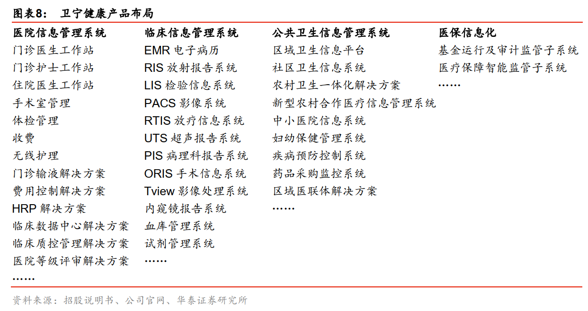


##### 3. 核心竞争力三：遍布全国的渠道布局 

医疗信息化解决方案需要提供持续的售后维护服务，因此具有一定的区域性特征。公司上市后陆续通过收购、参股、新设子公司等手段进行全国布局，有力扩大业务辐射范围，基本形成全国布局。截至 2018 年，公司共有 9 家全资子公司和 10 家控股子公司。收购增厚业绩的同时扩大业务辐射能力。公司收购后体现出良好的协同效应和赋能效应， 帮助公司把握更广阔范围的商机。 


##### 4. 创新业务，扭亏是目标啊

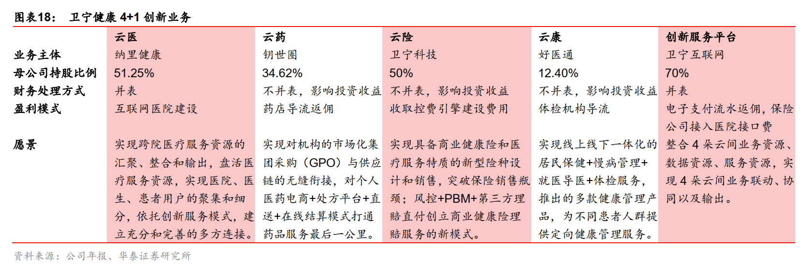

别看上面牛B哄哄的，现在都是亏损的，只能是远景，暂时没有利润释放。


##### 5. 对标 Cerner

卫宁的战略布局和成长路径与 Cerner 类似。 早期通过全国扩张和产品化战略，筑起高护城河。 2019 年拿下医保局智能监管订单，彰显业内领先实力。未来同样瞄准医疗全生命周期的互联网服务和数据赋能，发展潜力大。 


#### (二) 万达信息

##### 1. 始终专注于城市信息化建设 

公司自 1995 年成立以来一直专注于城市信息化领域的建设，是国内较早进入该领域的综合性服务厂商。经过 23 年的持续发展，公司已实现在医疗健康、政务服务、社会保障、市场监管、平安城市和金融保险等细分领域的深度卡位，并依托于市民云、健康云等城市公共平台实现了数据价值的有效输出。 

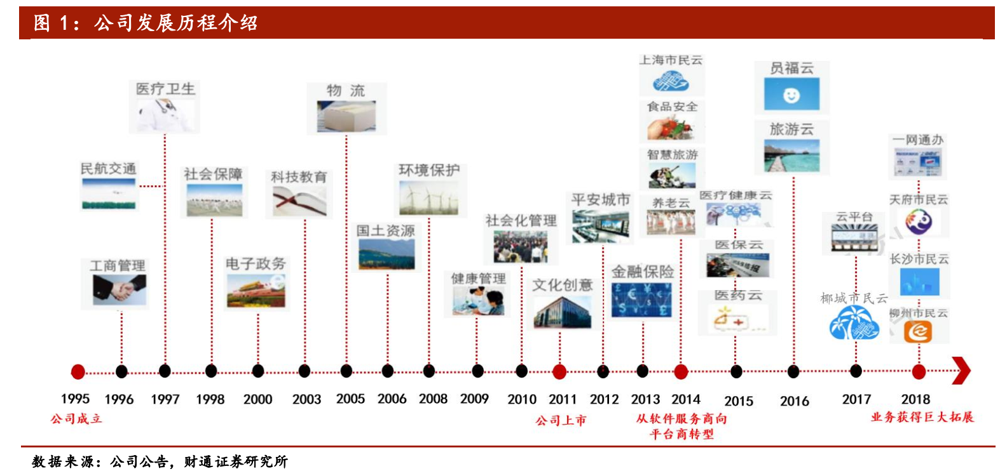


##### 2. 医疗布局全面

从业务线条布局上看，万达信息布局最为全面，全国性卫生平台、省级卫生平台、区域公共卫生平台、医疗、医保和医药等全部打通； 在卫生平台建设上份额最大，目前在浙江宁波、 浙江台州等试行， 全国卫生平台大数据分析平台和互联互通平台目前看全国唯一；在医保结算领域处于龙头地位（与东华软件、久远银海形成竞争）； 在医药领域率先在上海推出阳光采购平台，有望推向全国。 

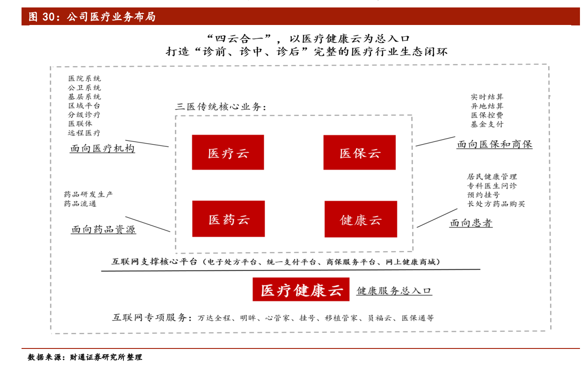


#### (三) 创业慧康


##### 1. 业务范围

公司组建了医卫信息化事业群、医卫物联网事业群、医卫互联网事业群， 形成了“一体两翼”的公司业务格局，为公司医疗健康大数据运营、健康城市建设运营、互联网医院建设运营、智慧医疗物联网服务运维等创新业务进一步发展奠定了坚实的基础。
1） 医卫信息化事业群。 得益于国家电子病历新政的推动以及公司的在电子病历业务建设的多年积累的经验，公司上半年电子病历评级相关业务订单数量明显增加；公司自2017 年 12 月中标医疗行业内首个大数据项目以来，在医疗大数据业务方面已相继与上海市闵行卫计委、江阴市人民医院、白银市第一人民医院等 400 余家医疗卫生机构及卫生行政部门开展了合作，在医疗大数据方面具有先发优势。
2）医卫物联网事业群。 2019 年初，公司物联网事业群组建完成，该事业群业务主要由公司的全资子公司杭州慧康物联网科技有限公司（原杭州博泰信息技术服务有限公司）负责。公司医卫物联网事业群业务主要针对医院诊前、诊中、诊后各环节的服务场景提供解决方案。
3）医卫互联网事业群。 2019 年是“中山市区域卫生信息平台建设营运项目”特许经营的第一年，公司在中山市区域卫生信息平台建设成果基础上，持续完善居民健康服务并开展多种运营业务 

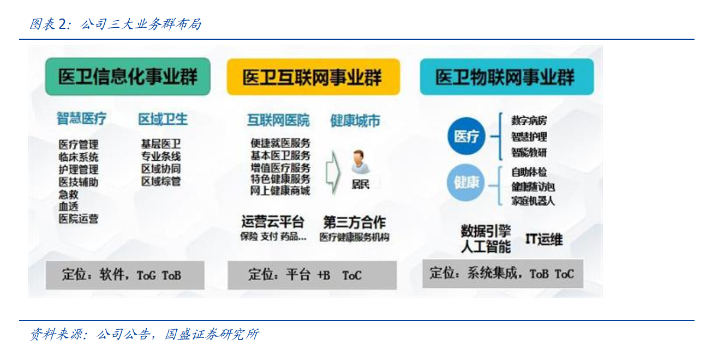

##### 2. 业务有点多

创业慧康通过参股控股子公司杭构筑高效业务版图。 公司通过子公司分散业务，提升效率。多数子公司主力投入软件开发业务，通过杭州合美物业布局物业管理业务，通过杭州联旗科技布局系统集成业务，通过梅清数码科技布局医疗器械业务。杭州慧康物联网科技有限公司作为主要子公司，以 IT 运维服务、系统集成、物联网医院建设等业务为主。从公司的参股控股子公司可以看到创业慧康在分配业务时高效的业务版图。 

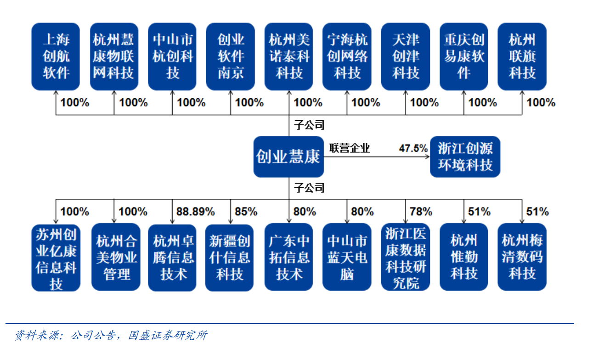


##### 3. 公司携手巨头拓宽创业业务可能性 

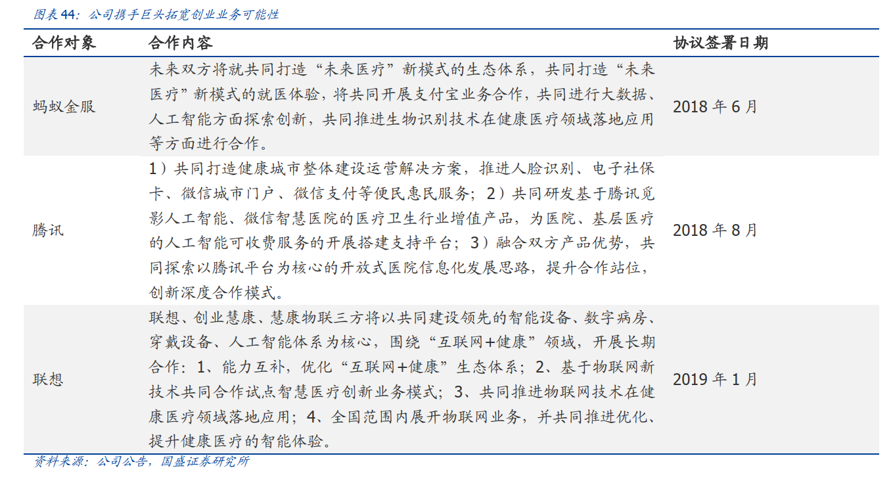


#### (四) 久远银海

##### 1. 产品体系

现在公司已经形成医疗医保、数字政务、智慧城市、军民融合四大产品体系，满足医保局、卫健委、住建部等客户多元化的信息化需求 

医疗医保业务板块主要围绕医保、医疗、医药等健康领域，面向医保局、卫健委、药监局以及医疗机构、医药机构、商保机构等主体，助力医保经办、医保便民、医保治理、区域卫生、智慧医院、互联网医疗、健康医疗大数据、药店服务、药品监管、慢病管理、医疗健康云服务等业务发展。 公司医保核心业务系统覆盖四川、云南、贵州、陕西、新疆、广东、广西、湖北、山西、天津、吉林等省份近 100 个地级以上城市。除核心系统外，医保业务项目还有“互联网+”医保便民服务平台、 吉林省医保局大数据平台等。 医疗信息化领域，公司产品已在重庆市第五人民医院、重庆市长寿区人民医院、攀枝花市第二人民医院、云南圣约翰医院等医院上线。医药信息化领域，公司可提供食品药品监督管理综合平台、 药店云 MIS 等 

从收入规模来看， 2018 年底医疗医保业务板块收入 3.16 亿元，同比增速 37.53%，智慧城市及数字政务两大板块合计收入 4.98 亿元，同比增长 41.58%，军民融合业务受军改等因素影响，实现收入 0.43 亿元，同比下滑约48%。 医疗医保业务是公司重要收入来源，未来医疗医保业务占比有望进一步提升。 


##### 2. 公司凭借多方优势有望充分享受行业成长红利 

公司属人社信息化领域前二的公司， 目前公司在人社信息化领域拥有较高的品牌影响力， 并且对行业有非常深刻的理解，能够给客户提供成套的解决方案及服务。随着医保局从人社部分离，公司又负责承建国家医保局新核心业务系统。基于多方竞争优势，公司有望充分享受行业成长红利，实现医保信息化业务高速增长。 


#### (五) 东华软件

高端医院首选合作伙伴，头部市场客户优势明显： 东华医为现有 300 多家三级以上医院客户，约覆盖 13%的三级医院。其中包括北京协和医院、华西医院在内的全国百强医院中， 有 32%的医院核心业务使用东华医为的智慧医院解决方案。 

据国家卫健委数据，截至 2018 年 6 月底，全国三级医院数量达到 2439 个，较去年同期增加 153 家。目前，东华软件服务三级医院 300 余家，约占三级医院市场份额的 13%，在三级医院市占率第一。 


#### (五) 东软集团

东软医疗系统股份有限公司（以下简称“东软医疗”）、东软熙康控股有限公司（以下简称“熙康”）、北京东软望海科技有限公司（以下简称“东软望海”）、东软睿驰汽车技术（上海）有限公司（以下简称“东软睿驰”）、融盛财产保险股份有限公司（以下简称“融盛财险”） 等等

东软做的东西比较多，东软医疗目前好像在推进独立IPO


#### (六) 易联众

公司中标了国家医疗保障局医疗保障信息平台建设工程业务应用软件采购项目9个项目包中的第5包和第8包，将参与国家医保局的5个应用子系统建设，包括公共服务子系统、信用评价管理子系统、基础信息管理子系统、医保业务基础子系统、应用支撑平台子系统，涉及医保核心业务、互联网应用、大数据应用领域，标志着公司在医保信息化领域的经验和核心竞争力得到巩固和进一步认同，为公司拓展医疗保障市场打下坚实基础。目前，该项目已进入系统开发、标准制定等实质工作环节，公司技术团队参与制定了相关行业标准。 2019年6月，公司参与了国家医保局制定与下发的《医疗保障信息平台建设指南》规划。 


#### (七) 中科软

2005 年-2015年，中科软公司在中国保险业核心业务系统解决方案提供商或 IT 服务商相关竞争力（市场竞争力、技术竞争力、服务竞争力、渠道竞争力和发展潜力）评估中连续十一年居第一位， 2017 年中科软公司在保险领域 IT 解决方案市场中发展能力、市场地位居首位

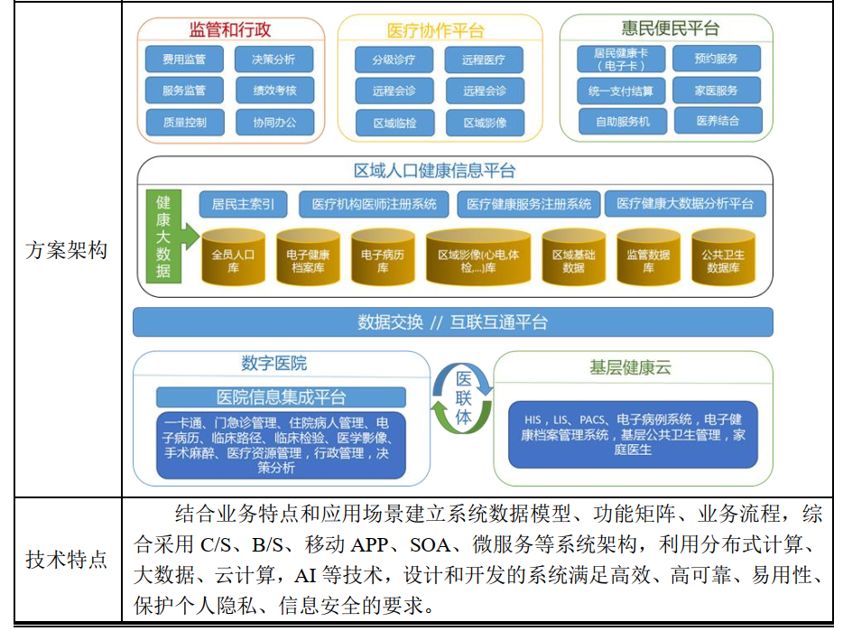


#### (八) 思创医慧

##### 1. 产品

医惠科技利用物联网、人工智能应用、平台数据交互三大核心技术，着力打造创新智慧医疗生态体系，拓展“大平台+微小化”创新医院信息化建设逻辑，让医院可以自由选择多个微小化应用组合来满足业务需求，产品从广度和深度都得到了进一步的丰富。目前广州市妇女儿童医疗中心(100%业务子系统接入同一开放平台)在公司智能开放平台上的信息交互量已达到 160 万次/日,同期其他其他平台仅达 30 万次/日。 

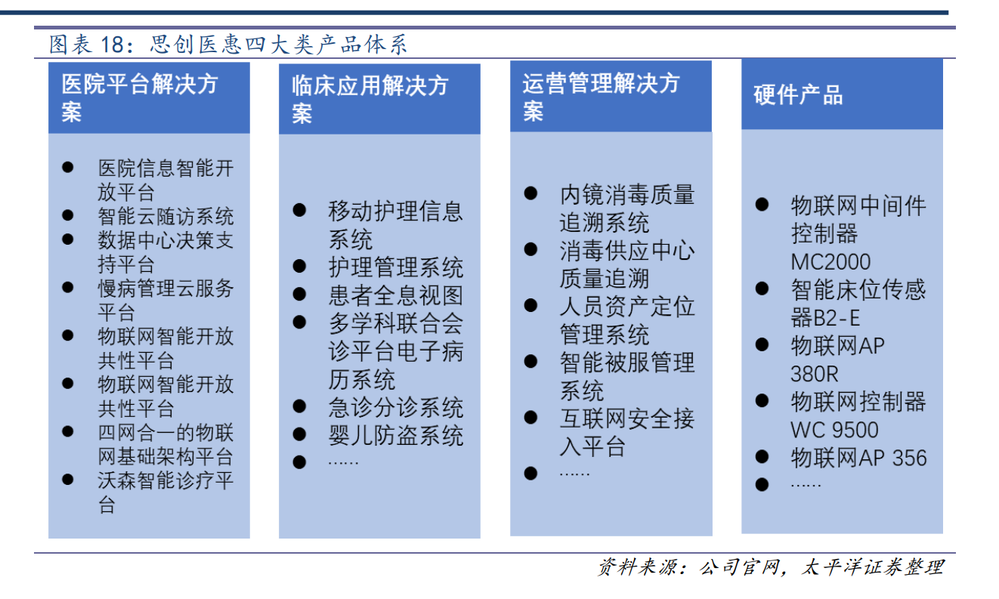

##### 2. IBM沃森

公司参股的杭州认知是国内首家 IBMWatson for Oncology 的官方授权运营商，拥有沃森在中国区域最高权限的全线产品代理权。 2016 年 12 月，浙江省中医院联合思创医惠、杭州认知三方联合成立沃森联合会诊中心，标志着人工智能辅助诊疗新时代的开启。 2017 年 8 月 8 日，公司以3333.20 万元增持杭州认知 8.33%的股权，交易后合计持有杭州认知 11.67%的股权， 标志着公司进入辅助诊断行业 

#### (九) 和仁科技

和仁的核心定位主要是医疗 IT 整体解决方案提供商，更倾向于向客户提供全院级别的 IT 解决方案，定制化程度更高，且产品偏向高端，客户群体以需求更为复杂的三级医院为主，这与多数以软件销售为主要商业模式的同业友商形成了一定程度上的差异化竞争。此外，公司已将业务从院内延伸至服务于医联体的区域平台解决方案，经过多年深耕，已具备规模化的复制推广能力，这也是公司的一大看点 

和仁的区域级产品主要是区域卫生云平台解决方案，是针对城市医疗集团、医联体、医共体的解决方案产品，用于打通医卫机构间的区域协作，是远程医疗、分级诊疗、慢病管理等的支持平台，可做到核心临床数据不错不漏、实时交互，同时可辅助医卫监管部门履行质量控制、综合控费、居民健康档案管理等职能，满足智慧城市中医疗健康业务及数据深度应用需求，是公司院内业务向院间及区域的延伸和拓展。 

军队医院市场是和仁的优势领域，大量军队医院使用了公司的 EMR 系统。 受军改影响，近年军队医院的 IT 建设放缓， 相应的功能配置或已落后，如军队医院重启 IT 建设， 公司有望优先受益 


#### (十) 麦迪科技

##### 1. 产品

麦迪科技是一家专注于医疗信息化和大健康领域的公司，历经十余年的发展，公司成长为临床信息化建设的龙头企业。目前，公司核心产品主要包括两大类： DoCare 系列临床信息系统和 DoRicon 解决方案。其中， DoCare 系列包括麻醉临床信息系统、重症监护（ ICU）临床信息系统、手术医疗行为管理系统、急诊临床信息系统、院前急救临床信息系统。解决方案包括主要包括 Doricon 数字化手术室整体解决方案及正在推广的 Doricon 数字化病区和 Doricon 数字化急诊急救平台整体解决方案。两种产品贯穿围手术期、急诊急救、急危重症、区域医疗协同等领域。 公司的主要客户为医疗机构。经过多年的积累，截至 2018年 12 月末，公司终端用户已覆盖全国 32 个省份，超过 1,400 家医疗机构，其中三级甲等医院 400 多家，是临床信息化细分领域的龙头厂商。 

##### 2. 不孕不育

2019 年 1 月 28 日，麦迪科技与海口玛丽医院有限公司签订《股份收购意向协议》，公司拟收购玛丽医院 50%以上的股份。 海口玛丽医院生殖医学中心是海南省卫计委批准开展试管婴儿辅助生殖技术、不孕不育科室的专科医院，重点开设试管婴儿辅助生殖技术、不孕不育科室等业务。 


### 五、巨头入局


```
阿里巴巴	卫宁健康5.03%
腾讯	     东华软件约5%
中国人寿	万达信息15.0183%
```


 


