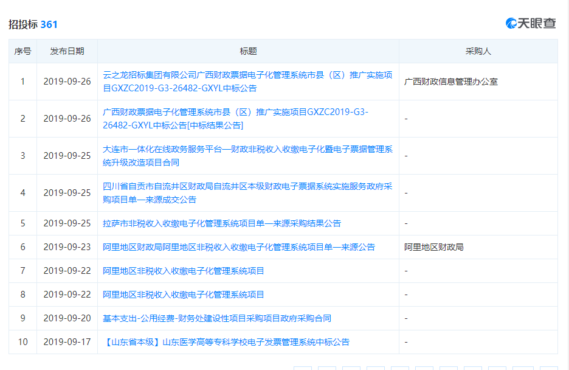
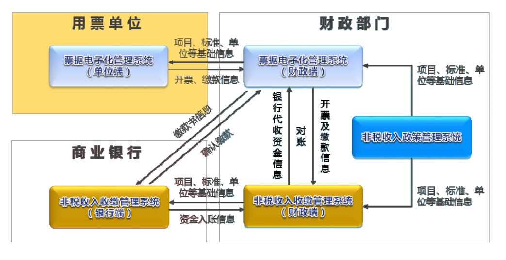
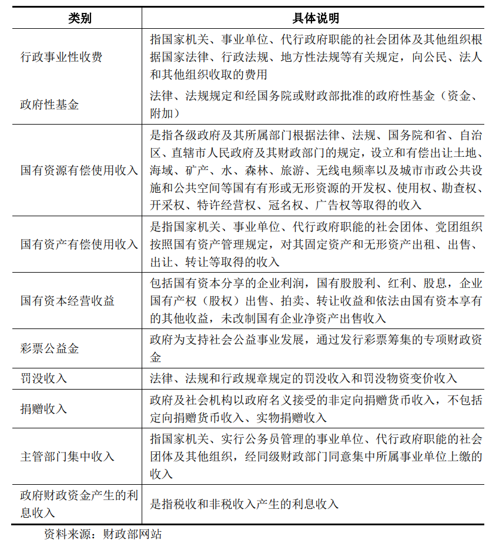
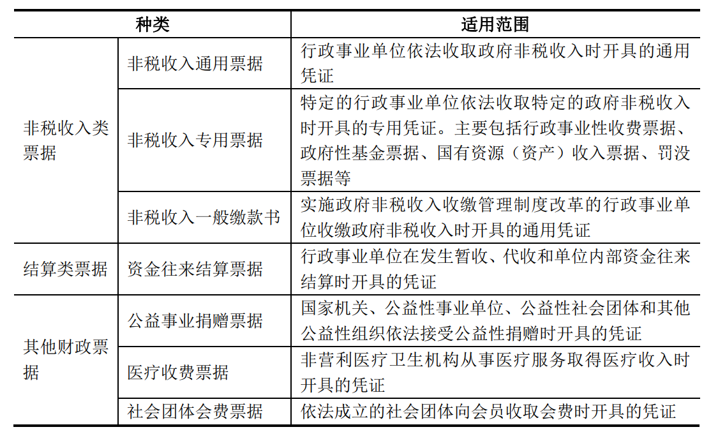
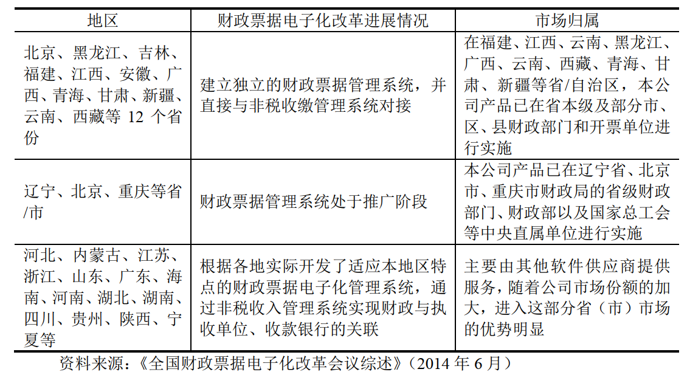

# 非税收入信息化(首次覆盖20191009)

### 一、结论

#### 1. 亮点

2018年11月，财政部发布了《关于全面推开财政电子票据管理改革的通知》，决定全面推开财政电子票据管理改革

2019年8月1日，财政部联合国家卫生健康委、国家医疗保障局发布了《关于全面推行医疗收费电子票据管理改革的通知》（财综〔 2019〕 29号），要求各地区应在充分总结财政电子票据改革试点经验的基础上， **在2020年底前全面推行医疗收费电子票据管理改革，推广运用医疗收费电子票据。**

**初步测算有望释放数十亿增量市场，而若考虑高校等其他行政事业单位与企业，市场容量有望迎来数倍扩容期；**

2018年末，医院按等级分：三级医院1192个(其中：三甲医院722个),二级医院6780个,一级医院4989个,未评定等级医院6751个。

毛估1200+6800+5000=13000*单价如果在50万左右=65亿，假设博思占有50%，至少有30亿的份额，博思的净利润率在20%左右，也就是至少保守有6亿的净利润，在2020年爆发

#### 2. 定增腾讯入局

公司发布公告，确定非公开发行股票数量为1821.12万股，募集资金总额4.50亿元，每股价格为24.71元，由林芝腾讯科技有限公司为单一认购对象

与腾讯系强强联合，业务和能力受一致认可：本次定增认购由林芝腾讯科技有限公司独家获取，林芝腾讯由深圳市腾讯产业投资基金有限公司100%控股，本次定增完成后林芝腾讯持股公司8.56%的股份，为第二大股东。通过此次定增，公司将与腾讯系强强联合，双方有望在资源和产品等方面形成互补，推进电子政务领域的业务布局。  

#### 3. 招标信息

#### 4. 小结

后面的内容其实可以不用看，主要是信息摘录，用来追溯和跟踪。坦白说，作为一名价值投机者，我居然研究一只上半年还在亏损的股票。。。但事实是，博思在第四季度的份月占了全的80%以上

但是理性告诉我，博思，值得沉思。这家公司在福州海西园，我不算陌生，只是没有留意，最近的医疗电子票据的驱动，特别是给博思带来了充足的确定性，福建省内的一些医院已经开始在招标了。

腾讯的入局，更是战略性上的财务投资，但侧面说明了博思在非税收入这块的龙头地位得到了侧面印证。

最近我也买了保险，发现这些行业在理赔上确实有依赖，从腾讯的众多布局，我们可以大概看到，医疗类就是主攻方向，而保险类未来更是重中之重，要衔接这税端，需要博思这样的接口。

总体上，我们可以期待医疗电子票据的驱动，爆发性成长是极大的可能的，看招标推进信息跟踪。 

### 二、行业概况

​	非税收入是指除税收以外，由各级政府、国家机关、事业单位、代行政府职能的社会团体及其他组织依法利用政府权力、政府信誉、国家资源、国有资产或提供特定公共服务、 准公共服务等而取得并用于满足社会公共需要或准公共需要的财政资金，是政府财政收入的重要组成部分，是政府参与国民收入分配和再分配的一种形式。 

​	主要包括行政事业性收费、政府性基金、国有资源和国有资产有偿使用收入、国有资本经营收益、彩票公益金、罚没收入、以政府名义接收的捐赠收入、主管部门集中收入以及政府财政资金产生的利息收入等。在当前世界上几乎所有国家，非税收入均为国家财政收入的重要资金来源，是政府提供公共服务和产品以及国家实施财政政策和进行宏观调控的主要手段之一。 

#### 1. 非税政策

2001 年以来，我国各级财政部门根据财政国库管理制度改革的要求，在规范财政票据行为， 加强政府非税收入征收管理和建立健全监督管理体制等方面进行了许多信息化建设的探索和改革。 

财政部于 2004 年发布了《财政部关于加强非税收入管理的通知》（财综【 2004】 53 号），要求各级政府加强非税收入管理，完善非税收入收缴及管理方式，实现各级部门与代收银行间非税收入收缴信息联网，加强政府非税收入票据管理，推进财政票据电子化改革，健全政府非税收入监督检查机制。  

2009 年，财政部进一步发布了《财政部关于深化地方非税收入收缴管理改革的指导意见》（财库【 2009】 1 号）推进政府非税收入管理的深化。要求按照构建公共财政管理模式的规范，在清理收费项目、改革票据管理、 完善行政审批制度的基础上， 建立以先进信息技术为依托的“单位开票、银行代收、财政统管、实时监督”的政府非税收入管理体制，地方各级财政部门要完善通过非税收入收缴管理信息系统收缴非税收入的方式， 并将其作为非税收入收缴的主要方式，确保政府非税收入管理的法制化、规范化，实现政府财政性资金的“国家所有、 政府调控、 财政管理”的目标， 提高非税收入管理的科学化、精细化水平。  

2012 年，财政部要求根据“金财工程”建设规划，依托计算机和网络技术手段，规范政府非税收入和财政票据管理，进一步推动了我国非税收入信息化建设的进程。  

2012 年 12 月，财政部发布《关于印发〈关于推进财政票据电子化改革的方案〉的通知》（财综【 2012】 104 号），明确要求统一规划、分步实施财政票据电子化改革。

2013 年 4 月，财政部进一步发布《关于中央部门和单位开展财政票据电子化改革试点工作的通知》（财综【 2013】 46 号），要求在中央部门和单位实施财政票据电子化改革试点工作， 并落实国家质量监督检验检疫总局
等 19 家单位为第一批试点单位。   

信息化建设是规范财政票据行为、加强非税收入管理、提高非税收入征缴效率的重要手段。公司通过各种产品的有效衔接，能够实现财政部门、用票单位、代收银行以至社会公众的实时联网，建立起“单位开票、银行代收、财政统管、实时监督、源头分解、自动缴库”的政府非税收入信息化管理体系，确保政府非税收入按规定及时、准确、足额上缴国库或财政专户，实现了征缴环节的便民利民，为提高政府非税收入管理的科学化、信息化水平发挥了重要作用。 

#### 2. 非税收入管理信息化理论模型与核心流程

#### 3. 政府非税收入定义及其在公共财政中的重要地位 

非税收入是政府财政收入的重要组成部分。在我国，非税收入具体包括以下几类： 

#### 4. 加强政府非税收入管理的背景 

加强政府非税收入管理，有利于健全“一体两翼”的公共财政体系。“一体”即公共财政体制，“两翼”即以税收收入为主体、政府非税收入为有力补充的公共财政收入体系和以人为本的公共财政支出体系。就公共财政收入体系来说，我国已建立了比较完善的税收体系，但现阶段政府非税收入管理落实还不到位，在一定程度上影响了非税收入的形象和公共财政体系的构建，影响了政府宏观调控水平的充分发挥，不利于国民经济健康稳健地发展。 

#### 5.财政票据的种类、适用范围 

财政部门是财政票据的主管部门。其中：

财政部负责全国财政票据管理工作，承担中央单位财政票据的印制、发放、核销、销毁和监督检查等工作，
指导地方财政票据管理工作；

省、自治区、直辖市人民政府财政部门负责本行政区域财政票据的印制、发放、核销、销毁和监督检查等工作，指导下级财政部门财政票据管理工作；

省级以下财政部门负责本行政区域财政票据的申领、发放、核销、销毁和监督检查等工作。 

### 三、竞争格局

非税收入管理应用行业形成了以少数几家专业的财政管理软件提供商为主，部分零散的财政信息单位、地方性小软件厂商为辅的竞争格局。 

国内主要专业财政管理软件提供商包括

东软集团股份有限公司（以下简称“东软集团”）、
北京用友政务软件有限公司（以下简称“北京用友”）、

深圳市龙图软件有限公司（以下简称“深圳龙图”）、

北京兴财信息技术开发公司（以下简称“北京兴财”）、

广东瑞联科技有限公司（以下简称“广东瑞联”）及本公司等多家软件企业；

各专业的财政管理软件提供商均拥有各自的市场份额，形成相互竞争、合作和共同发展的市场格局。 

#### 1. 市场进入壁垒 

政府部门在电子政务应用软件的功能、 数据交换和安全性等方面都有严格的标准和规定，不符合这些规定的新进入者将无法进入本行业市场。同时，非税收入信息化管理应用具有较高的“用户黏性”。 政府部门在建立信息系统并推广应用的过程中，所付出的总成本不仅包括购置硬件设施、软件系统所付出的显性成本，而且包括在工作规范、管理制度、业务改造、职员培训等方面的隐性成本，产品转换成本较高，新的进入者很难抢夺先入者的市场份额。

此外，非税收入管理应用软件产品具有开发周期长，研发人员和管理人员投入大，人力成本较高等特点，产品交付之后还需要根据客户出现的新需求、新问题投入资源为之进行后续运维，因此这个市场的先行者具备先发优势。 

### 四、博思软件

#### 1. 公司主营

公司主营业务为软件产品的开发、 销售与服务， 软件产品主要应用于财政信息化领域， 并聚焦于财政票据、 政府非税收入及其延伸业务领域、 财政财务领域和公共采购领域三大领域。 

在财政票据、 政府非税收入及其延伸业务领域， 主要面向财政票据电子化管理、 财政电子票据管理、 政府非税收入管理信息化及公共缴费服务领域， 为财政票据用票单位、 各级财政部门提供财政票据电子化管理及政府非税收入信息化管理相关的软件产品和服务， 在此基础上， 结合互联网+政务的改革需要， 通过公司自主研发的统一公共支付平台， 实现与执收单位业务系统、 非税票据管理系统和银行中间业务系统的互联互通， 为社会公众提供“业务开单、 缴费、 开票”的一站式网上业务办理服务。 此外， 在原E缴通公共缴费网基础上升级研发福码通缴费云， 以统一身份认证为基础， 聚合多种支付能力， 除政务服务外拓展到更多如公共交通、 旅游景点等公共服务领域， 为各级政府实现“数字政府 一网通办”、 “智慧城市 一码通行”的数字城市建设。

在财政财务领域， 主要是为政府客户提供财政核心业务一体化、 财政大数据、 财务内控及预算单位一体化和绩效管理相关的软件产品和服务。

在公共采购领域， 2018年通过并购行业内公司， 公司将政府采购进一步扩大至公共采购， 主要为参与政府采购、 高校采购、 军队采购、 国企采购等采购人、 社会代理机构、 供应商等相关主体提供采购信息化监管和电子交易平台建设并提供采购的相关服务 

#### 2. 经验优势

公司长期专注于财政信息化领域， 积累了多年的财政信息化经验， 深入领会国家有关财政票据电子化管理改革、 财政电子票据管理及政府非税收入管理的制度要求和政策导向， 切实把握各级政府财政票据管理和非税收入管理的特点和需求， 提供贴近客户实际应用的软件产品和个性化服务， 能够实现财政票据管理及非税收入管理与软件信息技术的深度融合。 同时在国家积极推进财政信息化系统化、 各省市着眼电子化采购变革的背景下， 公司凭借多年政府服务的经验积淀， 利用已占领的业务资源优势， 能够快速进入市场， 推进财政财务业务及公共采购业务。 

#### 3.财政票据电子化管理应用市场的大体情况

#### 4. 行业地位 

公司较早进入财政票据电子化管理及非税收入管理信息化领域， 是目前该领域的龙头企业之一。 

2007 年本公司的财政票据电子化管理软件在财政部财政票据监管中心部署实施，在中央单位财政票据的印制、发放、使用、审验、稽查、销毁的过程中，试行电子化监管；

2010 年应财政部财政票据监管中心的需求，本公司对该软件进行维护、升级改造及应用整合； 

2014 年 4 月，本公司中标财政部国库收付系统升级完善项目—非税收入收缴管理系统升级改造项目， 协助其进一步提升非税收入收缴管理水平， 建立较为先进的非税收入收缴电子化管理方式。

该项目现已完成升级改造工作，并进入试运行。通过上述合作，本公司的财政票据电子化管理系统与非税收入收缴管理系统两大系统已实现对财政部现有业务系统的衔接、并进行整合建设，树立了行业内系统建设标准，有利于本公司产品在尚未建立财政票据电子化管理系统、 非税收入收缴管理系统的地区进行推广应用 

#### 5. 销售区域（2018年年报）

从销售区域上看， 原有的优势区域如福建、 北京、 黑龙江等收入持续增长； 近两年开拓的地区如四川、 陕西、 贵州、 天津等经业务深耕， 收入与去年相比呈大幅增长， 另外， 通过行业内并购与业务整合， 内蒙古、 吉林、 广东等也带来较大收入。 

 

