# 心脉医疗(20191118)

### 总结

心脉医疗作为在我国主动脉血管介入医疗器械市场份额排名第二（排名第一的公司为美敦力） ，国产品牌中市场份额排名第一，技术方面的优势比较确定。

在外周血管介入领域，目前国内市场基本由美敦力、波士顿科学、科迪斯、巴德、雅培等国际先进企业占据，缺乏有力的国内竞争者。公司在外周血管介入产品销售收入较小，市场占有率较低。 

但我们目前也要清醒的认识到，主动介入市场规模还不算大，不到20亿的体量目前，在更大的外周血管介入领域

，接近70亿左右的体量，目前公司的占比应该是比较低的，没有批露占有情况。

总体来说，心脉医疗目前还是比较优秀的，占有主动脉血管介入龙头位置情况下，积极拓展外周血管产品线，目前暂时适合作为细分龙头来跟踪，当年对大博医疗偏见，跟丢了，现在对医疗股尽量客观跟踪，保持关注。

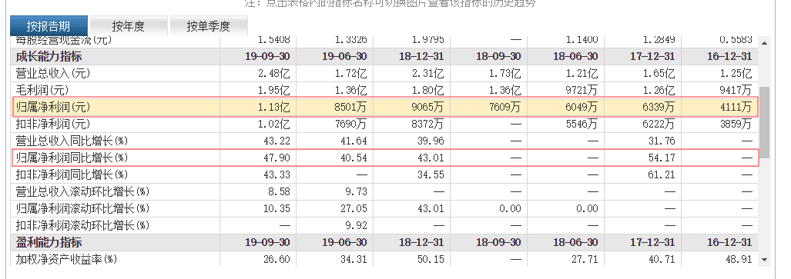

财务上也相对稳健成长，爆发性的增长，目前在心脉身上比较难看到，长牛慢牛是比较好的定位和归宿。目前100亿左右的市值，从成长性来看，相对偏高，需要消化估值或者业绩催化。

来自券商预测：

我们预计 2019-2021 年实现收入 3.25 亿元、 4.52亿元、 6.07 亿元，分别增长 40.76%、 38.81%、 34.34%， 归母净利润分别为 1.22 亿元、1.70 亿元、2.27 亿元，同比增长 34.88%、38.75%、34.06%  

### 一、主营业务

#### (一) 概述

​	公司是港股上市公司微创医疗子公司 

​	公司主要从事主动脉及外周血管介入医疗器械的研发、生产和销售。在主动脉介入医疗器械领域，公司是国内产品种类齐全、规模领先、具有市场竞争力的企业之一， 公司在该领域的主要产品为主动脉覆膜支架系统；在外周血管介入医疗器械领域，公司深耕多年，目前拥有外周血管支架系统、外周血管球囊扩张导管等产品； 另外，公司拥有国内唯一获批上市的可在胸主动脉夹层外科手术中使用的术中支架系统。 

​	根据弗若斯特沙利文公司的相关研究报告， **按照产品应用的手术量排名， 2018年公司在我国主动脉血管介入医疗器械市场份额排名第二（排名第一的公司为美敦力） ，国产品牌中市场份额排名第一。**

​	公司始终以“持续创新， 为主动脉及外周血管疾病患者提供能挽救患者生命或改善其生活质量的最佳普惠医疗解决方案”为使命， 致力于成为主动脉与外周血管介入治疗领域全球领先的高科技公司。 

​	公司始终坚持以产品和技术为导向，坚持具有自主知识产权产品的研发和创新，逐步实现从技术跟随到技术引领的角色转换。 经过多年潜心研发，公司掌握了涉及治疗主动脉疾病的覆膜支架系统的核心设计及制造技术， **成功开发出第一个国产腹主动脉覆膜支架、 国内唯一获批上市的可在胸主动脉夹层外科手术中使用的术中支架系统**。 **公司自主研发的 Castor 分支型主动脉覆膜支架首次将TEVAR 手术适应证拓展到主动脉弓部病变，是全球首款获批上市的分支型主动脉支架。** 

​	2014 年，原国家食品药品监督管理总局发布了《创新医疗器械特别审批程 序（试行）》，针对具有我国发明专利、技术上具有国内首创、国际领先水平，并且具有显著临床应用价值的医疗器械设置特别审批通道； 截至 2018 年底，全国共有 205 项创新医疗器械进入特别审批通道，公司已上市及在研产品中有 5项曾进入上述通道， 进入特别审批通道的产品数量排名在国内医疗器械企业中处于领先地位。 

#### (二) 主要产品

​	公司主要产品可分为主动脉覆膜支架类、术中支架类及其他产品 

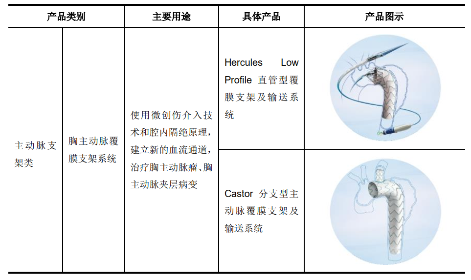

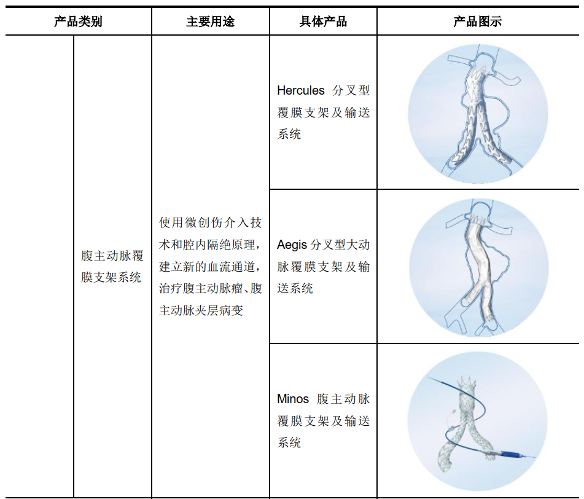

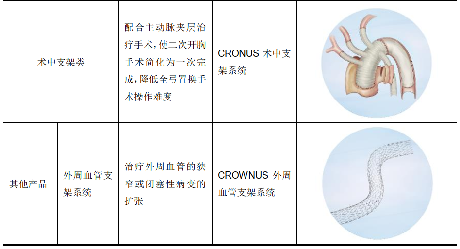

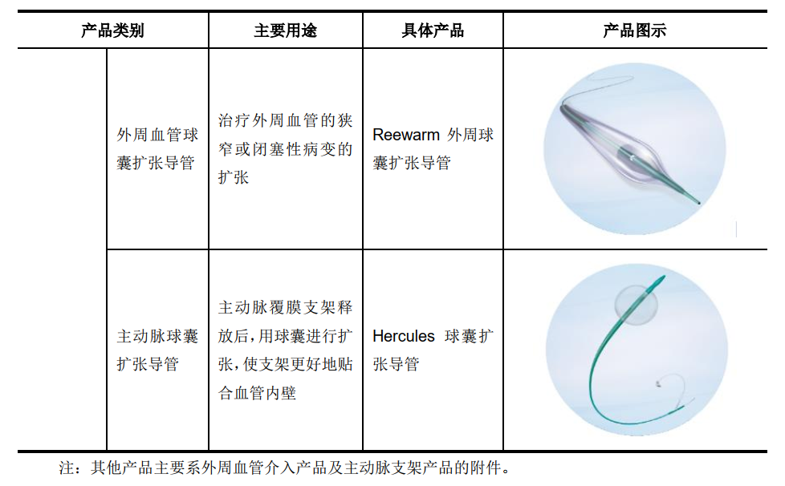

#### (三) 主营业务收入构成 

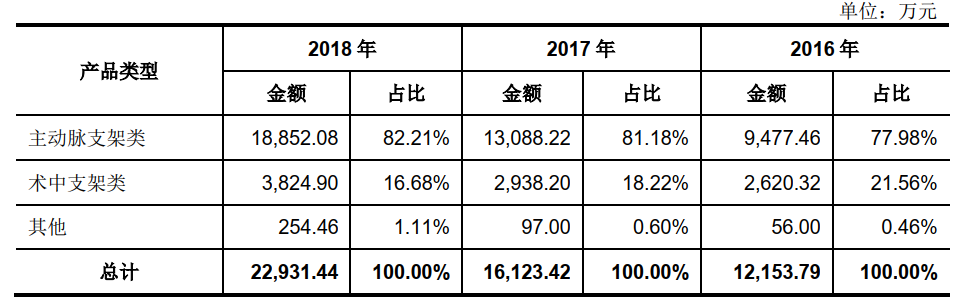

### 二、医疗器械行业

​	医疗器械是指单独或者组合应用于人体的仪器、设备、器具、体外诊断试剂及校准物、材料或者其他物品，主要通过物理方式对人体体表及体内产生作用。医疗器械临床应用包括疾病的诊断、预防、监护、治疗或者缓解，损伤的诊断、监护、治疗、缓解或者功能补偿，生理结构或者生理过程的检验、代替、调节或者支持，以及生命的支持或者维持等。
​	医疗器械产品品种繁多， 我国对医疗器械按风险程度进行监管，共分为三类。其中，第Ⅰ 类：风险程度低，实施常规管理可以保证其安全、有效的医疗器械；第Ⅱ 类：具有中度风险，需要严格控制管理以保证其安全、有效的医疗器械；第Ⅲ类：具有较高风险，需要采取特别措施严格控制管理以保证其安全、有效的医疗器械 

​	按照医疗器械的具体用途，医疗器械大致分为医疗耗材、医用装备、 检测诊断、家庭护理、制药装备五大类，具体情况如下： 

### 三、主动脉及外周血管介入医疗器械市场发展 

#### (一) 主动脉介入医疗器械市场发展情况 

##### (1) 主动脉疾病及治疗方案 

​	主动脉疾病主要包括主动脉夹层和主动脉瘤。其中，主动脉夹层指主动脉腔内血流从主动脉内膜撕裂处进入主动脉中膜，使中膜分离，沿主动脉长轴方向扩展形成主动脉壁的真假两腔。血液在真、假腔之间流动或形成血栓后，通常会引起持续性难以忍受的胸痛、心力衰竭或心源性休克等临床症状，病死率极高。主动脉瘤指主动脉局部异常扩张变形（超过正常血管直径的 50%）， 呈瘤样突出，一旦主动脉瘤破裂，极易导致死亡。 

​	目前，我国治疗主动脉疾病的临床方案主要分为药物保守治疗、外科开放式治疗、腔内介入治疗。 腔内介入治疗是近年来迅速发展起来的一门崭新临床治疗 技术， 采用一系列介入器械与材料和现代化数字诊疗设备进行结合的诊断与治疗操作。与传统外科开放手术相比，主动脉腔内介入治疗技术只需在患者腿部股动脉切口，将覆膜支架系统导入到病变部位后进行释放，使覆膜支架在血管腔内将动脉瘤隔绝，消除动脉瘤壁承受的血流冲击并维持主动脉血流通畅。主动脉腔内介入治疗凭借其创伤小、并发症少、安全性高、患者痛苦少的优势，近年来受到临床医生和患者的高度认可。 服务于腔内介入治疗需求，主动脉覆膜支架是主动脉疾病治疗中经常使用的介入医疗器械。 

##### (2) 主动脉腔内介入医疗器械市场规模 

​	近年来， 受益于政策支持及我国人均医疗支出的提高， 我国主动脉血管腔内介入医疗器械正处于高速成长阶段，市场规模由 2013 年的 5.5 亿元增长至 2017的 10.3 亿元， 复合增长率高达 17.2%。随着我国主动脉疾病筛查技术不断发展、临床相关经验不断提升、人民健康意识的不断提高，我国主动脉介入医疗器械预计市场规模于 2022 年增长至 19.5 亿元。 

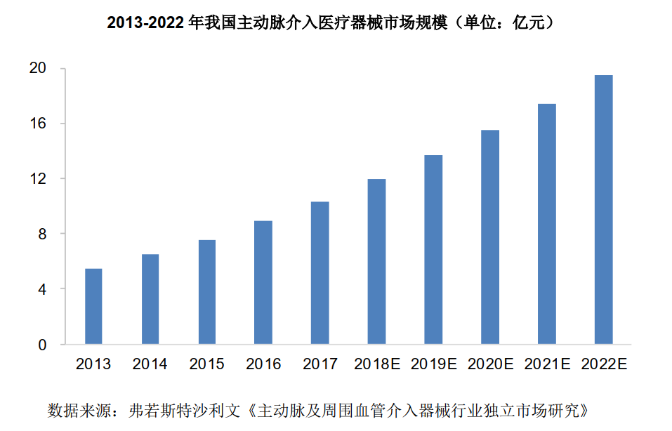

#### (二) 外周血管介入医疗器械市场发展情况 

##### (1) 外周血管疾病及治疗方案 

​	外周血管疾病主要包括外周动脉疾病和静脉疾病。外周动脉疾病是指因外周动脉局部狭窄或闭塞导致的身体局部缺血的疾病， 下肢动脉狭窄或闭塞后， 会引起间歇性跛行、腿部或足部皮肤发冷、 慢性疼痛和坏疽等症状。虽外周动脉疾病致死率低，但如未及时接受治疗， 会严重降低患者的生活质量，甚至出现截肢或死亡等严重后果。 静脉疾病主要包括静脉曲张、深静脉血栓及静脉受压等引起的血流受阻、肢体肿胀等一系列病症。  

​	目前， 外周血管疾病的治疗方法主要有药物治疗、外科手术治疗和介入治疗三种方式。 药物治疗通过抗凝血或抗血小板药物治疗，仅适合疾病较轻的患者。外科手术治疗以自身静脉或人工血管移植，代替病变血管，缺点是创口面积大，愈合慢。介入治疗通过相关介入器械的应用撑开阻塞血管，恢复血流通畅，创伤小，病人恢复快 

##### (2) 外周血管介入医疗器械市场规模 

​	我国外周血管介入医疗器械市场规模由 2013 年的 17.0 亿元增长至 2017 年的 30.1 亿人民币，复合增长率达 15.4%，预计至 2022 年我国外周血管介入医疗器械市场规模将增至 71.2 亿元。目前，我国该领域市场主要被国外企业占据，随着我国生产企业研发能力的不断增强， 预期国产医疗器械的市场份额将持续提升。 

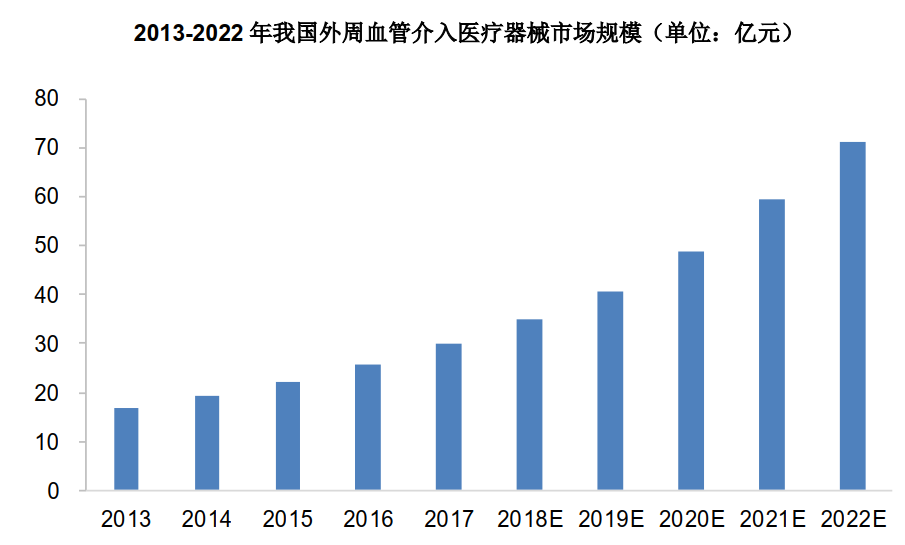

#### (三) 我国主动脉及外周血管介入医疗器械行业发展驱动因素 

##### (1) 经济发展带动医疗支出增加 

##### (2) 人口老龄化加剧，医疗需求增加 

​	全国人均预期寿命持续提高，从 1982 年的 67.80 岁提升至 2017 年的 76.7岁。根据国家统计局统计， 2017 年我国 65 岁以上人口数量 1.66 亿人，占比达到 11.9%，老龄化进程加快。从 2013-2018 年我国人口结构变化趋势来看，我国 60 岁人口占我国总人口比例逐年增加， 中国人口老龄化不断加剧。 

​	主动脉及外周血管疾病是和“三高” （高血脂、高血压、高血糖） 紧密关联的一类老年病，发病率高并且随老龄化加深而不断提升。 伴随我国人口老龄化的加剧， 主动脉及外周血管等疾病的发病人数亦将呈现持续增长态势， 对主动脉及外周血管介入医疗器械需求量不断扩大， 进而拉动市场持续增长。 

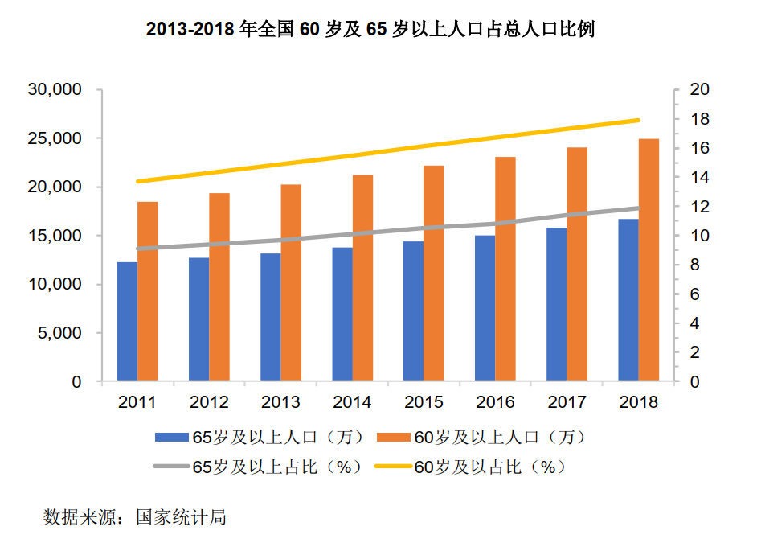

##### (3) 主动脉及外周血管疾病检出率、渗透率提高，市场容量迅速扩大 

​	目前，我国主动脉及外周血管疾病的检出率、治疗渗透率相比国际成熟市场仍然较低。 在医疗资源日益丰富、 临床医生技术水平不断提高、国产品牌技术和安全性持续提升的背景下， 我国主动脉及外周血管疾病的检出率将不断提高，治疗渗透率将向国际成熟市场靠拢，市场容量提升空间巨大。 2017 年，我国主动脉支架型腔内介入手术量、外周动脉介入手术量分别为 25,621 台、 99,400 台，预计至 2022 年，将分别增长至 50,569 台、 170,798 台。 

#### (四) 上下游行业 

​	公司所处的行业为医疗器械制造业，品类繁多，上游组件涉及领域较广，包括电子制造、机械制造、生物化学、材料等行业；基于医疗器械行业存在一定特殊性，主要通过医疗器械经销商销售至终端客户；下游行业是以各级医院为代表的医疗卫生机构。 

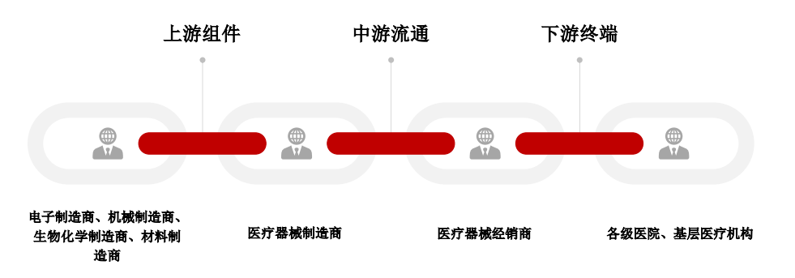

##### (1) 上游

​	上游行业的生产工艺水平、生产能力直接影响到医疗器械行业原材料供应的质量及规模，对医疗器械的生产经营具有重要的影响。电子行业为医疗器械行业提供电子元件、电路板、显示屏等零部件；生物医学材料行业为医疗器械制造企业提供所需的医用高分子材料及医用包装材料，主要包括覆膜、硅胶、医用包装 袋等原材料；金属材料行业能为医疗器械制造企业提供所需可作为生物材料的金属或合金，主要包括不锈钢、钴基合金、钛及钛合金、镍钛记忆合金等韧度、强度、生物相容性较高的高附加值的医用金属材料。
​	发行人的主要产品为主动脉覆膜支架系统等产品，上游原材料主要为镍钛医用金属材料、 涤纶 PET、聚四氟乙烯医用高分子生物材料等，市场发展成熟，供应稳定。随着科学技术的不断发展，近年来越来越多具有更好生物相容性、安全性、舒适性及制造工艺可行性的医用高分子材料成功研发、产业化并投入使用，多样性和可选择性满足了不同层次产品的需求。 

##### (2) 下游

​	发行人所处行业的终端下游主要是各级医院，市场需求主要与居民生命健康状况密切相关，需求刚性较强。人民生活水平逐步提高，加上人口老龄化趋势日益严重，将增加人们对医疗器械产品的需求。随着新医改政策的逐步落实，医疗卫生体系的不断发展完善，医疗保障方面的政策陆续推出，医疗器械市场将保持较快的增长。 

#### (五) 竞争对手

##### (1) 经营情况对比 

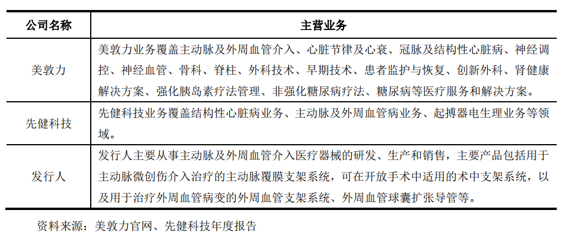

##### (2) 技术实力对比 

