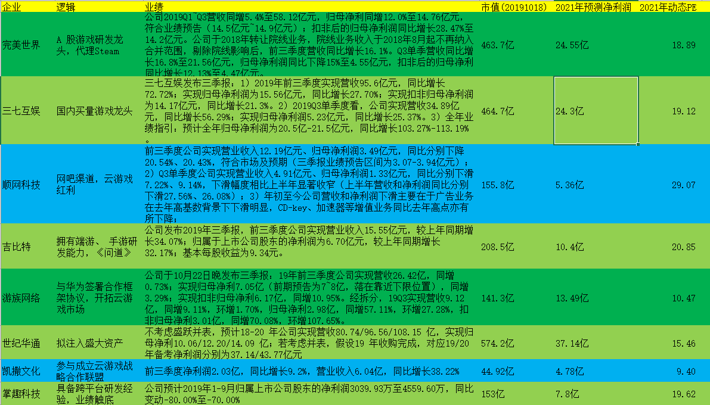
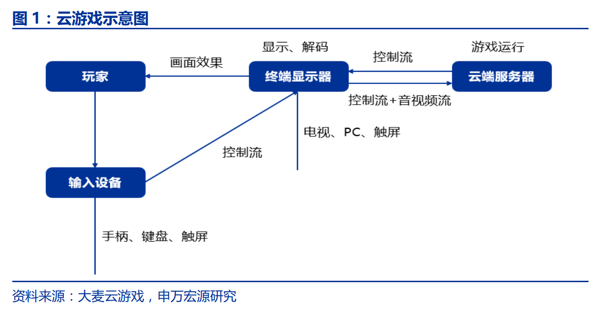
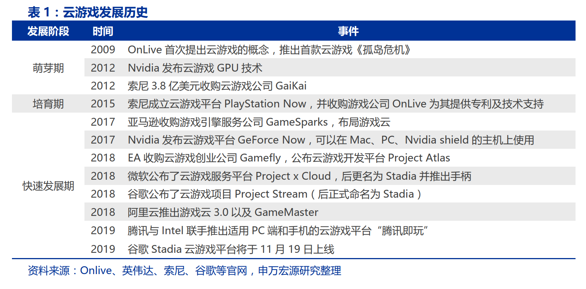
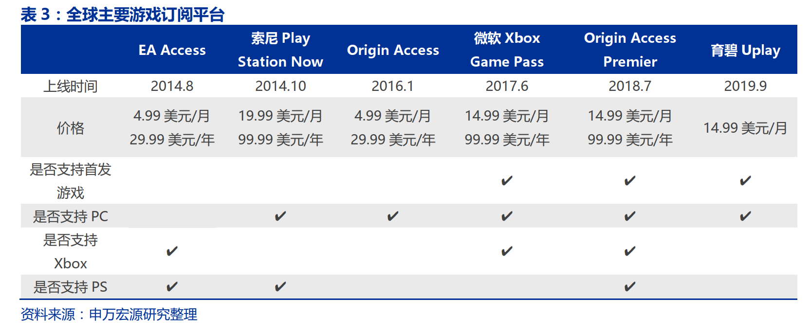
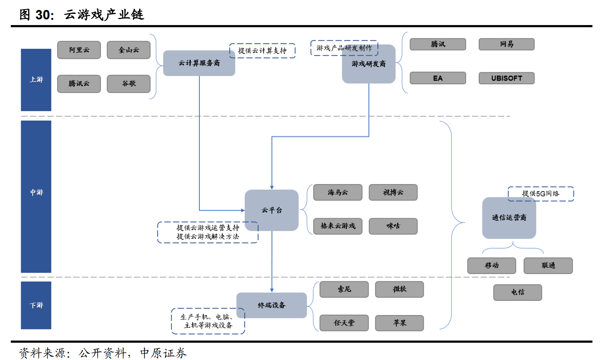
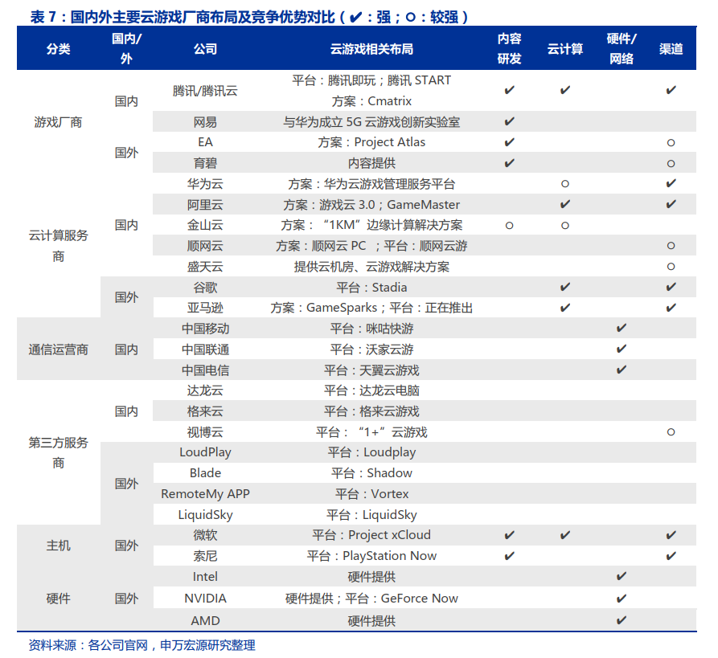
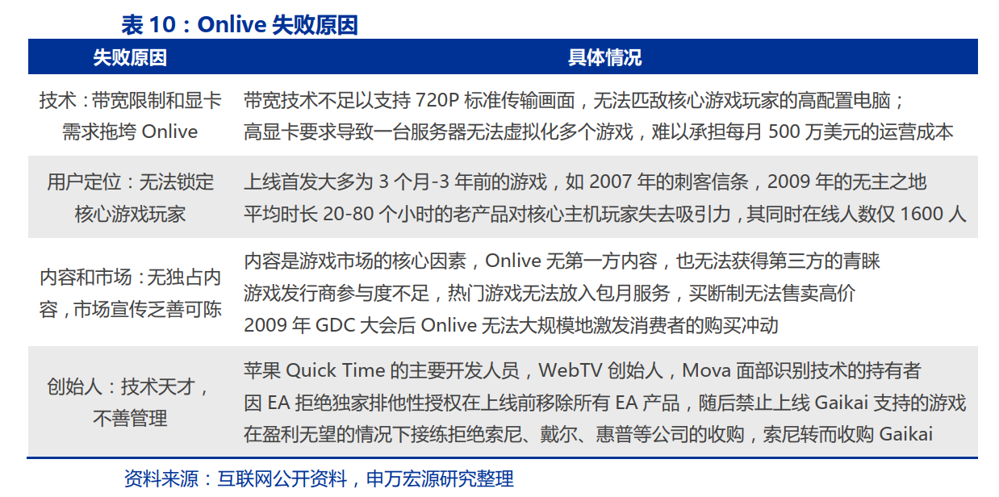
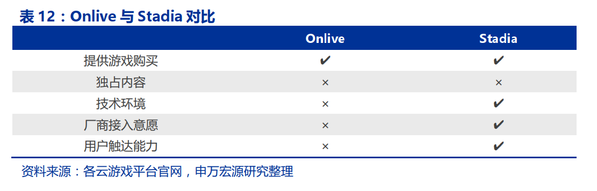
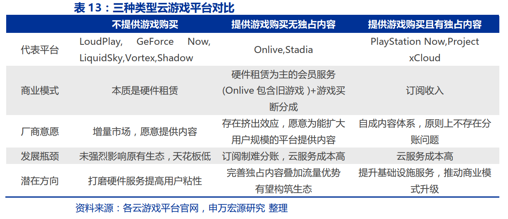

## 云游戏(20191202)

### 总结

​	云游戏分为传统游戏上云（ 2019-2022）和云 VR/AR（ 2022 年以后）两个阶段。当前阶段云游戏市场增量将来自商业模式升级和付费意愿提升，其中主机游戏上云预计带来增量空间 380-480 亿，而网络游戏上云或难带动增量。从海外经验看自有内容是海外云游戏平台的核心竞争要素，优质 CP 享受强议价能力。从国内投资机会看，精品游戏研发重要性凸显，买量转化率有望大幅提升，渠道议价能力或将被弱。 考虑较高的算力和网络成本，资源整合与算力分配能力强的公司有望率先盈亏平衡。 

​	云流化技术的应用场景将不止于云游戏，其未来将成为基础设施的重要组成部分，渗透到更多的行业 。

​	为什么关注云游戏呢？回顾历史，游戏是不少新技术最容易突破和落地的测试点，从端游到页游，从PC向移动转移时，手游也成为了突破口，同时树立了标杆，苹果AppStore也是通过愤怒的小鸟吸引了大量的开发者。但现在的云游戏，又很可能成为5G的新突破和落角测试点？为什么呢，游戏，成了，利益巨大，不成，也无伤大雅，但是，新技术从受疑问到落地，就需要有游戏等这样大型应用来支撑和测试。

​	但云游戏和过往又有些不一样，云游戏把算力都集中到了服务端，从对技术的要求，到服务端的运维，都对各环节提出了挑战，这成本上等又不是大部分游戏厂商能支撑和解决的，因此，云游戏，很可能出现一些中型公司的机会。

### 一、5G 时代云游戏为何受益？ 低时延解决关键瓶 

#### (一) 云游戏经历 10 年沉淀， 17 年以来巨头抢滩布局 

​	云游戏是以云计算为基础的游戏方式，云游戏场景下游戏在云端服务器中运行并由云端服务器将游戏场景渲染为视频音频流，通过网络传输给玩家游戏终端，其使图形处理与数据运算能力相对有限的轻端设备能运行高品质游戏。 

#### (二) 5G 低时延将成为推动云游戏普及的关键变量 

​	目前云游戏面临的主要挑战是网络通信带宽与网络通信延迟， 5G 成为云游戏普及的关键变量。 云游戏场景渲染的多媒体流质量取决于网络通信带宽，交互时延取决于网络通信延迟， 5G 的普及能够有效克服相关挑战： 1） 5G 更丰富的频谱资源以及大规模天线技术（ MIMO）能够有效提升网络速率； 2） 5G 网元重构从而使得切片技术能够优化网络资源分配，满足低时延的需求。 

### 二、云游戏能否带来增量？ 核心在商业模式变化 

#### (一) 云游戏处于过渡节点，中短期仍是传统游戏上云  

​	过去游戏载体变革带来的大机会，本质上是将游戏从小众推向大众，成为主流娱乐形式。 从游戏产业的载体变迁来看，街机→主机→PC→手机都伴随着学习成本的降低和游戏便捷化的提升，从而有利于扩大用户规模并推动行业增长。 根据伽马数据， 2019 上半年中国游戏市场规模 1163 亿元，手游贡献占比 65%， 而手游用户整体规模增至 6.9 亿（ Questmobile 数据， 2019 年 6 月）。 

游戏行业正处于手机游戏向下一代硬件过渡的节点，在云化技术和 5G 普及的催化下，我们判断云游戏发展将经历传统游戏上云和云 VR/AR 两个阶段：
 传统游戏上云（云 PC/云手机， 2019-2022）： 该阶段特点为游戏仍以既有手游/端游/主机游戏呈现， 用户体验改善的核心变量主要在于硬件门槛降低。 带宽和算力成本较高但将不断改善。
 云 VR/AR 游戏（ 2022 年后）： 该阶段特点为云 VR/AR 终端将构建新的分发渠道和流量入口，用户体验改善的核心变量在于的全新游戏体验，市场增量来源为进一步沉浸化带来的时长增加。 带宽和算力成本显著下降。 

#### (二) 两个判断维度 

(1) 从 5G 建设维度看， 5G 建设导入期（ 2022 年以前）的重心在于提升人口密集地区的信号带宽，并实现低时延场景在热点地区覆盖，对云 VR/AR 的渗透难以形成较强支撑；5G 建设中后期（ 2022 年-）将实独立组网大范围普及， 边缘计算节点不断完善， 高可靠低时延服务渗透率显著提升，能更好支持下一代 VR/AR 硬件载体的网络需求。 

(2) 从硬件技术维度看，当前 VR/AR 产品硬件技术尚未成熟，且优质内容资源匮乏。硬件方面， VR 产品如国内 3Glasses X1、 大鹏 VR 等已经落地，但头显设备过重、晕眩感影响体验、成本居高不下等问题导致始终缺乏杀手级硬件产品； AR 产品仍在孵化，成熟商用产品较少。内容方面，硬件技术的尚未成熟导致内容沉浸感不足、趣味性低、同质化严重等问题，优质内容资源依旧匮乏。 

#### (三) 主机游戏上云： 通过订阅制推动商业模式升级， 增量空间380-480 亿元 

​	2014 年起国外主机游戏厂商开始向订阅制转型。 国外主机游戏长期为买断制， 2014年 8 月 EA 率先在 Xbox One 平台推出订阅服务 EA Access 后，索尼、微软、育碧等优质游戏厂商纷纷跟进。根据 AlphaWise 统计，目前索尼、微软、 EA 订阅平台的市场份额分别为 42%、 34%、 19%，合计占据 95%的市场份额。 

​	订阅制有望推动主机游戏商业模式升级， 本质上是用户时长的增加， 预计 2023 年全球游戏订阅制收入占比超 20%。  

​	主机游戏上云降低硬件门槛，有望激发新一轮用户红利。 PC/主机用户对游戏质量要求相对较高，根据 Alphawise 的数据，有 10%和 7%的玩家因为硬件太贵而不玩主机/PC 游戏，云游戏突破硬件设备的限制有望取得该部分用户的增量。 

### 三、行业空间

#### (一) 从付费意愿和付费模式两个角度测算主机游戏上云的增量空间： 380-480 亿 

(1) 从付费意愿角度看， 增量空间中值为 378 亿。 我们认为主机游戏上云推动的是硬件成本的节约+订阅制用户粘性的提升，从而带来玩家付费意愿的提升， 市场增量源于对终端硬件和网吧市场的替换， 本质是赚硬件节约的钱。 我们对国内市场进行测算：
 终端硬件（游戏本、主机） 的替代增量约 288 亿元。 2018 年国内游戏本出货量约 300 万台，平均价格约 9000 元，总规模约 270 亿元；根据 Niko Partners 调研数据， 2018 年国内主机市场规模 7.36 亿美元，其中硬件收入 2.65 亿美元（折合人民币 18 亿元）。
 网吧市场的替代增量约 467 亿元。 根据中国互联网上网服务行业发展报告， 2018年网吧行业营业收入 706 亿元，其中网费充值收入 467 亿元，占比 66.2%。 

终端硬件和网吧的替代空间为 755 亿元，但这并能不完全作为云游戏市场的增量，因为玩家不会把所有节约的成本投入到游戏中，因此实际市场增量预计为 755 亿元的一部分。我们进行敏感性假设，当玩家对节约成本的投入比率为 20%时，增量空间为 151 亿，当玩家对节约成本的投入比率为 80%时，增量空间为 604 亿元，中值为 378 亿。 

(2) 从付费模式角度， 增量空间中值为 483 亿元。 我们认为主机游戏上云的核心用户包括： 网吧用户规模 1.18 亿+游戏本和主机核心用户 1200 万+手游用户回流 800 万，合计 1.38 亿。 当前海外订阅制包年金额为 30-100 美元，假设国内订阅制下云游戏包年订阅费用为 200/300/400/500 元人民币，则市场空间为 276 亿-690 亿元，中值为 483 亿元。 

#### (二) 网络游戏上云： 订阅制或难带动增量， 依靠游戏品类创新 

​	网络游戏 F2P+道具付费模式货币化效率高，订阅制或难带动增量。 与国外主机游戏的买断制不同， 在国内较弱的付费环境下，国产游戏厂商主要采取 F2P（ free to play） +道具付费的模式运营网络游戏，并经历了多次付费模式创新。国内以 F2P+道具付费为基础的付费模式具有持续盈利能力强且货币化效率高的特点。 

### 四、产业链

#### (一) 云游戏产业链：云计算厂商和通信运营商更为积极 

​	 

#### (二) 海外模板

​	云游戏在海外发展了较长时间，在网络硬件基础和玩家规模上具备优势。我们对海外云游戏平台进行分类拆解，旨在探索对我国云游戏发展的借鉴意义。
​	国外云游戏平台根据是否提供游戏购买以及是否依赖第三方游戏可分为三类。 

1）平台不提供游戏购买而主要提供硬件租赁服务，如 Nvidia 的 GeForce Now、 LiquidSky 等；

2）平台提供游戏购买但依赖第三方游戏，如已破产的 Onlive、 谷歌 Stadia； 

3）平台提供游戏购买且有独占内容，如索尼 PS Now、 微软 Xbox xCloud。 

1） 不提供游戏购买的平台：本质是硬件租赁服务商
第一类平台商业模式的本质是硬件租赁。 从国外第一类平台的收费模式来看，平台可根据时长或包月进行收费。 用户可在游戏分发平台（如 Steam、 Uplay 等）购买游戏后导入云游戏平台，并在支持的终端上接收高质量视频流，故该种模式下平台商业模式的本质是硬件租赁服务商。以 Nvidia 的 GeForce Now 为例，其数据中心位于北美和欧洲，支持游戏数量超 500 款，测试用户超 30 万，用户可通过 15Mbps 的带宽在 720P/60fps 的标准下租赁 GeForce RTX 2080 级别的显卡进行游戏，该服务正式推出后预计按小时进行收费。

第一类平台通过降低用户硬件门槛为游戏厂商带来了增量用户，但不拥有影响原有游戏行业利益分配的议价能力。 

2） 提供游戏购买但无自有内容的平台：依赖流量/渠道优势扩大用户规模从而提升游戏厂商接入意愿是构建平台生态的核心 

2009 年 Onlive 横空出世，但带宽等技术未能满足客观要求、游戏厂商不愿提供热门游戏等原因导致 Onlive 订阅用户数量惨淡最终破产；十年后，同样无独占游戏的谷歌Stadia 即将上线，其商业模式的瓶颈是如何找到厂商、用户、平台之间的平衡， 关键在于能否凭借天然的流量优势扩大用户规模，从而提升游戏厂商的接入意愿，构建起正反馈的生态系统。 

​	Stadia 未提供游戏订阅服务的原因或在于难以解决订阅制的分成问题。 Stadia 的云服务将包含免费与付费模式： 2019 年首发时仅支持每月 9.99 美元的会员模式 Stadia Pro，会员将获得 4K 分辨率/60 帧/5.1 环绕立体声服务； 2020 年将推出 Stadia Base 模式，用户免费获得 1080P/60 帧服务。 两种模式下用户均需单独购买游戏， 原因在于依赖第三方游戏的平台难以解决订阅制的分成问题：根据 HowLongToBeat 统计数据，不同类型的游戏通关时间差异较大， 根据用户游戏时长比例进行分成将难以满足不同游戏厂商的利益需求。 

​	游戏买断模式下 Stadia 商业模式将面临考验。 假设 Stadia 对于用户买断游戏的分成类似 Steam 的 30%，但不同于网游服务器只需提供基础的计算程序逻辑，云游戏服务器需要对每个用户进行独立渲染，运算量将呈几何倍提升，故 Stadia 将承担远高于 Steam 的服务器成本， 如何寻求游戏厂商、用户、平台之间的平衡将成为 Stadia 商业模式的考验。 

​	Stadia 的核心竞争力在于其出众的用户触达能力有望提升厂商的接入意愿。 由于云游戏对主机游戏产业潜在的挤出效应，游戏厂商缺乏变革动力，只愿意将销量停滞的旧游戏置入Onlive的订阅服务；谷歌的天然流量优势与云游戏降低用户门槛的特点能够完美结合，大幅扩大游戏用户规模， ID Software 新作《毁灭战士：永恒》将登录 Stadia 平台也表明游戏厂商将热门游戏接入平台意愿的提升， Stadia 有望凭借内容和渠道的正反馈搭建生态系统来对传统主机游戏产业发起冲击。 

3） 提供游戏购买且有独占内容的平台：掌握独占内容利于推动订阅制发展，巨头联手凸显云服务资源价值 

​	拥有独占内容的公司在云游戏平台推行订阅制阻碍较小。 Stadia 缺乏独占内容使其推行订阅制将面临与游戏厂商分成的难题，而索尼与微软均具有游戏研发基础，自有工作室体系能为订阅服务持续提供具有竞争力的游戏阵容： PS Now 为用户提供近 800 种 PS 游戏且支持离线游玩 200 款 PS4 和 PS2 游戏； Project xCloud 可支持 3500 款 Xbox 游戏。 

总结国外云游戏平台的三种模式： 第一类平台的本质是硬件租赁商，并未实现商业模式的升级， 议价能力有限；第二、三类平台对原有生态存在较大冲击的可能，无独占内容的平台或存在商业模式瓶颈，利用流量优势扩大用户规模从而提升厂商接入意愿是核心；有独占内容的平台有望率先利用订阅制推动商业模式升级。 从海外云游戏平台发展历史复盘中看到，优质研发商面对云游戏平台具有较强的议价能力（可决定与云游戏平台的分成方式、是否在云游戏平台首发等）。 

### 五、国内格局

#### (一) 精品游戏研发重要性凸显、买量转化率提升、渠道议价能力削弱  

1）主机游戏上云带来的需求端增量空间使得精品游戏研发重要性凸显 

​	主机游戏上云所带来的商业模式升级将为国内市场创造 380-480 亿增量蛋糕，而优质内容在海外云游戏平台发展中亦成为核心竞争要素，研发商议价能力已得到验证 

​	受制于付费环境、监管审核、研发能力等多重要素，国内主机游戏市场规模较小， 占比约为 4%，远低于全球 30%的水平。 我们认为，随着国内用户整体付费意识提升，以及国产 3A 级精品游戏研发商崛起，叠加 5G 云游戏推动， 未来主机游戏在我国具备较大的增长弹性。 

2） 网络游戏上云提高买量转化率， 供给端降低游戏厂商获客成本 

​	云游戏时代买量转化率将有 1 倍以上提升。 在传统买量模式下一个新用户的转化所需的步骤： 点击广告跳转至下载页面点击下载授予权限返回手机系统定位并打开游戏 App。 可以看出，在目前的买量推广模式下即使广告成功吸引到用户点击，但因接下来相对繁琐的操作，用户可能会在每个中间步骤选择放弃安装或进入游戏。 而云游戏时代，获取新用户只需要：广告吸引用户点击直接开始游戏，两步操作即可完成用户转化，大幅降低用户中途因为各种原因放弃进入游戏的可能性。 

3） 传统渠道议价能力被削弱， 角色将向云游戏平台转换 

​	传统渠道议价能力将被削弱。 手游时代传统分发渠道具有强议价能力，一般可分得 50%游戏流水。 但云游戏即点即玩、易集成的特点将使得视频网站、游戏直播等平台获得分发能力， 从而使得渠道数量显著提升， 传统渠道的议价能力或被削弱，其分成收入将部分被云游戏平台、游戏厂商瓜分。
​	应用市场或向云游戏平台转型。 由于云游戏时代渠道数量的增多使得用户无需通过特定的应用市场进行游戏下载与安装，传统应用商店将面临产业利益分配的挑战。未来传统应用商店或将通过与云计算服务商深度合作，充分发挥自身流量和渠道优势，实现向云游戏平台角色的转型。 

