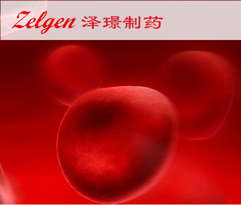
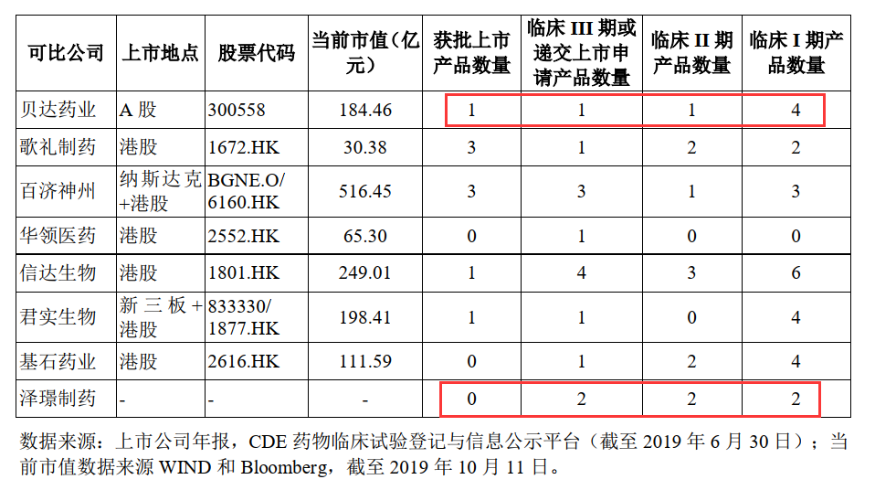
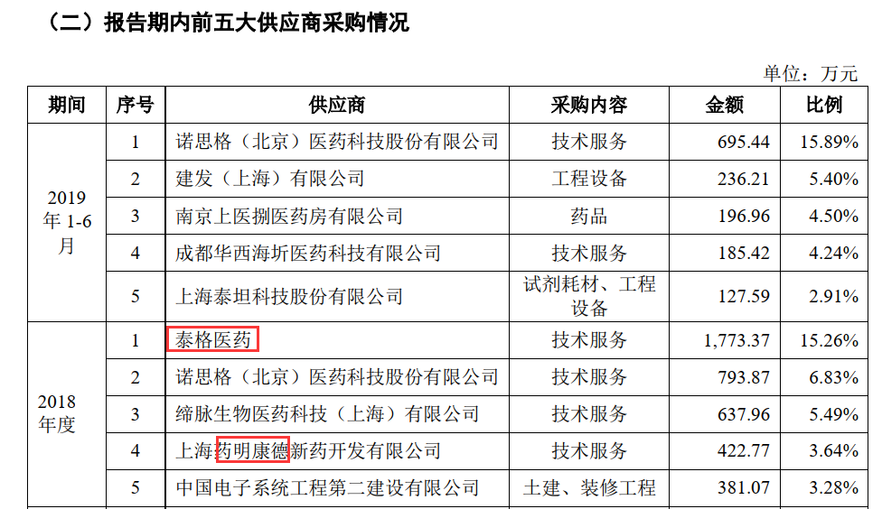
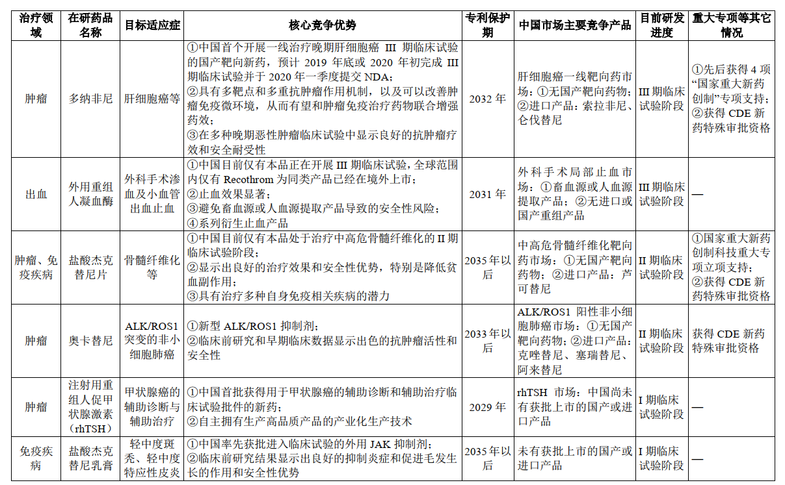
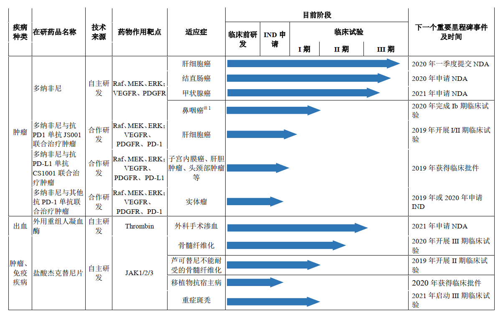
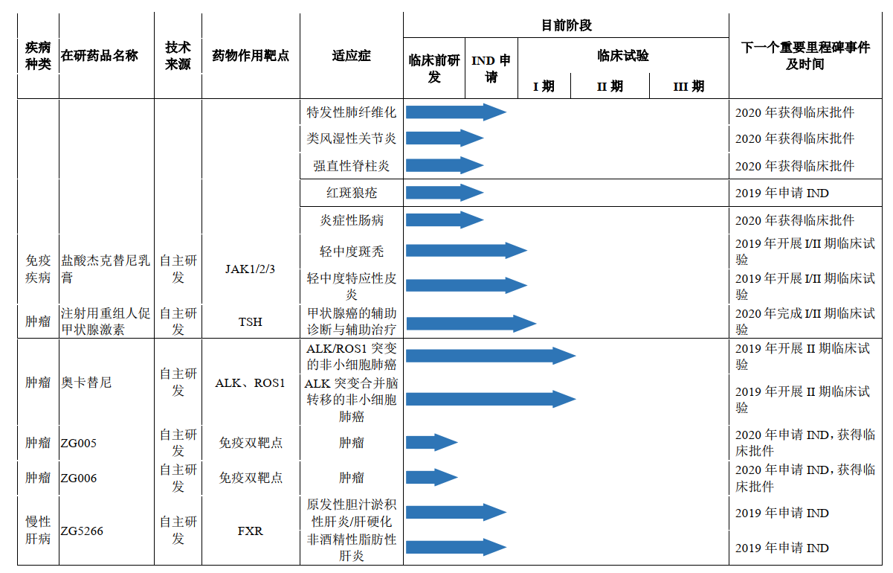
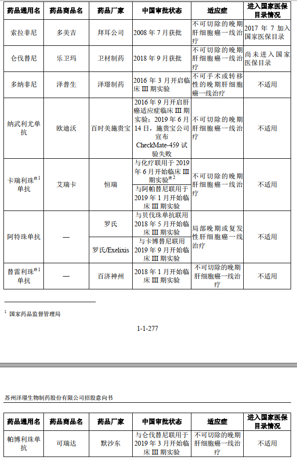
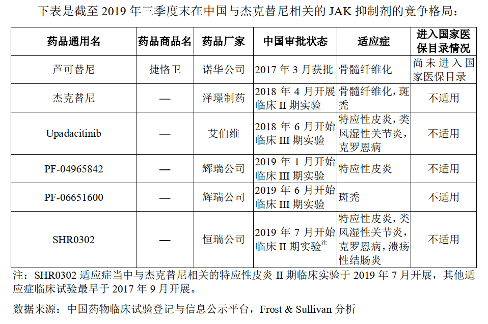
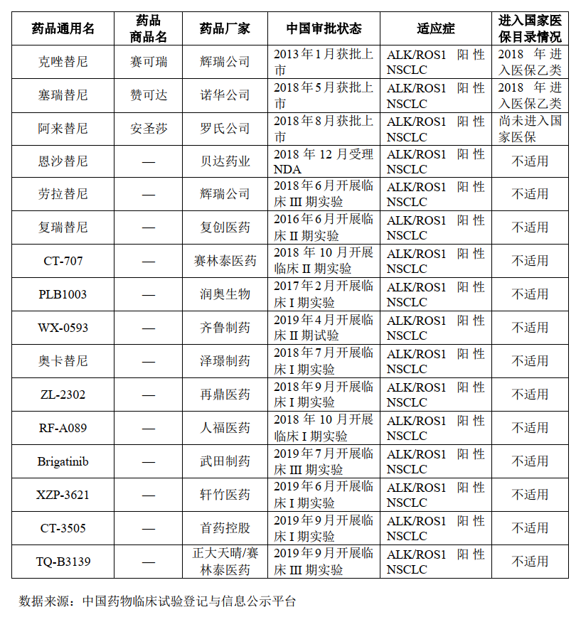
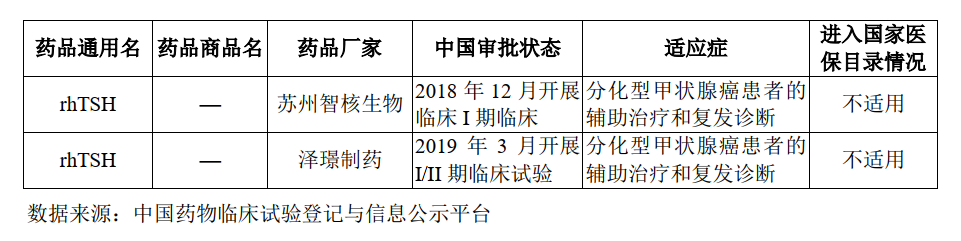

# 亏损上市的泽璟来了来了(20200116)

### 总结

关注泽璟的兴趣，缘于这是首只亏损上市，A股第一家亏损企业IPO。

泽璟制药预计2019年实现的归属净利润为-4.69亿元至-4.15亿元；预计实现扣除非经常性损益后归属于母公司所有者的净利润为-2.73亿元至-2.11亿元。由于尚未盈利，泽璟制药此次发行并未采用市场上常见的市盈率等相对估值方法，而是采用了DCF估值法

泽璟的招股书看着头大，边看边不懂，只知道看着，经常出现，XXX尼，化合物专利保护期至XXX，晶型专利保护期至XXX，说实话，我也看不懂啥东西，太专业了这个，于是我就查查，这个什么化合物专利保护期，晶型专利保护期大概是干什么的，见下面。然后又提示了一堆风险。

**第一印象就是，研发了各种管线，但都还没赚钱，未来也不一定赚钱，然后提示了一大堆风险，这在A股算是比较新鲜的，在港美还是不少的。**

泽璟制药成立于 2009 年，还是非常年轻的。

价格上总体还是比较贵的

截至 2019 年 6 月 30 日， 中国已上市的肝癌一线治疗药物分别为：索拉非尼与仑伐替尼。索拉非尼于 2006 年获得批准上市， 2017 年进入国家医保目录，价格为 11437 元/盒（60 片 X200mg/片）；仑伐替尼于 2018 年获得 NMPA 批准上市，零售价为 16800元/盒（30 片 X4mg/片）。 

截至 2019 年 6 月 30 日， 于 2017 年获批的芦可替尼（捷恪卫®）是中国唯一面市的骨髓纤维化药物， 2017年与2018年，芦可替尼在中国市场的中标价格为 6800元/盒（5mg/片 X 60 片）。 

截至 2019 年 6 月 30 日， 已获批上市的产品只有：色瑞替尼胶囊（诺华， 2018 年 5月获批上市），阿来替尼胶囊（罗氏， 2018 年 8 月获批上市）。色瑞替尼单盒价格 29,700元， 150 粒/盒， 150mg/粒；阿来替尼 49,980 元/盒， 224 粒/盒， 150mg/粒。 

关于带量采购

公司后续重点产品线药物多纳非尼、杰克替尼、奥卡替尼，均为中国自主研发的专利药物、创新药，并获得国家重大专项和新药特殊审批资格。从目前试点规则来看，均不在国家带量采购试点的范围，暂时无较大降价压力。 

关于横向对比

同时侧面说明了CXO的景气

研发人员费用

### 一、基本概念

#### **(一) 化合物专利简介**

对于药物来说，其专利大致可分为产品专利、用途专利、方法专利等等，当中，产品专利相对而言最为重要。而产品专利又包括化合物专利、晶型专利、制剂专利等等，这其中呢？化合物专利自然最为重要。对于化合物专利，其具有更为细致的内容，如通式化合物、药学上可接受的盐、活性代谢产物、前药、手性药物/光学异构体、中间体、衍生物、药物杂质、生物药物等，故化合物专利通常是大家最为关注的核心专利。

由于药品的本质是化合物，化合物是所有药品的源头，并且由于化学药可以利用马库什方式的专利保护(下文将着重介绍)，生物药可以用药品本身的靶点或序列专利保护，因此，能够保护化合物本身的一个或数个核心专利即可以对未来能够上市的药品及其整个链条进行控制。为了延长对药品的控制，在药品化合物专利申请之后还可以进一步提出晶型、新用途、新制剂等专利，持续维护企业在该药品上的获利。

发明专利：最多20年 
外观专利和实用新型专利：最多10年 
发明专利、外观专利和实用新型专利期限化合物专利保护时间以申请日开始计算

#### (二) **晶型专利与化合物专利的“渊源”**

一个药物的开发，通常会采取申请一系列专利对药品进行布局，从而形成层层保护，延长产品的专利期。大型制药企业，通常都会在一个新药化合物的诞生以后，逐渐通过形成“化合物”、“晶型”、“制剂”、“制备方法”、“化合物用途”等专利链或专利池，不难看出，晶型专利是位于最为核心的化合物专利之后的第一层保护，也是极其重要的一层战壕。

在专利层面，晶型药物专利的重要性在于：对于原研药企，通过申请药物晶型专利能够获得技术保护，在延长基础专利保护期的同时可形成对仿制药企业的专利障碍；对于仿制药企，通过研发不同的药物晶型并请求专利保护，能够绕开原研药厂的专利屏障，在与原研药企的竞争中另辟蹊径，在市场中博取一席之地。

### 一、主营业务

#### (一) 概述

​	泽璟制药成立于 2009 年，是一家专注于肿瘤、出血及血液疾病、肝胆疾病等多个治疗领域的创新驱动型化学及生物新药研发企业。公司致力于研发和生产具有全球自主知识产权、安全、 有效、患者可负担的创新药物，以满足国内外巨大的临床需求。 公司成立以来，坚持独立自主的原始创新和改良再创新并重的发展策略。针对经科学和临床验证的药物靶点，公司已建立先导药物发现和优化、候选药物的评价和确立、药物临床前和临床研究、药品注册、产业化和市场营销等较为完整的新药研发和商业化链条。 

​	经过十年发展，公司成功建立了两个新药创制核心技术平台，即精准小分子药物研发及产业化平台和复杂重组蛋白生物新药研发及产业化平台：

(1) 精准小分子药物研发及产业化平台的重要技术之一是公司全球领先的药物稳定技术平台。在该技术平台上，公司研发了 3 个具有重要临床和市场价值的小分子新药， 分别为多纳非尼、杰克替尼和奥卡替尼。

(2)在复杂重组蛋白生物新药研发及产业化平台上， 公司率先研发了技术壁垒较高的外用重组人凝血酶和注射用重组人促甲状腺激素。 进一步， 以这两大技术及产业化平台为依托，公司自主研发了一系列具有专利保护的小分子新药和双/三特异抗体的产品管线，覆盖肝癌、非小细胞肺癌、结直肠癌、甲状腺癌、鼻咽癌、 骨髓增殖性疾病等恶性肿瘤， 以及出血、肝胆疾病、 自身免疫性疾病等多个治疗领域。 

#### (二) 研发管线

截至 2019 年 12 月 9 日， 公司正在开展 11 个主要创新药物的 29项在研项目 

截至 2019 年 12 月 9 日，公司已在全球不同国家申请 131 项发明专利，其中 61 项已获专利授权，包括中国授权 21 项和境外授权 40 项。专利覆盖新药结构通式或基因序列、晶型、制备工艺、用途、制剂配方等，为公司产品提供充分的和长生命周期的专利保护。 

公司已按照 GMP 标准建成 2 个生产车间，即小分子药物片剂/胶囊生产车间和重组蛋白药物生产车间及配套设施，并已获得药品生产许可证，为临床试验用药的生产和未来商业化生产做好准备。 

#### (三) 在研概览

### 二、核心在研药品 

#### (一) 多纳非尼 

##### (1) 概述

多纳非尼是公司通过其精准小分子新药研发及产业化平台中的药物稳定技术自主研发的小分子多靶点 1 类新药。 多纳非尼为抗肿瘤靶向小分子 1 类新药（原分类 1.1），对晚期肝癌、晚期结直肠癌、晚期肾癌、晚期鼻咽癌、局部晚期/转移性放射性碘难治性分化型甲状腺癌和急性髓系白血病等有显著的治疗作用。已完成的多个 I 期和 II 期临床试验数据显示，在多种晚期肿瘤适应症中，多纳非尼显示出确切的治疗效果和良好的安全性。 截至 2019 年 12 月 9 日， 公司正在进行多纳非尼一线治疗晚期肝细胞癌、三线治疗晚期结直肠癌、一线治疗局部晚期/转移性放射性碘难治性分化型甲状腺癌的 III 期临床试验、治疗晚期鼻咽癌的 Ib 期临床试验和治疗复发性急性髓系白血病的 I 期临床试验；已取得多纳非尼与抗 PD-1 抗体联合治疗肿瘤的临床试验通知书。 

##### (2) 临床需求 

由于晚期肝癌现有治疗药物价格昂贵，中国晚期肝细胞癌一线小分子靶向药市场2018 年为 8.1 亿元，预计 2023 年可达到 72.8 亿元，晚期肝细胞癌小分子靶向药市场仍然存在着巨大的未满足临床需求。 

##### (3) 商业化计划 

公司核心产品多纳非尼预计 2020 年四季度获得批准上市销售。上市后商业成本主要包含商业运营团队的人员成本、学术推广成本、上市后临床研究成本和商业配送成本等。
公司已成功建立多纳非尼原料药和制剂的全套 GMP 生产工艺及质量标准，并开发了多纳非尼原料药生产的核心氘代原材料 X132 的低成本生产工艺，具备顺利实现商业化生产的能力。
公司将发挥药品的临床优势和价格优势，组建行业经验资深的商业运营团队，布局销售渠道，并致力在未来将多纳非尼纳入国家医保目录，不断调整营销策略，掌握市场竞争的主动权，惠及更多中国患者。 

#### (二) 外用重组人凝血酶  

##### (1) 概述

外用重组人凝血酶是公司通过其复杂重组蛋白新药研发及产业化平台自主研发的蛋白质药物。 手术中止血方法的合理选择可以控制创面出血、渗血，保证术野清晰，提高手术效率，缩短手术后出血时间，从而减少失血和输血，有利于避免术中和术后相关并发症的发生，加速患者术后恢复，进而减轻患者痛苦和减少医疗费用。 公司开发的外用重组人凝血酶的临床应用定位为：任何毛细血管和小静脉渗血/小出血的辅助治疗及任何常规外科止血（如缝合、结扎或烧灼）无效或不适用时的止血。外用重组人凝血酶已完成的 I/II 期临床试验结果显示， 该产品具有良好的安全性和突出的临床止血效果，在肝脏切除外科手术中 6 分钟止血率为 85.19%，总出血量比空白对照组下降约 50%。 

公司已完成外用重组人凝血酶在 GMP 条件下的工艺放大研究， 中国目前仅有本品正在开展 III 期临床试验，全球范围内仅有 Recothrom 为同类产品已经在境外上市，该产品具有工业化生产成本低、无病毒污染风险和低免疫原性风险等特点，使其具备广泛应用的潜力。  

##### (2) 临床需求

中国外科手术出血局部用药市场规模由 2014年的56.6亿元增长到了2018年的73.0亿元。 在手术台数增加，新一代局部止血药物的技术替代等多种驱动因素下，外科手术局部止血市场将会由 2018 年的 73.0 亿元增长至 2030 年的 160.3 亿元，年复合增长率为6.8%。 

##### (3) 商业化计划

公司已建立外用重组人凝血酶的商业化生产车间， 已获得外用重组人凝血酶的药品生产许可证， 配置了 2,000 升细胞反应器及配套生产体系 

#### (三) 盐酸杰克替尼片 

##### (1) 概述

盐酸杰克替尼是公司通过其精准小分子新药研发及产业化平台中的药物稳定技术自主研发的 JAK 激酶小分子抑制剂，属于 1 类新药，分别有片剂和乳膏两种剂型。盐酸杰克替尼片经过特殊审批于 2016 年获得 I/II/III 期临床试验批件。 公司已完成盐酸杰克替尼片在健康志愿者中的耐受性、药代动力学及食物影响研究的 I 期临床试验，结果显示耐受性良好，并为 II 期临床试验确定合适的剂量。目前正在进行杰克替尼片治疗中高危骨髓纤维化（MF），包括原发性骨髓纤维化（PMF）、真性红细胞增多症骨髓纤维化（post-PV-MF）或原发性血小板增多症骨髓纤维化（post-ET-MF）的 II 期临床试验以及治疗重症斑秃的 II 期临床试验。 

##### (2) 临床需求

中国骨髓纤维化的靶向药市场自 2017 年起存在，其市场规模由 2017 年的 0.7 亿元增长到 2018 年的 1.3 亿元。临床可惠及人口的渗透率由 2017 年的 0.5%增长到 2018 年的 0.8%。同年美国市场的渗透率为 68.4%。 

##### (3) 商业化计划

杰克替尼的生产工艺稳定、成本可控。 公司已拥有杰克替尼自主知识产权的生产工艺， 正在为未来商业化生产进行技术准备。 

### 三、I 期/II 期临床试验在研药 

#### (一) 奥卡替尼 

奥卡替尼是公司通过精准小分子新药研发及产业化平台中的药物稳定技术自主研发的选择性抑制间变性淋巴瘤激酶（ALK）和原癌基因酪氨酸激酶 ROS1 抑制剂类小分 子 1 类新药。非小细胞肺癌作为中国发病率最高的癌种，同时有着早期检测难、化疗不敏感、预后差等特点。中国肺癌患者在初次诊断中就已经达到晚期（III/IV 期）的比例
大于 70%，非小细胞肺癌的五年生存率仅为 19.6%。在所有 NSCLC 患者当中， ALK/ROS1阳性的患者占到了 5%以上。 ALK/ROS1 的小分子靶向抑制剂为该类患者带来了明显的生存获益。根据 Frost & Sullivan 的预测，中国 ALK/ROS1 抑制剂市场将会由 2018 年的1.7 亿元增长到 2030 年的 35.4 亿元。 

#### (二) 注射用重组人促甲状腺激素 

注射用重组人促甲状腺激素（rhTSH） 是公司通过其复杂重组蛋白新药研发及产业化平台自主研发的一个高端重组蛋白质药物， 于 2018 年 11 月获得 I/II/III 期临床试验批件，是中国首批取得用于甲状腺癌的辅助诊断和治疗临床试验批件的新药，中国市场上尚未有重组人促甲状腺激素产品；随着产品上市以及甲状腺癌发病率的逐年上升，预计中国重组人促甲状腺激素市场将于 2021 年达到 1.2 亿元，并以 19.4%的年复合增长率增长，于 2030 年达到 6.1 亿元。注射用重组人促甲状腺激素即将在国内多家医院开展的I/II 期临床试验，适用于分化良好型甲状腺癌的辅助诊断和辅助治疗。 

#### (三)盐酸杰克替尼乳膏剂 

杰克替尼是公司自主研发的 JAK 激酶小分子抑制剂，属于 1 类新药。盐酸杰克替尼乳膏于 2019 年 8 月 26 日获得 NMPA 批准用于治疗轻中度斑秃和轻中度特应性皮炎的 I/II/III 期临床试验通知书。
斑秃是一种非瘢痕性脱发症状，也同样被视为一种自身免疫性疾病。常为突发的局部或全身斑片状脱发，可为永久性，局部皮肤正常，无自觉症状。斑秃受精神心理因素的影响，在如抑郁症、焦虑症患者人群有着更高的发病率。 特应性皮炎是侵犯皮肤的疾病，属于湿疹性皮炎，临床表现多种多样。最重要的皮肤症状是皮肤干燥、慢性湿疹样皮炎和剧烈瘙痒 

### 四、其他

#### (一) MAH

截至本招股意向书签署日，公司尚不具备化学原料药的生产设施和生产能力。对于公司最接近商业化的化学药品甲苯磺酸多纳非尼，其有关化学原料药将采用 MAH 模式委托有资质的原料药生产企业进行生产 

根据药品管理法相关法律法规的规定，公司作为甲苯磺酸多纳非尼原料药的上市许可持有人，委托第三方神隆医药（常熟）有限公司（以下简称“神隆医药”）进行原料药的生产。神隆医药的主营业务为高活性注射剂原料药的开发与制造、抗癌药物仿制药原料药和中间体的开发和制造，其已取得《药品生产许可证》，并具备规范的原料药生产和质量管理体系，自 2013 年以来通过江苏省和苏州市食品和药品监督管理局的多次现场检查，并多次通过美国 FDA cGMP、欧盟 GMP 检查及日本 PMDA 的 GMP 检查。 

#### (二) 销售模式

公司将组建、领导并发展一支精英团队。公司会迅速组建具备丰富临床上市及推广经验的 200 人左右的核心运营团队，主要功能包括销售、市场和商务。目前销售团队、市场医学团队和商务团队的负责人已经就位，他们都具备 15 年以上知名外企/民企的商业化运营经验。 

### 五、行业概况

公司最接近商业化销售的核心产品为多纳非尼以及外用重组人凝血酶。其中，多纳非尼可用于多种实体瘤的靶向治疗， 外用重组人凝血酶主要用于外科手术局部出血的治疗， 所处细分市场分别为抗肿瘤小分子靶向药市场以及生物药市场。 

#### (一) 抗肿瘤小分子靶向药物行业 

肿瘤是指机体在各种致瘤因素的影响下，细胞产生的不正常增生；其中，恶性肿瘤被统称为癌症。癌症是目前人类面临的最大的医疗卫生问题，也是最恶性的人类疾病。癌症拥有死亡率高、 预后差、 治疗费用昂贵的特点，癌症患者通常需要承受巨大的生理痛苦，是目前最急需解决的人类医疗卫生问题之一。 

全球癌症新发病例数量呈现快速增长的趋势。根据世界卫生组织的统计和 Frost &Sullivan 的报告， 2018 年，全球经过诊断的癌症新发病例数为 1,808 万例。其中，乳腺癌、肺癌、结直肠癌、前列腺癌、胃癌、肝癌、头颈癌、宫颈癌、食道癌和甲状腺癌为前 10 大癌种，前 10 大癌种的合计新发病例数占到了全球癌症新发病例数的 60%以上。其中，肺癌、结直肠癌、前列腺癌和甲状腺癌的年复合增长率明显高过其他癌种。 

中国的高发癌种主要集中在呼吸系统癌症以及消化系统癌症。 根据世界卫生组织的统计， 中国的前 10 大癌种分别是肺癌、肝癌、胃癌、结直肠癌、乳腺癌、食道癌、头颈癌、脑/神经系统癌症、宫颈癌和胰腺癌。其中肺癌、结直肠癌、食道癌和甲状腺癌的年复合增长率均高于其他癌种。肝癌是中国特有的高发癌种，占全球肝癌病例的
47.5%，无论是诊断、治疗还是预后，都存在着极大未被满足的医疗需求。这样的新发病例数增长和分布主要和中国不断增长的吸烟人口、空气污染以及中国特有的饮食习惯相关。 

目前癌症的治疗方法分为五大类，即手术、放射治疗、化疗、分子靶向治疗以及肿瘤免疫疗法。 

小分子靶向药物是通过化学合成、以肿瘤细胞的特异性突变作为靶点的药物。与传统抗癌化疗药物相比，小分子靶向药特异性更高。 

#### (二) 生物药行业 

生物药包括单克隆抗体、重组治疗性蛋白、疫苗、血制品、细胞与基因治疗以及其他生物疗法诸如溶瘤病毒等。全球而言，相较于化学药，生物药的发展相对较晚，直到近 40 年进入大规模产业化阶段。但由于生物药的安全性、有效性等满足了化学药未能满足的临床需求，近年来生物药行业发展迅速，尤其是在中国等新兴市场，生物药行业以远超整体医药行业的速度快速增长着。 

虽然生物药的发展较晚，但全球而言，生物药已经成为医药行业中最容易出现年收入 10 亿美元以上的“重磅炸弹” 药物的细分领域。 2018 年，全球最畅销的 10 种药物中， 9 个药物是生物药1。 中国的生物药行业发展滞后于全球市场，也因此为中国医药市场带来了更广阔的增长空间。中国生物药市场在过去的几年中以数倍于全球生物药市场增速的增长率快速增长 

#### (三) 氘代技术行业 

氘是氢元素的同位素，属于稳定性同位素。稳定性同位素没有放射性，产品稳定，在分离、标记物合成及应用过程中无特殊防护要求，使用安全，可直接用于动物及人类的营养学、临床医学研究及医疗诊断等领域。 

氘代技术领域主要涉及三大技术，包括基础氘代试剂的生产和分离技术、氘标记衍生物合成技术和分析测试技术。经过几十年的发展，用于规模化生产获得基础氘代试剂如重水的方法主要有双温硫化氢---水交换法、双温氨---氢交换法等，主要分离技术包括水精馏法和低温精馏法等微小流量精密分离技术。氘标记衍生物合成技术主要包括化学
合成法、生物合成法和同位素交换法。分析测试技术主要包括质谱法、核磁共振法等测定同位素丰度的方法，涉及仪器设备、分析测试方法、技术标准、标准样品的制备等。 

### 六、竞争格局

#### (一) 多纳非尼 

目前，全球仅有两款获批的一线肝细胞癌靶向药物，即德国拜耳公司的索拉非尼和日本卫材公司的仑伐替尼。 

除已上市的索拉非尼和仑伐替尼外，一些针对晚期肝细胞癌一线治疗的创新靶向疗法正处于临床开发过程中。 截至 2019 年三季度末， 临床阶段的晚期肝细胞癌一线治疗靶向疗法的竞争格局如下： 

索拉非尼的化合物专利保护至 2020 年 1 月，晶型专利保护至 2025 年 9 月。化合物专利到期后市场上可能会陆续有索拉非尼的仿制药出现。另外，如果仿制药采用和原研药相同晶型、或者采用原研厂家晶型专利保护的其它晶型，那么在晶型专利被挑战成功后，仿制药才能于晶型专利保护期到期前上市。专利挑战成功主要取决于原研药企业对于产品专利的布局程度、仿制药企业和原研药企业的专利诉讼水平和谈判水平，具有不s确定性。 

#### (二) 杰克替尼 

杰克替尼是 JAK（Janus 激酶） 的靶向抑制剂，其口服剂型的主要适应症为骨髓纤维化。骨髓纤维化是一种较罕见的骨髓肿瘤，属于骨髓增殖性肿瘤（ MPN） 之一，同时被归类为一种慢性白血病。 

作为罕见病，骨髓纤维化的有效治疗手段十分有限。 目前， 全球有两款获批的骨髓纤维化靶向药，即芦可替尼和 Fedratinib。  

目前， 杰克替尼是中国目前仅有的治疗中高危骨髓纤维化的处于 II 期临床阶段的靶向药物。 作为一款 JAK1 /2/3 抑制剂，除了在骨髓纤维化中的应用以外，还具备在免疫性疾病中的临床潜力。 JAK1/2/3 都参与到了诸多免疫性疾病的过程当中， 包括斑秃、银屑病、类风湿性关节炎等。 截至 2019 年 6 月 30 日， 中国有 2 个 JAK 抑制剂获批上市，即芦可替尼和辉瑞公司的托法替布（尚杰®） 以及 9 个 JAK 抑制剂开展临床。 

#### (三) 奥卡替尼 

中国 ALK/ROS1 抑制剂的发展略微滞后于全球市场。 2013 年，一代 ALK/ROS1 抑制剂克唑替尼在中国获批，其后于 2018 年进入国家医保目录， 2018 年，诺华公司的塞瑞替尼和罗氏公司的阿来替尼在中国相继获批 

除已上市的克唑替尼、塞瑞替尼和阿来替尼外，一些创新靶向疗法包括奥卡替尼正处于临床开发过程中。 截至 2019 年三季度末，临床阶段的 ALK/ROS1 阳性 NSCLC 治疗靶向疗法的竞争格局如下： 

#### (四)注射用重组人促甲状腺激素 

截至 2019 年三季度末，中国尚未有 rhTSH 产品获批上市，仅有两个 rhTSH 产品处于临床阶段，竞争格局如下： 

