# 化学制药？不是创新药有啥好关注的？(20191118)

### 总结

会关注一家化学制药，还是有点出乎我自己的意料，毕竟，这几年关注的重点一直是创新药，会关注博瑞医药的原因比较简单，从股东上我看到了红杉，从这一点，我立马清空了自己的任何观点，下载招股书，慢慢的阅读和理解红杉投资博瑞的逻辑点在哪。

现在所有人都在眼着创新药，包括我自己，但是也不是说不要仿制药了，毕竟，大部分还是仿制药。对仿制药，我之前是没有任何研究的。从别人的一个观点我是认可的。

唯快不破，大家自然能想到我国医药龙头企业——中国生物制药；其控股的正大天晴，中国名副其实的首仿之王；唯廉不破，大家能想到华海制药，全球普利、沙坦大王，其仿制药原料、制剂工艺水平、管理水平、质量水平都是国内一流；

唯难不破，就是博瑞医药。

**高端仿制原料药和中间体的专注者** 

**公司盈利模式具体包括:**

**(1)相关医药中间体和原料药生产、销售;** 

**(2)技术转让和技术服务;**

**(3)下游客户产品销售权益分成 。**

2018 年，公司已实现卡泊芬净、吡美莫司、米卡芬净三个产品的权益分成共 2600 万元。

**凭借研发技术优势，公司在制药产业链中拥有较强的话语权，公司与部分客户约定由公司提供原料药技术支持的制剂产品上市销售后，公司可按照一定方式和比例享受客户制剂销售的利润分成。与国际大型药企进行制剂收益分成的模式体现了公司在产业链中的技术地位，在国内企业中较为少见。** 

在集采政策以后，未来的药就是比较纯粹的药了，从上面的逻辑，我们可以看到，博瑞的与药企进行制剂收益分成模式是比较强势的，这也是博瑞最大的看点。但是下游的分一杯羹的角度，我们目前还是持有谨慎乐观看法。

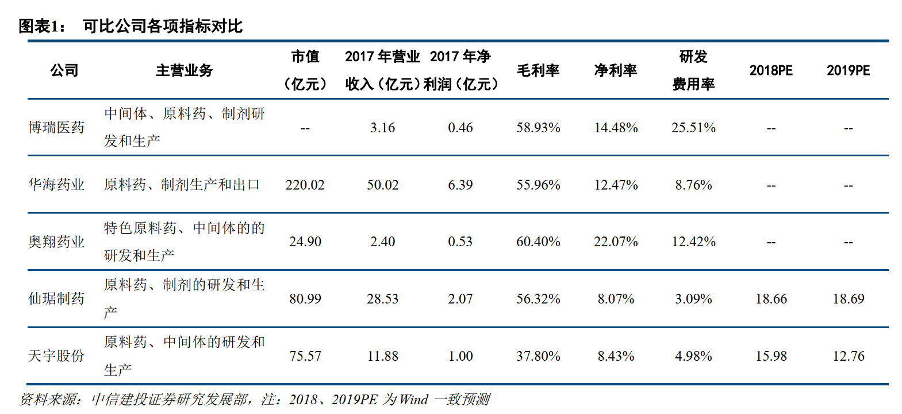

目前博瑞医药120亿，估值上并不占优，但特殊的盈利模式值得我们多看一眼。

### 一、主营业务

#### (一) 概述

​	发行人是一家研发驱动、参与国际竞争的化学制药全产业链产品和技术平台型企业，致力于成为一家全球领先的创新型高端化学制药公司。 

​	自设立以来，发行人一直从事高技术壁垒的医药中间体、原料药和制剂产品的研发和生产业务，凭借自身在微生物发酵、高难度药物合成工艺、药物合成原创路线设计、药物新晶型及药物靶向递送等方面积累的技术优势，建立了发酵半合成技术平台、多手性药物技术平台、靶向高分子偶联技术平台和非生物大分子技术平台等核心药物研发技术平台，形成了高技术附加值的医药中间体和原料药销售、药品技术转让以及利用自身技术和产品优势与其它具有品牌或销售渠道优势的医药企业合作开发并获得销售分成等多元化的盈利模式，并进一步向制剂产品领域拓展，逐步建立起原料药与制剂一体，仿制药与创新药结合，国际市场与国内市场并重的业务体系。公司自设立以来主营业务未发生重大变化。 

​	公司业务在上述药物研发技术平台上沿着两条主线发展：

​	(1) 在多手性合成和发酵半合成领域实现了一系列市场相对稀缺、技术难度较高的药物的仿制，现已掌握了包括恩替卡韦、卡泊芬净、米卡芬净、泊沙康唑、依维莫司及磺达肝癸钠在内的四十多种高端化学药物的生产核心技术，贯通了从“**起始物料→高难度中间体→特色原料药→制剂**”的全产业链 

​	(2) 创新药物研发领域，公司采用多手性药物技术拆分出的高活性单体，已获得国家药监局一类新药临床批件；凭借自身原创的靶向高分子偶联技术开发的抗肿瘤药物 BGC0222 已经向国家药监局递交了临床申请，该两项产品在报告期内已完成技术转让或签订技术转让合同并保留了药品上市后的销售分成权利。此外，公司尚有多个抗病毒感染和抗肿瘤的新药进入临床前研究。 

​	公司产品和服务的最终客户主要为全球知名仿制药厂家，包括：以色列梯瓦制药（Teva）、美国迈兰（Mylan）、日本日医工、日本明治、印度西普拉（Cipla）、印度太阳制药（Sun）、印度卡迪拉（Cadila）、韩国 Penmix 和印度卢平（Lupin）等，以及恒瑞医药、正大天晴、华东医药、扬子江药业、齐鲁制药和豪森药业等
国内大型制药企业。 

#### (二) 主要产品及服务  

发行人通过医药中间体和原料药销售、制剂销售分成以及相关研发技术转让实现收入，产品销售收入主要来源于以下产品 

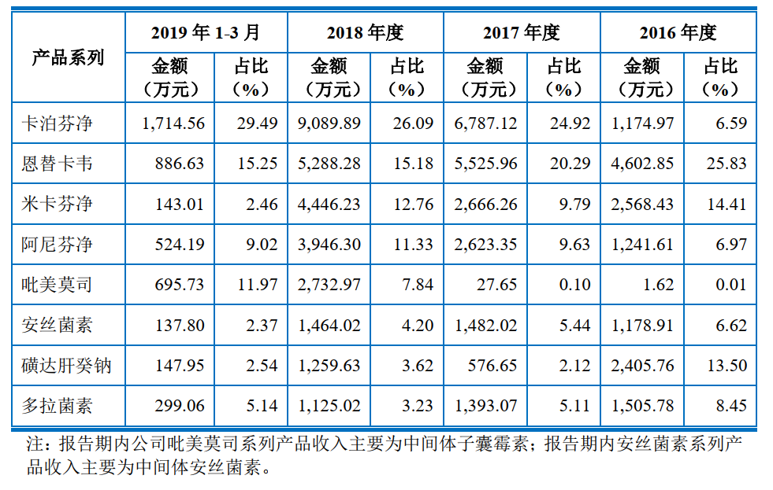

​	**其中的恩替卡韦进入集采，公司也提示了风险，影响毛利率**

#### (三) 主要产品技术水平 

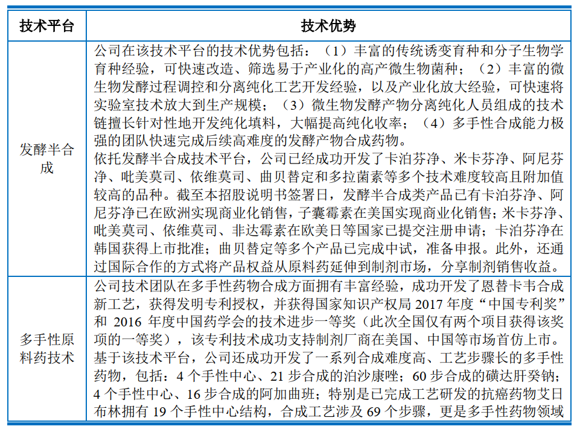

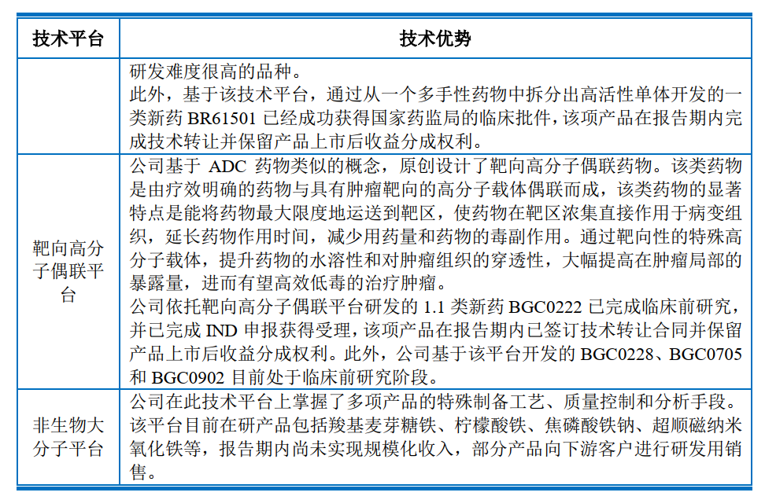

#### (四) 营收占比

国内外各占一半左右

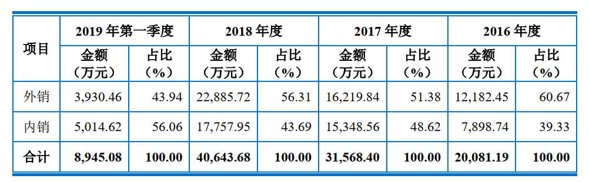

### 二、行业空间和格局

#### (一) 国际仿制药及 API 发展概况 

近年来全球医药市场持续扩容，医药支出总额稳步增加，但出现结构性分化，表现为原研药增长逐步放缓，仿制药的增速和占比都在快速提升。 

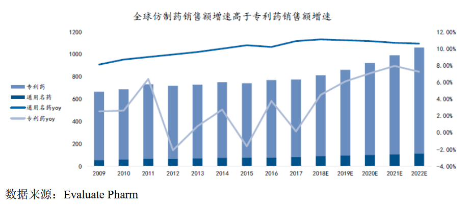

​	过去十年内通用名药销售增速一直高于专利药销售增。主要原因包括：
​	在需求端，受全球人口老龄化及慢性病高发影响，全球市场医药市场稳步扩容，根据研究机构 TrendForce 统计数据， 2017 年全球仿制药市场规模约为 1.13万亿美元。
​	在供给端，一方面新药研发的难度和资金门槛不断提高，获批上市的新药数量有所放缓。另一方面，专利悬崖推动国际通用名药物市场持续增长。 2013-2030年间，全球药品中共有 1,666 个化合物专利到期。大批世界级畅销专利名药相继到期为国际通用市场的繁荣提供了强大原动力，进而带动 API 需求量持续增加。 

​	中期内，全球仿制药市场有望保持两位数的复合增长，其中中国和其余发展中国家占比逐步提高。仿制药用量的提高将带来 API 市场的繁荣。特别地，针对支付能力有限的发展中国家，仿制药在未来一段时间内仍将是临床用药的主要选择。 IMS Health 预测， 2018 年全球医药支出相比 2013 年将增长 3,050-3,350亿美元，其中仿制药支出增长贡献 52%；在新兴医药市场增长中， 83%是仿制药的增长。 

##### (1) 过去十年中，全球 API 产能逐步从欧美向新兴市场转移，印度和中国成为主要承接者，目前印度是 API 产能转移的最大受益者，但中国凭借在技术和质量方面的优势，正快速缩小与印度的差距。 

​	一方面，由于人力成本高企及环保压力巨大，欧美原料药产能正流向拥有政策优势以及大量 DMF 证书的中印两国。目前欧洲 80%，美洲 70%的通用名产能由中印两国提供。印度由于语言和技术优势，成为过去十年 API 产能转移的最大受益者。截至 2016 年底，美国 DMF 中 46%由印度企业持有。从发展轨迹看，随着欧美日等国即将有大量产品的专利保护到期，以及印度的 DMFs 和 ANDAs数量大幅增加，印度 API 逐渐从大宗原料药发展到技术含量和附加值更高的特色原料药，销售重点从非规范市场转移到规范市场，从单纯做 API 延伸到 API+制剂，扩大市场话语权和毛利润。 

​	另一方面，中国凭借更为成熟的基础工业体系、成本优势以及发酵类产品优势，正在技术、产品质量体系和 DMF 认证等方面快速追赶印度。首先， 中国生化人才资源供给充沛，有利于国内企业迅速攻克全球主流的化学药生产的工程技术，建立起整套化学药研发和生产服务体系；其次， 据 Chemical Weekly 估计，生产环节占原研药全部成本的 30% 左右，在相对成本只有欧美 CMO 企业的1/2 到 1/3 的中国进行外包生产，这部分成本有望下降 40 -60% 以上，合计可减 少总成本 15% 左右；最后，印度自然条件不适宜生产发酵类的原料药产品，我国占据了世界 70%的产能。得益于上述优势，中国在全球 API 产业链中的地位近年来快速提升，表现在：①中国目前拥有全球数量最多的 API 生产基地，截至 2017 年底中国拥有 1,474 个 API 生产基地，印度为 688 个；②过去十年中国在美国注册的 DMF 数量迅速增长。 2000 年前中国每年获得的 DMF 注册号基本只有个位数， 2010 年后一般都在 100 个以上。近几年来中国每年新增获得的DMF 注册仅次于印度，已经超过了美国和欧洲五国的数量；③部分研发实力和质量管控能力较强的企业逐步深入至技术门槛较高的特色原料药领域，在全球市场的占比逐步提升。综上，过去 10 年，随着中国技术水平和质量体系的提高，中国在全球特别是规范市场的 API 竞争力逐步提高。 

#### (二) 国内仿制药及 API 发展状况  

根据《2018 年中国医药市场发展蓝皮书》，制药行业各子行业中化学药品原料药制造、化学药品制剂制造 2017 年收入增幅分别为 14.70%和 12.90%；收入占比分别为 20.34%和 33.98%，发展势头良好。具体情况如下： 

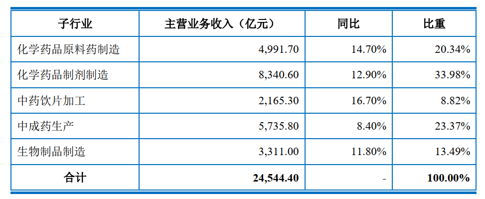

​	我国是仿制药使用大国，仿制药是我国医药市场的主导力量。根据《中国仿制药蓝皮书》（2017 版）， 2017 年我国仿制药市场规模在整体药品市场规模中的占比均维持在 60%以上。 

​	受国内慢性病患病率逐年正大，人口持续老龄化、医保控费等因素的驱动，预计未来我国仿制药市场规模仍将高速增长。 2021 年我国仿制药市场规模预计可达 15,887 亿元， 2017 至 2021 年复合增长率预计为 11.69%。  

##### (1) “一致性评价+集中采购”将促使医药行业格局加速洗牌，重新定义仿制药核心竞争要素， API 企业产业链优势凸显

​	2016 年 3 月，国务院办公厅发布《关于开展仿制药质量和疗效一致性评价的通知》，明确提出： 1）国家基本药物目录（ 2012 年版）中化学药品仿制口服固体剂，应在 2018 年底之前完成一致性评价，其中需开展临床有效性试验和存在特殊情形的品种，应 2021 年底前完成一致性评价，否则不予再注册； 2）化学药品新注册分类实施前批准上市的其他仿制，自首家种通过一致性评价后，其他药品生产企业的相同原则上应在 3 年内完成一致性评价，否则不予再注册； 3）鼓励企业开展一致性评价工作，同品种达到 3 家以上通过一致性评价的，在集采中不再选用未通过一致性评价的品种。 

​	与此同时， 4+7 带量采购要求通过招标形式确定价格的原则为量价挂钩，大于等于 3 家竞标即充分竞争，价低者得； 2 家竞标即不充分竞争，议价；仅 1 家竞标即无竞争，则谈判。从上海试点的中标价情况看，降价幅度超过 80%以上。

​	一致性评价及带量采购政策的出台，对仿制药行业将产生深远影响，对药企质量和成本管控提出了更高要求， API 质量稳定性、研发技术实力和效率、成本和产能稳定性在整个制药产业链中的重要性进一步凸显。 

#### (三)行业创新方面的发展和趋势 

##### (1) 仿制药研发简介 

​	从药品注册审批流程上来说，规范市场对药品的研发、生产、销售均有较高的审批要求。以中国为例，仿制药从研发至商业化生产完整的流程大致需要经历项目立项、物料采购、生产工艺研究、放大研究、生产验证、临床试验、申报省药监局、现场核查、申报生产等多个阶段，通常情况下整个流程时间跨度长达 3至 5 年。 

​	研发外包或合同研究（Contract Research Organization， CRO）通过联合协作实现资源利用最大化，可为制药企业节省成本和提高研发效率，已经成为医药行业的重要研发模式。其中， CRO 公司即是接受药企委托进行全部或部分科学或医学试验，以获取商业报酬的公司。对于部分自身具有研发技术积累的公司而言，先行进行自主研发，主动接触药企客户成为其 CRO 服务提供方，也成为行业内新兴的一种业务模式。 

##### (2) 仿制药行业研发策略 

​	在规范性医药市场，仿制药需待原研药保护期到期并获得相关监管机构的批准，方可上市销售。而由于价格竞争的存在，正常情况下，第一个仿制药上市销售时的销售定价仅略低于原研药，随后更多的仿制药不断进入市场，其价格会被不断拉低，这就导致了速度成为仿制药制剂的重要因素。有介于此，有些企业为了确保仿制药品能在第一时间上市销售，通过采取抢仿策略，提前 6~10 年甚至更早开始布局研发。
​	**按照仿制药企业对仿制药产品制定的预期上市时间，可将仿制药研发申报分为挑战专利、抢先仿制、一般仿制三种模式。** 

##### (3) 仿制药生产流程简介 

​	以化学合成药品为例，一种药品的研发从醇类、苯类等基础的化学原料，通过若干步的化学反应，不断生成医药中间体，医药中间体经过进一步的分子变化或精制生成原料药（Active Pharmaceutical Ingredient， API），原料药添加稳定剂、赋形剂等辅料后最终形成药品制剂供病人使用。 

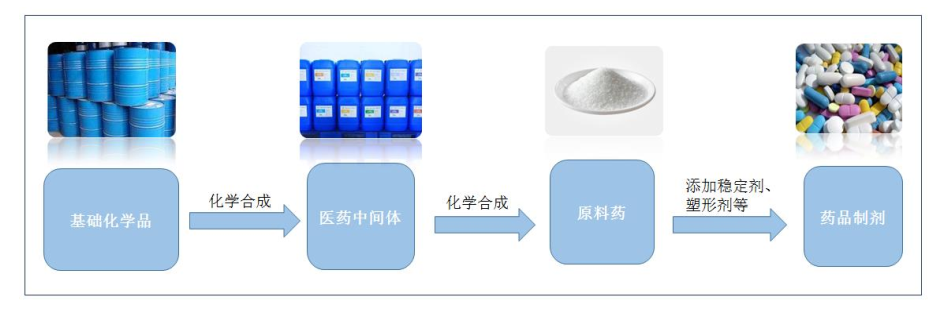

##### (4)原料药行业的细分情况 

​	根据 ICH 定义，原料药（英文名 Active Pharmaceutical Ingredient，直译为活性药物成份，简称 API）是指用于药品制造中的任何一种物质或物质的混合物，而且在用于制药时，成为药品的一种活性成分。此种物质在疾病的诊断，治疗， 症状缓解，处理或疾病的预防中有药理活性或其他直接作用，或者能影响机体的功能或结构。 

​	原料药产品通常分为大宗原料药、特色仿制药原料药和专利药原料药三大类。

​	特色仿制药原料药是行业通行说法。相对而言，

​	大宗原料药指市场需求相对稳定、应用较为普遍、规模较大的传统药品原料药，主要有抗生素类、维生素类、氨基酸类、激素类等。一般而言，大宗原料药各厂商的生产工艺、技术水平差别并不明显，生产成本控制是企业竞争的主要手段。

​	特色仿制药原料药通常指以心血管类、抗病毒类、抗肿瘤类等为代表的专科用药，对应制剂专利到期或即将到期，产品附加值较高。相比起大宗原料药，特色仿制药原料药具有较高的进入壁垒，利润水平更好。发行人主要产品及在研产品均为专利即将到期或专利保护期已结束但市场竞争格局相对宽松的药品，应用于心血管、抗病毒、抗肿瘤等专科领域，属于特色仿制药原料药范畴。 

​	据此，特色仿制药原料药和中间体行业可以进一步分为广泛上市仿制药原料药和中间体、专利到期仿制药原
料药和中间体，以及高难度合成仿制药原料药和中间体。
​	高难度合成仿制药中间体和原料药是行业通行说法，是从化学药物关键药物活性成份合成难度角度的再分类。相对于广泛上市仿制药和合成门槛不高的专利到期仿制药而言，高难度合成仿制药具有明显的技术壁垒，主要体现在两方面，一是合成技术难度大、壁垒高，二是药学研究和注册申报的壁垒高。 

#### (四) 主要产品的市场占有率 

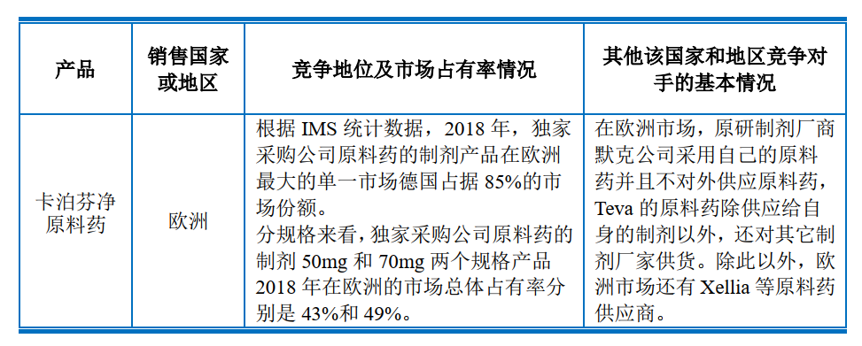

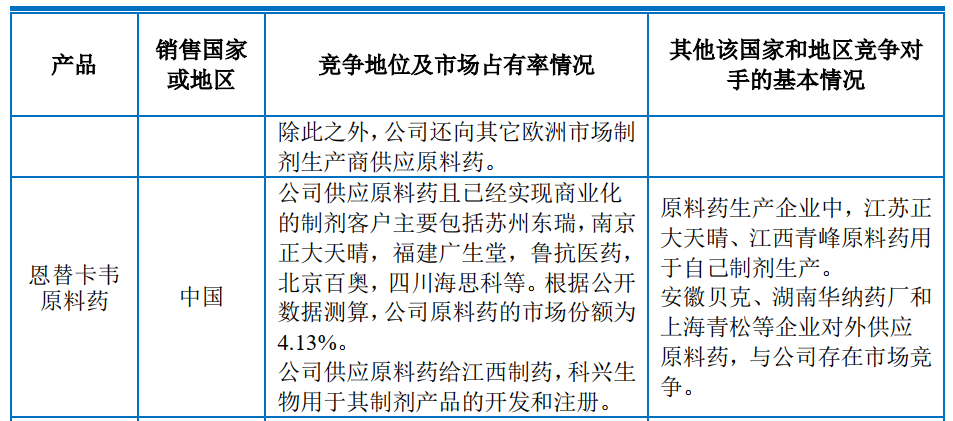

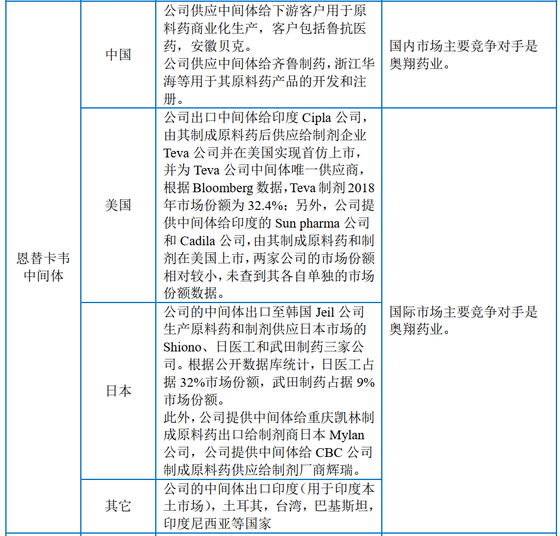

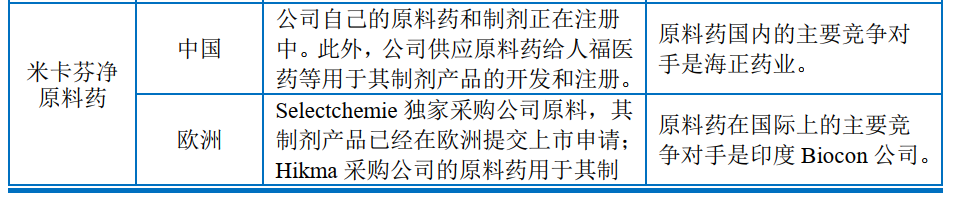

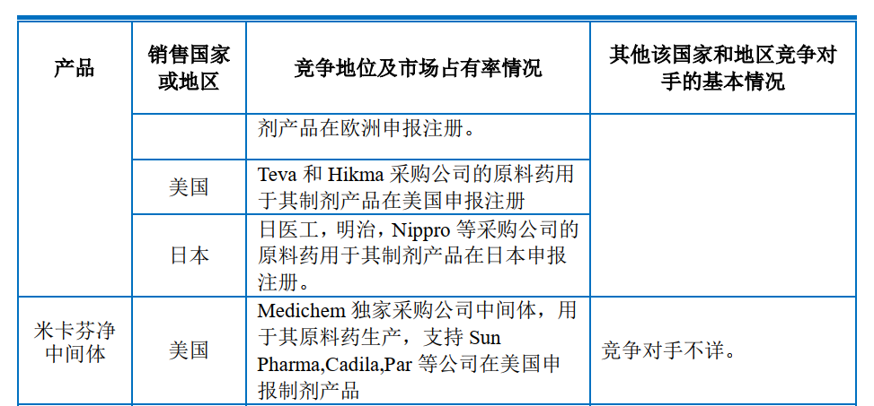

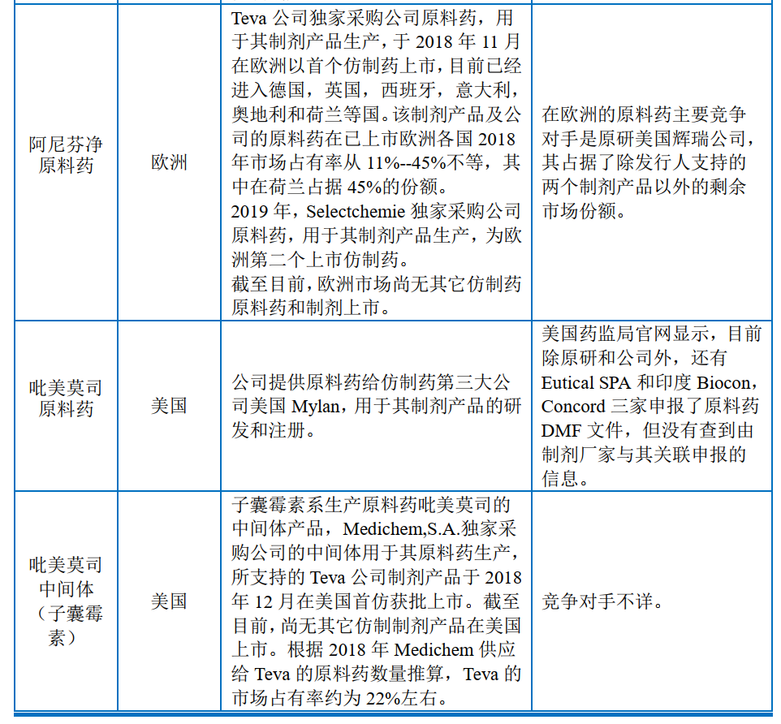

