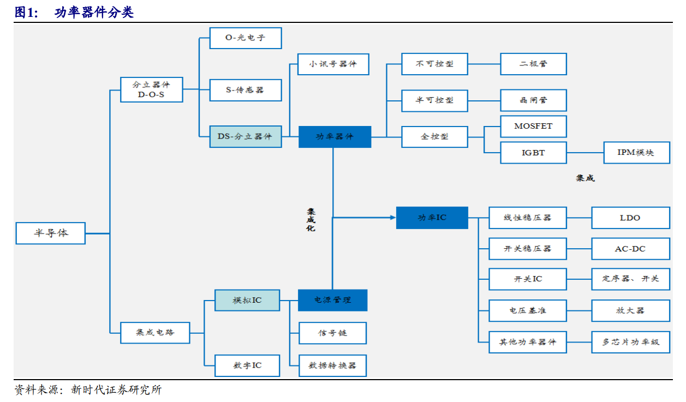
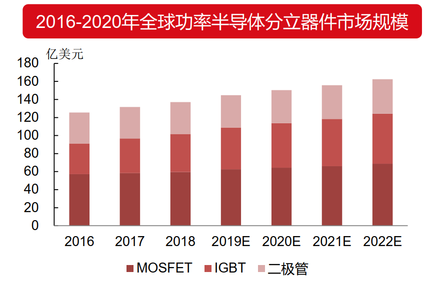
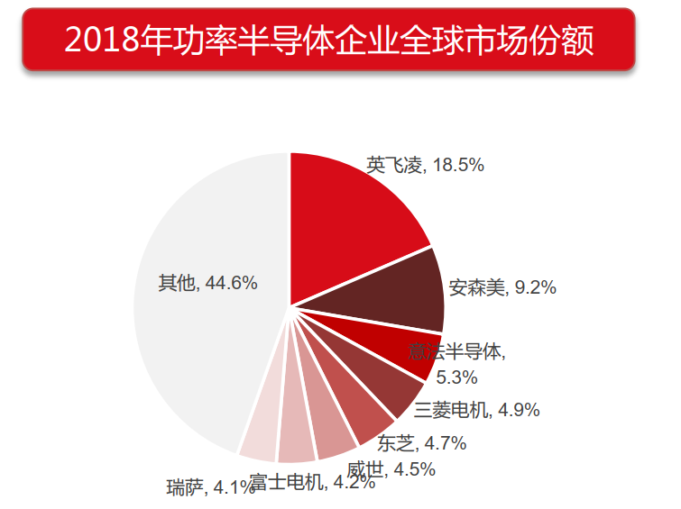
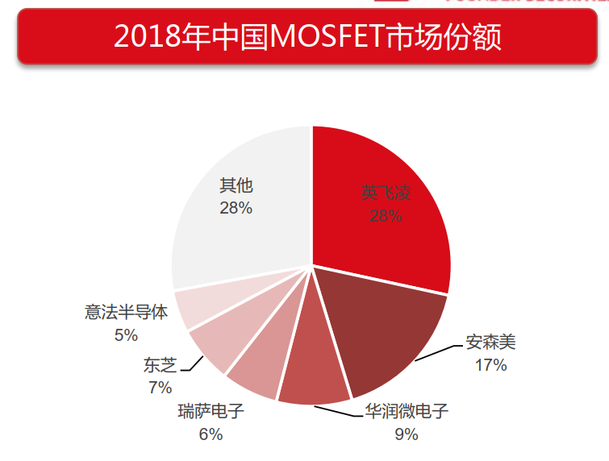
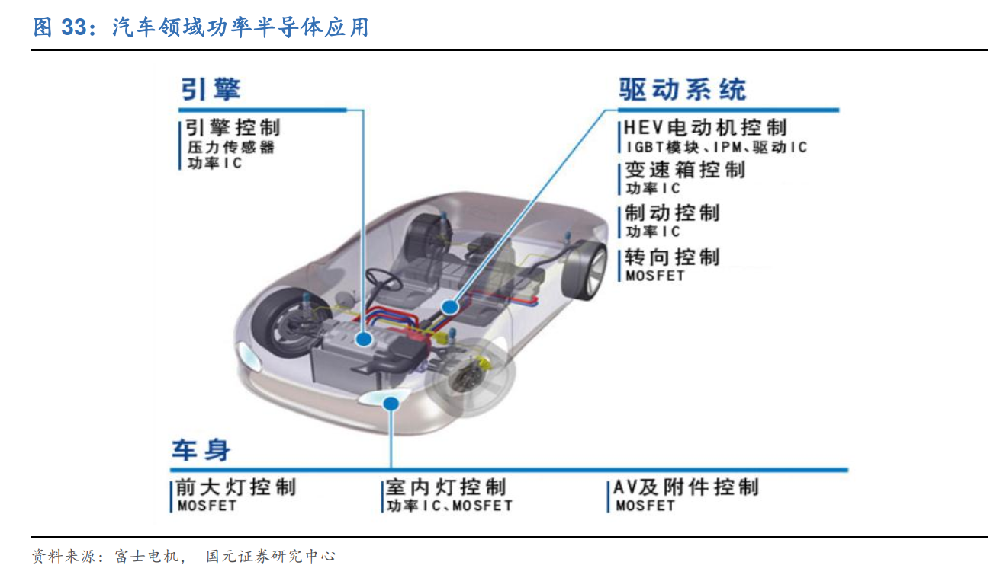

# 功率半导体(20200130)

### 总结

在之前研究了第三代半导体材料后，我们顺着路线看看关联紧密的功率半导体的情况。

赛道：功率半导体是必选消费品， 人需要吃” 柴米油盐“， 机器同样也需要消耗功率器件， 任何和电能转换有关的地方都需要功率半导体。 

目前来看，IGBT最大的增量空间就是汽车电动化过程中的单车价值的巨大提升。

下面是个人在梳理的功率半导体的相关企业，用来跟踪一用，国内总体来说对进口依赖过大，但也涌现了斯达半导这样的优秀新锐。根据IHSMarkit 2018年报告，斯达半导2017 年在 IGBT 模块全球市场份额占有率国际排名第 10 位，在中国企业中排名第 1 位，是国内 IGBT 行业的领军企业。 

### 一、基础概念

#### 1. ESD

ESD（Electro-Static discharge）的意思是“静电释放”。ESD是20世纪中期以来形成的以研究静电的产生、危害及静电防护等的学科。因此，国际上习惯将用于静电防护的器材统称为ESD，中文名称为静电阻抗器。

#### 2. 电力转换

在汽车中，汽车蓄电池的输入电压在 12V-36V，而民用电电压为 220V，

将民用电电压转换至输入电压的过程叫做**变压**。

蓄电池的输入电流一般是直流电，将交流电转换为直流电的过程叫做**整流**。

汽车运行时，蓄电池持续输出直流电，而汽车的各个模块需要使用交流电，交流电转换为直流电的过程叫做**逆变**。

汽车蓄电池输出的电压很低，无法满足各个模块的需求，将低电压转换成高电压的过程叫做**增幅**。 

电动汽车的马达使用的电流是三相电。首先，蓄电池输出的直流电经过逆变后成为单向交流电，将单向交流电变为三相电的过程叫做**变相**。 

#### 3. 功率器件分类

IGBT分为 IGBT 芯片和 IGBT模块，其中 IGBT模块是由 IGBT 芯片封装而来，具有参数优秀、最高电压高、引线电感小的特点，是 IGBT 最常见的应用形式， IGBT模块常用于大电流和大电压环境。 

功率 IC 通常由功率器件、电源管理芯片和驱动电路集成而来，能承受的电流比较小，能承受大电流的模块一般是 IGBT 集成形成的 IPM 模块。功率 IC 可以分为以下五大类：线性稳压、开关稳压器、 电压基准、开关 IC 和其他功率 IC。

 

#### 4. 二极管是啥都不知道？还当什么电子工程师，此文满足我的好奇心！

[二极管是啥都不知道？还当什么电子工程师，此文满足我的好奇心！](https://baijiahao.baidu.com/s?id=1600349337214227603&wfr=spider&for=pc)

https://baijiahao.baidu.com/s?id=1600349337214227603&wfr=spider&for=pc

#### 5.IGBT：电力电子行业“CPU” 

IGBT 是电机驱动的核心，广泛应用与逆变器、变频器等，在 UPS、开关电源、电车、交流电机等领域，逐步替代
GTO、 GTR 等产品。  

#### 6. IGBT、MOSFET、晶闸管异同点概述

[IGBT、MOSFET、晶闸管异同点概述](http://www.fusemi.cn/newsdetails_120875.html)

http://www.fusemi.cn/newsdetails_120875.html

### 二、行业概况

#### (一) 应用范围概览

需求来自各行各业， 单机半导体(硅) 含量的提升是核心规律。 功率半导体使得变频设备广泛应用亍日常消费。

##### 1. 手机： ESD保护相关的功率半导体遍布全身， 推动手机功率半导体需求不断增长。

手机上所有有接口的地方都需要有ESD保护，比如麦克风、听筒、耳机、扬声器、 SIM卡、 Micro SD、NFC天线、 GPS天线、 WiFi天线、 触屏、 2G/3G/4G RF 天线、 USB 接口、锂电池、电源键位置都有ESD保护器件。最多的手机用20多颗，少的用10多颗。 

##### 2. 手机充电器： “闪充” 需求逐步增加， 功率半导体数量和性能要求提升。

随着人们对充电效率的要求逐步提高，手机充电出现了“快充”模式，即通过提高电压来达到高电流高功率充电，但高电压存在安全隐患，需要添加同步整流的MOS管来调整；后来出现较为安全的“闪充”模式，即通过低电压高电流来实现高速充电，这对同步整流MOS管的要求更高，目前较为普遍的是GaN-mos管，它可以实现发热少、体积小的目的。 

##### 3. 汽车： 功率半导体遍布整个汽车电子系统， 推动汽车功率半导体需求增加。

根据富士电机资料， 汽车电子的核心是MOSFET和IGBT， 无论是在引擎、 或者驱动系统中的变速箱控制和制动、转向控制中还是在车身中， 都离不开功率半导体。 在传统汽车中的劣力转向、 辅助刹车以及座椅等控制系统等， 都需要加上电机， 所以传统汽车的内置电机数 量 迅 速 增 长 ， 带 劢 了MOSFET的市场增长。
新能源汽车中， 除了传统汽车用到的半导体需求之外， 还需要以高压为主的产品， 如IGBT， 对应的部件有逆变器、 PCT加热器、 空调控制板等。 

根据Strategy Analytics分析，在传统汽车中，平均车身半导体总价值约为338美元，其中功率半导体占比21%，约71美元；在混动电劢车中，车身半导体总价值约为710美元，其中功率半导体的占比达到49.8%，而在纯电动汽车中的功率半导体占比最高，高达55%。
**特斯拉（双电机全驱劢版）使用132个IGBT管，其中后电机为96个，前电机为36个，每个单管的价格大约4-5美元，双电机合计大约650美元，如果采用模块，需要12-16个模块，成本大约1200美元。** 

**IGBT 是新能源汽车电机控制系统和充电桩的核心器件。 IGBT 约占新能源汽车电力驱动系统及车载充电系统成本的 40%，折合到整车上约占总成本的7~10%，它的性能决定了整车的能源利用率。 IGBT 多应用于高压领域，**
**MOSFET 主要应用在高频领域。**
SiC 主要用于实现电动车逆变器等驱动系统的小量轻化。 SiC 器件相对于 Si器件的优势之处在于，降低能量损耗、更易实现小型化和更耐高温。 SiC 适合高压领域， GaN 更适用于低压及高频领域。 

##### 4. 通信： 5G带来基站电源硅含量提升 

##### 5. 电力：柔性输电技术都需要大量使用IGBT等功率器件。

智能电网的各个环节， 整流器、逆变器和特高压直流输电中的FACTS柔性输电技术都需要大量使用IGBT等功率器件。根据中国产业信息网发布的数据，预计到2021年我国智能电网行业投资规模将达到近23000亿元。 

##### 6. 风电：可再生清洁能源提供功率半导体新市场。

风力发电的逆变设备，可以将蓄电池中的DC12V直流电转换为和市电相同AC220V交流电。逆变器主要是由MOS场效应管不电源变压器为核心，通过模拟电路技术连接的。 2016年至2018年，我国风电装机量从18.73GW增至21GW， 2019年仅前5个月装机量就新增6.88GW，增长趋势迅猛。 

##### 7. 高铁：随着变流器需求增加， 行业得到持续稳定的发展 

牵引变流器将赸高电流转化为强大的劢力， 每辆列车共装有4台变流器， 每台变流器搭载了32个IGBT模块。
总的来说， 一辆高铁电劢机车需要500个IGBT模块， 劢车组需要赸过100个IGBT模块， 一节地铁需要50-80
个IGBT模块。
2018年全国劢车组产量达2724列， 同比增长5%。 世界范围内新一轮高铁建设热潮正在展开， 而大多数国家对高速铁路的技术研究仍处亍初级阶段。 从需求来看， 中国高铁的出口将存在广阔的国际市场空间。 

#### (二) 技术前进路线

##### 1. 产品性能要求

产品性能要求： 1）更高的功率 2）更小的体积 3）更低的损耗 4）更好的性价比。产品形态从单一的二极管
， MOS管向融吅的IGBT发展，从硅衬底往宽禁带半导体衬底迈进。

硅衬底（高损耗，高性价比）
二极管：高电压（高功率）
MOS管：高频率（小体积）
IGBT：高电压+高频率（高功率+高频率）

化合物半导体衬底（低损耗，低性价比）
更宽的禁带使得产品产品性能和效率进胜于硅衬底的功率器件，目前只是性价比斱面还不是太有优势。
未来趋势：化合物半导体制造的成本降低，凭借其优势替代硅基的功率半导体器件指日可待。 

##### 2. 发展历史

分立器件主要以功率二极管、晶闸管、功率 MOSFET 和 IGBT 模组为占比最大的四个方面。 

##### 3. 制造工艺

#### (三) 全球功率半导体市场空间 

​	根据IHS数据统计， 2018年全球功率器件市场规模约为391亿美元， 预计至 2021年市场规模将增长至441亿美元， 年化增长率为4.1%， 市场规模稳步增长。 目前国内功率半导体产业链正在日趋完善， 技术也正在取得突破。 同时， 中国也是全球最大的功率半导体消费国， 2018年市场需求规模达到138亿美元， 年化增长率为9.5%， 占全球需求比例高达35%。 预计未来中国功率半导体将继续保持较高速度增长， 2021年市场规模有望达到159亿美元， 年化增速达4.8%。 

#### (四) 市场格局

​	2018年中国MOSFET销售规模约为183亿元，其中市场份额前六位的公司里仅有一家中国本土企业——华润
微电子，市占率为8.7%，而排名前两位的海外企业市占率合计为45.3%，占据了近一半的市场份额。由此看来，中国MOSFET市场仍然大量依靠进口，未来进口替代空间巨大。 

​	产品交期和价格主要被欧美企业牢牢掌握。
​	MOSFET、 IGBT及二极管的产品交期普遍在20周以上， 货期趋势都是缩短， 可见供应商存货充足。 随着
5G的建设发展， 新能源电劢汽车的崛起， 将会有效拉劢功率半导体市场的需求， 从而促迚半导体产业快速发展。 预测未来功率半导体市场前景广阔， 交期会逐渐变长。 	

#### (五) 受惠于新能源汽车

IGBT 是新能源汽车电机控制系统的核心器件。特斯拉 Model S 车型使用的三相异步电机驱动，其中每一相都需要使用 28 颗 IGBT 芯片，三相共需要使用 84 颗 IGBT 芯片。每颗的价格大约在 4~5 美元。 我们预计 IGBT 的单车价值量大约在 420 美元左右。 根据全球新能源汽车的销量能够推导出新能源汽车所带来的 IGBT 市场需求。 

SiC 主要用于实现新能源汽车逆变器等驱动系统的小量轻化。 2018 年，特斯拉 Model 3 的逆变器采用了意法半导体制造的 SiC MOSFET，每个逆变器包括了 48 个 SiC MOSFET。Model3 的车身比 Model S 减小了 20%。每个 SiC MOSFET 的价格大约在 50 美元左右。 我们判断SiC 的单车价值量大约在 2500 美元左右。 

受惠于新能源汽车需求的显著增长，我们认为 IGBT 的增量空间巨大。 SiC 市场可能会出现供不应求的情况。高成本是限制各国际厂商扩大 SiC 产能的重要因素。 s

#### (六) 充电桩市场受益于电动车消费增长快速 

作为新能源汽车不可缺少的配套措施， 汽车充电桩也是对功率半导体增长的驱动力之一。目前汽车充电桩的核心功率模块有两种：一种是采用 IGBT 芯片；另一种为采用 MOSFET 芯片。 国家能源局在《电动汽车充电基础设施建设规划》草案中提出，到 2020 年国内充换电站数量将达到 1.2 万个，充电桩达到 450 万个。 中国产业信息研究院数据预计到 2020 年国内充电桩功率器件市场规模有望超过 35 亿元。 

#### (七) 新兴应用不断涌现

功率半导体的应用领域非常广泛，根据 Yole 数据， 2017 年全球功率半导体市场规模为 327 亿美元，预计到 2022 年达到 426 亿美元，复合增长率为5.43%，其中， 2017 年全球功率半导体器件市场规模为 144.01 亿美元，预计到 2022 年市场规模将达到 174.88 亿美元，复合增长率为 3.96%。 在全球功率半导体市场中， 工业、汽车、无线通讯和消费电子是前四大终端市场， 根据中商产业研究院数据， 2017 年工业应用市场是功率半导体最大的市场，占比 34%，汽车领域占比 23%，消费电子占比 20%，无线通讯占比 23%。 我们认为受益于工业、新能源汽车、通信和消费电子领域新兴应用不断出现，全球功率半导体市场将会不断向好，规模将会不断扩大。 

#### (八) 晶圆缺货涨价，国产缺口较大 

​	功率半导体的制造需要使用 8 寸晶圆， 8 寸晶圆供给不足导致功率半导体供需紧张，价格持续上涨。 2016-2018 年， 8 寸晶圆价格涨幅超过 30%，预计未来 8 寸晶圆供给紧张的情况还将继续。
​	从晶圆供给端来看， 8 寸晶圆产能不足导致此轮涨价。受 2008 年金融危机的影响，全球整机出口疲软，对晶圆需求较低，晶圆厂扩产能的意愿不强。随着全球经济复苏，整机出口回暖， 对晶圆需求增加，晶圆供给不足。新建一条晶圆生产线需要 1-2 年的时间，短期内难以解决晶圆短缺的问题。其次， 12 寸晶圆生产线挤占8 寸晶圆产能。随着制程工艺不断提高，晶圆厂转向 12 寸晶圆生产投资，部分 12寸晶圆生产线由原有的 8 寸晶圆生产线改造而来，挤占了 8 寸晶圆产能。目前全球约有 70%的晶圆是 12 寸， 8 寸晶圆占比约 20%， 8 寸晶圆供给足。
​	从下游需求端看，模拟芯片与功率半导体争夺 8 寸晶圆产能。 8 寸晶圆可用于模拟芯片与功率半导体制造，受益于新能源汽车等领域的爆发，模拟芯片与功率半导体市场规模持续增长， 8 寸晶圆供不应求。其中模拟芯片市场规模与复合增长率明显高于功率半导体，模拟芯片将抢占 8 寸晶圆产能，晶圆供需缺口进一步加大。 

