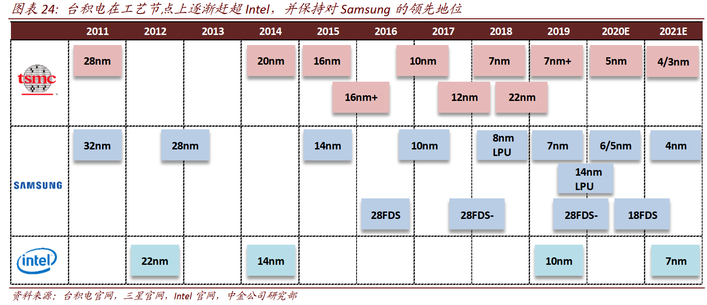
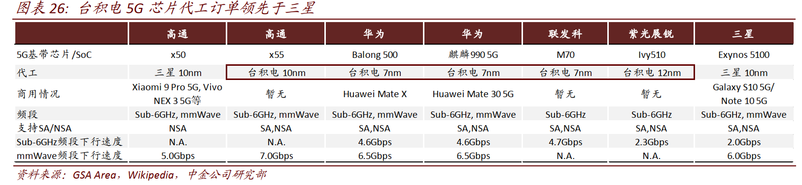
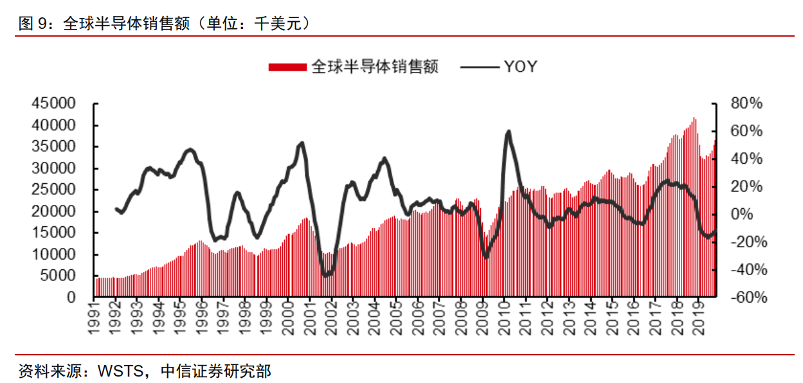
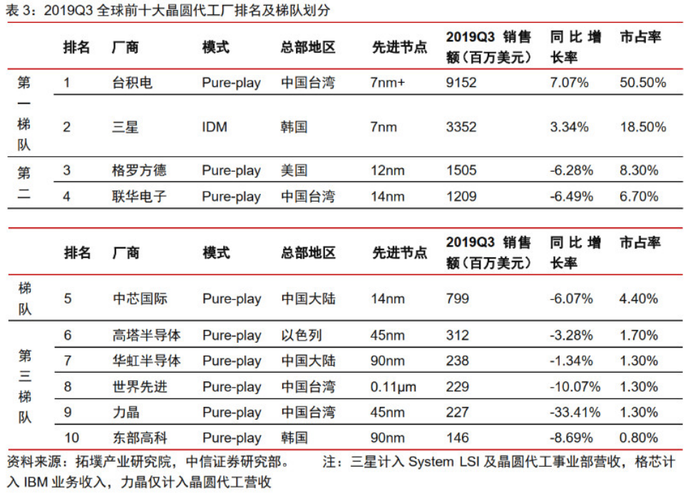
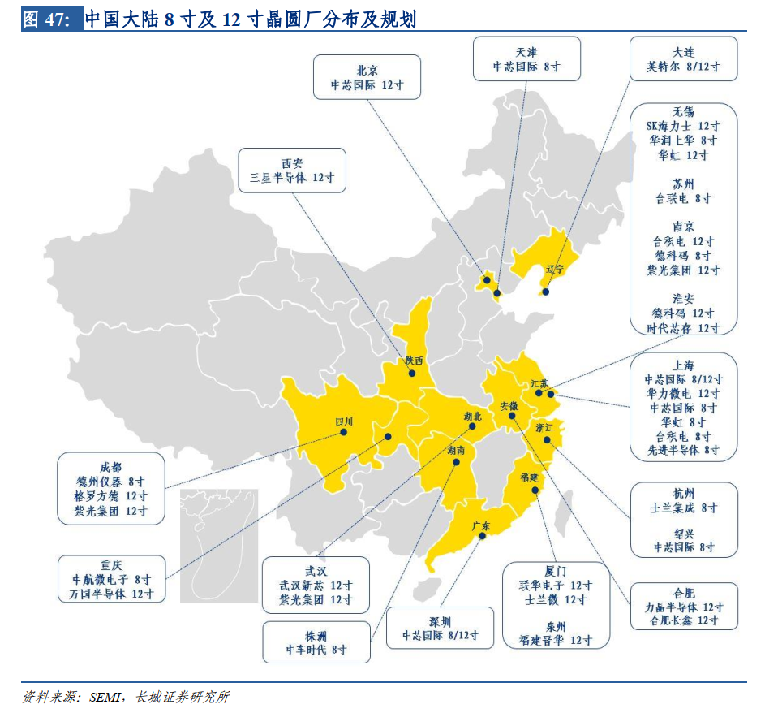

# 半导体制造(20200131)

### 总结

如果单纯的作为半导体制造环节，晶圆厂并不是一个好赛道，这个赛道的龙头目前来看毫无疑问就是台积电，

中芯国际当前尚不具备 7nm 或 10nm 技术能力，体现了先进工艺仍与台积电有 2 代左右的技术差距。 

另一个趋势是下游终端应用市场全备，全球新建晶圆厂 40%位于中国大陆 ，另一方面大基金一期已经开始不断的加大对中芯国际和华虹半导体的投入。

再一个寡头可能出现，先进制程向龙头集中，当前呈现英特尔、台积电、三星三足鼎立局面，中芯国际是唯一后续追赶者。随着晶体管尺寸不断缩小，集成电路发热和漏电等问题凸显，保持先进的制程以及高良率需要高研发投入和设备投入，龙头集中趋势愈发明显。 由于先进制程研发的高投入，其他厂商如格罗方德、联电均已宣布停止 14nm 以后先进制程的研发，目前仅余中芯国际一家先进制程追赶者。 

半导体制造的晶圆代工，我们看到的龙头是台积电，中芯国际是目前国内的突破手。国内大批量的晶圆厂的不断投入，必然带动下游的封测，上游的设备和材料等行业的发展，也是我们要关注的。

### 一、基础概念

#### (一) 简述晶圆制造工艺流程和原理

[简述晶圆制造工艺流程和原理](http://www.elecfans.com/d/1017219.html)

http://www.elecfans.com/d/1017219.html

#### (二) 纳米工艺、硅晶圆、知识总结

[纳米工艺、硅晶圆、知识总结](http://www.elecfans.com/d/926418.html)

http://www.elecfans.com/d/926418.html

### 二、晶圆代工厂

#### (一) 台积电-商业模式创新：“Fabless+Foundry”模式大获成功，逐渐取代IDM模式 

谈起晶圆代工厂，不得不先从台积电说起。

台积电（ TSMC）于 1987 由张忠谋成立于台湾新竹科学园区，是全球第一家、也是全球最大的晶圆代工（ Foundry）企业。目前公司业务遍布北美、欧洲和亚洲，在中国台湾、中国大陆以及美国拥有 14 座晶圆代工厂，员工总数超过 4.8 万名。 台积电创造性地实践了“Fabless+Foundry” 的商业模式， 大幅降低了芯片设计的技术与资本门槛，推动 Fabless芯片设计与晶圆代工市场快速崛起。  区别于以 Intel、三星、 SK 海力士为代表的 IDM
（垂直一体化厂商）模式。

台积电是“Fabless+Foundry” 模式的开创者、驱动者，更是受益者。 1987 年台积电的成立标志着纯晶圆代工模式的诞生，在获得 Intel 技术认证之后，台积电不断获得高通、英伟达、联发科、博通等重要客户订单，公司业绩快速增长，同时也引领联电、世界先进、中芯国际等一批企业进入晶圆代工领域，驱动行业规模不断提升；晶圆代工模式的兴起降低了芯片设计行业的门槛以及芯片产品开发失败的风险，吸引越来越多的中小厂商进入半导体行业，反过来进一步刺激晶圆代工的行业需求，从行业增速来看，除 2017-2018年由于存储器市场的高度景气 IDM 行业增速显著加快外， 2001-2018 年 Fabless 与晶圆代工的行业增速整体高于 IDM 的行业增速。我们认为，作为绝对龙头的台积电正是这一模式大获成功的最大受益者 

#### (二) 先进制程遥遥领先

近年来，摩尔定律放缓甚至失效的论调开始盛行，人们开始担心台积电的领先地位会因此动摇，但随着 10nm， 7nm， 7nm+等技术的率先量产以及在 5nm 与 3nm 的超前布局，台积电逐渐开始引领全球先进制程发展，不断拓宽摩尔定律的理论极限。如今，**联电、 GlobalFoundries 等厂商已相继放弃 14nm 以上节点研发，台积电在先进制程上开始形成垄断之势，与竞争对手的技术差距进一步拉大。** 

考虑到目前 5G基带均采用 14nm 以下的先进制程， GlobalFoundries、联电、中芯国际等其他晶圆代工厂将难以直接受益于 5G 芯片放量带来的代工需求，台积电将充分受益于 5G 芯片放量带来的代工需求，进一步拉开与其他代工厂的差距。 

台积电不仅在逻辑芯片上不断突破先进制程，纵向提升制造技术的深度，同时积极研发射频、模拟、图像传感器、
MEMS 等多种特殊工艺制程，横向拓展技术平台的广度。特殊工艺制程面向各个细分市场，有效地丰富了台积电的客户群体以及下游应用领域，目前索尼、 ADI、 TI、汇顶科技、豪威等非逻辑芯片厂商已经成为台积电的重要客户，而台积电也不断凭此不断切入汽车、工控等多个下游领域，产品组合不断优化 

#### (三) 利用成本优势狙击竞争对 

通常晶圆代工行业的折旧年限为 5-7 年，以中芯国际为例，中芯国际 8 寸线的折旧年限通常为 6 年， 12 寸线的折旧年限则为 7 年，而台积电采用较为积极的设备折旧策略，折旧年限仅为 5 年，短于一个制程的生命周期，一旦设备折旧计提完成，产品的会计成本就会大幅下降，而此时台积电的竞争对手通常仍在计提设备折旧，台积电便可利用成本优势削减产品价格，从而向下狙击竞争对手，挤压竞争对手的获利空间。以 28nm 为例，台积电 2011 年实现量产，设备在 2016 年完成折旧， 28nm 产品在 2017 年开始降价，对中芯国际、联电等厂商的盈利能力形成较大压力。 

### 三、晶圆厂格局

根据世界半导体贸易统计组织（WSTS），全球半导体销售额 2018 年为 4688 亿美元，同比+13.7%。受存储器价格下行、中美贸易摩擦冲击、2019 上半年库存水平偏高等因素影响，WSTS 预测2019 年全球半导体销售额同比-12.8%至 4090 亿美元。进入 2019 年下半年，半导体销售额已出现明显的景气周期复苏迹象，WSTS 预计随着数据中心设备投资恢复、5G 导入、以及汽车持续电子化，2020 年全球半导体销售额有望重回增长，同比+5.9%至 4330 亿美元。 

### 三、国内晶圆厂

​	2019年中芯南方集成电路制造有限公司12英寸14纳米生产线正式投产，标志着中国大陆集成电路生产工艺向前推进一步。 

