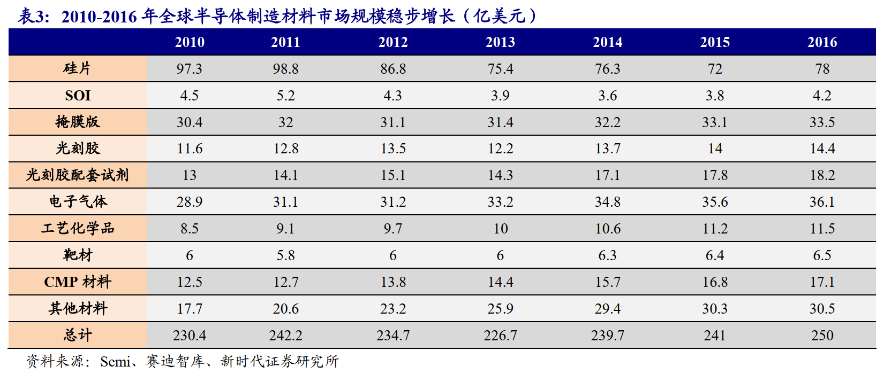
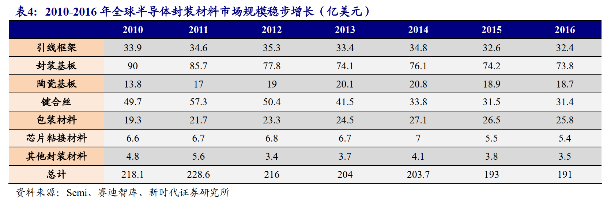
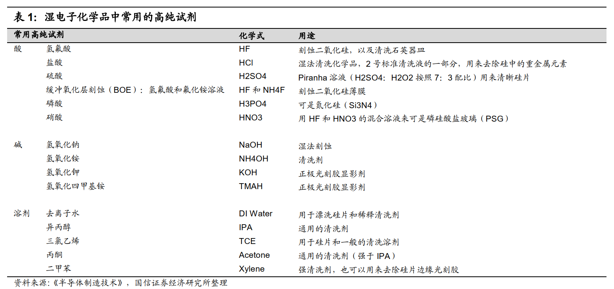

# 半导体材料(20200131)

### 总结

2018 年全球半导体材料销售规模在 519 亿美元，其中基体材料、制造材料、封装材料占比分别为 23.4%、38.7%和 28.0%。根据细分统计数据，制造材料中电子特气、掩膜版、光刻胶的市场占比最大，合计占到制造材料的 61%。按照未来硅片尺寸越来越大（18 英寸将成为主流）的趋势，我们预计基体材料的占比将变小，制造材料的占比将有望扩大。 

目前概况：

在靶材方面，国内企业江丰电子已经具备较强的竞争力，江丰电子改变了中国半导体靶材完全依赖进口的局面，其产品已经打入主流国际市场，客户包括台积电、德州仪器、镁光科技、意法半导体、格罗方德等国际一线半导体厂商； 

在大硅片方面， 主要依赖进口，前六大厂商全球市占率超过 90%，其中前两大日本厂商 Shin-Etsu和 SUMCO 合计全球市占率超过 50%，国内企业有新昇半导体，竞争力还明显不足；

电子气体方面，国内雅克科技收购的科美特和江苏先科具备一定的研发能力，未来有望受益国内半导体市场发展； 光刻胶方面，国内企业产品目前还主要用于 PCB领域，代表企业有晶瑞股份、科华微电子；

在 CMP 抛光垫方面，国内企业鼎龙股份在研发，江丰电子已经有出货；

在 CMP 抛光液方面，国内企业安集微电子具有一定竞争力；

在工艺化学品方面，国内企业江化微、晶瑞股份有一定研发能力，竞争力还相对较弱。 

### 一、半导体材料

#### (一) 全球半导体材料市场规模巨大，但基本由外企主导 

2018 年全球半导体产业规模达 4373 亿美元，其中半导体材料规模达 519亿美元，大陆地区半导体产业规模达 1220 亿美元，其中半导体材料规模达 84.4 亿元。大陆地区半导体产业占全球总量的 28%，半导体材料占全
球总量的 16%。欧美、日韩和台湾等地区的半导体产业发展较早，全球半导体材料仍主要由海外企业所主导，国内企业目前还处于起步阶段，参与产业链的程度普遍较低。 

2018 年全球半导体材料销售额达到 519 亿美元，大陆地区销售额销售额达 84亿美元，其中国产材料占比仅为 20%，在全球硅晶圆制造产业向大陆转移的历史浪潮之下，半导体材料进口替代将成为必然趋势，国内半导体材料企业未来成长空间巨大。 

#### (二) 材料产业链

半导体材料是产业链上游环节中非常重要的一环，在芯片的生产制造中起到关键性的作用。

根据半导体芯片制造过程，一般可以把半导体材料分为基体、制造、封装等三大材料，其中基体材料主要是用来制造硅晶圆半导体或者化合物半导体，制造材料则主要是将硅晶圆或者化合物半导体加工成芯片的过程中所需的各类材料，封装材料则是将制得的芯片封装切割过程中所用到的材料 

#### (三) 导体材料是产业基石，国产替代势在必行 

全球半导体材料市场：根据 Semi 统计数据， 2016 年全球半导体材料整体销售额达到 443 亿美元，其中，半导体制造材料和封装材料市场规模分别为 247 亿美元和 196 亿美元。在所有半导体制造材料中，硅片及硅基材是最重要的半导体制造材料。近几年，全球半导体材料市场规模保持每年 430-440 亿美元的市场销售额，整体比较稳定。按全球地区分布来看，其中中国台湾地区市场份额最大，为 43.37 亿美元，占比接近 10%，亚洲地区（ 中国台湾地区、韩国、日本、中国大陆等国家与地区）占比之和为 30.17%，成为全球最大的半导体材料市场 

### 二、主要公司

#### (一) 基体材料 

根据芯片材质不同，分为硅晶圆片和化合物半导体，其中硅晶圆片的使用范围最广，是集成电路 IC 制造过程中最为重要的原材料。硅晶圆片全部采用单晶硅片，对硅料的纯度要求较高，一般要求硅片纯度在99.9999999%（9N）以上，远高于光伏级硅片纯度。先从硅料制备单晶硅柱，切割后得到单晶硅片，一般
可以按照尺寸不同分为 6-18 英寸，目前主流的尺寸是 8 英寸（200mm）和 12英寸（300mm），18 英寸（450mm）预计至少要到 2020 年之后才会逐渐增加市场占比。

全球龙头企业主要是信越化工、SUMCO、环球晶圆、Silitronic、LG等企业 

相关上市公司主要有：上海新阳、晶盛电机、中环股份、保利协鑫（港股） 

#### (二) 化合物半导体

化合物半导体主要指砷化镓（GaAs）、氮化镓（GaN）和碳化硅（SiC）等第二、第三代半导体，相比第一代单质半导体（如硅（Si）、锗(Ge）等所形成的半导体），在高频性能、高温性能方面优异很多。三大化合物半导体材料中，GaAs占大头，主要用在通讯领域，全球市场容量接近百亿美元；GaN 的大功率和高频性能更出色，主要应用于军事领域，目前市场容量不到 10 亿美元，随着成本下降有望迎来广泛应用；SiC 主要作为高功率半导体材料，通常应用于汽车以及工业电力电子，在大功率转换领域应用较为广泛。

相关公司主要有：三安光电、海威华芯 

#### (三) 抛光材料 

半导体中的抛光材料一般是指 CMP 化学机械抛光（Chemical Mechanical Polishing）过程中用到的材料，CMP 抛光是实现晶圆全局均匀平坦化的关键工艺。CMP 抛光的原理是是在一定压力下及抛光浆料存在下，被抛光工件相对于抛光垫做相对运动，借助于纳米粒子的研磨作用与氧 化剂的腐蚀作用之间的有机结合，在被研磨的工件表面形成光洁表面。 

抛光材料一般可以分为抛光垫、抛光液、调节器和清洁剂，其中前二者最为关键。抛光垫的材料一般是聚氨酯或者是聚酯中加入饱和的聚氨酯，抛光液一般是由超细固体粒子研磨剂（如纳米级二氧化硅、氧化铝粒子等）、表面活性剂、稳定剂、氧化剂等组成。
根据SEMI和IC Mtia数据，2016年全球抛光材料的市场规模大约16.1亿美元，其中国内市场规模约 23 亿元。全球抛光垫市场几乎被陶氏垄断，抛光液市场则主要由日本的 Fujimi 和 Hinomoto Kenmazai，美国的卡博特、杜邦、Rodel、EKA，韩国的 ACE 等企业占领绝大多数市场份额。

相关上市公司主要有：鼎龙股份（抛光垫）、安集科技（抛光液） 

#### (四) 掩膜版 

掩膜版通常也被称为光罩、光掩膜、光刻掩膜版，是半导体芯片光刻过程中的设计图形的载体，通过光刻和刻蚀，实现图形到硅晶圆片上的转移。掩膜版通常根据需求不同，选择不同的玻璃基板，一般是选择低热膨胀系数、低钠含量、高化学稳定性及高光穿透性等性能的石英玻璃为主流，在上面镀厚约 100nm 的不透光铬膜和厚约 20nm 的氧化铬来减少光反射。
根据 SEMI 和 IC Mtia 数据，2018 年全球半导体掩膜版的市场规模大约 33.2 亿美元，其中国内市场规模约 59.5 亿元。全球生产掩膜版的企业主要是日本的TOPAN、大日本印刷、HOYA、SK 电子，美国的 Photronic 等。

相关上市公司主要有：菲利华、石英股份、清溢光电 

#### (五) 湿电子化学品 

湿电子化学品，也通常被称为超净高纯试剂，是指用在半导体制造过程中的各种高纯化学试剂。按照用途可以被分为通用化学品和功能性化学品，其中通用化学品一般是指高纯度的纯化学溶剂，例如高纯的去离子水、氢氟酸、硫酸、磷酸、硝酸等较为常见的试剂。在制造晶圆的过程中，主要使用高纯化学溶剂去清洗颗粒、有机残留物、金属离子、自然氧化层等污染物。功能性化学品是指通过复配手段达到特殊功能、满足制造过程中特殊工艺需求的配方类化学品，例如显影液、剥离液、清洗液、刻蚀液等，经常使用在刻蚀、溅射等工艺环节 

根据 SEMI 和 IC Mtia 数据，2016 年全球湿电子化学品的市场规模大约 11.1 亿美元，其中国内市场规模约 14 亿元。全球市场主要由欧美和日本企业主导，其中德国的巴斯夫和HenKel、美国的Ashland、APM、霍尼韦尔、ATMI、Airproducts、日本的住友化学、宇部兴产、和光纯药、长濑产业、三菱化学等公司。

相关上市公司主要有：多氟多、晶瑞股份、巨化股份、嘉化能源、滨化股份、三美股份、江化微、澄星股份、光华科技、兴发集团 

#### (六) 电子特气 

电子特气是指在半导体芯片制备过程中需要使用到的各种特种气体，按照气体的化学成分可以分为通用气体和特种气体。另外按照用途也可以分为掺杂气体、外延用气体、离子注入气、发光二极管用气、刻蚀用气、化学气相沉积气和平衡气。与高纯试剂类似，电子特气对气体纯度的要求也极高，基本上都要求 ppt级别以下的杂质含量。这是因为 IC 电路的尺寸已经达到纳米级别，气体中任何微量残存的杂质都有可能造成半导体短路或者线路损坏。 

#### (七) 光刻胶 

光刻胶是图形转移介质，其利用光照反应后溶解度不同将掩膜版图形转移至衬底上。目前广泛用于光电信息产业的微细图形线路加工制作，是电子制造领域关键材料。光刻胶一般由感光剂（光引发剂）、感光树脂、溶剂与助剂构成，其中光引发剂是核心成分，对光刻胶的感光度、分辨率起到决定性作用。光刻胶根据化学反应原理不同，可以分为正型光刻胶与负型光刻胶。

以半导体光刻胶为例，在光刻工艺中，光刻胶被均匀涂布在衬底上，经过曝光(改变光刻胶溶解度)、显影(利用显影液溶解改性后光刻胶的可溶部分)与刻蚀等工艺，将掩膜版上的图形转移到衬底上，形成与掩膜版完全对应的几何图形。**光刻工艺约占整个芯片制造成本的 35%，耗时占整个芯片工艺的 40-60%，是半导体制造中最核心的工艺。** 

根据 SEMI 和 IC Mtia 数据，2016 年全球光刻胶的市场规模大约 14.4 亿美元，其中国内市场规模约 20 亿元。全球光刻胶市场主要被欧美日韩台等国家和地区的企业所垄断。

相关上市公司主要有：上海新阳、强力新材、苏州瑞红、南大光电、飞凯材料、容大感光、永太科技 

#### (八) 溅射靶材 

溅射靶材的使用原理是利用离子源产生的离子，在高真空中经过加速聚集，而形成高速度能的离子束流，轰击固体表面，离子和固体表面原子发生动能交换，使固体表面的原子离开固体并沉积在基底表面，被轰击的固体是用溅射法沉积薄膜的原材料，因此称为溅射靶材。
半导体芯片的单元器件内部由衬底、绝缘层、介质层、导体层及保护层等组成，其中，介质层、导体层甚至保护层都要用到溅射镀膜工艺。集成电路领域的镀膜用靶材主要包括铝靶、钛靶、铜靶、钽靶、钨钛靶等，要求靶材纯度很高，一般在 5N（99.999%）以上。
全球溅射靶材的龙头企业主要是美国的霍尼韦尔和普莱克斯，日本的日矿金属、住友化学、爱发科、三井矿业和东曹。

相关上市公司主要有：阿石创、有研新材、隆华科技、江丰半导体 

#### (九) 封装材料 

半导体封装是指将通过测试的晶圆按照产品型号及功能需求加工得到独立芯片的过程。封装过程为：来自晶圆前道工艺的晶圆通过划片工艺后被切割为小的晶片（Die），然后将切割好的晶片用胶水贴装到相应的基板（引线框架）架的小岛上，再利用超细的金属（金锡铜铝）导线或者导电性树脂将晶片的接合焊盘（Bond Pad）连接到基板的相应引脚（Lead），并构成所要求的电路；然后再对独立的晶片用塑料外壳加以封装保护，塑封之后还要进行一系列操作，封装完成后进行成品测试，通常经过入检 Incoming、测试 Test 和包装 Packing等工序，最后入库出货。整个封装流程需要用到的材料主要有芯片粘结材料、陶瓷封装材料、键合丝、引线框架、封装基板、切割材料等。 

#### (十) 芯片粘结材料 

芯片粘结材料是采用粘结技术实现管芯与底座或封装基板连接的材料，在物理化学性能上要满足机械强度高、化学性能稳定、导电导热、低固化温度和可操作性强的要求。在实际应用中主要的粘结技术包括银浆粘接技术、低熔点玻璃粘接技术、导电胶粘接技术、环氧树脂粘接技术、共晶焊技术。环氧树脂是应用比较广泛的粘结材料，但芯片和封装基本材料表面呈现不同的亲水和疏水性，需对其表面进行等离子处理来改善环氧树脂在其表面的流动性，提高粘结效果。 

根据 SEMI 和 IC Mtia 数据，2016 年全球芯片粘结材料的市场规模大约 7.5 亿美元，其中国内市场规模约 20 亿元。

相关上市公司主要有：飞凯材料、联瑞新材、宏昌电子 

#### (十一) 陶瓷封装材料 

陶瓷封装材料是电子封装材料的一种，用于承载电子元器件的机械支撑、环境密封和散热等功能。相比于金属封装材料和塑料封装材料，陶瓷封装材料具有耐湿性好，良好的线膨胀率和热导率，在电热机械等方面性能极其稳定，但是加工成本高，具有较高的脆性。目前用于实际生产和开发利用的陶瓷基片材料主要包括 Al2O3、BeO 和 AIN 等，导热性来讲 BeO 和 AIN 基片可以满足自然冷却要求，Al2O3 是使用最广泛的陶瓷材料，BeO 具有一定的毒副作用，性能优良的 AIN 将逐渐取代其他两种陶瓷封装材料。 

根据 SEMI 数据显示，2016 年全球陶瓷封装材料的市场规模大约 21.7 亿美元，占到全部封装材料市场规模的 11%左右，其中国内市场规模约 35 亿元。全球龙头企业主要是日本企业，如日本京瓷、住友化学、NTK 公司等。

相关上市公司主要有：三环集团 

#### (十二) 封装基板 

封装基板是封装材料中成本占比最大的一部分，主要起到承载保护芯片与连接上层芯片和下层电路板的作用。完整的芯片是由裸芯片（晶圆片）与封装体（封装基板与固封材料、引线等）组合而成。封装基板能够保护、固定、支撑芯片，增强芯片的导热散热性能，另外还能够连通芯片与印刷电路板，实现电气和物理连接、功率分配、信号分配，以及沟通芯片内部与外部电路等功能。
早期芯片封装通常使用引线框架作为导通芯片与支撑芯片的载体，但是随着 IC特征尺寸不断缩小，集成度不断提高，只有封装基板能够实现将互联区域由线扩展到面，可以缩小封装体积，因此有逐步提到传统引线框架成为主流高端封装材料的趋势。 

根据 SEMI 和 IC Mtia 数据，2016 年全球有机基板以及陶瓷封装体合计市场规模达 104.5 亿美元，占到全部封装材料的 53.3%，国内市场规模约 80 亿元，占全部封装材料的 30%。全球封装基板龙头企业主要是日本的 Ibiden、神钢和京瓷、韩国的三星机电、新泰电子和大德电子、台湾地区的 UMTC、南亚电路、景硕科技等公司。 

相关上市公司主要有：兴森科技、深南电路 

#### (十三) 键合丝 

半导体用键合丝是用来焊接连接芯片与支架，承担着芯片与外界之间关键的电连接功能。键合丝的材料已经从过去的单一材料，逐步发展为金、银、铜、铝用相关复合材料组成的多品种产品。根据应用领域以及需求的不同，可以选择各种不同的金属复合丝。 

根据 SEMI 数据显示，2016 年全球半导体键合丝的市场规模大约 31.9 亿美元，其中国内市场规模约 45 亿元。全球半导体用键合丝的龙头企业主要是主要是日本的贺利氏、田中贵金属和新日铁等。

相关上市公司主要有：康强电子  

#### (十四) 引线框架 

引线框架作为半导体的芯片载体，是一种借助于键合丝实现芯片内部电路引出端与外部电路（PCB）的电气连接，形成电气回路的关键结构件。引线框架起到了和外部导线连接的桥梁作用，绝大部分的半导体中都需要使用引线框架，是电子信息产业中重要的基础材料。引线框架的通常类型有 TO、DIP、SIP、SOP、SSOP、QFP、QFN、SOD、SOT 等，主要用模具冲压法和蚀刻法进行生产。 

相关上市公司主要有：康强电子 

#### (十五) 切割材料 

半导体晶圆切割是半导体芯片制造过程中重要的工序，在晶圆制造中属于后道工序，将做好芯片的整片晶圆按照芯片大小切割成单一的芯片井粒，称为芯片切割和划分。在封装流程中，切割是晶圆测试的前序工作，常见的芯片封装流程是现将整片晶圆切割为小晶粒在进行封装测试，而晶圆级封装技术是对整片晶圆进行封装测试后再切割得到单个成品芯片。

目前主流的切割方法分为两类，一类是用划片系统进行切割，另一种利用激光进行切割。其中划片系统切割主要包括砂浆切割和金刚石材料切割，该技术起步较早市场份额较大，金刚石锯片或者金刚石线是此类常见的划片系统切割工具，但机械力切口较大，易导致晶圆破碎。激光切割属于新兴无接触切割，切割表面光滑平整，适用于不同类型晶圆切割。 

相关上市公司主要有：岱勒新材 