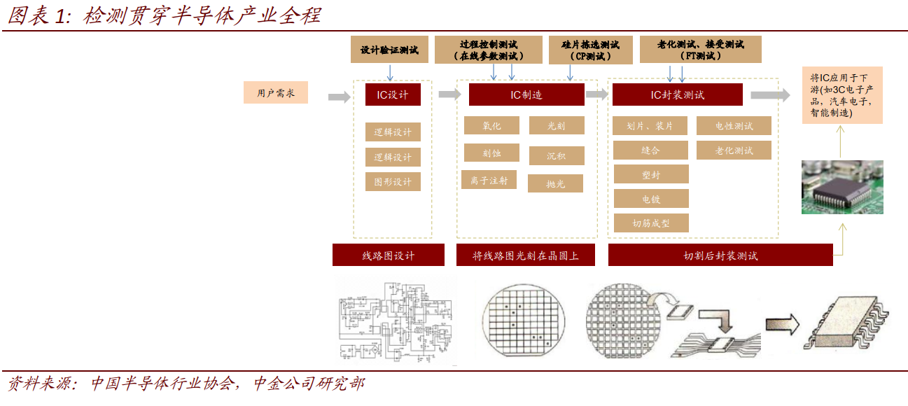
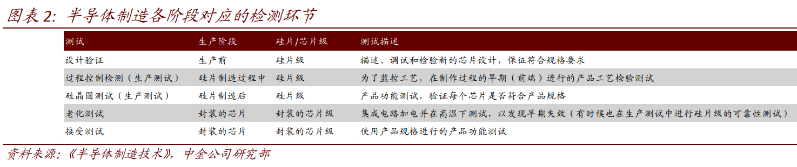
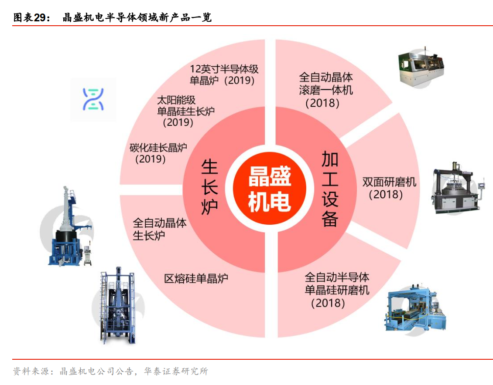

# 半导体设备(20200131)

### 总结

半导体设备作为一个依赖晶圆厂资本支出而更新的产业，除了极少数ASML这样的独一无二，整个产业和晶圆厂资本支出依赖性较大，呈现一定的波动。

### 一、半导体

#### (一) 5G 产业浪潮驱动，全球半导体设备市场出现改善迹象 

全球半导体、半导体设备行业景气度与全球 GDP 增速相关性较高，但波动幅度更大。 半导体行业虽然有科技革命驱动，但也会受到全球经济的影响而出现周期性波动。通过数据，我们可以发现 2005~2018 的十几年里，半导体及设备市场规模波动性较大，且与全球经济的景气度密切相关。 

受益于 5G、物联网（IoT）、人工智能（AI） 等新一轮技术变革所带来的增量需求， 2019Q4~2020 年半导体下游需求具备复苏条件。 

虽然全球半导体及设备市场 2019 年处于增速换挡调整期， 2020 年以后 5G、物联网（IoT）、人工智能（AI）等领域的技术浪潮有望催生产业的新一轮成长。

集成电路旺盛的市场需求带动产业的不断升级和投资的加大，有力促进了集成电路装备制造行业的发展，因此**半导体设备市场与集成电路产业景气状况紧密相关。** 

5G 时代，全球存储芯片产能扩张对刻蚀设备、薄膜沉积设备的需求拉动较为突出。 5G 产业发展催生增量需求，叠加下游技术进步对半导体工艺及设备提出更高要求，刻蚀、光刻、薄膜沉积等关键工艺设备的增量需求空间或将较为广阔。 其中存储芯片扩产对设备的拉动效果显著， 例如在 3D NAND 存储芯片领域， 随着堆叠层数不断增多，刻蚀、薄膜沉积工艺难度和次数不断增加，刻蚀设备、薄膜沉积设备需求更为受益， 薄膜沉积设备需求增长幅度可能最大。 

#### (二) 中国晶圆厂

中国大陆正处于晶圆制造产能扩张的历史性阶段，逆周期投资是中国半导体设备需求韧性和成长性较强的重要支撑。 中国大陆作为全球最大半导体消费市场， 消费重心一定程度上也牵引产能重心转向中国，同时叠加国家战略支持， 全球产能不断向中国转移，中资、外资半导体企业纷纷在中国投资建厂， 2019~2021 年中国本土企业有望成为晶圆厂建设的主力， 大陆半导体设备需求增长具备坚实基础。 

### 二、检测设备

#### (一)检测贯穿半导体产业链全程 

检测贯穿集成电路产业全过程。 集成电路产业主要由设计、制造、封装和测试四大主体构成，而测试则是唯一贯穿集成电路产业全过程的环节。 根据产业链的流程，可以把测试分为四种类型，分别是验证测试、生产测试、老化测试和接受测试， 分别在集成电路的设计、生产和封装环节进行。 

验证测试（设计环节）： 在一个新的设计进入量产阶段前进行，目的是验证这个设计是否正确，是否满足了规范中所有的要求。验证测试的项目比较全面，包括功能测试、交流测试和直流测试等。通过验证测试，可以诊断和修改设计错误，测量出芯片的各种电气参数，并开发出将在生产中使用的测试流程。
生产测试： 当产品通过了验证测试，进入量产阶段后，就要进行生产测试，通过生产测试的芯片必须满足设计的规范要求。降低成本和提高效率是这一阶段的首要问题，测试时间和准确率直接影响到晶圆厂的生产成本，因此测试设备的运行速度和稳定性至关重要。 这一阶段主要包括过程控制检测（也叫在线参数检测）和硅晶圆检测（ CircuitProbe，也称为 CP 测试），均是在硅片级产品上进行测试。
老化测试： 老化测试是为了保证被测器件的可靠性。即使产品通过了生产测试，但投入使用后很可能马上失效，因此需要进行老化测试，即进行持续的或周期性的测试，使得有问题的器件在测试时间内就失效。老化测试往往通过调高供电电压、延长测试时间、提高运行环境温度等方式，将不合格的产品筛选出来。
接受测试： 系统制造商在进行系统集成之前，需要对产品进行接受测试，避免在系统组装的时候使用有缺陷的器件，否则后期诊断费用将远高于测试费用。 

检测通常被分为前道过程控制检测以及后道检测。 

1）前道检测： 前道检测为前文提到的生产测试中的过程控制检测，其几乎 运用于晶圆加工的每一个环节，通过测量每一步工序后的加工参数是否达到设计要求，以及查看晶圆表面是否存在缺陷来确保产品的生产良率。前道检测的原理包括光学测量、原子束测量和电学测量。 

2）后道检测： 后道检测是对封装前后的晶圆和芯片进行电学测量，以检查产品是否达到性能要求，对应前文提到的硅晶圆测试、老化测试和接受测试。后道检测包括封装前的硅晶圆测试（ CP 测试）和封装后的芯片测试（终测，也称为 FT 测试），测试的原理主要是电学检测。 

**前端过程控制检测的主体主要为晶圆制造企业，后端检测的主体主要包括晶圆制造企业、封装测试企业和测试代工厂等。** 

### 三、 主要设备公司

#### (一) 中微公司： CCP 刻蚀机优势持续强化， ICP 刻蚀机实现量产突破 

中微公司专注于集成电路、 LED 关键制造设备，核心产品包括：

1）用于 IC 集成电路领域的等离子体刻蚀设备（CCP、 ICP）、深硅刻蚀设备（TSV）； 

2）用于 LED 芯片领域的MOCVD 设备。  

其中，TSV： 公司还顺应集成电路先进封装和 MEMS 传感器产业发展的需要，成功开发了电感性深硅刻蚀设备。 

目前公司等离子体刻蚀设备已被广泛应用于国际一线客户从 65 纳米到 14 纳米、 7 纳米和 5 纳米的集成电路加工制造及先进封装， 截至 2018年末中微公司累计已有 1,100 多个反应台服务于国内外 40 余条先进芯片生产线。 

#### (二) 刻蚀设备市场份额

#### (三) 北方华创：半导体设备布局渐趋完备，打造“平台型”产品体系 

北方华创是国内目前产品品类覆盖最广的半导体设备“平台型”企业。 北方华创拥有半导体装备、真空装备、新能源锂电装备及精密元器件四个事业群，为半导体、新能源、新材料等领域提供全方位解决方案。公司现拥有四大产业制造基地，营销服务体系覆盖欧、美、亚等主要国家或地区。北方华创建立了丰富而有竞争力的产品体系，半导体装备包括刻蚀机、 PVD、 CVD、氧化/扩散炉、清洗机及气体质量流量控制器等品类。 据公司 2018 年报，半导体设备在集成电路领域形成了 28 纳米设备供货能力， 14 纳米工艺设备处于客户工艺验证阶段 

#### (四) 长川科技：探针台、数字测试机新品蓄力，有望实现测试设备全品类布局 

长川科技目前主导产品为测试机、分选机和探针台等，在国内市场中产品链较为完整，产品可以覆盖晶圆制造和封测两大工序环节。同时受益于国内芯片设计产业的国产化需求上升，公司后续有望取得技术水平的提升，并有望进一步扩大产品覆盖范围。 

长川科技的产品链完整度处于行业内领先地位。 在成功研制数字测试机和探针台后， 公司产品覆盖了测试机、探针台和分选机三大块主要测试设备，产品链完整度处于行业内领先地位。据各公司官网，国内本土测试设备龙头华峰测控的产品线仅覆盖测试机，全球测试设备龙头爱德万和泰瑞达的主流产品为测试机，爱德万还拥有部分分选机；科休的产品线涵盖分选机和部分测试机，东京电子致力于探针台产品。 

长川科技于 2019 年 8 月 1 日完成了长新投资 90%股权过户，获得实际标的资产STI 100%的控制权。
STI 是研发和生产为芯片以及晶圆提供光学检测、分选、编带等功能的集成电路封装检测设备商。  

#### (五) 晶盛机电：半导体单晶炉批量化销售，向硅片后道加工设备不断延展 

晶盛机电是国内领先的晶体生长、加工装备研发制造和蓝宝石材料生产的高新技术企业。公司主营产品为全自动单晶炉、多晶铸锭炉等， 应用于太阳能光伏、集成电路、 LED 等新兴产业。公司较早掌握了国内领先的半导体硅材料生长的装备技术，在半导体领域实现了8~12 英寸大硅片制造用晶体生长及加工的核心装备国产化。 公司产品覆盖晶体生长、 切磨抛和监测等各个环节， 已逐步从单一的设备制造商转型成了立足于“新材料、新装备”的国际领先的设备供应商和高端晶体材料生产商。 

目前公司已形成以单晶炉、区熔炉为核心，后道智能加工设备为重要配套的半导体硅片设备产品体系，成为实现 8、 12 英寸硅片制造设备国产化的领军企业 

#### (六) 精测电子：通过自建团队和对外合作，布局前道和后道半导体检测 

精测电子是面板检测龙头企业，其通过自建团队和对外合作的方式，进军半导体检测设备。公司在前道和后道检测方面均有布局：

 1） 牵手 IT&T 布局后道检测设备。 2018 年 1 月，公司发布公告，拟与 IT&T 及两位自然人张庆勋和周璇在武汉共同投资设立中外合资公司武汉精鸿，进行半导体测试设备的研发、生产、销售及技术服务。 IT&T 为韩国企业，成立于 2006年，主要业务为半导体自动测试设备（ ATE），应用于存储器及 SoC 领域。依托于 IT&T 的技术和自主研发，公司有望在后道测试机领域取得突破。 

2） 成立上海半导体子公司进军前道过程控制测试领域。 公司在上海成立了子公司，将通过对外寻求合作加上自建团队的方式研发前道过程控制测试设备。考虑到精测本身具备卓越的光机电一体化技术，我们预测未来两年其在半导体检测方面将有所突破。 

#### (七) 至纯科技

公司对标国际一流企业，为下游行业提供高纯工艺系统整体解决方案，横向布局具有国产替代力的湿法清洗设备。公司未来增长主要来自于半导体湿法清洗设备放量及延伸的晶圆回收业务，以及并购的波汇科技在光传感领域的增长 

波汇科技的光感器系统可以有效的对高纯工艺系统及工艺制程设备中的温度、压力、溶液浓度、液体泄漏、气体浓度实施精准地监控，光传感技术协同效应提高产品竞争力，有望实现智慧工厂转型升级。 

#### (八) 华峰测控

在半导体测试设备的细分领域，公司产品主要用于模拟及混合信号类集成电路的测试 

北京华峰测控的主要产品为半导体自动化测试系统、 测试系统配件，用于测试半导体的电压、电流、时间、温度、电阻、电容、频率、脉宽、占空比等参数，判断芯片在不同工作条件下功能和性能的有效性。
公司产品广泛应用于半导体产业链从设计到封测的主要环节，包括集成电路设计中的设计验证、晶圆制造中的晶圆检测和封装完成后的成品测试 

#### (九) 芯源微

芯源微主要从事半导体专用设备的研发、生产和销售。 产品包括光刻工序涂胶显影设备和单片式湿法设备。 公司涂胶/显影机成功打破国外厂商垄断， 在 LED 芯片制造及集成电路制造后道先进封装等环节，已成功实现进口替代。 同时，公司成功突破了晶圆加工环节的涂胶显影设备技术，成型产品目前正在长江存储、上海华力等前道芯片制造厂商进行工艺验证。 

**作为与光刻机配合进行作业的关键处理设备，公司生产的涂胶/显影机成功打破国外厂商垄断并填补国内空白， 在中国市场市占率达 25.71%。** 

#### (十) 万业企业(凯世通)

公司第一大股东上海浦东科技投资有限公司具备丰富的集成电路产业链资源整合经验，曾投资过先进半导体、澜起科技、中微、盛美等优质半导体企业。 2019年一季度末，国家集成电路产业投资基金持有万业企业7%的股权，成为公司第三大股东。雄厚的股东背景助力公司扎实推动 “外延并购+产业整合”的转型模式，为国内集成电路产业增砖添瓦。 

离子注入机市场前景广阔，凯世通在本土市场初显锋芒。离子注入机在光伏和IC制造产业链中都属于核心设备，目前IC离子注入设备全球市场规模约16亿美元且随着芯片制程升级市场不断扩容。凯世通目前拥有iPV-3000、 iPV-2000和IonSolar三大核心设备，公司主要销售的光伏离子注入机已获得下游客户认可，并将集成电路离子注入机作为研发和市场推广的主力，切入半导体装备国产化无人区，未来有望迅速进击国内市场。 

