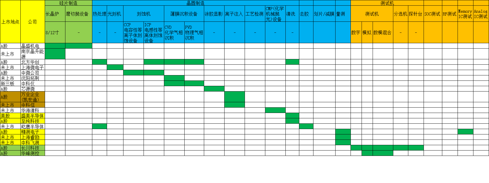
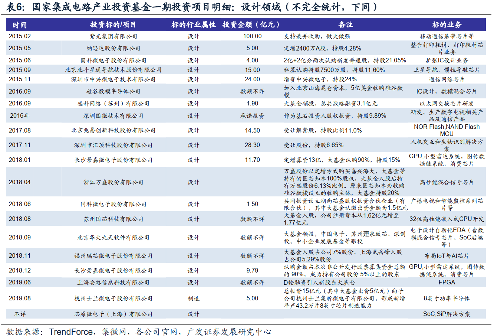
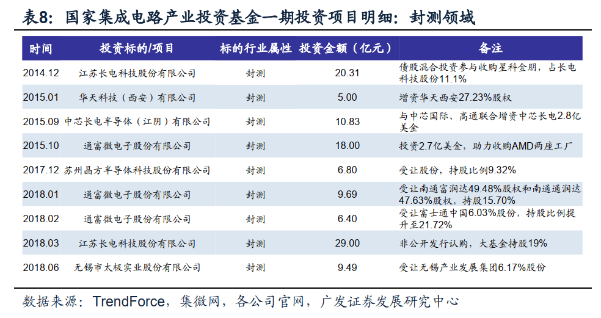
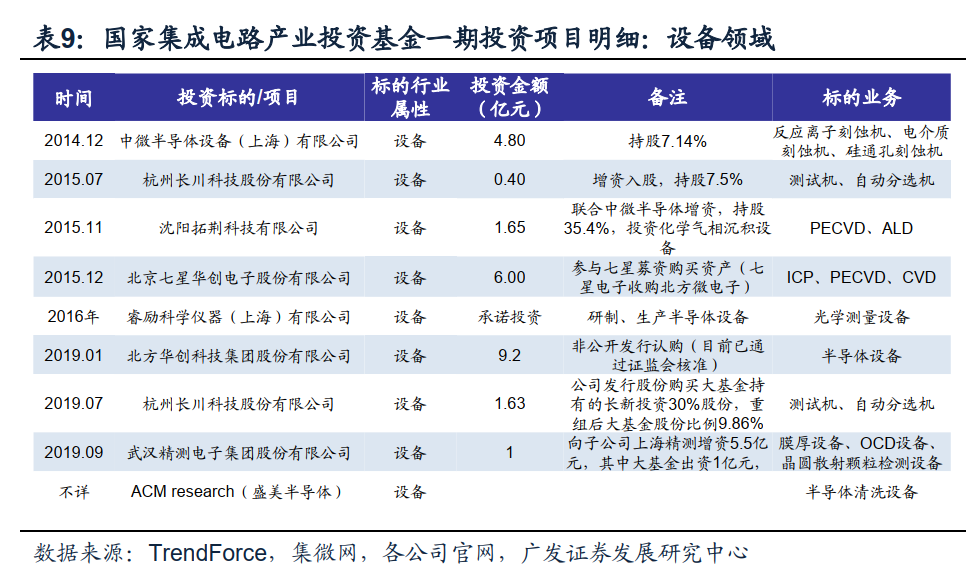
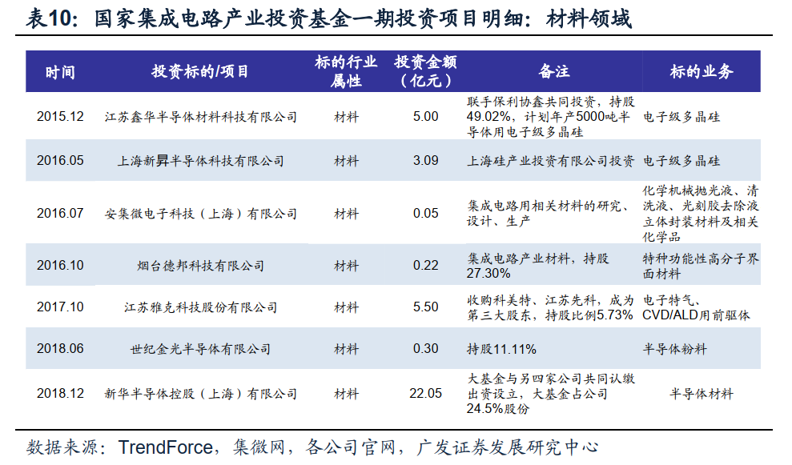
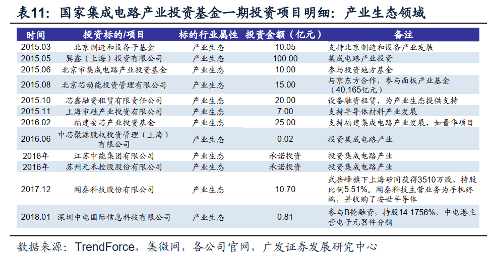
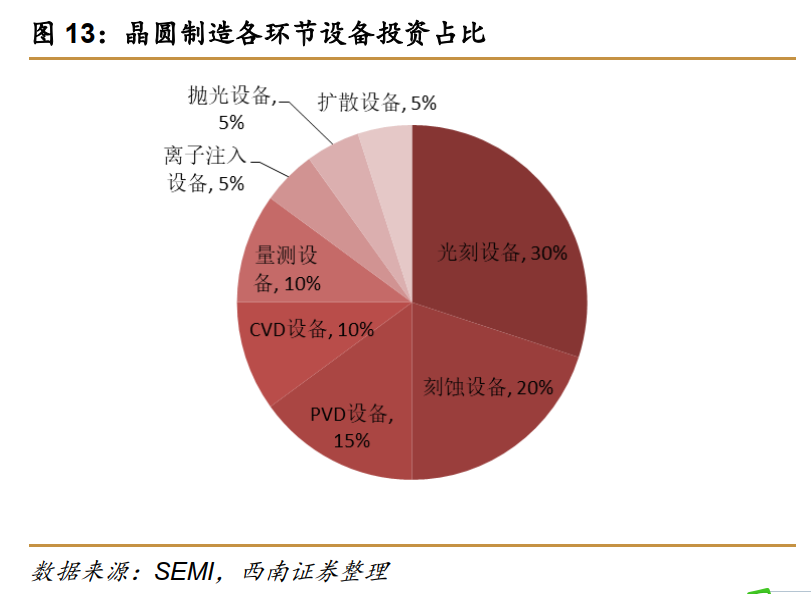
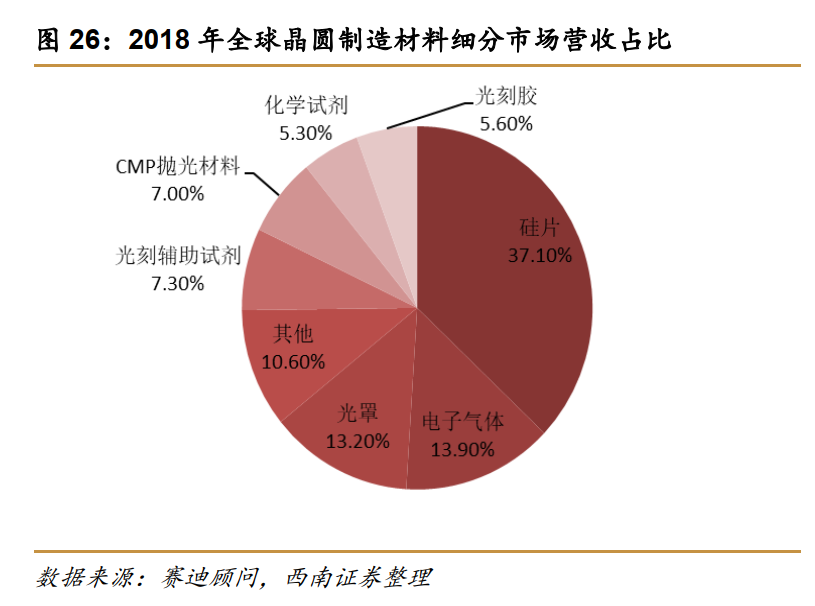
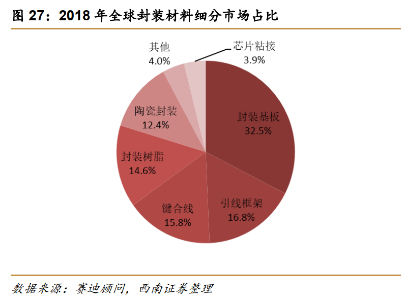

## 大基金二期(20200128)

### 总结

脑回路比较慢，对科技股的认知，包括大基金一期，非常慢，也是最近趁着过年，看了几十份资料，才大概了解整个半导体的概况。

这里梳理的主要是半导体设备和半导体材料的整个行业概况，后面的分布是我大概梳理后整理出来的两个大基金重点投资方向的概览，对于半导体设计，制造，封测，目前在这里没有体现。但并不是前面的环节不会再投入了，而是不断投入的，特别是制造。

半导体材料上，从一期的雅克科技，安集科技，我们发现材料端，大基金偏好技术领先，国内空白，进入国际主流厂商供应体系等特点，按此思路，大家可以找找资料继续研究。

半导体设备上，目前石锤的除了一期的，二期的最近有精测电子，兴森科技，上海睿励等，设备端的标的不算多，反而容易跟踪。

### 一、集成电路产业-国产化  

#### (一) 集成电路产业发展推进纲要确定发展目标 

​	2014 年 6 月经过国务院审议通过， 《国家集成电路产业发展推进纲要》正式公布，纲要指出了集成电路作为国家产业信息技术产业的核心，是支撑社会经济发展以及保障国家核心信息安全的战略性、基础型以及先导性的产业，当前及以后的一段时间内，我国将迎来集成电路产业发展的重要战略机遇期和攻坚期，产业发展纲要推出的目的就是为了加快推进我国集成电路产业发展。 

​	纲要制定了分为三步的发展目标，首先是在 2015 年，实现集成电路产业发展机制创新取得一定成效，并配套建立和产业发展规律一致的融资平台好政策环境，实现集成电路产业销售额超过 3500 亿元。
​	到 2020 年，实现国内集成电路产业与国际领先公司的差距逐步缩小，实现集成电路行业年均复合增速超过 20%。
​	到 2030 年，实现国内集成电路产业达到国际领先水平，有部分企业可以进入到国际供应链第一梯队，实现我国集成电路产业的跨越式发展。 	

#### (二) 对细分产业提出不同的发展任务

​	为了实现计划目标，制定了主要的发展目标，主要针对集成电路设计、制造业、封装测试业以及关键材料和装备都提出来不同的要求和发展重点。 

#### 

### 二、大基金一期

​	国家集成电路产业投资基金成立于 2014 年 9 月 26 日，注册资本为 987.2亿元。 

​	国家集成电路产业投资基金一期已经投资完毕，总投资共计 1387 亿元，投资范围涵盖集成电路产业链上游至下游各个环节，其中更侧重于制造业的投资，构建我国集成电路产业的发展基础，按投资金额来计算， 制造业投资占比67%，设计业投资占比 17%，封测业占比 10%。 

#### (一) 设计

#### (二) 制造

#### (三) 封测

#### (四) 设备

#### (五) 材料

#### (六) 产业生态

### 三、大基金二期

​	国家集成电路产业投资基金二期于 2019 年 10 月 22 日成立，注册资本为2041.5 亿元，是一期注册资本的两倍。 

#### (一) 二期投资方向

​	近期，在半导体集成电路零部件峰会上，国家大基金表示将从三个方面来支持国产设备和材料的发展。
​	首先将继续支持细分领域龙头企业发展，对具备**刻蚀机、 薄膜设备、测试设备以及清洗设备**生产技术的企业持续加大投入，帮助龙头企业做大做强，形成系列化、成套化的设备，打造大陆本土的应用材料、东京电力。对照《集成电路发展纲要》要求，继续填补国内技术空白，加快对**光刻机以及化学研磨设备等国内还欠缺的设备**的产业投资布局，保障国内具备完整供应链设备生产能力。
​	其次将通过设立发展产业园区的方式，吸引海内外半导体产业公司集中设立研发中心，打通产业链上游至下游的技术和人才合作，形成产业合力，继续推动国内外企业的合并和资源整合，打造航母型企业。
​	最后利用好大基金在产业链内的纽带作用，推动国内集成电路设备、制造以及封测公司的协同，增加国内企业间合作，真正实现上下游结合，打造虚拟IDM 模式，另外积极推进国产半导体设备的验证工作，加速半导体产线的国产化替代，同时为国内设备企业提供更多的市场机会，督促国内制造型企业加大国产设备的采购规模 

​	由此我们可以发现，大基金二期将更加侧重于产业链上游设备支持，继续设备制造补短板工作，重点投入光刻机、化学研磨设备等的研发工作；另外，在一期投资的基础上将加大对 IC 设计的支持，预计将重点扶持内存、 SiC 和GaN 等化合物半导体、物联网、 5G 及自动驾驶等应用领域。 

#### (二) 半导体设备

#### (三) 半导体材料

