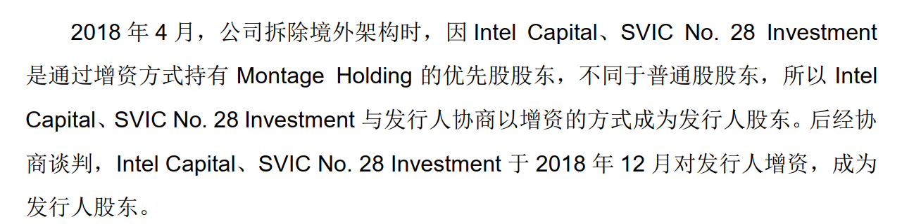
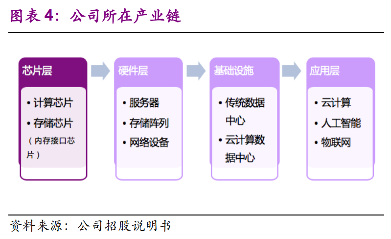
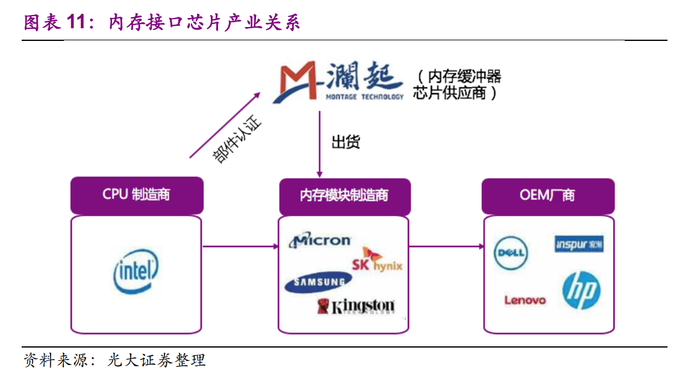
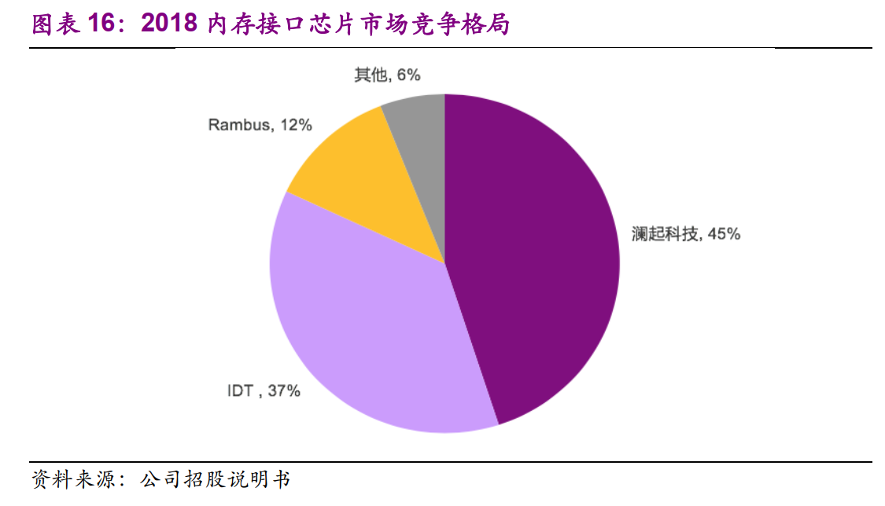

# 谈谈一只被忽略的云计算标的(20200212)

最近火爆的热点，毫无疑问，就是云计算了，大家也快看到了，特别是陶门流派。

之前我也跟风，发了一篇，从光模块-到

光模块，交换机，VPN，服务器，CDN，IDC，IAAS，CDN，IDC，IAAS，系统集成，云办公，传统软件SAAS等等，谈了一些

但是在更早期的半导体设计文章中，其实有只标的被忽略了，就是半导体设计中，澜起科技。

这和其他科创板中大部分半调子的不一样，这是一家世界级的公司。

看看财务吧，目前澜起净利润2018年是7.37亿，2019年前三季度已经7.44亿了，2019年大概在10亿，2020年根据券商预测大概在13亿吧

2020年2月12日市值在1311亿，2020年动态PE大概在100倍，高是高了点，但对比中微这样上千倍的，优刻得这样几百倍的，还是便宜太多了，当然，中微也是比优刻得高一等级的，至少也是国际级的。

好吧，对这样的国际级澜起，同时是DDR全球龙头，不要几百倍，200倍的梦想还是可以有的，哈哈，这样吹票会被人骂死的。

倒不是说吹票，而是提醒大家可以关注他，风险偏好啊，交易节奏啊，每个人都是不一样的，但是关注总可以吧。

### 一、澜起就什么

澜起科技创建于 2004 年 5 月，致力于为云计算和人工智能领域提供以芯片为基础的解决方案。公司曾在 2013 年于美国纳斯达克上市，之后于 2014 年完成私有化； 2019 年 7 月在科创板上市。经过多年的研发与积累，公司的产品性能在行业内赢得高度认可，是中国唯一打入国际主流内存、服务器和云计算领域的芯片供应商。公司产品的服务器被广泛应用于数据中心、人工智能等不同领域， 满足了新一代服务器对高性能、高可靠性和高安全性的需求。 

公司目前主要产品为内存接口芯片、津逮®服务器 CPU 及混合安全内存模组。  

主要收入目前都是内存接口芯片，我们主要分析这一点。

#### 三星，英特尔都是股东

#### 

### 二、开收费站的

内存接口芯片为内存条核心逻辑器件。 内存接口芯片是服务器内存模组必不可少的器件， 作为服务器 CPU 存取内存数据的必经通路，其主要作用是提升内存数据访问的速度及稳定性，满足服务器 CPU 对内存模组日益增长的高性能及大容量需求。 

内存接口芯片，并不能直接用，是内存条模组（就是我们经常说的内存条）的必备组件，在内存接口芯片领域的竞争中处于领先地位，主要客户是**富昌电子、海力士、海太半导体、金士顿、淇诺科技、三星电子、中电器材等**

### 三、全球龙头

公司 DDR4 内存接口芯片打入全球主流内存市场，市场份额 45%。

双寡头格局， 澜起科技、 IDT 统领市场。 打进内存接口芯片市场困难重重， 不仅需要研发其核心技术，还要通过 CPU 制造商认证。因此，现阶段从事研发并量产服务器内存接口芯片的仅有 3 家公司， 分别为澜起科技、IDT 和 Rambus。 2018 年度，澜起科技和 IDT 在内存接口芯片市场占有率较为接近， Rambus 占比则相对较小。 公司、 IDT、 Rambus 市场占有率分别为 45%、 37%、 12%。 

### 四、DDR5 技术升级推动价格上涨 

DDR5 技术预计将提高内存接口芯片单价。 2018 年底， 全球各大主要内存芯片厂商已经公布了各自的 DDR5 研发进度。 DDR5 内存接口芯片相比于前一代 DDR4 内存接口芯片可以支持更高的速率以及更低的电压，并有望在未来代替 DDR4 内存技术。 内存接口芯片已有技术的生命周期里，销售单价逐步降低；但随着技术的更新， 新产品因技术先进而售价将有所提高。 DDR4 向 DDR5技术的全面更新有望在未来进一步提高内存接口芯片的销售价格。 

