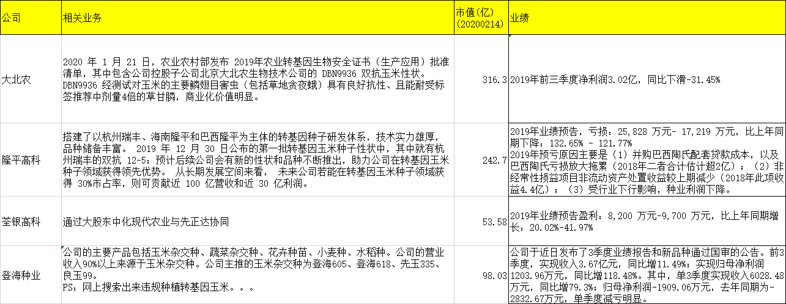
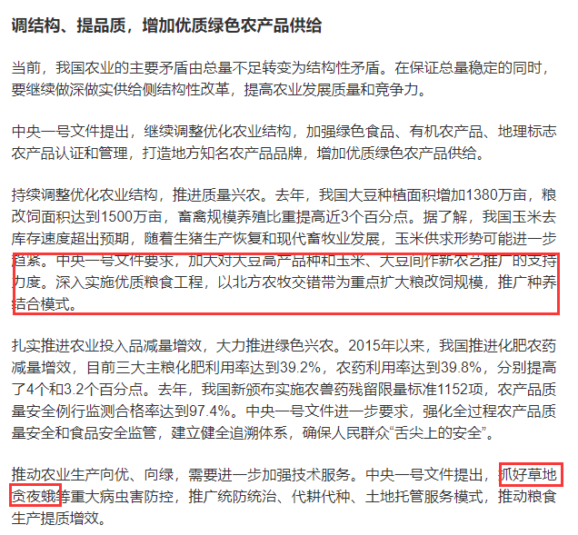
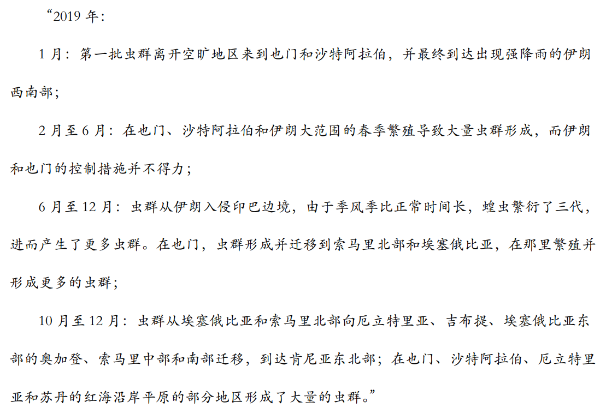
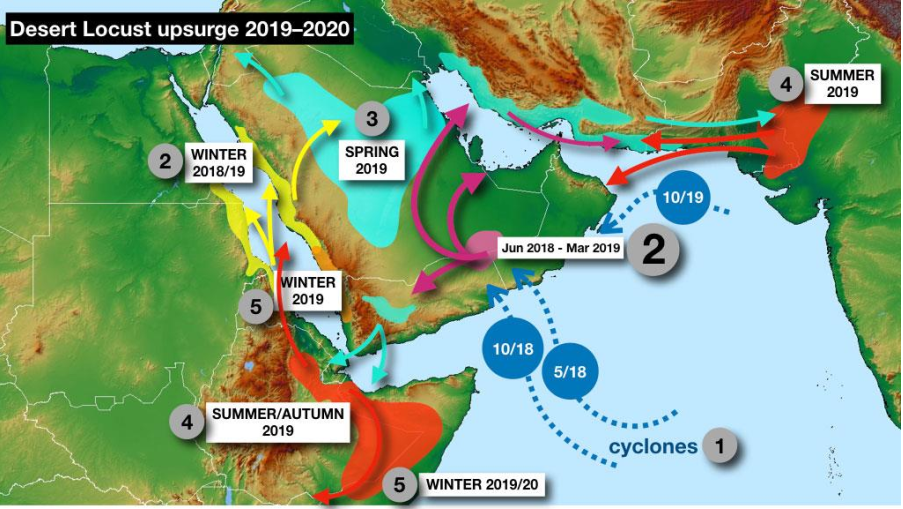
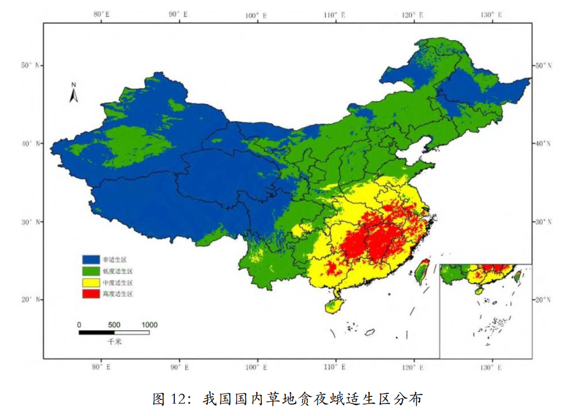

# 幺蛾子来了-草地贪夜蛾(20200216)

### 总结

#### 1. 消除偏见，涨涨见识

大概在前一阵子，有听到蝗虫，草地贪夜蛾的消息，也炒过一波，但是按照以前的认知，这个是看都不看的，自己经历的投tou资ji时间也不长，对周期股或者说认知外的行业，确实一脸懵B，去年见识了猪周期后（我没有买），刷新了自己不少的世界观和偏见，当然，于是，最近本着，不投也可以看看嘛，涨涨见识又没什么坏处，就开始搜索资料看看这个草地贪夜蛾。

#### 2. 小结

本来也是模模糊糊，大概看过之后，目前这个幺蛾子暂时还好，还看不到和zhu-wen一样的趋势，暂时只是作为知识储备。

转基因作物相关公司：

大北农，隆平高科、登海种业、荃银高科。

农药相关公司：

根据公司 2018 年年报，扬农化工涉足氟氯氰菊酯原药生产；海利尔、长青股份涉足啶虫脒原药生产。此外，安道麦 A 在互动平台中表示，公司拥有数款产品可用于应对草地贪夜蛾，如瑞梦得、垄创等。诺普信在互动平台中表示，相关产品“稼酷”等可以满足防治草地贪夜蛾的需要。海利尔在 5 月 15 日召开的业绩说明会上表示，公司制定了多个针对草地贪夜蛾的产品解决方案。**考虑到上述公司农药品种较多，草地贪夜蛾防控特定品种对上述公司营收占比较小。**

相关公司：长青股份，海利尔，安道麦A，诺普信，扬农化工，中农立华，雅本化学，利尔化学，中旗股份等

### 一、背景

#### 1. 一号文件

#### 2. 沙漠蝗虫

直接引用联合国粮农组织蝗灾发展过程的报告 

关于影响

[蝗灾对我国农化行业影响？是否会进一步侵袭我国？蝗虫如何用药？](https://new.qq.com/omn/20200214/20200214A0NA1400.html)

https://new.qq.com/omn/20200214/20200214A0NA1400.html

[农业农村部：沙漠蝗对我国危害几率很小](https://www.chinacourt.org/article/detail/2020/02/id/4800875.shtml)

https://www.chinacourt.org/article/detail/2020/02/id/4800875.shtml

大概看了一下，总体上，根据某些人士看法，目前非蝗影响有限：

这位负责人说，春季发生区的蝗群迁飞方向为印度—尼泊尔—缅甸—我国西藏南部和云南西部。考虑到我国边境地区昆仑山脉和喜马拉雅山脉阻隔，蝗虫很难越过高海拔的寒冷地区。由于西藏南部和云南西部边境与尼泊尔和缅甸沙漠蝗发生区毗邻，不排除有少量蝗虫随季风迁入我国的可能，但造成危害的几率很小。

#### 3. 草地贪夜蛾

[危害以玉米为主，今年四川草地贪夜蛾预计发生面积超去年7倍](https://new.qq.com/omn/20200206/20200206A0P4I600.html?pc)

https://new.qq.com/omn/20200206/20200206A0P4I600.html?pc

来自一德期货的总结：

可以发现草地贪夜蛾发生最严重的地区仍在长江以南，玉米主产区大范围发生虫害的可能性不大，害虫时刻处在有关部门密切监控之中，并且可以有效防控。但今年害虫影响范围和幅度大于去年应该是趋势。如果我们按照南部地区整体影响 5%，中部整体影响 1%，黄淮区域没有影响来估算，全国玉米产量损失只有 0.36%；如果影响继续恶化，三个区域分别达到 10%， 5%和 1%，那么影响玉米产量也只有 1.75%。因此，在不大范围失控的情况下，草地贪夜蛾对国内玉米产量的影响同样有限。 

### 二、草地贪夜蛾影响比较大

#### 1. 什么是草地贪夜蛾

草地贪夜蛾（Fall Armyworm，简称 FAW, 拉丁文名： Spodoptera frugiperda），又称秋黏虫，是起源于美洲热带和亚热带地区的一种昆虫。在缺少自然控制条件或防控管理不善的情况下，可能对作物造成严重损害。草地贪夜蛾偏爱玉米，但也啃食另外 80 多种作物品种，包括稻米、高粱、小米、甘蔗、蔬菜和棉花。草地贪夜蛾于2016 年初首次在非洲中部和西部地区被发现，随后迅速蔓延至撒哈拉以南几乎所有地区， 2 年时间内遍及非洲 44 个国家和地区，造成数十亿美元损失，严重区域出现毁种绝收现象。 2018 年传入亚洲，在全球有 100 多个国家发生虫害，是联合国粮农组织全球预警的重大农业害虫。
2019 年 1 月，我国云南首次发现草地贪夜蛾入侵， 5 月开始快速传播蔓延， 9 月，农业农村部发布的数据显示，全国有 25 个省份发现草地贪夜蛾，见虫面积 1500 多万亩，实际危害面积 246 万亩。 2019 年，草地贪夜蛾在我国主要危害的作物为玉米，此外在其他 17 种作物和 5 种杂草上也发现了草地贪夜蛾危害的迹象。 

#### 2. 2019 年仅是试探性进攻， 2020 年或将全面爆发 

草地贪夜蛾自 2019 年 1 月在我国云南省发现之后，迅速在省内蔓延，并于 4 月相继侵入广西、广东、贵州、湖南、海南等地， 5 月份扩散至福建、湖北、浙江、四川、江西、重庆、河南等地， 截至 2019 年 10 月 8 日，草地贪夜蛾侵入我国西南、华南、江南、长江中下游、黄淮、西北、华北地区的 26 省 1518 个县， 其传播速度之快、波及范围之广十分罕见： 

2019 年 1 月 13 日，确认侵入我国云南省普洱市江城县；
2019 年 1 月 28 日，云南省 3 个市（州） 11 个县（市）发生；
2019 年 2 月 26 日，云南省 6 个市（州） 18 个县（市）发生；
2019 年 3 月 23 日，云南省 7 个市（州） 18 个县（市）发生；
2019 年 4 月 16 日，已在云南省 8 个市（州） 48 个县（市）、广西 8个市 18 个县发生；
2019 年 4 月 26 日，全国云南省、广西、贵州省、广东省以及湖南省等 5 个省（区）发生，发生面积 13 万亩；
2019 年 4 月 29 日，贵州省共有黔西南州、黔南州发生，设计望谟县、兴仁县、安龙县、兴义市、义龙新区、罗甸县、荔波县等 7 个县（市、区）发生，发生面积 2000 余亩，主要危害幼嫩玉米，一般虫量 8-50 头/百株，被害株率 8-30%； 

2019 年 5 月 14 日，发生区域涉及云南省、广西、贵州省、广东省、湖南省、海南省、福建省、浙江省、湖北省、四川省、江西省、重庆市、河南省等 13 个省的 260 个县区；
2019 年 7 月 25 日，草地贪夜蛾已在我国 21 个省（区、市） 1246 个县（区、市）发生；
2019 年 8 月 17 日，草地贪夜蛾北扩至河北省，在我国 24 个省份的1366 个县（市、区）发生； 

2019 年 10 月 8 日，草地贪夜蛾侵入我国西南、华南、江南、长江中下游、黄淮、西北、华北地区的 26 省 1518 个县。 

#### 3. 政府及时反应部署，目前尚未造成较大影响 

草地贪夜蛾作为一个农业害虫，对粮食威胁大，受到党中央、国务院的高度重视。农业农村部已制定下发《草地贪夜蛾防控方案》，启动应急防治用药机制，公布了 25 种防治用药名录，并会同财政部紧急下拨了 5亿元防控资金，指导支持各地有力有效开展防控工作。此外，农业农村部分别于 5 月 24 号和 6 月 13 号召开全国草地贪夜蛾防控工作视频会议、防控推进落实视频会，明确提出了“重点发生区防控处置率达到 90%，危害损失率控制在 5%以内，确保草地贪夜蛾不大规模迁飞、不大面积连片成灾”的防控目标。 

[农业农村部关于做好草地贪夜蛾应急防治用药有关工作的通知](http://www.gov.cn/xinwen/2019-06/10/content_5398774.htm)

http://www.gov.cn/xinwen/2019-06/10/content_5398774.htm

#### 4. 防控难度较大， 2020 年或将全面爆发 

草地贪夜蛾作为外来入侵物种，防控难度较大，主要体现在： 1）目前基层真正从事植保的农技人员数量相对欠缺，在虫灾面前更显不足，没法做到全覆盖性监控； 2）农民普遍缺乏风险意识，也缺乏合理的防控手段与渠道； 3）繁殖速度快（草地贪夜蛾繁殖能力是一般害虫的 2-5 倍）、迁飞能力强为防控工作带来较大困难； 4）草地贪夜蛾有明显的抗药性，而我国目前还没有防治该害虫的登记农药。以上种种原因导致草地贪夜蛾的防控难度较大 

#### 5. 传统防治措施并不能有效控制住草地贪夜蛾的影响 

当前阶段，我国传统的害虫防治措施主要包括三种：农业防治、化学防治以及生物防治。但是，参考美国的草地贪夜蛾防控经验，以上传统的生物安全防治措施并不能有效控制住草地贪夜蛾对玉米、小麦等农作物的破坏作用。 

#### 6. 转基因抗虫作物是控制草地贪夜蛾种群发展的有效手段 

随着科学技术的发展，转基因抗虫玉米的研发和商业化种植为控制草地贪夜蛾开辟了新途径，并逐步成为每周大陆热带和亚热带地区防控草地贪 夜 蛾 应 用 最 广 泛 的 技 术 手 段 。 目 前 ， 表 达 Cry1F 、 Cry1Ab 或Cry1A.105+Cry2Ab2 蛋白的 Bt 玉米已在美国、加拿大和南美部分国家商业化种植；在每周或非洲批准种植的转基因抗虫玉米有“ MON810” 、“ Bt11” 、“ MON89034” 、“ MON89034×TC1507” 、“ MIR162” 、“Bt11×MIR162” 和“MON810×TC1507×MIR162” 等，表达的蛋白类型有Cry1Ab、 Cry1F、 Cry2Ab2、 Cry1A.105 和 Vip3Aa20。

参考美国、加拿大和南美部分国家的经验，商业化种植转基因玉米是防控草地贪夜蛾的主要手段之一。 我们认为，从长期来看，培育转 Vip3基因的玉米是我国防治草地贪夜蛾的根本办法，我国或全面放开转基因玉米种植 

**现在国内只有大北农公司已经培育出有自主知识产权的 Vip 基因的玉米，可以立即在生产中直接种植使用。其它种子公司也在准备这方面的研发，但要走向成熟可能还需要几年时间**。同时， 2017 年，中国化工集团公司花了 430 亿美元，已经把先正达公司收购，所以先正达研发的 MIR162玉米以及相关的基因修饰技术的知识产权已经属于中国，在中国种植转vip3 基因的玉米没有任何知识产权问题。 

