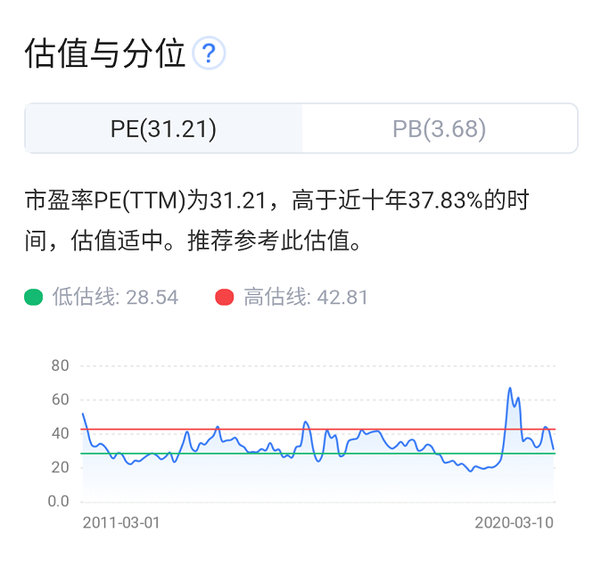
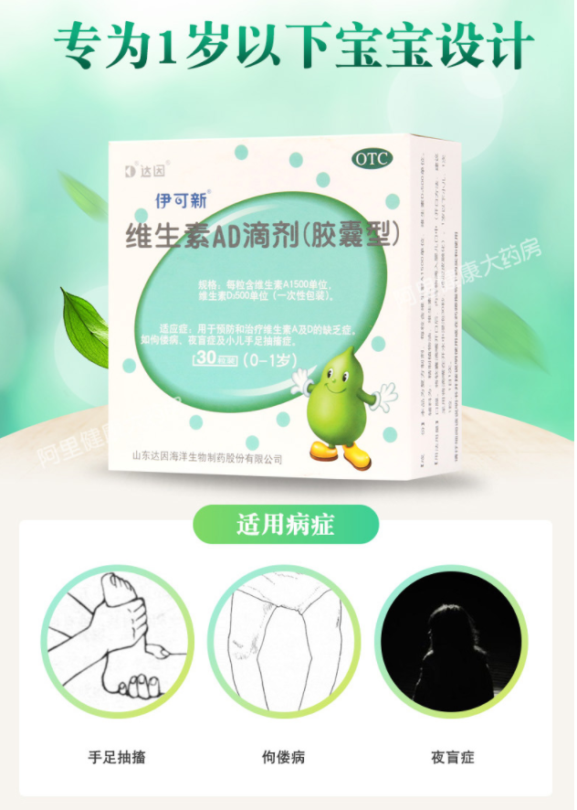

# 山大华特(20200310)

### 总结

山大华特，重新会关注一下，主要是看到了一些新的变化。

经营层面的，产能扩张完成，供给端不成问题，需求端目前市占率第一，有提价的空间。

股东层面，山东国投入主，有望完成对核心子公司达因药业的激励。

公司公布2019年报：实现营业收入18亿元，同比+17.93%；归母净利润2.04亿元，同比+57.38%；扣非归母净利润1.92亿元，同比+28.53%；净经营性现金流2.44亿元，同比-54.78%

2020年3月10日，山大华特市值63.39亿，2019年静态PE为33

2020年券商预测的净利润大概为3个亿，2020年动态PE为21，但作为OTC估值上一直不高。

**总结起来，就是2020年业绩有相对的确定性，估值不高，最重要的是大股东的变化，带来了新的预期，主要业务相对简单，儿童用药，属于欧奈尔中的N中的出现了变化，股价强度上，相对中等，还达不到强势，作为一只小而美的标的可以看看。**

### 一、基本概况

​	山大华特原是山东大学旗下校办企业，经过多年发展， 形成了以医药、 环保为主导，电子信息、新材料、教育、物业等多产业并举的发展格局。

​	其中医药板块的子公司山东达因海洋生物制药股份公司是公司最主要的收入和利润来源， 2018 年占公司全部营业收入的 59%，占公司毛利润的84%。截至 2019 年年底公司持有达因药业 52.14%。达因药业产品主要涉及儿童药、儿童保健品领域。 

​	达因药业的儿童药品主要包括维生素 AD 滴剂（伊可新）、复方碳酸钙泡腾颗粒（盖笛欣）、右旋糖酐铁颗粒、甘草锌颗粒（伊甘欣）、 阿奇霉素颗粒、利福昔明干混悬剂、二巯丁二酸胶囊等。其中“伊可新”为中国著名儿
童药品牌，多年来位居儿童维生素 AD 补充剂市场占有率第一。  

#### 1. 供给端-增量

​	2015-2017 年达因药业伊可新生产线连续多年满负荷生产，设备压力增大，与此同时 2018 年公司为提升产品外观形象，更换“伊可新”生产模具，设备调试检修以及车间 GMP 验收等工作使得 2018 年下半年开始伊可新停
产断货，收入利润受到较大影响， 2019Q2 供货才开始逐步恢复正常。

​	公司为解决产能瓶颈， 2018 年 2 月开始，在现有 4 条伊可新软胶囊生产线基础上，新建 2 条合计年产 40 亿粒软胶囊生产线， 2018H2 开始设备安装， 预计 2020 可投产。随着伊可新老生产线 20 亿粒产能升级改造完成+新生产线 40 亿粒（一期 20 亿粒，二期 20 亿粒） 产能投产， 2020 年业绩有望再上一个台阶。 

总结：产能上2020年投产后，规模是原来的3倍

#### 2. 伊可新市场空间

​	伊可新是儿童维生素 A、维生素 D 复合制剂。维生素 A 主要促进视觉发育，维生素 D 主要促进体内钙转化。 

​	根据《中国国家处方集（儿童版）》： 

​	0~1 岁儿童每天需要额外补充：维生素 A1500IU，维生素 D500IU；
​	1~3 岁儿童每天需要额外补充：维生素 A2000IU，维生素 D700IU。
​	伊可新维生素 AD 3:1 配比， 0-1 岁每粒含维生素 A 1500IU、维生素D3 500IU， 1 岁以上每粒含维生素 A 2000IU、维生素 D3 700IU，符合《中国国家处方集（儿童版）》推荐标准。  

​	由于新手家长首次接触儿童膳食补充剂一般在三甲医院或社区医院，经过医生首诊推荐，大部分家长会持续在 OTC 渠道形成回购粘性。因此医生的学术推广（医生选择） 、家长心中的品牌地位（家长选择） ，成为产品能
否“长青”的致胜因素。 

​	医生选择： 

​	2012-2018 年国内样本医院维生素 AD 复方制剂市场规模由 2919万元增长至 3810 万元， 每年稳定增长 4~5%。 2019Q1~3 达因药业市占率达到 56%。但如果只考虑滴剂市场（婴幼儿一般只选用滴剂） ，达因药业在滴剂市场的市占率达到 66.5%。 医院端高占比证明伊可新有很强的医生基础。 

​	家长选择： 

​	当前国内市场上主流的婴幼儿维生素 AD 或维生素 D 滴剂主要有以下四种产品：伊可新、优卡丹、星鲨、以及进口品牌 Ddrops。 其中优卡丹中成分为 D2与其他品牌 D3不同，价格便宜，不符合消费升级趋势。 Ddrops虽为进口品牌，但据家长反映一整瓶包装打开后易挥发，不如独立包装科学，家长粘性不高。 伊可新和星鲨是家长更倾向于购买的品牌，而伊可新优势在于 A+D 复方制剂， 成分与含量更适合中国儿童。 

​	结论： 0~3 岁伊可新终端市场容量可达到 58 亿元。 由于伊可新首诊在医院，后续主要销售渠道在零售终端，而零售终端供货价格高于医院端价格，我们估计加权平均出厂价约为 0.88 元/粒（见表 13），因此伊可新出厂口径市场容量约为 40 亿元。
​	根据伊可新 2017 年的“历史峰值”销售额 10 亿估算， 目前仅覆盖了全国约300 万名新生儿。 未来每个儿童用药时长、渗透率均有提升空间。 我们认为伊可新远没有到达天花板， 当前市场渗透率仅 25%（10 亿/40 亿）， 仍有巨大增长潜力。 

#### 3. 提价

​	自 2016 年以来，伊可新已经提价多次，提价时点分别于 2016 年 6 月提价 1次， 2017 上、 下半年各提价 1 次， 2019 年年初提价 1 次。 而实际上，即使当前，日用金额也仅 2 块钱左右，新生儿家长对产品价格并不敏感，我们判断未来还有持续提价空间。 

#### 4. 新管理层

​	核心子公司达因药业其核心高管、 总经理杨杰女士不持有上市公司股权， 对达因药业持股仅 1.63%。 公司治理机制的不顺畅无形中增加大量交易成本， 也是市场的长期担忧，压制了公司估值水平。 

​	2019 年 7 月 17 日，公司公告， 实际控制人山东大学拟将其全资公司山东山大产业集团有限公司及所属企业的股权转让给山东省国有资产投资控股有限公司， 2020 年 1 月 13 日，上市公司实际控制人正式变更为山东国投。我们认为， 上市公司大股东易主对公司发展是一个转折点，有望为达因药业注入新的活力。 

​	山东国投是山东省唯一一家省级国有资本运营公司，旗下有浪潮信息、浪潮软件、浪潮国际、中鲁 B 等，并以第二大股东身份参股新华制药、新华医疗、积成电子、 中通客车等多家上市企业。 其中， 浪潮信息分别于2015、 2018 年两次实施股权激励； 新华制药于 2016 年实施员工持股计划， 2018 年实施股权激励；
新华医疗于 2015 年尝试员工持股计划，后因经营状况变化取消。

​	历史表现证明山东国投对于子公司股权激励秉持开放态度， 由此推断达因药业实施激励可能性大大增加，治理结构有望得以理顺，达因药业获得发展新动能。 另外，公司易主后脱离校办企业的对外投资限制，有利于达因药业外延发展，未来预计上市公司战略将更加聚焦医药主业，估值有提升空间。 

