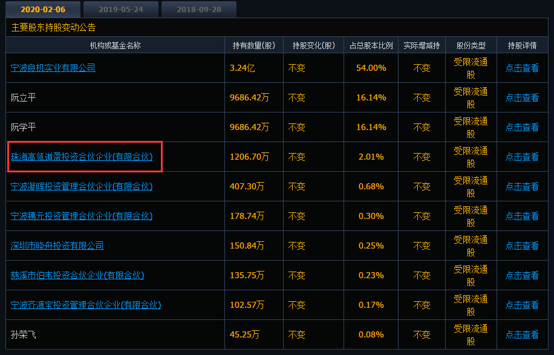
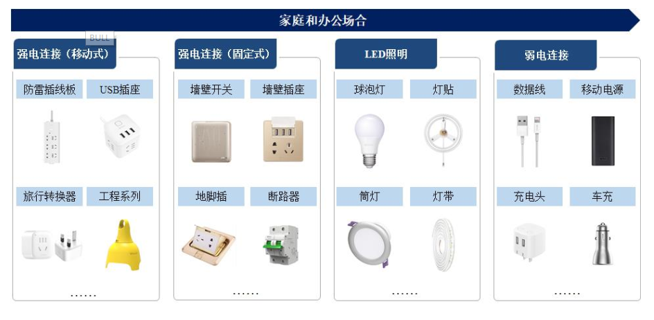
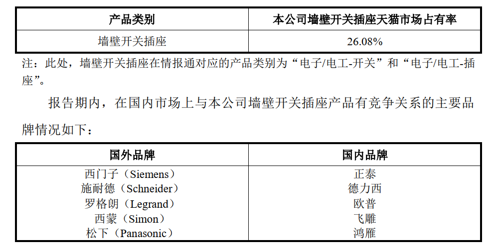
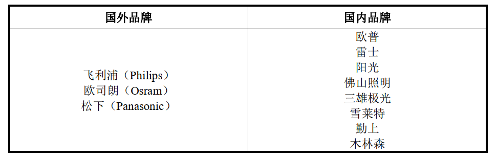
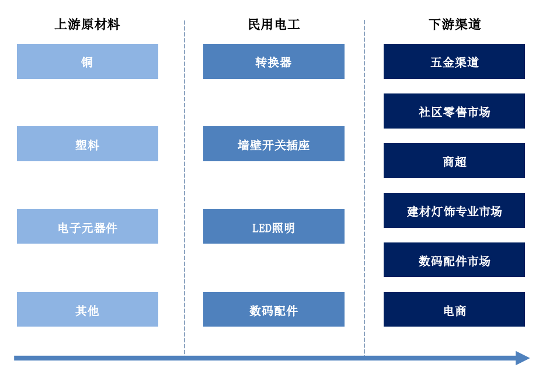
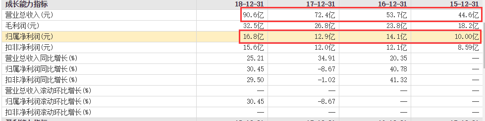
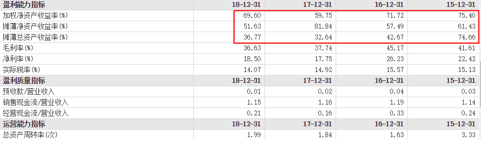

## 公牛集团(20200210)

### 总结

公牛插座，这是我们大部分人对公牛的第一印象。

插座这一产品，基本上只要有用电，多少都会购买，形态上类似于消费品。

公牛线下，有近百万的网点，这是非常可怕的渠道，终端掌控力，借着渠道，公牛的产品的品类扩张之路走得还算顺当，从插座，到墙壁开关插座，LED，数码配件等。线上也是强势占领头部位置。

由此我们可以看到，公牛的产品力和渠道力非常强悍，借着高毛利率，摊薄ROE近50%，非常恐怖，这是什么概念呢，扔一块钱进去，能得到5毛的回报，两年可以回本，这比贵州茅台还牛。

作为一只长牛相的插座一哥，早早要躺在我们的自选中，总有一天，我们会和它擦出火花的。

此外，在十大股东，我们也看到了高瓴资本

**高瓴资本在2017年12月4日通过大股东转让出资8亿元人民币 以 PE 27.86倍 购买了 1206万股 公牛插座公司的股权（2017年底 公牛插座 估值 400亿人民币 ），占总股本2.011%（按IPO后）**

### 一、主营业务

专注于以转换器、墙壁开关插座为核心的民用电工产品的研发、生产和销售，主要包括转换器、墙壁开关插座、 LED 照明、数码配件等电源连接和用电延伸性产品，广泛应用于家庭、办公等用电场合。  

自 1995 年创立以来， 公牛始终坚持以消费者需求为导向，以产品品质为根本，从**“插座”（即转换器）**这一细分领域开始，不断推动功能、技术与设计的创新，开发出了大批受消费者喜爱的新产品，并在多年的发展过程中逐步拓
展、形成了“安全插座”、“装饰开关”、“爱眼 LED 灯”、“数码精品”等品类定位鲜明、可持续发展的业务组合，“公牛”已成为一个家喻户晓的公众品牌。 

未来，公司将在“成为国际民用电工行业领导者”愿景的牵引下，秉承忠信诚和、专业专注的价值理念，不断深耕民用电工领域，顺应消费者需求和技术发展的潮流，大力拓展智能家居和物联网业务，为消费者提供更加智能、便利、安全舒适的用电环境。 

### 二、行业概况

#### (一) 行业发展概况和市场供求状况 

转换器和墙壁开关插座属于电器附件行业， LED 照明属于照明行业，数码配件属于消费电子行业。 

#### (二) 市场需求状况和行业驱动因素 

转换器、墙壁开关插座、 LED 照明和数码配件等四大类产品均属民用消费品，其市场需求与家电、消费电子、房地产、装修市场等行业的发展高度相关，其中墙壁开关插座、 LED 照明产品与房地产、装修市场的相关度更为紧密。这些下游产业成为驱动以上四大类产品发展的直接动力和影响市场供求状况的主要因素。而居民收入和消费水平的增长又是这些下游产业发展的基础，亦间接成为影响四大类产品市场供求关系的因素。 

经过多年发展，大家电产品已成为我国城乡居民生活必需品，空调、电视、冰箱、洗衣机等产品的城乡居民家庭保有量持续增长，有效驱动了转换器、墙壁开关插座等基础配套的电源连接产品需求的持续增长。 

同时，随着我国人民富裕程度和生活水平的不断提高，各类小家电产品得以逐步普及。小家电产品品类不断丰富和拓展，全面涵盖厨房、生活、个人护理等各方面，行业市场规模不断扩张。小家电品种多、数量大的特点大幅提升
了家庭对转换器、墙壁开关插座等电源连接产品的需求。 

智能手机的高普及率和高使用粘性带来了“随时随地”的充电需求，从而带动了 USB 插座等电源连接产品和数据线、充电器、车充、移动电源等数码配件行业的全面升级和市场扩容。除智能手机外， iPad、智能手环、 VR 眼镜等新兴消费电子产品仍在不断涌现和发展，也将带来持续增长的电源连接需求。 

### 三、竞争格局

#### (一) 转换器 

根据情报通所提供数据， 2018 年本公司转换器产品天猫市场占有率情况如下： 

#### (二) 墙壁开关插座  

根据中国质量认证中心的查询结果，截至 2018 年 7 月末，墙壁开关插座行业约有 1,400 余家制造商的产品通过 3C 认证。根据情报通所提供数据， 2018年本公司墙壁开关插座产品天猫市场占有率情况如下： 

#### (三) LED 照明行业 

根据 Wind 和国家半导体照明工程研发及产业联盟发布的数据， 2017 年中国 LED 应用市场规模达 5,343.00 亿元，其中通用照明规模占比为 47.70%，约为 2,548.61 亿元。 2009 年至 2017 年间， LED 通用照明市场规模年均复合增长率高达 54.62%。 

公司于 2014 年进入 LED 照明领域，报告期内该项业务从导入期进入高速增长阶段。在国内市场上与本公司 LED 照明产品有竞争关系的主要品牌基本情况如下： 

#### (四) 数码配件行业  

本公司于 2016 年推出数码配件产品，目前该业务仍处于前期培育阶段。报告期内，在国内市场上与本公司产品有竞争关系的主要品牌包括小米、华为、品胜等国内品牌。 

#### (五) 行业上下游

转换器、墙壁开关插座、 LED 照明与数码配件的主要原材料均由铜、塑料、电子元器件等构成。

转换器产品主要在五金渠道、社区零售市场、商超和电商渠道销售，

墙壁开关插座产品主要在建材灯饰专业市场和电商渠道销售，
LED 照明主要在五金渠道、社区零售市场、商超、建材灯饰专业市场和电商渠道销售，

而数码配件产品则在数码配件市场和电商渠道销售。 

#### (六) 公牛竞争优势

“公牛”自创立以来，始终坚持以消费者需求为导向，以产品品质为根本，通过在产品研发、品质管控、渠道开拓、营销推广与供应链建设等方面持续的、全方位的创新与变革，逐步形成了较强的综合性竞争优势。 

###### 1. 建立了以消费者需求为导向的产品研发创新优势，产品不断推陈出新 

借助对消费者需求的深刻洞察与前瞻性研究，公司创新应用各种新技术、新材料与新工艺，并通过持续不断的微创新叠加，推出了一大批设计、 外观、技术、 性能等方面充满特点的产品。 

###### 2.始终坚持以质取胜的质量理念,形成了有效,系统的质量管理和控制体系 

在创立初期，从一开始即定位于制造高品质插座，坚持高标准、严要求，以此在市场上逐步建立起了公牛良好质量的品牌形象和口碑。随着业务的发展，公司对质量的要求也不断升级，制造“安全”的插座成为新的产品定位和质量追求，以质取胜的质量理念在公司内部深入人心。 

###### 3. 依托覆盖全国城乡、近 100 万家网点的线下实体营销网络和专业的线上电商营销网络，在民用电工领域形成了线下、线上协同发展的强大营销体系 

截至 2019 年 2 月底，公司已在全国范围内建立了近 73 万个五金渠道网点、近 10 万个专业建材及灯饰渠道网点及 12 万多个数码配件渠道网点。兼具广度与深度的营销网络及其背后的配送访销能力，既是公司产品进一步扩大销售的基础，又是 LED 照明等新品类进入传统优势渠道迅速形成销售和品牌知名度的保障，也是拓展数码配件等新渠道的能力支点。 

###### 4.形成了以售点广告为核心的立体化品牌传播模式，使“公牛” 品牌家喻户晓 

二十多年来，公牛坚持以售点为核心的品牌传播模式，持续不断地大力支持经销商在终端售点投放“公牛”店头招牌、店内店外陈列展示和宣传物品等广告资源，成功的把“公牛”品牌传播到大小城市及各级乡镇，形成了简单却
又行之有效、独具特色的品牌传播推广模式。 

###### 5.形成了具备先进制造技术能力和自动化生产能力的供应链系统，使公司在品质、效率、成本方面始终保持竞争力 

公司将制造技术能力作为供应链核心竞争力的重要载体。公司设有专门的模具工厂，采用高精度公差等级、先进的自动浇注技术、 3D 打印技术等模具技术，为公司产品配套设计、开发、制造各类高精度模具，同时采用机械手、免后加工模具技术等，实现注塑生产自动化、模塑一体化，大幅提升了产品品质、生产效率以及产品创新能力。 

### 四、财务分析

#### (一) 稳健的净利润

#### (二) 炸裂的ROE

