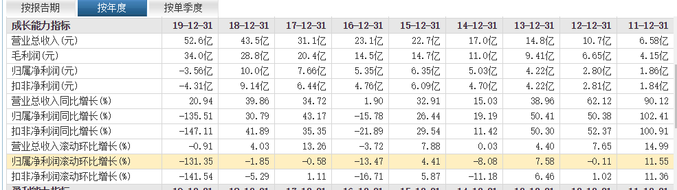
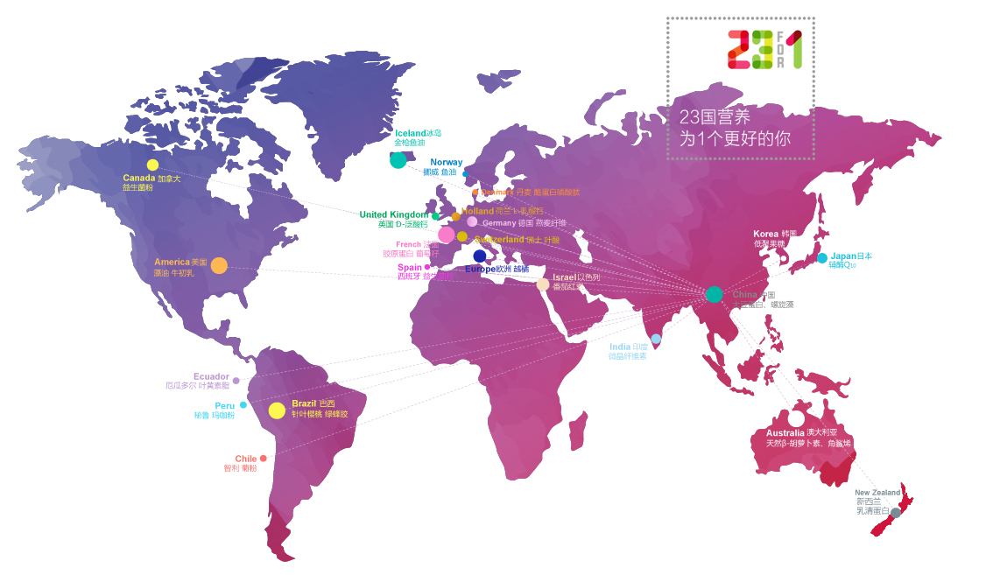

## 汤臣倍健(20200810)

### 总结

汤臣倍健，在经历去年震荡后，今年LSG减值压力已经小很多了，同时行业变革下，集中度有望继续进一步提升。不少人讲到海外，没有保健品的牛股，对标当然是最好的，没有，也不代表无。

撇开2019年，汤臣自己本身已经是一只牛股相，国民的人口基数，足以支撑公司成长到相当大的一个阶段，目前还没有看到天花板。

今年券商预计汤臣在13亿左右净利润，但上半年已经接近10亿情况下，我觉得汤臣今年大概率超过券商的预期，目前市值在400亿左右，整体合理偏下一点范围。

### 一、谈谈保健品行业背景

2019 年是保健品行业历史上政策压力最大的一年 

1.权健事件引发的保健市场“百日行动” 

2.新电商法对海外进口保健食品原有代购渠道的影响；

3.医保改革中，部分地方禁止用医保购买或“一刀切”下架医保药店里保健食品

4.电商禁止个人代购导致 LSG 收入大幅下滑，计提减值 14 亿 

因此，汤臣在2019年出现了上市后首个亏损财报

### 二、谈谈破产的GNC

GNC 是以线下专营店销售模式为主的国际保健品零售巨头，据哈药股份公告， GNC 在全球 50 余个国家和地区拥有 9000余家零售门店，提供 1500 余种健康类产品，以营养补充剂和保健品的研发、生产、销售为主营业务，并经销第三方同类产品，自主品牌产品销售约占营业收入的 50%左右。

在电商蓬勃兴起、保健品消费渠道日益多元的时代下， GNC 自建渠道的重资产模式显得日渐吃力，营业收入从 2015 年的 26.39 亿美元持续缩减至 2019 年的 20.68 亿美元，近 5 年归母净利润有3 年为负。

今年新冠疫情令公司经营雪上加霜,据公告，截至 5 月 6 日，约 40%（即 1300 家）位于美国和加拿大的所属 GNC 门店因政府的要求等原因而暂时关闭，且该等暂时关闭的门店中的一部分亦有可能在未来永久性关闭 

虎嗅网的文章

[保健品巨头GNC的“倒掉”](https://www.huxiu.com/article/366780.html)

https://www.huxiu.com/article/366780.html

当然，还包括其他一些文章，从中我们可以看到，GNC的破产，并不是说明保健品行业不行，而是企业经营路线上的僵化引起的。GNC曾经的“产品+渠道”零售连锁模式曾经巅峰过，最后也在YI情下成为最后的稻草。

### 三、汤臣的成长路径

#### 1. 成长路径

从这点上，我们来反思汤臣的成长路径，以下来自券商：

公司成长阶段的动能来自于：

1. 2002-2013 年：快速渗透药店，驱动收入高速增长 

2. 2014-2016 年：2 次调整，品牌力/大单品推动公司走出低谷 

3. 2014 年：保健品行业监管严政，公司经营受到波及 

2013、2014 年保健品行业遭遇一系列监管严政，包括“打四非”系列整改活动等。受此影响，2014 年行业进入信任危机，市场消费信心下降、整体增长明显放缓，增速下滑4Pcts。汤臣倍健亦受到波及，当年收入同增 15%，增速下滑 24Pcts。公司强大的品牌壁垒赋予其抵御行业波动风险的韧性，2015 年公司快速复苏，收入同增 33%。

4. 2016 年：药房乏力/电商兴起，健力多转直供，净利润上市后首次下滑 

5. 2017-2018 年：顺应行业趋势，多品牌+全渠道布局激发增长动能 

6. 2019 年多个不利因素致亏损 

2019 年保健品行业遭受多个不利因素，亦波及汤臣倍健线上线下销售。包括：百日行动影响保健品消费需求、医保个人账户禁买保健品影响公司在药房销售，以及电商禁止个人代购导致 LSG 收入大幅下滑，计提减值 14 亿。在以上不利环境的影响下，虽然对比其他企业和行业整体，公司收入表现依然稳健，但增速整体放缓明显，2019 年同增约 15%（剔除 LSG 并表），净利润则由于 LSG 减值出现上市以来第一次亏损。

公司2019年对LSG进行商誉计提减值准备10.09亿元，计提无形资产减值准备5.62亿元并转销递延所得税负债1.69亿元，同时对部分参股企业长期股权投资计提资产减值准备1.02亿元。计提减值后LSG余下商誉为11.57亿元，无形资产16.04亿元

#### 2. 2020 多品种出击+渠道裂变，全面激活 

##### 品类端：布局高速增长赛道，健力多&Life-Space 引领增长 

4+2+1 多品种全线出击。2020 年公司再次升级品类战略，提出重新激活 VDS 业务的4+2+1 多品种全线出击，寻求在多个细分市场的占位和突破，带动整体销售。

具体来看：
①四大单品：健力多+Life-Space 为核心大单品，健视佳+护肝产品为储备大单品；

②两大形象产品：蛋白粉+多种维生素矿物质片作为主品牌形象产品；

③一个明星产品：牛初乳加钙咀嚼片，打造针对儿童的爆品 

##### 渠道端：全面裂变，推动渠道精细化运作&下沉 

千家经销商裂变计划。2020 年公司全面启动渠道裂变，构建适合多个大单品运营的新销售模式，在 VDS 业务中建立汤臣倍健、“健力多”“Life-space”三个完全独立的经销商体系。经销商的新增以原有经销商裂变为主，以地级市为单位搭建经销商体系，未达到裂变标准的区域将招募新经销商。

裂变的意义：终端精细化运作、加速渠道下沉。纵观中国所有的消费品企业，在成长到一定阶段后，必然会升级其渠道管理模式，逐步向下渗透，向精细化、去层级化发展。其原因如下：

①品牌企业议价权增强，具备约束渠道的能力；

②经销商追求自身短期利益，或有追求高毛利&高周转产品，从而忽视对其他产品的投入等危害公司产品发展策略的行为；或有甩货、窜货等伤害公司价格体系行为，因此需要对其进行精细化管理；

③追求进一步的成长空间，在全国范围内铺广业务后，下沉亦是必然。 

#### 3. 小议

从汤臣的成长路径来看，我们发现汤臣的管理层，并不僵化于某种销售方式，各个红利期基本有踩到，特别是保健品不能请代言人，当年汤臣请的姚MING真是成为绝唱，这点上和GNC的模式是不一样的

### 四、财务

汤臣的净利润上市后一直稳定，直到2019年

今年在新GUAN YI 情下，汤臣的半年报可以说非常出色

公司公布2020年中报，2020H1公司实现营业收入31.25亿元，同比增长5.23%；实现归母净利润9.62亿元，同比增长10.96%。2020Q2实现营业收入4.27亿元，同比增长16.55%；实现归母净利润4.27亿元，同比增长15.66%。

这和GNC破产形成鲜明对比，得毅于公司多渠道布局，不局限于某一渠道。

此外，汤臣的毛利率，一直稳定在60%几，媲美白酒。现金流也非常好，真金白银。

###  

