# 南微医学(20191117)

### 总结

南微医学是目前已上市的科创板中比较优质的次新，机构扎堆的持仓也侧面证明了它的地位，作为一只现有业务稳定，新业务潜在空间巨大，又不断创新的医疗器械股，值得我们长期跟踪。

因为时间关系，断断续续，看了好久的南微的资料，券商研报大同小异，基本核心是内镜这块业务稳定增长，肿瘤消融和EOCT空间巨大，其他的一大堆医学名词，我看的时候是大概有百度了下，但看完感觉也不用太在意他们的具体意思，反正就是微创手术的辅助器械呗。

2018年净利润1.93亿，后面2019，2020，2021年的预测上，券商给的大概是3，4，5亿的级别跳，截止2019年11月15日收盘市值229亿，分别对应的是76PE，57PE，46PE，之前曾经一段时间横在120元，大概在160亿左右市值，偏见害死人，之前对科创板没有任何研究，倒是错过布局，现阶段只能等待机会。

投资逻辑主要如下

1. 疾病治疗从开放手术到微创手术是大势所趋，腔镜微创手术成为主流 

2. 内镜诊疗产品线齐全，公司国内市占率 15%，全球市占率不到 3%，国内外同时发力增长持续可期 
3. 公司肿瘤消融和 EOCT 业务前景广阔，有望未来成为公司的增长引擎 

### 一、微创医疗行业

#### (一) 手术诊疗从开放手术到微创手术是大势所趋 

目前，微创手术正成为主流，以腹腔镜手术为代表的微创外科具备开放手术不可比拟的优点：
 局部创伤小，腹腔镜微创外科手术切口小,损伤轻,全身炎症反应最轻,且避免了脏器在空气中的暴露；
 病人痛苦少，病人可以在术后短期内恢复正常活动,并发症少、出院早，一般病人术后 2 到 3 天就可以出院；
 腹部美容效果好，腹腔镜手术仅在腹部做穿刺样切口,无传统外科切开手术那样的癜痕；
 节省医疗开支，腹腔镜手术对社会、单位及病人的经济负担有所减轻。病人住院时间短,缩短了离岗休息的时间,能提前上班参加工作,其隐性效益明显 

达芬奇手术机器人所作的腔镜手术是微创手术比较典型的代表， 是目前全球最成功及应用最广泛的手术机器人，广泛适用于普外科、泌尿科、心血管外科、胸外科、妇科、五官科、小儿外科等。 通过达芬奇机器人做手术，手术的精确度大大增加后，手术的开口能够缩小，缝合更加容易，从而能够减少术后疼痛，缩短住院时间，减少失血量等让手术对身体损伤大大减小，进而使得患者的术后恢复更快。也是因为这些优点， 其手术量增长快速。 截至 2018 年 10 月，达芬奇手术机器人全球手术量超 500 万例，而 2008 年全球不到 10 万例。 在国内， 截至 2017 年底，中国大陆地区累计装机 69 台，国内全年完成手术 26765 例，平均每台达芬奇手术机器人每天做 1-2 例手术，一年完成手术 393.5 例， 而 2011 年达芬奇机器人的手术量才仅有 800 例。 

PCI，经皮冠状动脉介入治疗（ percutaneous coronary intervention， PCI），是指经心导管技术疏通狭窄甚至闭塞的冠状动脉管腔，从而改善心肌的血流灌注的治疗方法。 是比较典型的微创手术的一种， PCI 手术量， 从 2009 年的 22.8 万例，到 2018年的 91.5 万例， 复合增长率 16.7%。 

而南微医学产品应用场景为通过消化道等自然腔道开展的诊断和治疗， 属于微创手术，直接通过人体的自然腔道开展手术，不对人体造成伤害，恢复快。 NOTES手术，指使用腹腔镜或软质内镜等设备完成腹腔内手术操作，经自然腔道（ 阴道或直肠） 取标本的腹壁无辅助切口手术，术后腹壁仅存留几处戳卡疤痕， 通过使用常规微创手术器械，结合独特的消化道重建方式以及标本取出途径，既保证了的根治性切除，同时也能达到最佳的微创效果。

公司所处的领域为微创手术领域，处于一个快速增长的赛道。 

### 二、主营业务

#### (一) 概述

​	公司从事微创医疗器械研发、制造和销售。秉持着“以科技和创新服务临床”的宗旨， 致力于为全球医疗机构提供优质产品及服务，帮助世界各地提高医疗水平、减少病人痛苦，降低医疗成本。
​	经过近 20 年的创新发展，公司逐步由非血管支架单产品研发到形成三大技术平台，由国内市场为主到国内国际市场双轮驱动发展，已成为微创诊疗领域具有较高科研创新实力，具有核心产品竞争优势，业绩高速增长的行业龙头公司。 

​	公司主要产品包括内镜诊疗器械（止血及闭合类、活检类、扩张类、 ERCP 类、EMR/ESD 类和 EUS/EBUS 类等六大类）、肿瘤消融设备及耗材（微波消融治疗仪和微波消融针）、 EOCT（ 内窥式光学相干断层成像系统） 等产品系列，并广泛应用于消化道、呼吸道疾病的临床诊断及治疗和恶性肿瘤的微波消融治疗。 

​	内镜诊疗器械广泛应用于消化道和呼吸道疾病的临床诊断及治疗；

​	肿瘤消融设备及耗材产品包括微波消融治疗仪和微波消融针等，主要被应用于肿瘤的热微波消融治疗 .

##### (1) 内镜诊疗技术 

​	内镜诊疗技术是将内镜插入人体自然腔道，并通过内镜工作管道插入器械进行检查和治疗的一项全新的临床技术，是微创医学的一个重要分支。
​	根据内镜的功能，内镜可分为消化内镜和呼吸内镜。消化内镜主要包括胃镜、超声内镜、肠镜、十二指肠镜、小肠镜以及常用于小肠疾病诊断的胶囊内镜等。呼吸内镜主要包括支气管镜、超声支气管镜和硬质支气管镜。 

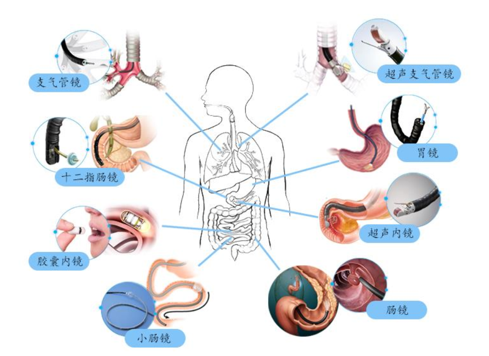

​	运用内镜诊疗技术，医生可在内镜影像（直视、超声影像、 EOCT 影像等）引导下进行组织活检、息肉切除、肿瘤剥离、狭窄扩张、止血、静脉曲张套扎、胆汁引流、胆道取石、胰腺假性囊肿引流、胃-空肠吻合、组织消融等检查和治疗 .

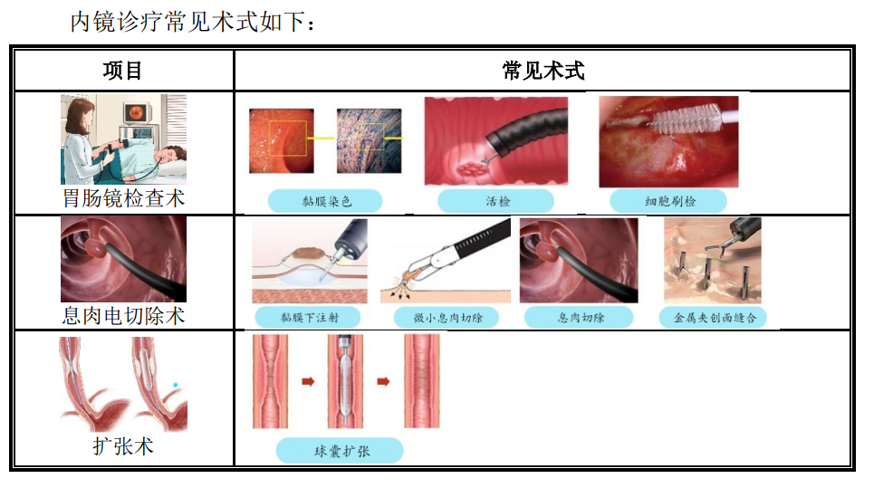

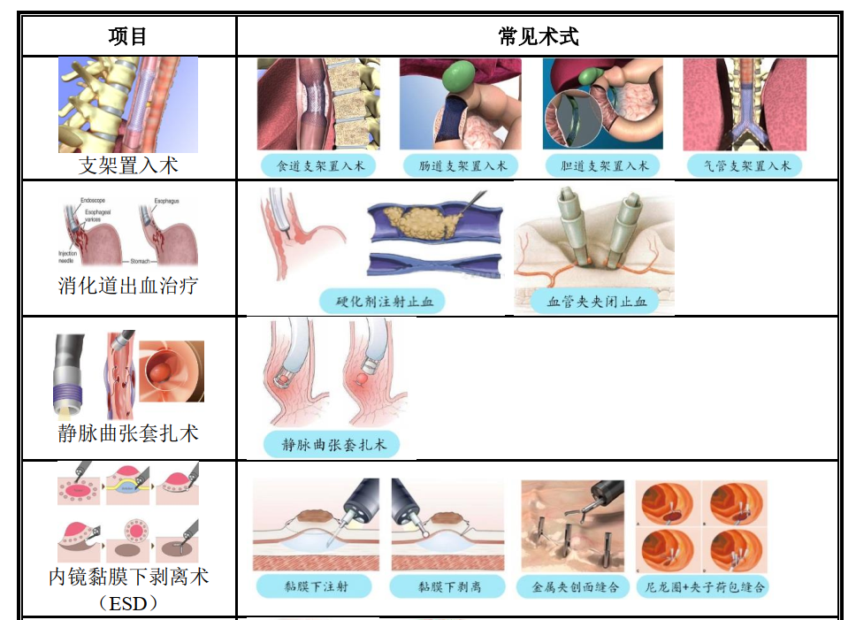

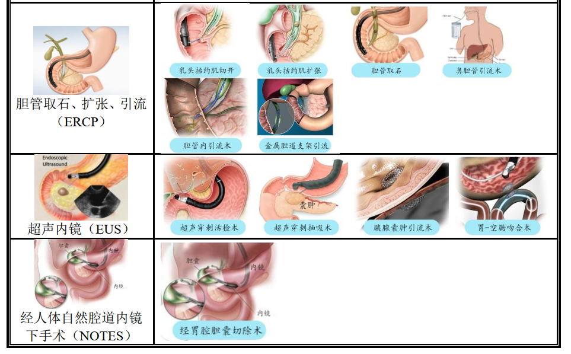

##### (2) 肿瘤消融技术 

​	肿瘤消融技术是在影像设备，如超声、 CT、 MRI 等影像引导下，对肿瘤直接应用化学药物或物理灭活，是一种精准、微创的诊疗技术。目前最常用的肿瘤消融方式为化学消融和物理消融。 

​	化学消融是在影像的引导下，向肿瘤内注射化学药物，从而灭活肿瘤病灶，而使肿瘤消融。物理消融主要包括微波消融、射频消融、冷冻消融等。 微波消融是一种热消融手段，通过加热使得肿瘤组织凝固坏死。 

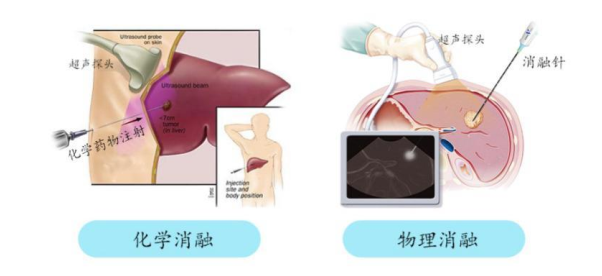

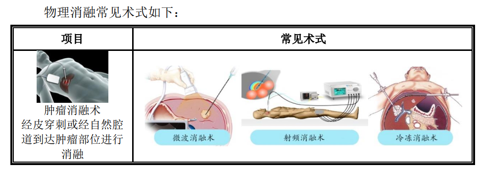

##### (3) EOCT 内窥式光学相干断层成像技术 

​	EOCT 内窥式光学相干断层成像系统由设备及探头两部分组成。医生将一根高速旋转的光纤及成像探头通过内窥镜工作管道插入人体腔道，对腔道横截面进行逐层扫描。其成像范围介于内镜和超声之间，成像深度达黏膜下 5 毫米，可观察到内镜直视观察不到的黏膜间病变；成像清晰度 100 微米，接近病理级，远远高于超声影像，可用作快速病理判断和早癌及癌前病变筛查，是一种全新的人体腔道“无创光学活检” 手段。 

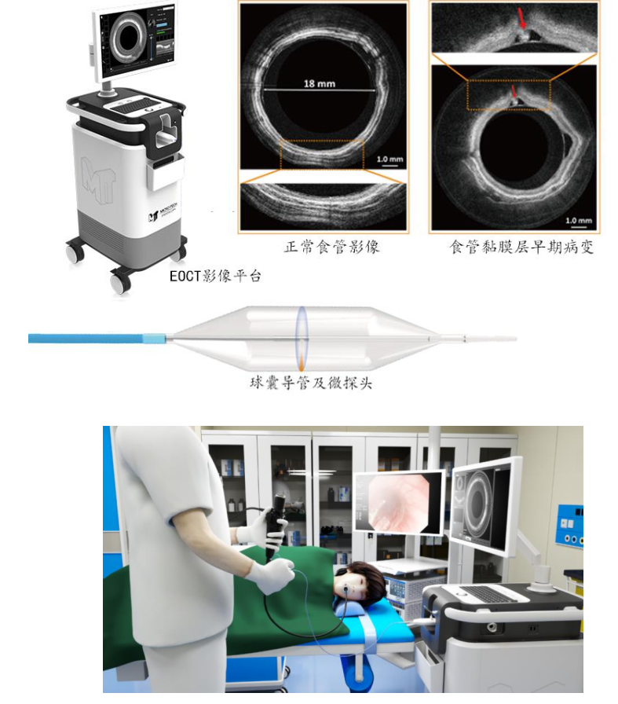

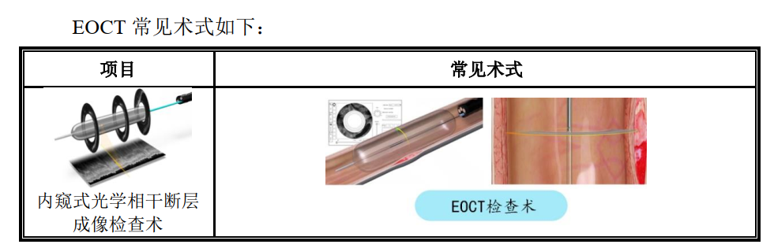

#### (二) 主营收入

公司收入主要来源于止血及闭合类、活检类、扩张类产品 

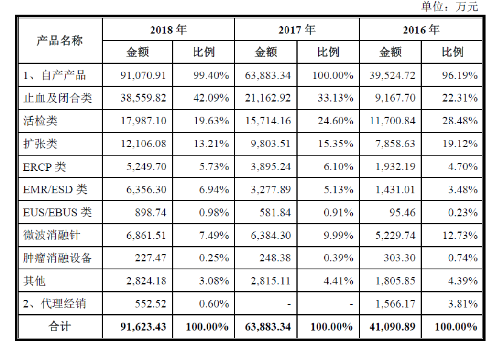	2018 年公司占比前六大产品止血及闭合类、活检类、扩张类、微波消融针、 EMR/ESD类和 ERCP 类分别收入 3.86、 1.80、 1.21、 0.69、 0.64、 0.52 亿元，分别增长 82.08%、14.65%、 23.47%、 7.81%、 93.94%和 33.33%，其中止血及闭合类和 EMR/ESD 类产品收入增长迅猛，止血及闭合类收入从 2013 年的 0.01 亿元增加到 2018 年的 3.86 亿元，年均复合增速达到 169.83%， EMR/ESD 类从 2014 年的 0.03 亿元增加到 2018 年的0.64 亿元，年均复合增速达到 84.42%。 

#### (三) 国内外双轮驱动增长 

​	2013~2018 年期间，南微医学在国内和国外的收入占比基本保持稳定， 2018 年国内收入占比 55.29%，国外收入占比 44.71%。国内与国外收入均快速增长，年均复合增速分别为 32.90%和 32.14%，而国外地区中，美洲地区增长迅猛，从 2014 年的 0.21亿元增加到 2018 年的 1.5 亿元，年均复合增长率达到 48.17%。 

#### (四) 增长体系

公司聚焦于微创诊疗技术的持续创新，已形成“1+3+N”的医疗器械持续创新模式。 

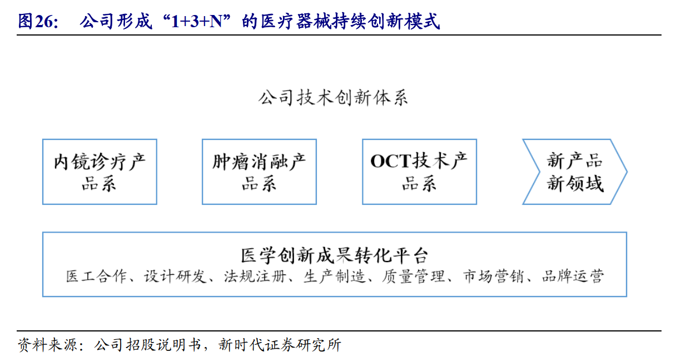

### 三、行业空间和格局

#### (一) 全球消化内镜诊疗耗材市场 50 亿美元，保持 5%的稳定增 

​	运用内镜诊疗技术，医生可在内镜影像（直视、超声影像、 EOCT 影像等）引导下进行组织活检、息肉切除、肿瘤剥离、狭窄扩张、止血、静脉曲张套扎、胆汁引流、胆道取石、胰腺假性囊肿引流、胃-空肠吻合、组织消融等检查和治疗，器械产品类型是活检类、止血和闭合类、 EMR/ESD（ 内镜粘膜切除术/内镜粘膜下剥离术）、扩张类、 ERCP（经内镜逆行性胰胆管造影术） 和 EUS/EBUS 类。 

​	**波士顿科学是全球内镜诊疗器械的龙头企业，全球市场占有率超过 1/3**。 据其市场测算， 2017 年全球消化镜下耗材的全球市场容量是 50 亿美元， 2017-2020 年保持每年 5%以上的增速。 2018 年美国消化疾病周（ DWW）上，波士顿科学的统计和预测认为，从 2018 年到 2021 年，镜下诊疗耗材的增长保持快速，其中胰胆管疾病从 14 亿美元到 17 亿美元，胃肠癌症 14 亿美元到 18 亿美元，胃肠止血类从 6亿到 6.75 亿美元，肺部相关疾病（呼吸、支气管等）从 1.25 亿到 5.75 亿美元。 

​	而波士顿科学在内镜诊疗器械领域 2017 年财年收入 17.6 亿美元，并以 8-12%的速度保持增长，目前占全球市场比例约 35%； 2013 年-2018 年，五年复合增长在为 8.36%。
​	奥林巴斯是内镜设备以及内镜诊疗器械的龙头企业之一，其中内镜诊疗耗材2019 年财年收入 52.17 亿人民币，而 2014 年收入仅为 30.45 亿人民币，五年时间增长超过 70%，复合增长 8.13%。奥林巴斯的内镜诊疗器械业务占全球的市场份额超过 15%。 

##### (1) 中国消化道相关癌症高发，测算消化内镜诊疗器械市场 34 亿 

​	中国从 20 世纪 50 年代起开展消化内镜技术，目前中国胃镜、结肠镜、 ESD、ERCP、 EUS、小肠镜等内镜下介入治疗基本与国际接轨。在 50 年代已有 13 家医院开始消化内镜诊疗。自改革开放以来， 中国消化内镜诊疗进入快速发展期，截止2014 年就有 94.9%的医院陆续开展消化内镜诊疗 

​	据 CA:A cancer Journal of Clinicians 统计， 中国癌症种类其中结直肠癌中国的发病率从 2000 年到 2011 年在持续的上升，而美国的结直肠癌发病率的统计来看，从 1973 年到 2013 年，美国结直肠癌发病率在一直不断的下降。中美之间差距因为是美国普及了胃肠镜的筛查，特别是肠镜筛查。美国的癌症筛查指南是推荐 50 岁以上的人群，每年都要做一次肠镜的筛查，中美之间的胃肠镜的筛查比率存在一个非常大的差距，美国从 1975 年到2013 年结直肠癌发病率在不断的下降。 

​	胃镜开展率，与美国相比有差距。 通过对美国（ 2009 年）、德国（ 2006 年） 和西班牙（ 2007 年） 每 10 万人胃镜开展率对比来看，美国的胃镜开展率最高，每 10万人有 2234.82 人。中国 2012 年的开展量与德国 2006 年开展量相当， 但与美国相比， 有一定的距离。
​	肠镜开展率与美国有 8 倍的差距。 通过对美国（ 2009 年）、澳大利亚（ 2005年）、爱尔兰（ 2008 年）、德国（ 2006 年）、西班牙（ 2007 年）、英国（ 2006 年） 和加拿大曼尼托巴省（ 2003 年） 的每 10 万人肠镜开展率对比来看，美国 2009 年的肠镜开展率最高，每 10 万人有 3724.70 人开展，而中国每 10 万只有 435.98 人开展，8 倍的差距， 差距十分巨大。
​	ERCP 手术与美国有 5 倍的差距。 ERCP 作为胆胰系统疾病最重要的内镜手术之一，也是十分重要的四级消化内镜技术。通过对奥地利、挪威、英国、美国等国的数据对比来看，中国的每 10 万人 ERCP 开展率与世界发达国家相比差距明显，开展率最高的奥地利 2006 年每 10 万人有 181.40 人开展， 美国 2009 年每 10 万人有 74.82 人开展，而中国 2012 年每 10 万人只有 14.62 人，五倍的差距。 

​	实际上， 中国的胃肠镜诊疗、 ERCP 等消化疾病术式的开展，相比世界其他可比国家，供给和需求严重不匹配，开展量严重偏低。 

国内内镜诊疗耗材行业持续发展的推动力主要来源于：
 胃肠镜筛查进一步普及以及基层医院对基础术式的学习从而耗材需求总量上升： 国家政策推动下胃肠镜等内镜诊疗手段普及度上升， ESD 等内镜诊疗术式向基层医疗机构下沉，对于内镜诊疗耗材的总需求量呈增长态势。
 国内产品性价比高，国内市场进口替代：国产公司的产品性能优秀，性价比高，销售网络布局全面，对市场反应更加灵敏，在国内对于国际相似产品具有代替效应。 

##### (2)公司内镜耗材覆盖内镜全套诊疗流程， 中国市占率 15%， 全球市占率不到 3%， 产品持续创新并国内外同发力 

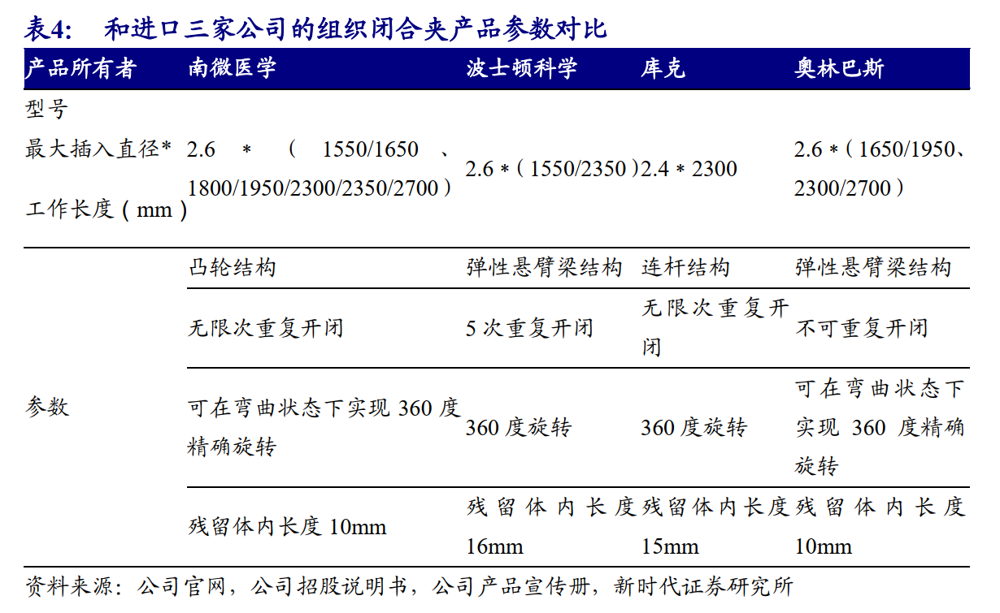

#### (二) 肿瘤消融业务空间巨大，行业处于高速增长期 

​	肿瘤消融技术是在影像设备如超声、 CT、 MRI 等影像引导下，对肿瘤直接应用化学药物或物理灭活，是一种精准、微创的诊疗技术。目前最常用的肿瘤消融方式为化学消融和物理消融。化学消融是在影像的引导下，向肿瘤内注射化学药物，从而灭活肿瘤病灶，而使肿瘤消融。物理消融主要包括微波消融（ MicrowaveAblation， MWA）、射频消融（ Radiofrequency Ablation， RFA）、冷冻消融等。 MWA和 RFA 是目前市场主流消融术式，通过加热使得肿瘤组织凝固坏死，目前两种术式占肝癌肿瘤消融市场超过 90%的份额。 

​	肿瘤消融技术目前主要应用在原发性肝癌。 其中 RFA 已被列为早期肝癌的一线根治性治疗手段，而随着微波技术的改进和冷循环电极的出现， MWA 技术在临床上的应用不断增多，其安全性和疗效得到临床医生的认可。 MWA 相比 RFA，具有更好的热传导、更高的瘤内温度、更快的消融时间、受热沉降效应影响小，能获得更大的消融范围，而且不需要负极板等优点。现在肿瘤消融技术还应用在甲状腺结节、肺部结节、 乳腺肿瘤、子宫肌瘤等肿瘤领域。 

##### (1) 全球肿瘤消融设备及耗材行业市场预计 2025 年达 21.71 亿美元 

​	肿瘤消融设备及耗材产品包括微波消融治疗仪和微波消融针等。 根据 Grand View Research 的统计数据， 2017 年全球肿瘤消融设备及耗材相关行业市场规模为9.34 亿美元，预计 2025 年市场规模将会达到 21.71 亿美元，年复合增长率达到11.12% 

##### (2) 中国肿瘤消融设备及耗材行业增速快， 拥有数十亿的巨大空间 

​	国家癌症中心 2018 年发布了的全国癌症统计数据，肝癌是全国恶性肿瘤发病率排名第四，死亡排名第二。 中国一直是肝病大国， 中国有 1.2 亿乙肝病毒（ HBV）携带者，占人口数量的近 10%。原发性肝癌分为肝细胞型肝癌（ HCC）、胆管细胞型肝癌（ CC） 及混合型肝癌，其中 HCC 最为多见，约占 85%-90%，而 HBV 慢性持续感染是 HCC 最重要的危险因素， 2014 年中国肝癌发病数是 36.5 万人。 

​	按照 IQVIA 的统计，肝癌热消融市场 2018-2028 年十年期间复合增长为 9.1%，到 2028 年，将会有 30 万例消融针市场，按照公司 2018 年的出厂价约 1800 元/针计算， 2018 年国内市场约 2 亿，而 2028 年市场潜力超过 5.4 亿。 肝癌消融市场，按照数量计算，目前外资占 27%（美敦力、 美国 RITA、 韩国 STRAMED 为主），公司的子公司康友约占 22%，南京亿高约 14%。 

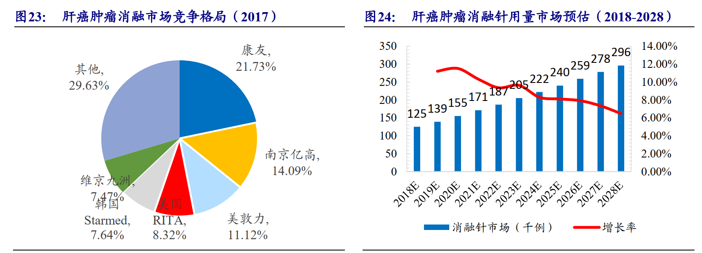

​	**仅仅一个肝癌癌症种类，市场保持十年复合约 10%增长，十年后有 5 亿市场空间，而其它七种高发癌症每年的发病人数是肝癌的近 10 倍，公司所处于的肿瘤消融市场潜力巨大。** 

综上，公司肿瘤消融医疗市场的增长推动力主要是：
 癌症患者数量的增长促进市场需求的增长。根据中华医学会 2018 年公布的数据， 中国癌症发病率为 210/10 万， 占全球的 22%，癌症患者数量的增长将会促进肿瘤消融设备及耗材市场需求的增长。
 肿瘤消融技术具有微创、有效、安全等优点，近年来已成为中国发展最为迅速的肿瘤治疗手段之一。未来肿瘤的手术治疗将进入微创时代，微波消融技术以其热效率高、消融形态规则、疗效确切等优势将成为肿瘤消融治
疗的重要技术之一。
 产品可以推向国际市场，国际市场空间更大。 

#### (三) 重磅品种 EOCT 已经通过 FDA 审核，在国内进入绿色审批通道预计 2021 年拿证 

​	光学相干层析（ Optical Coherence Tomography，简称 OCT） 成像技术是一种新颖的、非侵入、无损伤、无电 离辐射的生物医学光学成像技术，能够在体地对生物组织内部结构和生理功能进行高分辨率高灵敏度三维层析成像，被认为是最有可能成为“光学活检”的技术之一。该技术由美国科学院院士、美国麻省理工学院教授 James G. Fujimoto 于 1991 年提出。二十年多来， OCT 技术在分辨率、探测灵敏度、成像深度、成像速度、组织穿透深度、对比度增强机制以及临床应用等方面都有了长足进步。 OCT 可实现对生物组织的微观结构进行分辨率接近组织学水平的原位成像，并且无需对组织进行切除和后处理，因此可对以往医疗诊 断中难以观察或不宜作切片检查的组织进行在体成像，从而避免传统活检对活体组织的潜在损伤 

​	**而 EOCT（内窥式光学相干断层成像系统）是 OCT 的一个应用场景， EOCT由设备及探头两部分组成，根据具体使用可分为血管 OCT 和消化科 OCT， 公司的EOCT 主要指消化科 OCT 产品。 医生将一根高速旋转的光纤及成像探头通过内窥镜工作管道插入人体腔道，对腔道横截面进行逐层扫描。 其成像范围介于内镜和超声之间，成像深度达黏膜下 5 毫米，可观察到内镜直视观察不到的黏膜间病变；成像清晰度 100 微米，接近病理级，远远高于超声影像，可用作快速病理判断和早癌及癌前病变筛查，是一种全新的人体腔道“无创光学活检”手段。** 

​	**粗略测算 EOCT 国内市场超过 50 亿** 

​	目前， 国际上仅有 NvisionVLE 公司有EOCT 并拿到 FDA，暂没进入国内市场，其 2018 年 4 月-12 月八个月销售 300 万 美元。 以雅培血管内 OCT 设备出厂口径价格 200 万参考，假设公司 EOCT 的出厂价为 150 万，国内近 1500 家三甲医院， 按照国内三甲医院平均配臵 1 台测算， 则国内市场空间是 22.5 亿；而雅培血管内 OCT 的一次性耗材出厂价约 5000 元，假设公司的一次性探头耗材出厂价 4000 元， 按照我们之前测算国内一年内镜活检的病例约 1500 万例其中有 5%的比例（ 75 万例） 选择做 EOCT 来计算，市场空间计算得 30 亿元。合计则国内消化道 EOCT 的市场超过 50 亿， 而国际市场的潜力更大。 

#### (四) EOCT

​	公司在约翰霍普金斯大学独家授权 OCT 技术专利基础上进行自主开发出EOCT 产品，将超高分辨率断层成像技术、三维快速扫描成像技术、图像三维重建技术与内镜技术平台相结合，实现针对消化道癌症的无创“光学活检”，可用于消化道早癌筛查和内镜手术术前规划和术后评估。
​	目前公司 EOCT 产品在美国已取得 FDA 批准，在美国梅奥诊所、斯坦福大学医院等地开展临床试验与合作研究， 积累数据做图像比对。在中国该产品已于2017 年 11 月进入国家药监局创新医疗器械审批绿色通道，在首都医科大学附属北京友谊医院、中国人民解放军总医院（ 301 医院）、复旦大学附属中山医院等地开展临床试验。 已经入组完成 28 例临床实验，进展顺利并取得了良好的临床效果预计 2021 年初可在国内上市。
​	相比市场另外一家 EOCT 厂家 Ninepoint NvisionVLE 的产品，公司的产品扫描速度更快，球囊种类更多，可以实现球囊自动扩张及回缩。 

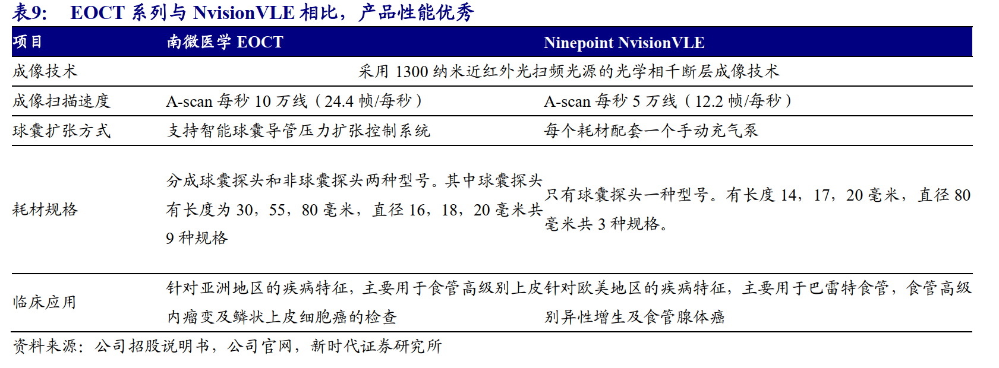

