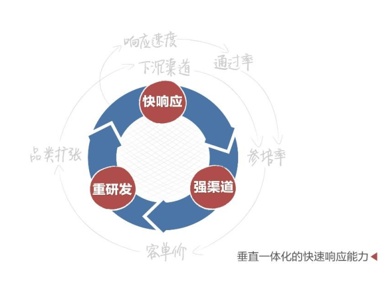
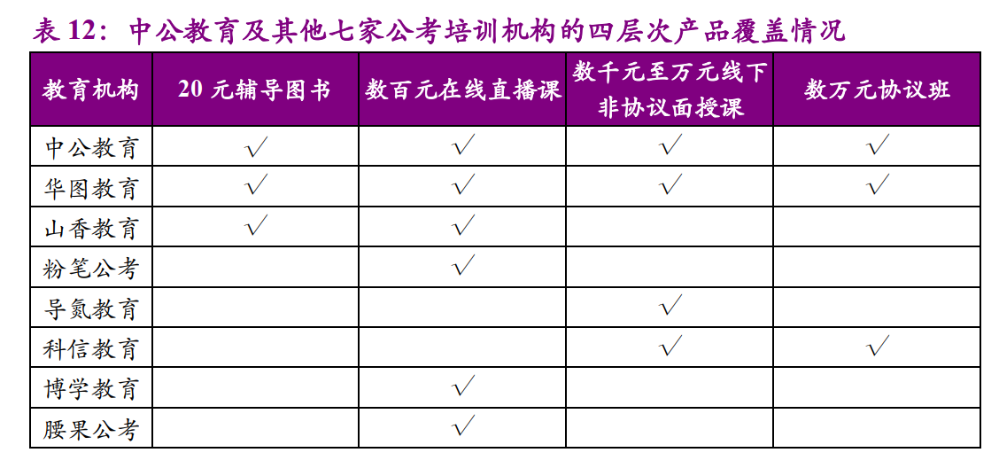
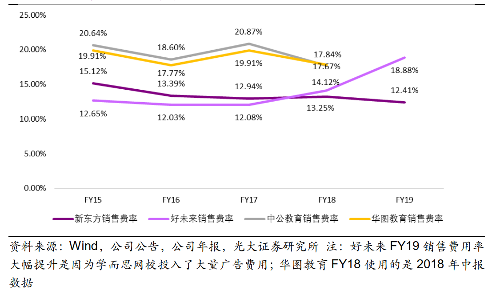

# 中公教育

## 20190828首次覆盖

## 一、主营业务

### (一) 概况

​	中公教育是国内领先的职业教育机构，是公职类招录考试培训的领导者。主要服务于大学生、大学毕业生等年轻就业人群。这个人群广泛分布于全国各地，职业能力训练和就业是这个人群的两大核心诉求，就业则是撬动整个职业教育领域的杠杆支点，也是职业教育机构竞争的终极赛场。由此，越能在最大范围靠近就业需求的职业教育机构，越有机会形成的研发、教学、服务和渠道的垂直一体化快速响应能力，也越有机会占据统领职业教育全局的优势地位。 

​	中公教育具有全国范围的垂直一体化快速响应能力。中公教育一直置身于公职类招录考试培训市场创造的最前沿，率先采用自主研发，率先培养专职师资，率先进行全国渠道布局并不断下沉渠道，率先完成全国网点全直营，率先采用互联网内容营销及 IT 自主开发，用科技力量持续提升营销、管控及协同服务水平。目前已基本形成了重研发、强渠道、快响应的垂直一体化快速响应能力。在公务员、事业单位、教师等公职类招录领域成为学员首选机构，在其他职业就业新领域取得了强劲增长，并在各类资格证考试培训领域进行了全面的覆盖。 

### (二) 核心竞争力

​	**垂直一体化的快速响应能力是中公教育核心竞争力。**

​	招录通知发布时间波动且考题变化大， 对培训企业的反应速度和研发速度均有较高要求。 每年招录通知的发布时间在往年日期前后一周内波动，且多在傍晚或晚间发布，因此需要教研人员在该时段内实时关注政府网站上的
信息。此外， 每年招录通知的要求和内容虽无大的变化，但是重点考试内容和考题约有 30%的变化， 这对于课程研发及更新能力有着相当高的要求。 

​	由此使得公司具备了最快响应市场需求并提供优质服务的领先优势，以供给创造需求，不断拓宽行业边界。也使得公司在进入新的职业教育细分赛道时后劲十足。 特征点如下

#### 1. 持续以供给创造需求，增长模式可在新赛道复制 

​	招录就业考试培训是公司的基础业务。非学历的职业教育由三大板块组成：招录考试培训、考研等职
业提升考试辅导和职业能力训练。
​	通过持续的供给创造需求， 公司率先在招录考试培训领域建立了领先地位，并通过持续的积极投资形
成了高壁垒的企业能力，进而得以在新赛道复制增长模式，形成供给创造需求快速循环，抬升新赛道的发
展曲线斜率，再现公司在招录领域不断做大行业规模的历程。 

#### 2.“多品类增长飞轮效应”逐级放大增长愿景 

​	多品类之间的投资能力累积和叠加，多品类的增长飞轮效应不断增强，这一效应在招录领域内部之间已经持续多年，从国考、省考、事业单位到教师和各类基层公共服务类岗位的招录，新旧品类的发展相互放大投资充分度，共同推动形成更强的经营基础设施能力。
​	当前，这种增长飞轮效应已经扩大到了三大板块之间，逐级放大了公司的增长愿景。合理的规模是由潜在人群的规模决定的。在上述三大板块中，招录考试培训主要面向大学毕业生； 考研等职业提升考试辅导的覆盖范围则可以向前扩充到更多年级的在校学生，向后可以延伸到毕业 5—10 年的学生；职业能力训练的覆盖范围则可以拓宽至所有的在职人群。由此，这三大板块合理的市场规模排序与其刚需程度正好相反，职业能力训练最大， 考研等职业提升考试辅导次之，招录考试培训最小。 

​	在保持招录领域稳步快速增长的同时，公司对考研和 IT 职业能力训练等新赛道进行了积极进取的投资，并已实现规模化的快速增长。在多品类增长飞轮效应的强大动能下，公司新的增长愿景已经不再局限于招录，而是延伸到了整个知识型人群的职业教育培训领域。 

#### 3. 三位一体的经营基础设施硬资源实力 

​	持续的规模扩张和多品类飞轮效应拉动下，公司不断提升经营基础设施的投资水平，形成了领先的“教
研—渠道—管理” 三位一体的硬资源实力。具体体现为：

**规模化教研：** 创业之始，公司即率先开展专业的研发，规模化的专职师资。目前已形成近 2,000 人的专职研发团队，教师团队人数达 11,604 人。
**全直营的全国渠道网络：** 公司目前已建立覆盖 319 个地级市的 880 个学习中心网点， 并将在较长时期内保持稳步增长势头。
**管理资源与 IT 设施：** 公司已形成了由大批优秀管理人员组成的管理团队，建立了高度适配行业特征的高效管理系统——淡化职能，强化指挥；市场导向，一线拉动；重视数据，极速反馈；动态感知，实时调节。 IT 自主开发能力及架构设施是其中关键一环。在长期累积的自主开发能力支撑下，公司积极开展经营数字化转型， 不断加大技术与经营的融合度， 扩大双师的应用水平， 展开全业务系统一体化协同再造，持续扩大科技在管理体系中的权重和资源占比。 

#### 4. 经营架构兼容度高，可支撑大规模的组织与产能扩张 

​	公司的垂直一体化快速响应能力并没有因为规模扩大而降低，反而还在随着规模扩大而提升。其中一个关键原因就在于独特的经营架构。一方面，一线的学习中心网络由功能简单的网点所组成，由此网点可以自主管理，工作的自主性灵活性也很高，网点快速扩张并不会导致整个经营体系的管理压力骤增；另一方面，总部及核心省市的中央指挥部具有较高的管理规模效应和内部产业集群效应，这些效应可以基本抵消组织与产能扩张对指挥系统的冲击。
​	在这一架构下，高速运转的体系带动着每个人置身于全力服务学员的经营主线中，高标准、高负荷、高收入，在快速发展中培养人、选拔人和淘汰人，由此能在很大程度上避免规模增长通常会带来的诸多日常管理问题，团队管理的简化显然有助于持续大规模的组织与产能扩张。 

#### 5.友善利他的中公文化 

​	作为一家知识员工高度密集的职业教育机构，公司在艰苦创业的漫长历程中建立了简洁有效的企业文化，以"做善良的人"为核心价值观，倡导无我而利他，由创始团队率先垂范，在每一天的经营中毫不动摇地贯彻实施。 这种鲜明的企业文化使得公司可以在规模扩张的过程中持续保持组织凝聚力。
​	同时，公司高度重视党建工作。 2018 年，公司获准成立党委。截至 2019 年 6 月 30 日，公司党员 7,019人，占员工总数超过五分之一。 

### (三) 研发

​	中公教育为应对每年招考标准和选拔方式的变化，形成了“研发+培训”的模式，组建了专职研发团队，实现了研发与教学分离。截至 2018 年末，中公拥有 1350 位专业化研发人员，同比增长 36.92%。在课程研发方面， 研发团队根据招录政策变化， 首先研究并制定出针对性的授课讲义等辅助性资料，随后对教师进行培训， 最后再由教师对学员进行教学。中公教育的产品研发模式的四个步骤分别为产品调研、课程开发、小范围试课以及大范围推广。 

### (四) 离职率

​	在通畅的晋升渠道、 有竞争力的薪酬福利体系与完善的教师培训机制下，中公教育的教师离职率不断降低。 2015 年度、 2016 年度、 2017 年度和 2018年 1-4 月，中公教育教师的离职率分别为 25.88%、 25.48%、 21.47%和 7.96%，呈下降趋势，且普遍低于同行业公司。 

### (五) 渠道直营化 

​	中公教育 2010 年起加盟全部转直营。 中公教育曾在 2008 年、 2009 年拥有加盟商，该模式下，中公对加盟商的管控力极弱，难以实现对学员的承诺，无法落实标准化产品。 2010 年中公教育进行全面转型，实现渠道直营
化。截止 2018 年 12 月，中公教育的 701 个直营分支机构已覆盖 31 个省 319个城市。 

### (六) 产品

从产品层次上看，中公教育产品结构完善，覆盖四维学员。 

（1） 20 元辅导图书——覆盖自制力好、有一定学习能力与专业基础的学员； 

（2）数百元在线直播课——覆盖不具备较长备考时间、有一定专业知识基础的学员；
（3）数千元至万元线下非协议面授课——覆盖具备较长备考时间、有一定专业知识基础的学员； 

（4）数万元协议班——覆盖具备较长备考时间、没有基础或基础知识相对薄弱的学员。 

对比目前拥有公考培训的七家教育培训机构， 包括华图教育、山香教育、粉笔公考、导氮教育、科信教育、博学教育（BOLEARN）、以及腰果教育。 其中仅有中公教育和华图教育从学员切身需求出发，开发了多品类课程，覆盖不同需求的学员。其余机构均只提供部分产品，其中四家机构只提供一种产品。另外， 粉笔公考、博学教育、腰果公考只服务于线上，导氮教育只提供线下课程。 

​	

## 二、行业空间

### (零) 从 4P 理论看中公教育商业模式 

#### 1. 渠道 Placement： 长尾市场， 供给创造需求 

渠道下沉和院校覆盖，长尾市场供给创造需求。 截止 2018 年 12 月，中公教育的 701 个直营分支机构已覆盖 31 个省 319 个城市 

#### 2. 产品/服务 Product： 横纵两向完善产品结构 

中公教育产品结构完善、课程类型丰富。 （1）产品内容：包括人才招录培训和资格认证培训在内的多元化培训体系，教学领域不断拓展。（ 2）产品形式：面授培训和线上培训课程相结合，培训形式灵活多变。（ 3）产品层次：课程内容高度细分，延伸至各个专业领域；课程类型日趋多元化，包括普通和协议课程，基础、专项和冲刺课程等。 

#### 3. 营销 Promotion： 协议班有望通过品类联动实现“虚拟续班率” 

2018 年年底，中公拥有 11644 名销售人员，包括 8657 名市场人员和2987 客服人员，总员工占比 45%，巨大售前售后团队是服务庞大客群的基础。  

中公教育的协议班课程具有课后增值服务丰富和未过不同阶段考试按比例退费两大特点， 2018 年 4 月底协议班整体营收占比达 70%。 

#### 4. 价格 Price：规模效应，降维打击 

中公教育和华图教育的课程设置较为丰富。 中公教育和华图教育的培训课程按产品内容可分为公务员招录培训、事业单位招录培训、教师招录培训及其他。 

中公教育北上广三地的公务员招录培训课程价格低于华图教育。 通过对比中公教育与华图教育2019年8月公务员招录培训课程价格可以发现，（1）就不同班别而言，中公教育的日单价大都低于华图教育，仅有 1-2 个班别的
日单价略高。（2）就日均单价而言，无论是北京市、上海市还是广东省，中公教育的价格都更低。（3）就不同地区而言，中公教育北京市和上海市课程价格相当，广东省课程价格略低。华图教育上海市和广东省课程价格相当，北京市课程价格略高 

### (一) 行业概况

从市场空间角度看，（3）职业就业培训>（2）资格认证培训>（1）人才招录培训； 从刚性角度看，（1）人才招录培训>（2）资格认证培训>（3）职业就业培训。 

光大证券预测 2018 年职业培训行业约 5000 亿元市场空间，YoY+10-20%。 具体可分为招录（500 亿元）和技能（4500 亿元+）两大类，技能又分为资格认证（500~600 亿元）和职业就业（约 4000 亿元）两大类。

1）人才招录培训行业市场空间约为 500 亿元， 包括公务员（100 亿元）、事业单位（100 亿元）、教师招聘（200 亿元）及其他（100 亿元）。

 2）资格认证培训行业市场空间约为 500~600 亿元， 包括教师资格（100 亿元）、会计证书（100 亿元）、 IT 证书（200 亿元）及其他（100~200 亿元）。

 3）职业就业培训行业市场空间约为 4000 亿元， 包括会计技能（700 亿元）、IT 技能（300 亿元）及其他。因此，在市场空间层面上， （3）职业就业培训>（2）资格认证培训>（1）人才招录培训。考虑到考试难度、招录人数、以及培训需求强烈程度等主客观因素，我们认为人才招录培训的刚性最大。 

### (二) 竞争对手概况

中公教育及其他七家公考培训机构经营情况概要 

### (三) 产品对比

### (四) 职业教育和K12对比

职业就业培训行业的中公教育和华图教育销售费用率显著高于 K12培训行业的新东方和好未来 

### (五) 行业动态

#### 1. 国考

从国考来看，招录人数19年大幅下滑，由18年的2.85万人减至1.45万人，同比下滑近50%。从省考来看， 18年个别省推迟或取消（如河南18年未考），根据各省人社局的招录计划， 18年合计招录14.5万人， 19年截至目前（下半年招录计划尚未公布）合计招录12.0万人，影响远小于国考。 

#### 2. 教师资格

2015年正式实施教师资格证考试改革，采用国家统一考试,且无论是否是师范生，均需要统一参考获得资格证。 2018年8月出台的K12教培行业新规要求学科培训的教师需要有教师资格证，报考人数大幅提升。 2018年下半年，教师资格证笔试报考人数达447万，全年累计651万人，较17年418万人同比增长约56%，预计2019年报考人数将超过800万。 

#### 3. 考研

考研人数自15年以来逐年攀升。 受学历需求升级及就业形势严峻等多方面因素影响，自2015以来我国每年考研人数逐年攀升，由2015年的165万人增至2019年的290万人， CAGR约15%。
目前新东方和中公在考研培训赛道体量较大，但仍不到10亿元体量。 

## 三、其他

### 业绩承诺

业绩承诺：中公教育在2018年度，2019年度和2020年度合并报表范围扣除非经常性损益后的归属于母公司所有者的净利润数分别93000万元，130000万元和165000万元

## 四、总结：曲奇模式

 培训行业的成功在于“一地成功，异地扩张”，行业本质是连锁经营服务 

​	

