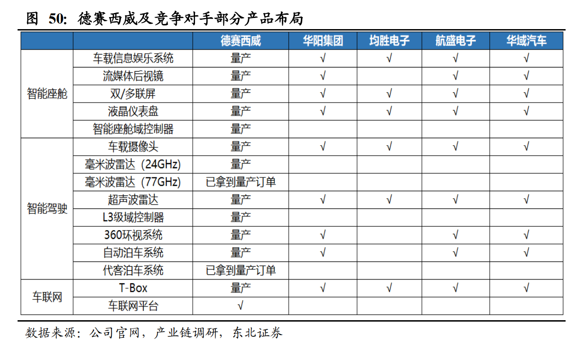
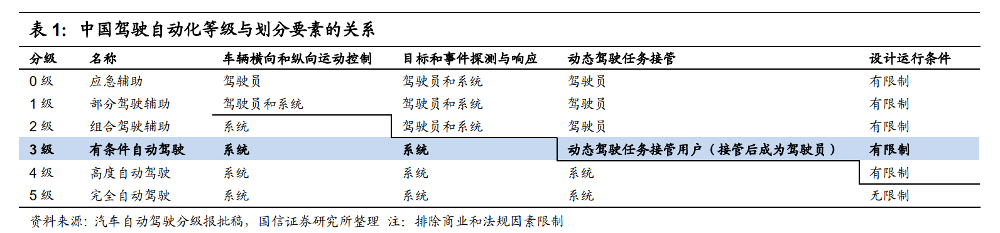

# 智能驾驶舱(20200705)

### 总结

### 一、全球电动化加速， L3 级智能驾驶车型加速推出标志智能化升级

电动化与智能化是汽车转型升级中的新增量环节， 2020 年呈现两大变化

一是中美欧三国加速电动化布局

二是 L3 级智能驾驶车型加速推出

L3 级别是汽车自动化道路的一次跃升， 2020 年是 L3 级别车型量产元年。 

在智能化领域， 终极目标是无人驾驶，而实现无人驾驶是一个渐进式的发展过程，这个过程中，车内硬件智能（ ADAS）和车际互联通信（ V2X）两条腿走路，以10 年以上为行业周期划分发展重点，

短期（ 3-5 年）关注 ADAS 渗透率提高带动传感器产业链发展，

中期（ 5-10 年）关注车联网伴生的智慧交通基础设施建设，

长期（ 10 年以上）关注 L4 级别成熟后共享汽车引领的出行方式颠覆， 

2020年为 L3 级别智能驾驶商业化落地的元年 

### 二、L3加速

从国外车型看， 奥迪 A8 是最早搭载 L3 级别硬件的量产车型， 全球多数车企计划在 2020-2021 年开始正式量产 L3 级别车型，如宝马 iNEXT、奔驰全新 S/C 级等。 

中国 L3 量产自 2020 年长安发布的 UNI-T 车型开始， 2020 年是我国 L3 级别车型的量产元年，将先后迎来小鹏 P7、长安 UNI-T、北汽新能源ARCFOX ECF Concept、广汽新能源 Aion LX、奇点 iS6 等车型上市。 

### 三、未来汽车

根据英伟达预测，未来汽车主要 由两大运算单元构成，分别是智能驾驶舱和无人驾驶。定义人机交互即全车娱乐部分的智 能驾驶舱(cockpit)在汽车未来发展必不可少，有望成为 ADAS 技术和无人驾驶汽车的标 配。数据量的暴增使得传统机械仪表难以应对，无法实现有效的人车交互。液晶仪表的信 息承载量级大，加上组合显示的多样化，将成为行车数据爆炸时代的最佳选择。

