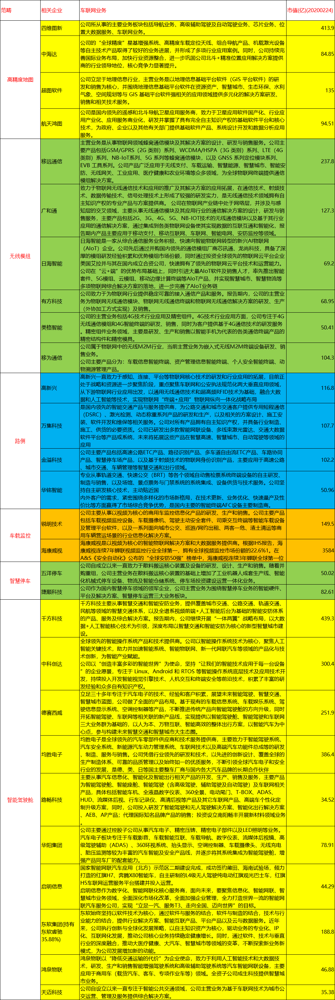
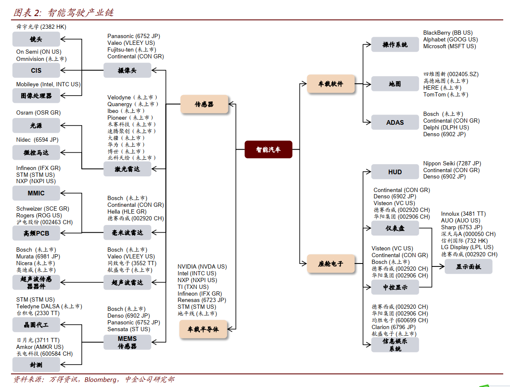
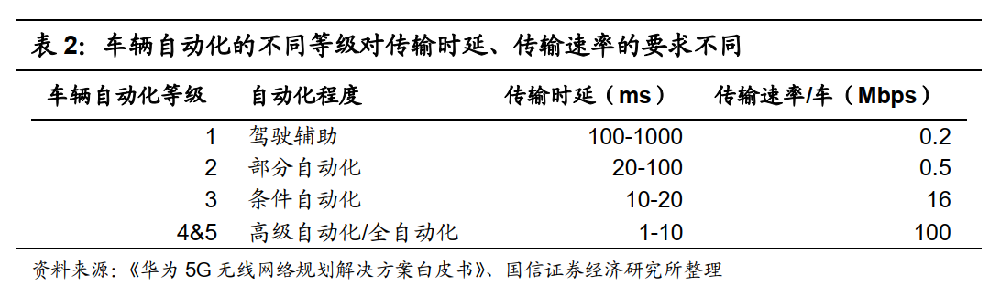
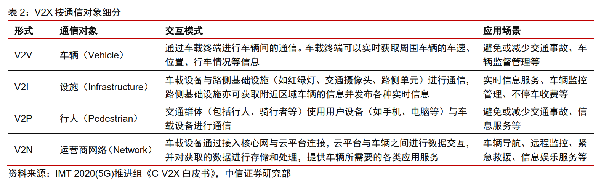
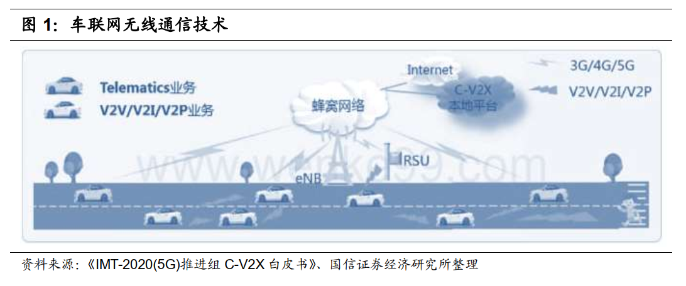
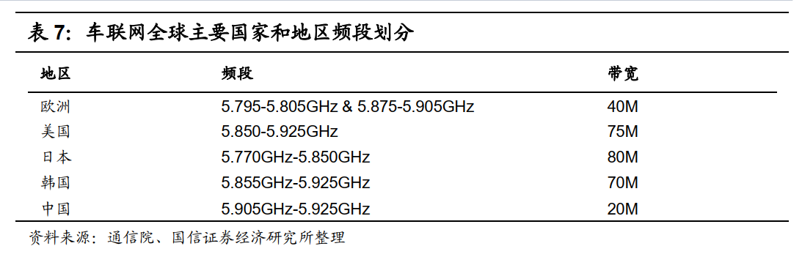
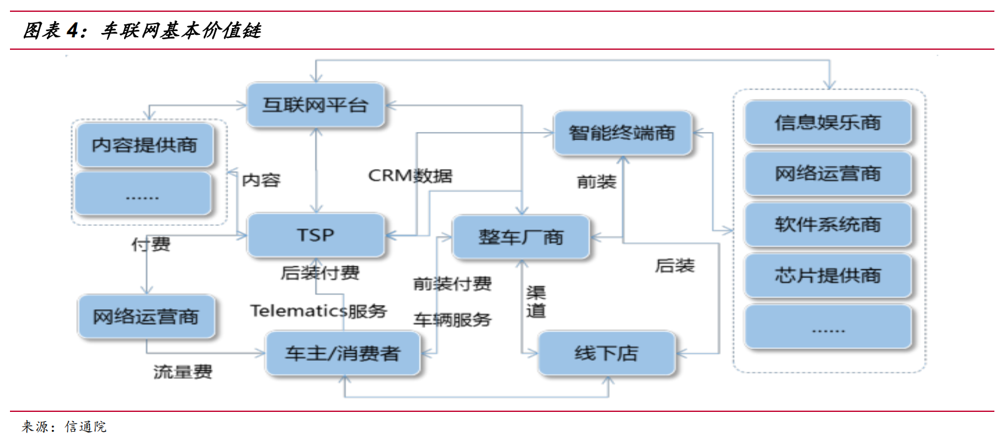
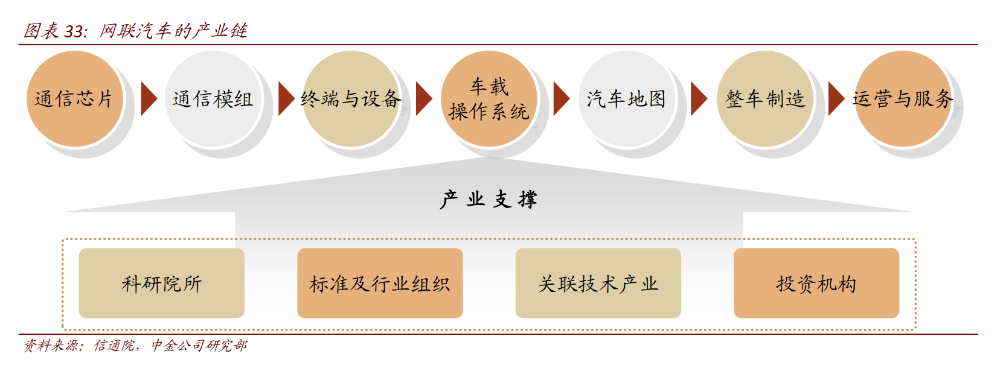

# 车联网(20200226)

### 总结

车联网其实很早在我的视线了，只是懒啊，一直没有花时间细细的梳理。特别是中科创达，5年前刚上市时就研究了，等待了整整5年，感觉今年才有主升的味道。。。太难了。。。

当然，车联网，未来是非常巨大的，这个观点，不接受反驳，未来的大型移动手机啊。

特别是在盘后，我们也看到了，博士提到了车联网，于是，在吃完饭后，我连夜梳理了大概能触摸到的所有信息，最后整的图，我看了，绝对是物超所值的。。。

从信息收集，加工，整理，理解，到成文，今天又开动了小马达，终于完工了，刚还在床上趴了几分钟，好了，准备睡觉，就酱，晚安。

#### 1. 高精度地图和定位服务

高精度地图有望成为车联网的刚需性服务。 随着车联网基础设施的成熟以及高等级自动驾驶的普及，车辆将最终发展成为比肩手机的重要智能终端， 围绕智能车辆上的应用也将随着百花齐放。考虑到车联网的终极目标是自动驾驶，而高精度地图又是自动驾驶的标配应用。  

**相关公司：四维图新，中海达，航天宏图，超图软件**

#### 2. 通信模组

模组的作用是将芯片集成为车规级模组，可直接被 RSU/OBU 的 OEM 厂家使用。 

之前我们已经研究过的

**相关公司：移远通信，广和通，日海智能，有方科技，美格智能，移为通信**

#### 3. 路侧

RSU（Road Side Unit）是路侧的信号接收和发送装臵。其内部核心模块是 V2X 模组，有些厂家也实现了基于DSRC 的模组集成。 

**相关公司： 万集科技、 金溢科技、华铭智能、高新兴**

#### 4. 智能驾驶舱

“聪明” 的车+“智能”的路， 车联网（ V2X）的发展将显著降低单车改造成本。 国内的自动驾驶技术路线是智能网联的路线，即“单车智能”与“车路协同”协同发展。 

**相关公司：千方科技、中科创达、德赛西威、路畅科技、东软集团、华阳集团、均胜电子，启明信息，鸿泉物联，天迈科技**

#### 5. 车载监控

**相关公司：锐明技术，海康威视**

#### 6. 智慧停车

**相关公司：捷顺科技，五洋停车**

### 一、智能汽车创新发展战略

#### 1. 智能汽车创新发展战略通知

2 月 24 日， 国家发改委等 11 部委联合发布《智能汽车创新发展战略》，明确 2025 年/2035~2050 年中长期战略愿景，并提出 20 条主要任务。 

原文：

[**关于印发《智能汽车创新发展战略》的通知**](https://www.ndrc.gov.cn/xxgk/zcfb/tz/202002/t20200224_1221077.html)

https://www.ndrc.gov.cn/xxgk/zcfb/tz/202002/t20200224_1221077.html

[智能汽车创新发展战略](https://www.ndrc.gov.cn/xxgk/zcfb/tz/202002/P020200224573058971435.pdf)

https://www.ndrc.gov.cn/xxgk/zcfb/tz/202002/P020200224573058971435.pdf

#### 2. 战略愿景

到 2025 年， 中国标准智能汽车的技术创新、 产业生态、 基础设施、 法规标准、 产品监管和网络安全体系基本形成。 实现有条件自动驾驶的智能汽车达到规模化生产， 实现高度自动驾驶的智能汽车在特定环境下市场化应用。 智能交通系统和智慧城市相关设施建设取得积极进展， 车用无线通信网络（ LTE-V2X 等） 实现区域覆盖，
新一代车用无线通信网络（ 5G-V2X） 在部分城市、 高速公路逐步开展应用， 高精度时空基准服务网络实现全覆盖。 

展望 2035 到 2050 年， 中国标准智能汽车体系全面建成、 更加完善。 安全、 高效、 绿色、 文明的智能汽车强国愿景逐步实现， 智能汽车充分满足人民日益增长的美好生活需要 

### 二、智能汽车产业链-来自中金

### 三、车联网有望成为 5G 最大应用市场 

根据 C114 通信网 2019 年 3 月 29 日报道，工信部部长苗圩表示， 5G 应用 80%将用于物和物之间的通讯。 “移动状态的物联网最大的一个市场可能就是车联网，以无人驾驶汽车为代表的 5G 技术的应用，可能是最早的一个应用。 ”苗圩表示工信部正在研究推动车联网的发展，并已与交通部部长达成共识，加快推动公路数字化、智能化改造。 

#### 1. 5G 规模化商用在即，低延时、高密度、高可靠的通信网络为车联网打开突破口 

智能驾驶对 5G 网络的传输时延、可靠性、速率要求均非常高，而在智能驾驶场景下， 5G 网络覆盖受道路、车辆本身、车辆速度等众多因素影响，需要更加精细的场景化规划解决方案。 

#### 2. V2X(Vehicle to Everything)是车联网的灵魂

V2X(Vehicle to Everything)是车联网的灵魂，车用无线通信技术 V2X 是将车联与一切事物相连接的新一代信息通信技术，其中 V 代表车联， X 代表任何与车交互信息的对象，当前 X 主要包含车、人、交通路侧基础设施和网络。 V2V 具体的交互信息的模式包括：车与车（ V2V）、车与路（ V2I）、车与人（ V2P）、车与网络（ V2N）之间的交互。 

#### 3. 在 V2X 通信技术标准上，中国龙头着重布局 C-V2X，技术路线大概率胜出。 

由于 LTE-V2X 技术标准的研究制定过程中有中国厂商包括华为、大唐的深度参与， LTE-V 具备了我国自主知识产权属性，再加上通信运营商的利益诉求和信息安全方面的考虑，我国车联网市场采用 LTE-V 技术标准是大概率事件。 

### 四、产业链

车联网产业链条较长， 主要分为上游、中游和下游三个部分。
上游：主要包括 RFID/传感器、定位芯片和其他硬件等元器件设备制造商。
中游：主要包括终端设备制造商、汽车生产商和软件开发商。
下游：主要包括 TSP、系统集成商、内容服务提供商和移动通信运营商。 

#### 1. 首批通过“LTE-V 技术验证试验”的产品 

相关公司： 千方科技，东软集团(持有东软睿驰35.88%)，金溢科技，万集科技

#### 2. 行业细分

C-V2X 行业可细分为通信芯片、通信模组、终端与设备、整车制造、运营服务、测试验证、高精度定位和地图服务六大领域。 

#### 3. 商用车车载监控 

据 IHS 报告， 国内厂商锐明技术、海康威视在全球商用车车载监控市场份额位居第二、第三名。其中，锐明技术还是国际龙头 Safe Fleet、 Angel Trax、 REI 的 ODM 供货商。 

