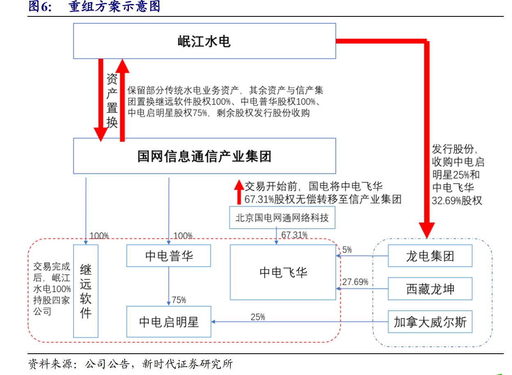
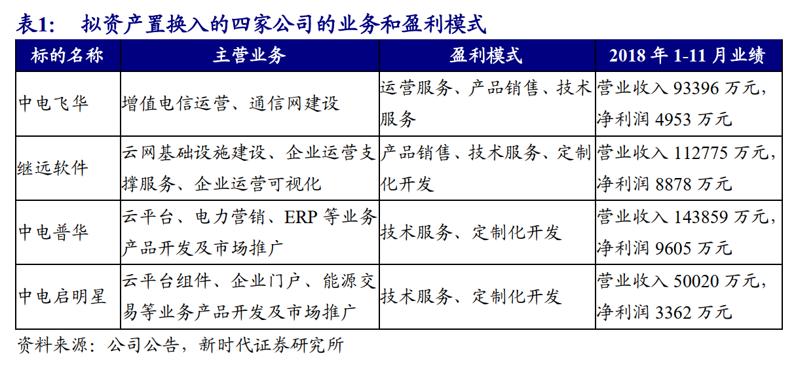
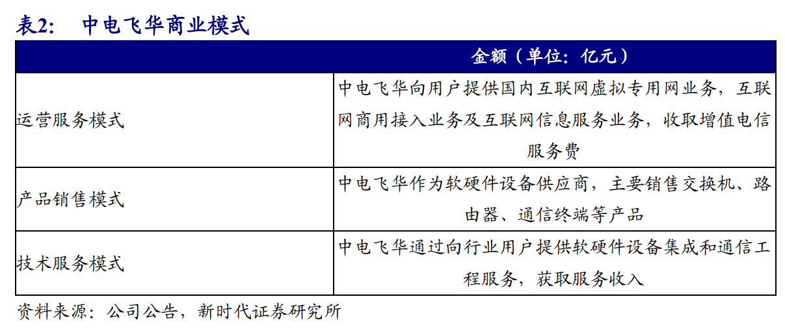
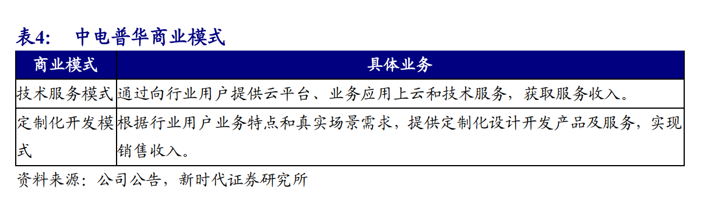
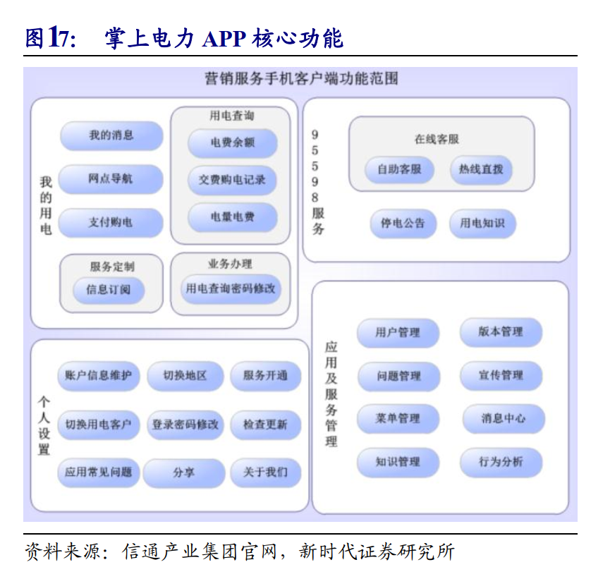
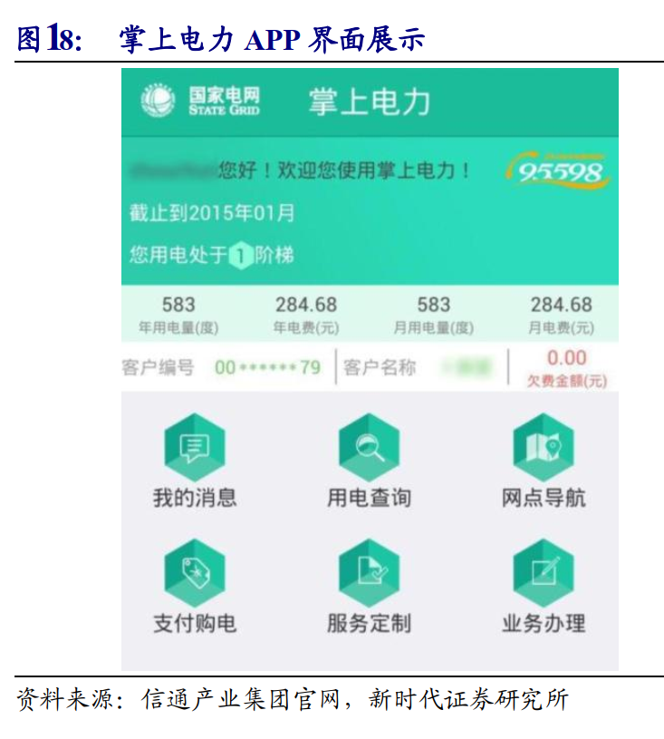
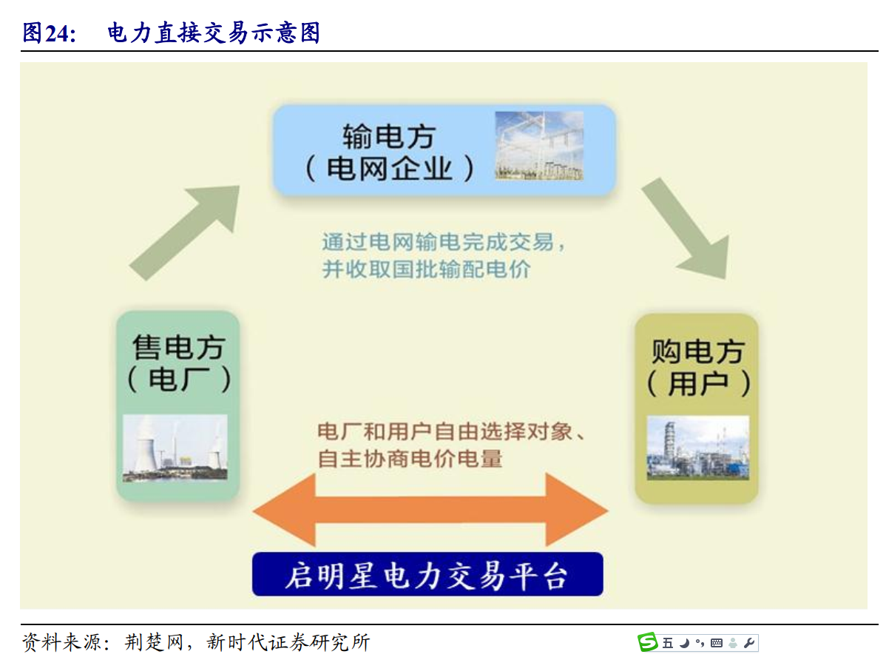

# 岷江水电(20191006)

### 总结

从泛在电力物联网的前提下，我们可以看到，信产集团，确实在信息化领域的准入上占据门槛，未来也是受易，但是坦白说，这些注入的资产本质上是国网屏蔽外部企业的设立的三资，表面上门槛，其实也没有多少空间。

电改压力下国网计划转型综合能源服务商，泛在的提出就是未来国网想从电力的管道转型的步伐，像信息化这块的拉动，目前上看，还是比较有不确定性的，相对于涪陵电力这样的配电节能的确定性上相差还是比较大的。

中电普华的掌上电力，这类直达C端用户的运营能拓展的空间，反而比较有空间。

因此，在个人的定义上，岷江还需要证明自己吧，但可以放入跟踪。

### 一、公司概况

#### 1.旧有主营

业务范围：报告期内，公司的主营业务未发生重大变化，为电力生产、电力购售。
经营模式：公司是集发配售电于一体的电力企业，拥有区域性独立配电网络。公司电力来源为，一是自有水电站和并网小水电发电量通过自有电网销售给终端客户；二是通过联网线路从国家电网四川省电力公司等单位趸购电量。公司电力销售主要以大工业和趸售用户为主。
主要的业绩驱动因素： 公司业绩主要来源于电力业务，经营利润主要来源于发电和售电业务的逐步增长、成本费用的有效控制以及投资收益。 

#### 2.国网注入

公司于 2019 年 1 月启动了重大资产重组，拟将除保留资产外的全部资产、负债及业务作为置出资产，与

国网信息通信产业集团有限公司（以下简称“信产集团”）持有的

北京中电飞华通信股份有限公司（以下简称“中电飞华”） 67.31%股份、

安徽继远软件有限公司 100%股权、

北京中电普华信息技术有限公司 100%股权及

四川中电启明星信息技术有限公司（以下简称“中电启明星”） 75%股权的等值部分进行置换，

并拟以发行股份的方式向信产集团购买上述重大资产置换的差额部分、向龙电集团有限公司和西藏龙坤信息科技合伙企业（有限合伙）购买其分别持有的中电飞华 5%股份和 27.69%股份，

以支付现金的方式向加拿大威尔斯科技有限公司购买其持有的中电启明星 25%股权，

同时拟向不超过 10 名投资者非公开发行股票募集配套资金，用于投资标的公司“云网基础平台光纤骨干网建设项目”、“云网基础平台软硬件系统建设项目”、“互联网+电力营销平台建设项目”等，推进公司战略发展转型。

保留资产包括上市公司持有的福堂水电 40%股权、阳光电力 9%股权、拟处臵整合的企业（包括杨家湾水电 98%股权、天威硅业 14%股权等）、相关债权债务及部分货币资金。上述保留资产中，作为联营公司的福堂水电为岷江电力带来的可观的投资收益，其中 2018H1 贡献收益 6171 万元，占同期岷江水电归母净利润的 74%。

随着上市公司原有主要配售电及发电资产臵出和标的公司资产注入，上市公司主要业务由原来传统的配售电及发电业务转变为更富成长性的新型信息通信业务，包括云网融合基础设施、云平台、“互联网+”行业云应用（ ERP、电力营销、能源交易等）等业务，具有良好的市场前景和发展活力。 

### 二、国网信息化-信产集团

#### 1. 重组标的质量

中电飞华： 增值电信运营业务和通信网建设业务；

继远软件： 云网基础设施建设、企业运营支撑服务、企业运营可视化

中电普华： 数字企业、智慧能源、 IT 平台三大核心业务体系，提供 ERP 咨询实施、电力营销、云平台业务服务。

中电启明星： 云平台组件、企业门户、能源交易等业务产品开发及市场推广 

#### 2. 重组后架构

#### 3. 注入标的业务模式和盈利情况

#### 4. 重组若完成后， 岷江水电具有如下核心竞争优势 

(1)下游客户优质稳定： 国网背景带来的下游客户优质且稳定。
(2)基础通信资源优势： 国家电网拥有丰富电力通信基础资源以及杆塔沟道等稀缺的基础设施资源， 拟置入岷江水电的标的企业中电飞华作为 主要商业化运营载体可以使用上述基础设施，进一步完善网络资源。
(3)技术壁垒及资质认证优势： 当前电网信息化存在的一个主要问题就是技术要求较高， 本次重组完成后岷江水电臵入的标的企业在技术上处于行业领先地位，并囊括了各种资质认证。
(4)行业经验优势： 置换入的四家标的公司都长期服务于国网，有着深厚的行业经验积累。 

#### 5. 对比恒华科技 

(1) 在基础设施这一层： 

恒华科技具有河北唐山和贵州兴义一南一北两大数据中心， IaaS 这一层自建；

岷江水电在在基础设施层可通过中电飞华和继远软件为抓手来实施。
(2)中间件 PaaS 层，

 恒华自建开发，

 岷江水电可以通过中电启明星为抓手开发云平台组件。
(3)在配售电业务方面：

恒华科技通过电+平台，从设计、施工、运营、配售电等提供一揽子信息化服务；

岷江水电可以通过中电普华为抓手开展电力营销、ERP 等信息化产品和业务， 通过中电启明星为抓手开展能源交易等业务产品开发及市场推广。 

恒华科技和岷江水电（如果资产重组能顺利完成）对比来看，两者电改相关信息化业务并驾齐驱，但是客户体系不同——恒华配售电的客户体系主要在园区配售电、地电以及纯售电公司，重组后的岷江水电的客户侧重在国网体系相关的配售电公司。  

### 三、标的研究

#### 1. 中电飞华：电信运营和通信网建设 

中电飞华主要从事增值电信运营业务和通信网建设业务，盈利模式主要包括运营服务、产品销售和技术服务。 

经过多年的发展，中电飞华形成了通信运营、系统集成、电力信息化、实时生产管理系统四大业务体系。业务内容包括 Internet宽带接入、光纤接入、 PLC 电力线宽带接入、语音业务、视频业务、系统集成、远程培训、远程抄表、电力生产营销综合管理、电力生产实时监管、信息化管理、应急通信、可视化电网、 IDC 及 ICT 等多项业务。

##### 商业模式

##### 核心业务

增值电信运营业务为中电飞华核心业务。 

通过多年不断的建设，中电飞华已建立覆盖北京、上海、天津等重点城市的光纤网络资源，中电飞华组建了覆盖 24 个省会城市的 10G SDH 直属单位承载网，承接了国家电网公司直属单位互联网出口归集统一、国网省公司无线虚拟专网等一系列重点项目的落地实施。同时与中国电信、中国联通、中国移动、基础运营商建立良好的合作关系，面向国家电网公司下属单位、发电集团、国家能源局等政府机构、华融集团等大型金融机构等 2000 余家单位，提供广域网组网服务、国内互联网虚拟专用网业务，互联网接入服务业务及互联网信息服务业务 

##### 战略业务

电力无线专网为中电飞华战略业务。 

中电飞华牵头承担了国家电网电力无线专网顶层设计规划及试点建设工作，重点开展以 LTE-230M 为主导的电力无线专网建设和运营工作，向用户提供规划咨询、工程设计、定制化产品、工程建设、运维、运营等一站式服务。中电飞华电力无线专网产品结合板卡级集成与自主研发，形成了手持信号测试仪、Ⅰ /Ⅱ型集中器模块化通信终端（ 230M）、一体化无线通信基站B230E、 230MHz 分布式基站产品、增强覆盖通信网关等硬件产品以及终端通信接入网管理系统，着力打造电力无线专网整体解决方案。目前，中电飞华已完成了浙江嘉兴、福建泉州等无线专网建设。 

围绕通信系统建设，业务布局多点开花。 作为国家电网公司信息通信系统建设项目主要中标商，中电飞华还提供通信设备集采、信息化集采等集成服务；开展安防监控、综合布线、电视电话会议系统改造、智能楼宇等工程、项目建设。 

#### 2.继远软件： 云网基础设施建设、 企业运营支撑服务、企业运营可视化 

继远软件主要从事云网基础设施建设、企业运营支撑服务、企业运营可视化等业务,盈利模式包括产品销售、技术服务和定制化开发。 

继远软件是国电信通产业集团全资子公司，资产总额超过 20 亿元。 作为电力行业信息化集采业务的核心集成商， 深度参与国家电网公司总部和省市公司信通、营销、运检、调度、运监等业务的信息化项目建设，以及国网系统内的直属单位和南方电网的信息化项目建设。公司业务包括销售服务器、交换机/路由器、存储备份和电网终端设备等产品、软硬件设备、集成平台，以及业务应用运行维护服务、 定制化设计开发产品及服务。 

##### 商业模式

云网基础设施建设业务主要模式为系统集成。 继远软件面向电力行业核心业务系统，提供包含服务器、网络、存储、安全和底层基础设施的一体化集成解决方案，并为用户提供 IT 架构规划设计、集成实施和运行支撑服务。继远软件作为软硬件设备供应商，主要销售服务器、交换机/路由器、存储备份和电网终端设备等产品 

企业运营支持服务模式为技术服务与定制化开发。 继远软件提供包含运维咨询、架构优化、设备维保、远程运维的全方位管家式服务，并采用自主研发的性能监测（ APM）产品、数据库智能运维工具、网络智能运维审计工具、远程运维云平台等产品，全面保障用户信息化系统安全稳定运行，并持续提升用户运营管理效益。 通
过向用户提供软硬件设备、集成平台、业务应用运行维护服务以及定制化开发服务，获取服务收入。 继远软件依托在电力行业的成功案例，将经验拓展至其他行业，与中东部区域的教育、医疗、政府、气象、农业、水利、交通等多行业机构组成稳定的合作生态圈，形成固定的行业外市场规模。

企业运营可视化业务主要模式为技术服务。 继远软件融合视频检测、图像识别、深度学习等技术，自主研发现场作业安全防控、可视化融合展示、可信身份认证、运检移动作业、大雾识别、绿色机关和智能分析识别装臵等产品，提升用户的现场作业、生产指挥和业务巡检的生产安全管控能力。目前产品主要应用在华东区域省气象局和国家电网公司华中、华东区域的省市公司等单位。 

#### 3.中电普华： 云平台、电力营销、 ERP 

中电普华拥有 IT 平台、智慧能源、数字企业三大核心业务体系，提供云平台业务服务、电力营销、 ERP 咨询实施、企业云运营支撑服务，盈利模式包括技术服务和定制化开发。 中电普华是国网系 IT 实力最强的公司之一， 着力打造覆盖咨询、软件研发、测试、实施、安全及集成运维的完整 IT 产业链条。中电普华形成了以数字企业、智慧能源、 IT 平台为核心聚焦的三大业务体系，积极布局和孵化新业务领域。主要从事云平台、电力营销、 ERP 等业务产品开发及市场推广。 

##### 商业模式

IT 平台业务体系： SoGird PaaS 开发平台。  

SoGrid 云平台解决方案提供的在线应用的构造理念，使得用户基本可以通过拖拽的方式即可在线轻松实现应用的功能构造，大大减少开发工作量且对人员技术要求降低，达到较高的经济效益。 

##### 电力营销

智慧能源业务体系：电力营销是中电普华一大核心业务。

电力行业中的售电端是 2015 年以来电改的主要改革领域，随着售配电端的不断开放，售电业务系统的需求空间有望持续增长。中电普华基于对电力营销业务的深刻理解，研发了系列化的电力营销产品， 主要可以分成三类： 面向企业营销管理的“互联网+电力营销平台”，面向用电客户服务的“网上国网”互联网平台产品， 以及手机端“掌上电力”APP 等。 

(1)售电企业核心业务系统，互联网+电力营销平台： 为电网企业营销人员提供业务受理、计量计费、收费账务、客户服务、综合能源、运营监控等营销管理服务，支撑能源企业营销管理精益化、营销决策智能化。 

(2)用电客户的往上门户， “网上国网”互联网平台： 基于移动应用开发平台和互联网移动交互平台，采用微服务和微应用模式，构建以“一门户、一中心、四平台”为核心的“网上国网”在线服务平台。为 4.6 亿客户提供办电、交费、报修、找桩充电、光伏报装等线上服务，构建线上 APP 和线下实体营业厅一体化协同业务处理机制，实现电网企业以客户为中心的现代服务体系转型升级。
(3)用电客户的手机门户，“掌上电力” APP： 掌上电力 全面覆盖电力业务营业厅网上缴费、办电申请、故障报修、业务咨询等核心业务，初步建成了基于智能手机的“供电服务移动营业厅”，全面覆盖营业厅服务业务。目前，由中电普华研发的“掌上电力”手机 APP 已全面覆盖国家电网总部及 27 家省（市）公司，注册用户 1.8 亿人 

##### ERP

数字企业业务体系：中电普华是国网体系内 ERP 建设主要力量。

中电普华是国网系 SAP 建设的主要力量，其编制实施的 ERP 解决方案，在电力企业和装备制造行业实现有效应用，涉及企业经营发展和日常管理的多个环节和部门，将企业运营的各项工作纳入标准化的流程型管理，提高了企业工作效率，提升了企业利润空间 

电力企业 ERP 系统建设将企业各个管理部分和企业的生产过程组合成为一个互相关联的有机体，集成从原材料购入和用户需求响应道发电、送电、变电和配电，服务资金结算等企业运行的全过程。

装备制造行业 ERP 系统在销售、生产、采购、库存、财务成本集成等流程为客户提供有针对性的优质解决方案， 其中 MRP（物料需求计划） 通过需求触发，对生产的总体排产的执行计划、产品的完工日期等提供了更为合理的建议 

企业运营支撑服务：整合优势，提供一站式服务。 

中电普华企业云运营支撑服务主要为大型央企和中小型企业提供基于互联网化的云运营支撑服务。采用“云平台研发+云应用+云运营”的运营模式，以云平台产品为基础，通过部署云产品和业务应用系统，为用户提供基于互联网方式使用的存储、计算、网络等基础资源服务，提供单体和微服务架构应用上云服务。同时在业务发展过程中研发拥有自主知识产权的云运营管理平台工具，实现动态运营和自动运营。 

#### 4. 中电启明星： 云平台组件、企业门户、能源交易信息化 

中电启明星主要从事云平台组件、企业门户、能源交易等业务产品开发及市场推广。 中电启明星专注于为政府、大型企业和事业单位提供信息通信服务，主要从事云平台组件、企业门户、能源交易等业务产品开发及市场推广，其盈利模式有技术服务模式和定制化开发模式。 

##### 商业模式

云平台组件： 云基础设施管理及业务上云应用整体解决方案。 解决方案包括主机虚拟化、存储虚拟化及网络虚拟化等基础设施资源管理功能。目前相关产品已全面应用于国家电网公司三地数据中心（北京、上海、西安）和 26 个省（市）公司，集群规模达 1.5 万台虚机，承载业务系统 1500 余套 

企业门户： 启明星星窗整体解决方案。 该方案是中电启明星根据业界企业门户发展趋势。 结合多年企业门户规划、实施经验，充分应用互联网技术自主研发的一套具有自主知识产权的成熟企业门户解决方案。解决方案融合企业决策者、中层管理者、基层操作人员办公应用场景，为各层级企业客户提供一个集成的、可配臵的、个性化的、随需应变的工作空间和访问企业信息资源的统一入口，是企业统一业务处理和信息展现平台。企业门户通过开放的协作共享机制，充分发挥企业中“人”的力量，挖掘隐藏于员工的各种知识，提升企业的自我创新与学习能力。同时支持大屏、 PC 端与移动终端的多源统一展现，让“在正确的地点、正确的时间、找到正确的人、得到正确的信息”成为可能。 

星窗解决方案产品主要分为 Web 门户、大屏可视化、桌面可视化和移动平台四类。 

Web 门户提供 Web 内容整合、个性化定制、第三方内容管理集成、即时通讯、协同办公、知识共享、单点登录、 BI 集中报表展现等功能。 

大屏可视化平台针对拼接大屏幕场景编排、播放演练以及播放控制提供整体解决方案，产品具有自主知识产权。 桌面可视化解决方案提供一个统一的个人桌面入口。 

桌面可视化平台用户通过一个帐号，一次登录，即可访问企业内的各种应用系统、使用企业内协调办公 IM、浏览图标展示，统一信息提醒等办公功能。 

移动平台通过语音识别技术和移动平台的互动，帮助用户实现日常工作团队协同办公，通过简单的协作、沟通和分享，实现团队交互与任务管理的轻松协作。 

能源交易：一体化电力交易系统。 中电启明星的电力交易系统， 是在新一轮电力体制改革背景下，面向新型售电主体、省市电力交易机构、用电客户打造的电力交易系统，主要包括交易撮合、智能合约、交易结算、信息发布等功能和相关增值服务，为长期电力交易，竞价策略研究、偏差考核等业务提供支撑，并基于该系统进一步构建面向综合能源服务中水、电、气、热等相关能源交易和增值服务的运营平台。电力交易系统现已应用于四川、江西、吉林、陕西、冀北等省市的电力交易中心，服务交易用户累计近万家，交易电量累计超千亿千瓦时。 

 