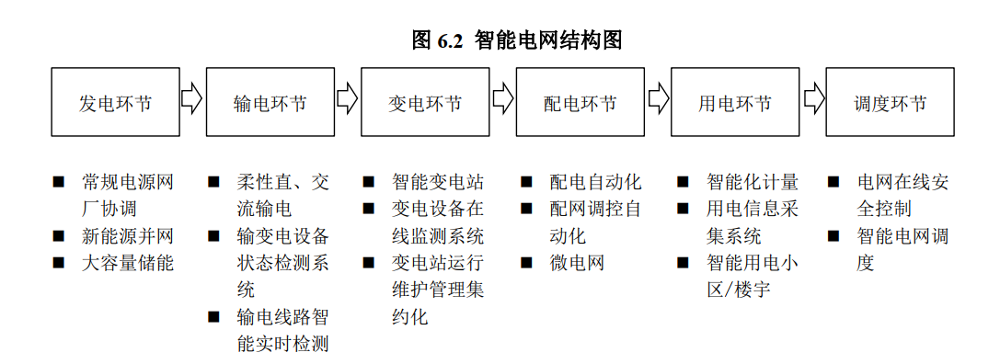

# 智能电表(20191001)

### 总结

智能电表行业，在前面泛在电力物联网的了解上，我们已经知道，这是属于感知层。

我们要充分的清楚，这是一个充分竞争的行业，国网过往的中标历史上可以看到，没有一家独大的局面出现，现在目前驱动的主要是国网中标带来的业绩驱动。

在目前的两轮招股标中，结合中标金额，企业的专注度等，海兴，三星，林洋比较值得关注，至少是我比较感兴趣的，给合股价表现，我们的重心还是 海兴和三星上面。

海兴电力之前大部分业务都主在在海外，形成比较完善的配用电自动化的相关核心技术，涵盖传感、通讯、信息
处理、业务管理软件等领域，智能用电系列产品系列齐全、技术先进，具有很强的国际竞争力 。多年以来一直是中国表计产品的出口领头企业；国内业务覆盖国内除西藏外的所有省市，成为国家电网主要的智能电表及智能配用电产品供应商 

三星医疗咋一看还以为是医疗股，结果才发现占比高的收入来自配用电业务，另外一部分来自医疗服务，还有来自一些投资收益的金融资产。配用电上，主营产品覆盖智能计量、智能开关、智能配电系统、电力箱、配网自动化、智能充电桩设备，是领先的智能配用电整体解决方案提供商。 

### 一、电表行业

#### 1. 智能电表概述

电能表的发展历程可以分为感应式（机械式）电能表、普通电子式（多功能）电能表和智能电子式电能表三个阶段。上世纪 60 年代以前，电能表基本上采用电气机械原理，其中应用最多的是感应式电能表；上世纪 70 年代起，人们开始研究并试验采用模拟电子电路的方案，到了 80 年代，大量新型电子元器件的相继出现，为模拟电子式电能表的更新奠定了基础。而在中国， 2005 年之前国内使用的电能表主要是传统的感应式电能表；从 2005 年开始电子式电能表的销量首次超过了感应式电能表。 

智能电表是一种新型的电子式电能表，它由测量单元、数据处理单元等组成，具有电能量计量、信息储存及处理、实时监测、自动控制、信息交互等功能。相对普通电表， 除具备基本的计量功能以外，智能电表带有硬件时钟和完备的通信接口，支持双向计量、自动采集、阶梯电价、分时电价、冻结、控制、监测等功能，具有高可靠性、高安全等级以及大存储量等特点，可以为实现分步式电源计量、双向互动服务、智能家居、智能小区等奠定基础。

智能电表是智能电网数据采集的重要基础设备，对于电网实现信息化、自动化、互动化具有重要支撑作用，属于 AMI 系统的重要组成部分，承担着原始电能数据采集、计量和传输的任务，是实现信息集成、分析优化和信息展现的基础。智能电表的广泛应用能够提高电力企业的经营效率、促进节能减排，增强电力系统的稳定性。 

据相数分，分为单相和三相电能表。目前，家庭用户基本是单相表，工业动力用户通常是三相表。

#### 2.上游行业情况

本行业的上游行业主要是电子元器件、结构件等行业。电子元器件主要包括集成电路、印制板、液晶、电池、电阻电容、二三极管等。电子元器件行业属于完全竞争市场，本行业生产制造所需的电子元器件在国内外市场都可以得到充足的供应。长期来看，元器件的采购成本将不断下降。结构件主要包括塑料件、金属件、互感器等。行业内企业的主要原材料成本为电子元器件的采购成本，本行业受上游行业成本波动影响较小。  

#### 3.下游行业情况 

本行业的下游行业主要为电力行业，随着全球智能电网建设步伐的加快，该行业具有显著的增长空间，进而促进本行业在未来较长的一段时间内继续保持快速增长的良好态势。 

### 二、投资逻辑

#### 1. 国网招标总量增长主要受益存量更换、新标准出台和泛在电力物联网。

2019 年智能电表国网两轮集中招标总量有望达到 7391 万只，较 2018 年同比增长 37%。 我们认为总量快速增长主要受益两方面原因：

(1)国家电网上一轮智能电表改造主要发生在 2009-2015年，而智能电表使用寿命一般为 8-10 年， 因此 2019 年是存量智能电表更换元年。

(2)国家电网公司大力推动泛在电力物联网，电表行业有望出台新标准，更多功能升级需求倒逼智能电表更新换代。 

#### 2. 智能电表新标准及泛在电力物联网新应用共同推动头部企业市占率提升

(1)2015-2017年为国网智能电表招标下行周期，导致部分实力较弱的电表企业退出市场竞争。

(2)新一代智能电表标准出台在即，新标准要求的功能模块更加复杂，对应具备制造能力和资质
的电表企业数量更少，头部企业有望获得更高的市占率。

(3)泛在电力物联网对智能电表应用提出更高要求。 

### 三、招投标

#### 1. 国网年内第一轮招标 

#### 2. 国网年内第二轮招标 

​	

