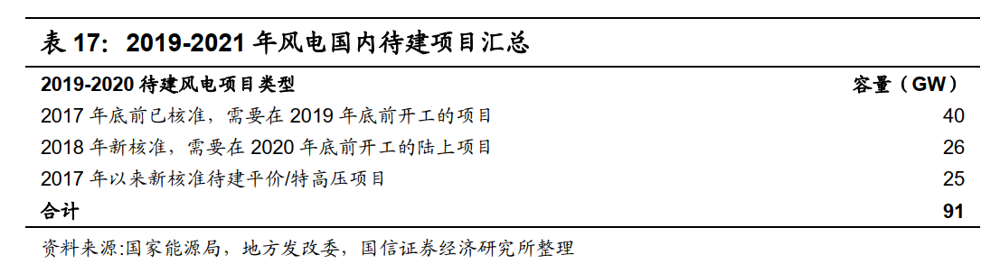
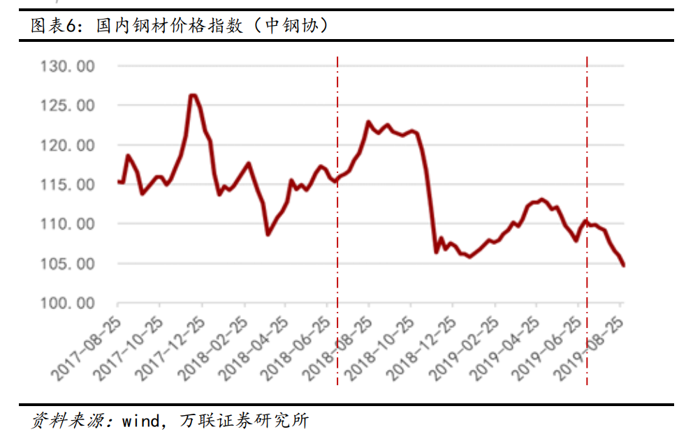
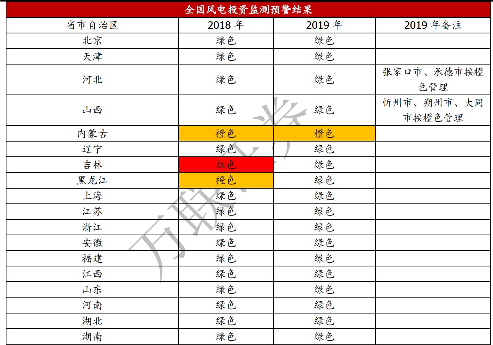
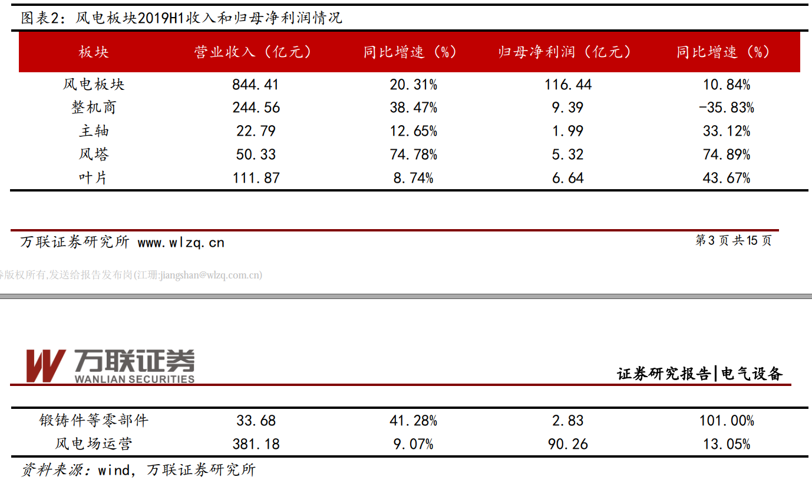

# 风电(20191007)

### 总结

趁着国庆的尾巴，赶紧把风电的知识给补上，买不买的是另一回事。现在正是学习的阶段，很多股票的演绎还不够熟悉，就因为偏见，年底没研究猪，没有然后了。

此次风电受到不少人推荐，我是后知型的，其实在前阵子，有看到风电票，只是没那个觉悟，放过许久，在各路大V的推荐下，我也跟风研究了下，主要是熟悉此类型的事件下，股票如何演绎。

最近看了后，有些风电在这两年确定性确定比较高，业绩也有一定保障，还是值得关注的，也算是打破自己的舒适区，研究研究不同类型的企业。

毫无疑问，此次风电的不少企业业绩爆表就是抢装驱动下的业绩浪，但是此次的周期，有些企业还是值得跟踪的，像现在进入四季度了，三北地区那么冷，风塔肯定是先弄上去的，不然，那么冷不好搞了。我这边是南方，我家对面山上几年前就有中广核的风电场，只是没说是意识到这个行业。

整个行业，我谈不上熟悉，至于交易，让市场告诉我们声音。

### 一、风电行业

#### 1. 平价前夕三北重启 中国风电进入“抢装” 2.0 时代 

2018 年行业装机容量在经历了连续两年的下滑后触底回升。我们预期 2019 年随着三北市场升温、风电平价项目试水、海上风电的加速开发，以及低风速地区存量核准项目的抢装，行业吊装量进一步提升至 28GW 以上。 

风电是我国能源转型进程中的主力增量电源之一
我国非化石能源消纳占比自“十二五”以来持续改善，每年约提高 1%，截至 2017底我国一次能源非化石能源占比 13%，但横向对比欧美发达国家普遍在 15%以上，法国和丹麦更是达到 48%和 24%。假设之后几年仍保持相同的提升速度，预计我国和发达国家间的差距还需要 2-3 年的时间来追赶。 

非化石能源中过去我国水电占比较高，而风电和光伏的占比过低，考虑我国水电资源供给趋于平稳，能源结构调整主要依靠平价后的风电、光伏。 

#### 2.2018 年北方三省摘“红帽”释放装机增长潜力 

2018 年内蒙古、黑龙江、宁夏三省区顺利脱下红色预警地区的“帽子”，重新启动了风电项目核准和开发建设活动。目前风电建设依然停摆的只有新疆、甘肃、吉林三省。

#### 3.2018 年低风速地区预演抢装行情 

截至 2018 年初，国内自 2015 年-2017 年已核准未吊装的风电项目容量超过70GW，这些项目如果未在 2019 年底之前开工（首台机组完成基础浇筑）的话，将面临核准补贴作废的后果。因此 2018 年以来国内存量核准项目的建设进度逐步加快。 

#### 4. 待建项目

预计 2017 年底之前已经核准并需在 2019 年底前开工的项目有超过40GW（2018年新招标项目为 37GW），加上 2018年新核准陆上项目超过 26GW，特高压配套风电项目、风电平价基地和 2017 年批复的风电平价示范项目合计25GW，预计 2019-2020 年需要开工建设的项目总容量高达 91GW，即使不考虑 2019 和 2020 年的新增核准项目， 2019-2021 年均新增风电并网容量也已经超过 30GW，将对整个风电设备产业链的供应能力带来巨大考验。 

#### 5. 关于完善风电上网电价政策的通知

2019 年 5 月，根据发改委发布《关于完善风电上网电价政策的通知》，为获得补贴，2018 年底之前核准的陆上风电项目需 2020 年底前完成并网， 2019 年 1 月 1 日至 2020 年底前核准的陆上风电项目需在 2021 年底前完成并网。自 2021 年 1 月 1 日开始，新核准的陆上风电项目全面实现平价上网，国家不再补贴。因此， 2019-2020 年的风电装机需求具备高度确定性。 

此次《通知》 将风电补贴执行的时间标准由之前的“开工建设” 改为“完成并网” ，有望加速国内已核准风电项目的建设节奏 

#### 6. 钢材价格

从 2019 年 7 月开始，钢材价格开始出现明显回落，随着成本的降低从零部件端逐步传导到整机商，加之低价风机订单预计将在 9 月份全部出清，整机商毛利率有望迎来拐点。

#### 7. 风电投资监测 

### 二、海上风电

#### 1. 中国海上风电未来发展潜力巨大 

我国海上风电起步较晚， 2007 年首台海上风电机组在渤海湾石油钻井平台吊装，2017 年才开始实现年装机超过 1GW 的规模化发展。但我国凭借海上资源稳定、大发电功率、便于消纳等特点，近年来资源开发迅速，市场前景广阔， 装机规模连续 5 年快速增长。 根据行业统计， 2018 年我国海上风电招标容量约 5GW，同比增长 60%。 

我国海上风电已基本具备大规模开发条件，下一阶段须通过技术创新和规模化开发，尽快摆脱补贴依赖，通过市场化方式实现快速发展。 参照欧洲发展海上风电的经验，机组的大型化、规模化对于降低海上风电度电成本有显著作用。目前国内 2.5-4MW 的海上风电机组技术已经成熟， 5-6MW 机组已经正式在市场中批量应用，新型大功率风力发电机正在逐步取代由陆上机组过渡而来的中小型风力发电机。此外，施工运维、勘测设计方面国内的施工方也在逐步积累相应经验。 

#### 2. 海上风电抢核准 

5 月 8 日由国家能源局组织召开 2019年风电建设管理办法征求意见座谈会，对于已核准海上风电项目， 必须在 2021 年底之前建成并网，方可享受 0.85 元/度的上网电价。结合当前的核准量，海上风电也会在未来三年实现可观的增长。 从公司层面也得到验证，金风预计今年海上风电装机0.6-0.7GW，明年预计 1GW。从招投标理性的角度看， 国内首个海上风电项目——奉贤海上风电项目竞争配置招标价格来看， 0.65 元/度的龙源电力落选，而 0.7388 元/度的上海电力股份和上海绿色组成的联合体中标。彰显海上风电招标的理性，同时也利好行业的长期稳定发展。

### 三、风电行业格局

#### 1. 风电产业链

为了深入了解整个风电产业链各细分板块的经营情况，我们将风电行业分为运营商、整机商、主轴、风塔、叶片、锻铸件等零部件 6 个板块。 

#### 2. 风电产业2019年上半年盈利情况

### 四、风塔行业

#### 1. 行业竞争格局 

风塔高达几十米甚至上百米，需要承载重达上百吨的整套主机系统，承受叶片旋转带来的振动。风电场所处通常自然环境比较恶劣，需要长年经受温差、风沙、雨水、强风、 高盐等外部因素考验， 看似结构简单但可能隐藏着极大质量风险，且维修难度和成本较高。因此，风电机组对风塔产品的可靠性和稳定性要求极高。 近年来随着市场调控与整合进程的加快，国内风电场、整机行业的集中度逐渐提高，寡头竞争格局基本形成，这将促进下游零部件行业的加速整合。目前，国内塔架生产企业约 100 多家，然而这些厂商的规模与技术水平存在着较大的差异。 2.0MW 及以上风机塔架市场份额被少数实力较强企业所占据。 

行业内主要企业包括天顺风能（苏州）股份有限公司、上海泰胜风能装备股份有限公司、辽宁大金重工股份有限公司及本公司。随着国家对清洁能源需求的持续增长及风电市场竞争的良性化、优质化，行业内龙头企业将获得更多的发展机遇，市场空间广阔。 

### 五、重点企业

#### 1. 天能重工

天能重工9月27日公告，公司成为“中广核内蒙古兴安盟风电场塔筒采购-标段2”的中标候选人，该标段涉及塔筒采购需求351台，预中标金额为9.25亿元，占2018年经审计营业收入的66%。公司尚未收到中标通知书，最终能否中标及是否能够签署正式合同均存在不确定性。

#### 2. 运达股份

报告期内，公司各项业务进展顺利、经营业绩稳步提升、在手订单快速增长，公司新增订单4,283.3MW，同比增长410%。公司累计在手订单7513.3MW，金额达到261.68亿元，包括已签合同尚未执行的项目和中标尚未签订合同的项目，其中2MW及以下风电机组（含2.2MW） 2355.5MW、 2.5MW风电机组3775MW、3MW风电机组1050MW、 3MW以上风电机组332MW。
2019年1-6月公司营业收入为人民币147,939.26万元，同比上升17.41%；实现归属母公司净利润为人民币1,203.28万元，同比上升28.54% 

