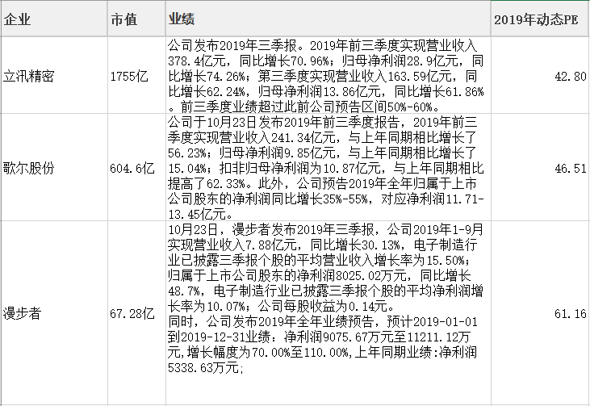
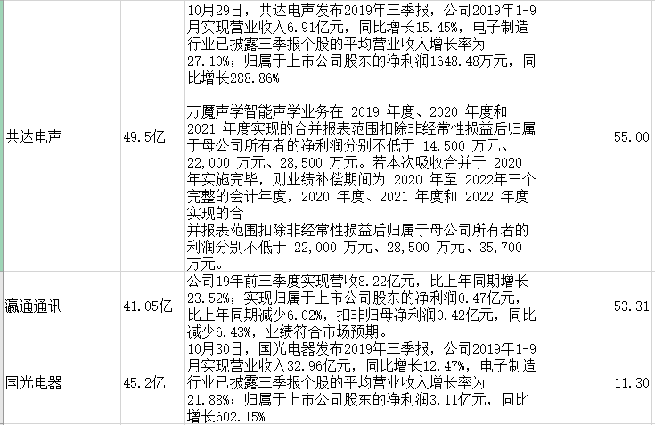
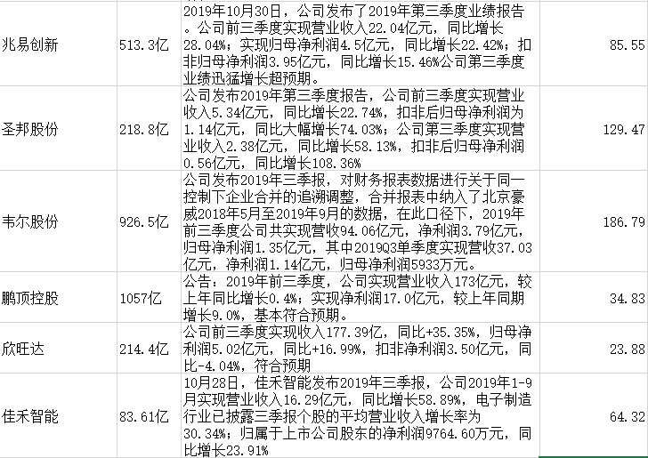
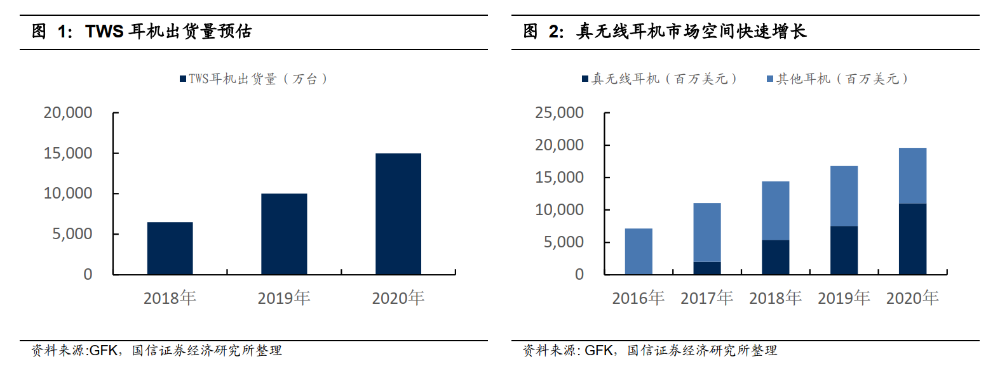
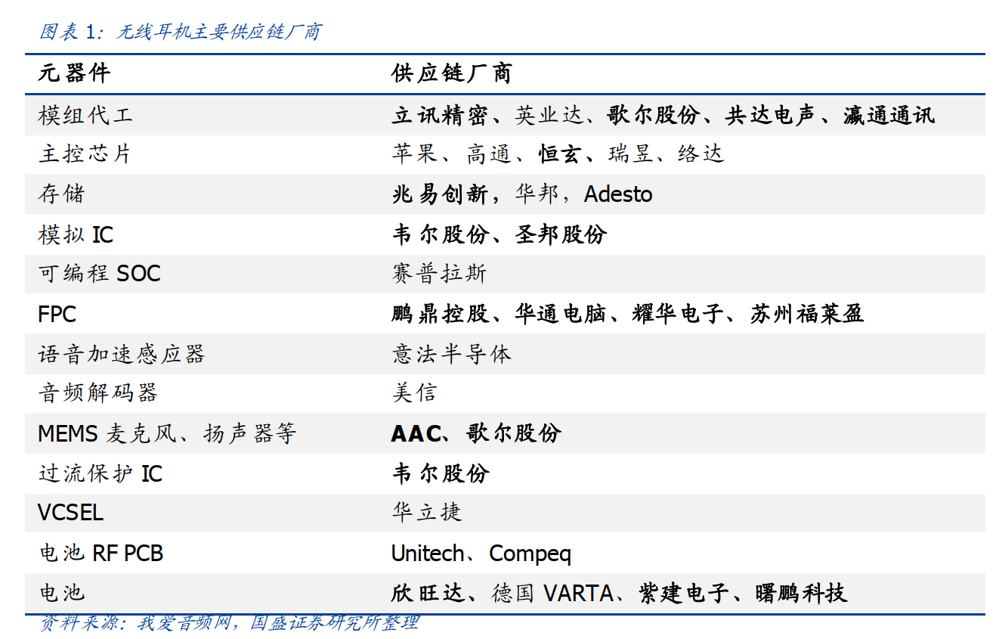
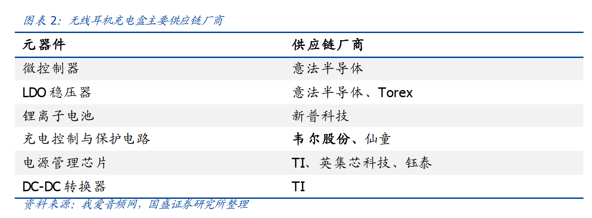
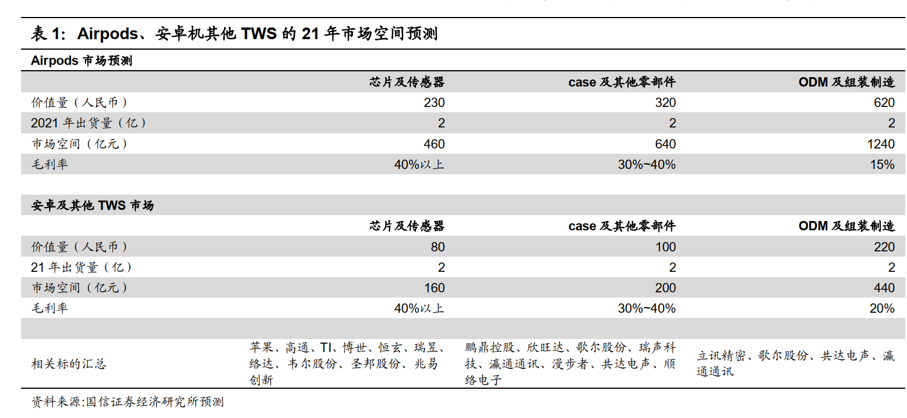
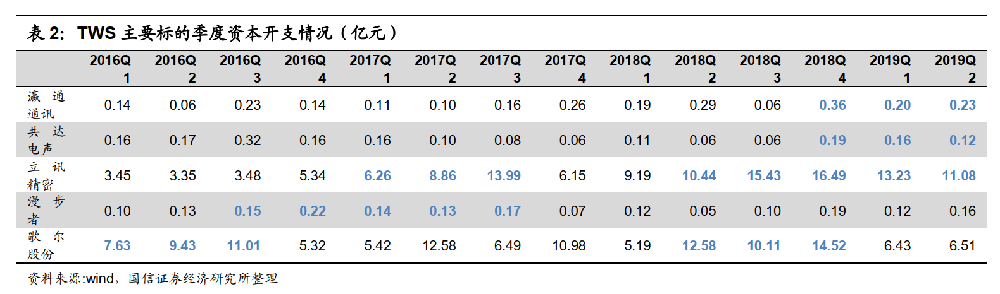

# TWS无线耳机(20191103)

### 总结

坦白说，对TWS的挖掘还是比较落后的，也深感一个个体对背后逻辑把握的信息不够迅速，但是，没有绝对的标准。

谈谈怎么会发现TWS，其实很简单，立汛和歌尔在大科技的那一波中，因为对大科技没有多少跟踪，没注意到TWS的逻辑，在医药出清后，我也在跟踪背离和潜在的趋势股，然后，漫步者和共达之类的不断跑进来，一开始我是不认识，跑出来了多次后，我就烦了，就查资料，然后，发现TWS的增量市场。然后在上雪球和各公众号溜了一圈，哇咔咔，TWS一下有点焦点味道，好，也不好，且行吧。

目前苹果的Airpods爆量比较确定，未来的主要看点是，安卓的爆量，从今年的华为，小米等推出TWS，明年才可能是各种安卓量的爆发点。

漫步者是最近的龙头，但是共达如果在万魔并表后，在真实的业绩驱动上，还真不好说。

自产自销: 漫步者，共达电声(万魔)

ODM: 共达电声(给小米代工)，佳禾智能(给国际大厂ODM)，瀛通通讯

其他的信息，大家可以参考下面的表格。

上游的芯片厂商方案，变成红海了，成本不断降低，这也是不断导入到下游销量爆发的关键，受益于市场容量扩大，也是有利润的。

下游的代工，反而是声学的特殊性价值不小，其他的就是消费品牌的量了，目前比自有品牌的就是漫步者和万魔。

 

### 一、TWS行业

#### 1. 概述

TWS，即 True Wireless Stereo 的缩写， 真正无线立体声。自苹果 16 年推出第一代 Airpods 后，快速成长为最受欢迎的苹果产品之一， 根据 Counterpoint 的数据显示，在 2018 年第四季度中， AirPods 的出货量占到了市场的 60%，达1250 万台， 18 年全年总出货量达到 3500 万部， 排在第二位至第五位的品牌分别为索尼、三星、 Bose 和 Beats（苹果旗下）。 Airpods 的热销彻底引爆 TWS市场， 并引领整个声学产业链新一轮的成长机遇。 

根据 GFK 的数据预测， 2018 年全球 TWS 耳机出货量将达到 6500 万台，2019 年一季度 TWS 耳机 1750 万台，第二季度随着 TWS 耳机出货量提升到2700 万台，全年则预计是 1 亿台以上， 2020 年则预计将有 1.5 亿台。整个 TWS耳机市场将从 2017 年的 2 亿美元增长到 2020 年的 110 亿美元以上。 即使按照TWS 耳机 200 元的平均单价，以全球每年 15 亿部智能手机的出货量估算， 如果 TWS 平均渗透率达到 50%，则理论上全球 TWS 耳机的年产值在 1500 亿以上。 

**从无线耳机未来的发展来看， 更长的电池续航， 主动降噪（ ANC）和高分辨率音频，更低的延时等特性将是产品差异化的核心因素，带动整个 TWS 市场成为未来几年内成长性最好的赛道之一。** 

#### 2.产业链下游蛋糕最大，受益程度最深 

从产业链的上中下游来看， 上游主要是芯片和方案厂商， 中游主要各种零部件比如 PCB、 电池、 扬声器、线缆、天线等， 下游主要是整机组装或代工厂。 从产值划分来看， 随着上游芯片厂商加速退出低成本的成熟方案， TWS 芯片价格持续下滑， 上游 TWS 芯片行业的利润率有所压缩， 但整体市场空间快速扩大。TWS 对便携以及舒适度的要求更高，由于其内部空间更小，下游的整机组装环节更加复杂，对厂商的要求较高，我们认为下游整机组装是 TWS 产业中产值增长最快的环节 

### 二、产业链格局

#### 1. 产业市场空间

TWS 产业链按照产值结构将其划分为芯片及传感器、 外观结构件及其他零部件、ODM 组装制造三大类型 

#### 2. 从 Airpods 的 BOM 拆分看零部件的成长机会 

从 Airpods 最新的第二代产品的拆分来看， 单侧耳机的主板上共包含了约 16 颗芯片和传感器，其中包含可分辨的主芯片 apple H1 价值 11 美金， sony 的天线开关芯片 0.2 美金， Bosch 的三轴加速度传感器价值 0.35 美金， Cirrus Logic的音频芯片价值 1.4 美今， 歌尔声学的 2 颗波束成型麦克风合计价值约 0.4 美今， FLASH 存储约 1.6 美金。 其他芯片还包含环境光/距离传感器 0.4 美今，LDO 稳压器 2 颗约 0.12 美今， 以及其他的若干芯片。 

除了芯片以外，还包含电池、连接器、天线、 MEMS 贴片硅麦、 防尘网、 保护壳、 麦克风盖板等其他零部件。 元器件方面，包含 01005 电感 1 颗，其他 0402 、0201、 0603 等电感共计 10 颗， 01005 电容 50 颗， 其他电容 46 颗， 电阻合计47 颗。
从拆解图来看， Airpods 2 代整体设计异常紧凑， 整体装配组装难度较大， 从元器件的 BOM 列表来看， 单个耳机芯片和传感器总价值量约 16.55 美金。 两个耳机的芯片总价值量为 33.1 美金。 

#### 3. 主要受益公司资本开支和营收增速情况 

从上文的分析我们得出 ODM 是目前市场最大，国内产业链受益程度最深的环节， 我们对 A 股目前的 TWS 下游的 ODM 以及整机制造受益标的进行梳理。并做对比分析。
我们列举主要 TWS 耳机 ODM 制造标的的季度资本开支情况。 对比其峰值与低谷。资本开支的大幅提升，是制造业类公司扩产或者开拓新产品的标志性信号，并有助于判断其业绩拐点。 

可以看出 TWS 耳机行业主要标的自从 18 年以来纷纷增加了资本开支， 龙头公司如立讯、歌尔率先在 18 年 Q2 就开始了较大的资本开支， 主要是应对新产品所致。 而二线标的则在 18Q4 开始显著增加资本开支。 我们认为主要是 TWS 耳机方案的成熟，下游需求爆发， 芯片厂商增加出货量， 并带动整体行业景气度向上。 

​	

