# 牙科(20191119)

### 总结

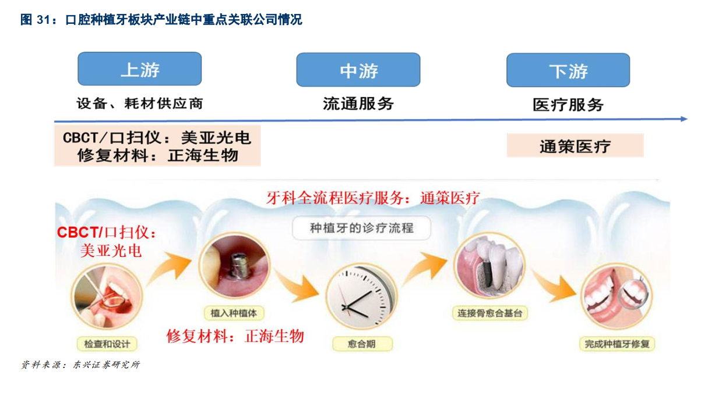

牙科行业，目前在市场上的关注标的比较简单，就三家

正海生物，国产独家口腔修复膜继续分享种植牙行业高成长红利 ，目前占比10%

美亚光电，优秀的国产 CBCT 生产企业，在低端市场占据30%

通策医疗，大连锁模式深耕牙科医疗服务领域，最容易理解了，曲奇模式的模板

这次会梳理一下牙科，比较简单，发现正海异动~~(说好的价值投资呢，又看线~~)，虽然不清楚原因，但研究研究总不会错，牙科三雄业绩增速都相对稳定，

美亚光电， 2019 年前三次展会团购销量超 1300 台，同比增速接近 80%，有点加速的味道。

这些都是我们长期要跟踪的目标

通策在70亿左右时看闲大就在买入了，当时认知水平不够，赚不了这个，没毛病。

正海，作为次新股时，开始进入视线的，倒是倒腾过阵子。

美亚光电，去掉就在跟了，只是之前CBCT不够放量，没有跟踪，三季报没及时看，倒是有业绩加速的趋势，现在重新关注起来。

### 一、 种植牙

#### (一) 概述

​	种植牙是指将纯钛的人工牙根植入患者的牙槽骨内，并通过骨整合的方式与牙槽骨结合， 然后将基台与
上部的人工牙冠连接来完成牙齿修复。 主要有单颗种植、多颗种植、全口种植等修复方式。

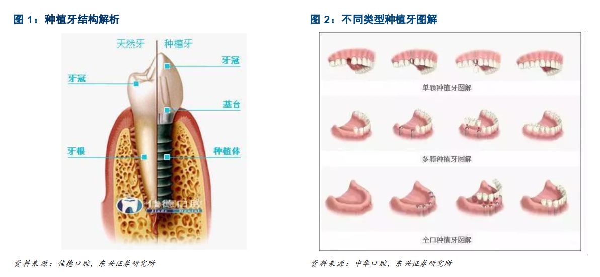

#### (二) 种植牙手术 

​	种植牙手术主要分为三个步骤，常规种植周期约 2-3 个月。 一是术前检查、制定种植治疗方案，二是种植手术阶段，三是修复牙冠。可根据不同的种植周期，分为如下三种情况，（1） 常规种植，一般是拔牙后 2-3 个月进行种植牙齿， 主要用于后牙种植； （2）早期种植，拔牙后 6-8 周后进行； （3）即刻种植，拔牙后立刻种植，主要用于单根牙。 

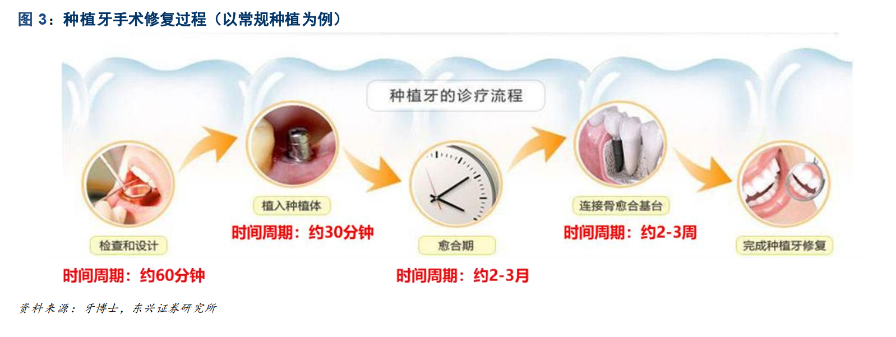

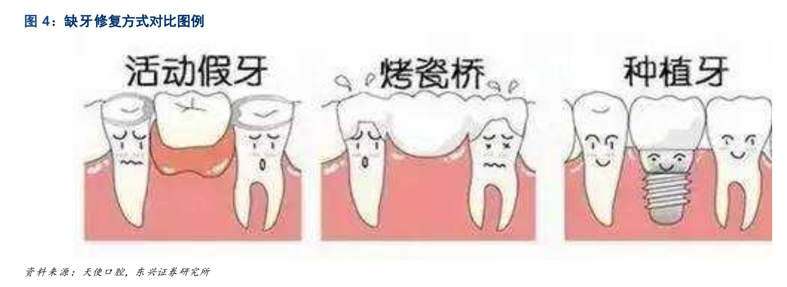

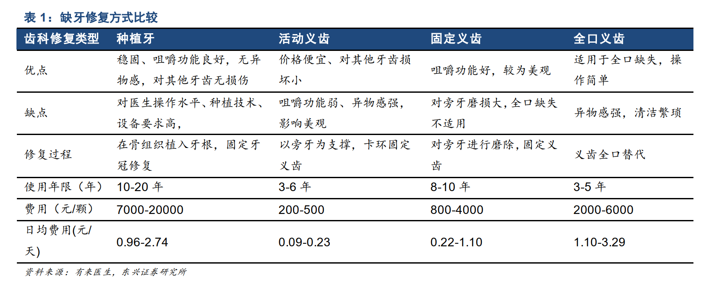

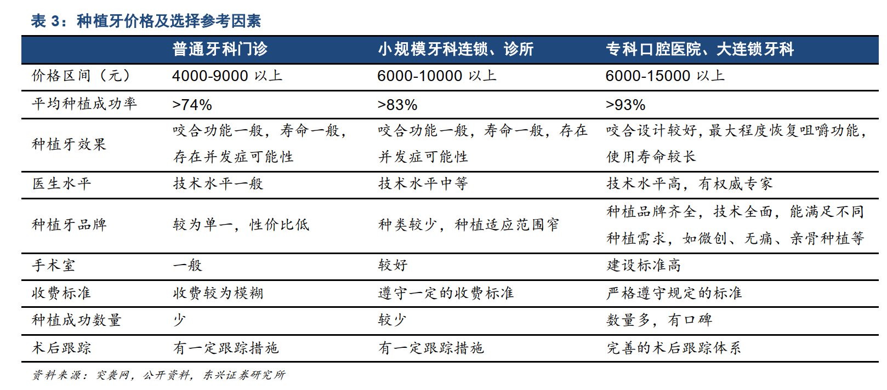

#### (三) 口腔子领域增速

以通策医疗为样本分析中高端口腔医疗服务就诊患者治疗结构，牙齿种植、牙齿正畸为口腔服务的核心领域，其中牙齿种植患者在所有就诊患者中占比约为 20%。 通过口腔细分领域三年平均增速来看； 高端口腔服务中的隐形正畸、 种植牙的平均增速为 34.6%、 23.2% 

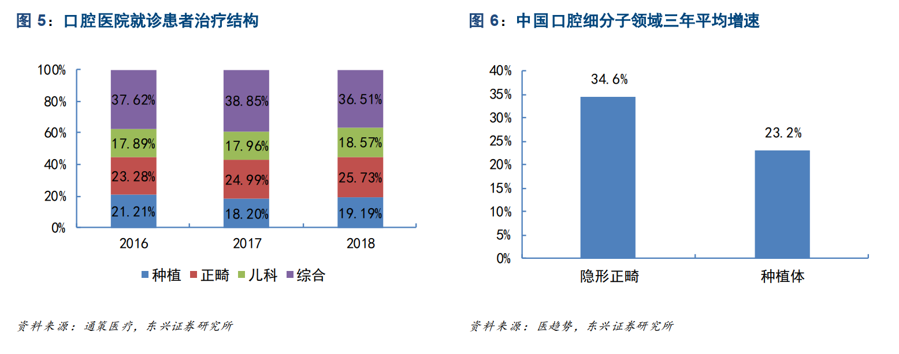

​	国内种植牙年使用量达 240 万颗， 七年复合增速 52%。 在 2011 年-2018 年，国内种植牙数量由13 万颗增长到约为 240 万颗，复合增长率达到 51.7%。根据市场价格来看， 单颗牙的出厂价约3750-9375 元，终端市场价格约 7000-20000 元，种植牙的出厂端市场规模约 90-225 亿元，终端市场规模约 168-480 亿元 

#### (四) 中国中老年人群总计缺牙数达到 22.88 亿颗 

​	中国 60 岁及以上的人口在 2018 年已经达到约 2.49 亿人，占总人口比例 17.90%，高龄人口呈现稳定增长趋势。 老年人缺牙治疗率大幅上升。随着人口年龄增加，缺牙人口比例不断上升，其中 55 岁以上缺牙人口比例高于 50%以上，人口老龄化的发展不断打开种植牙市场空间。 

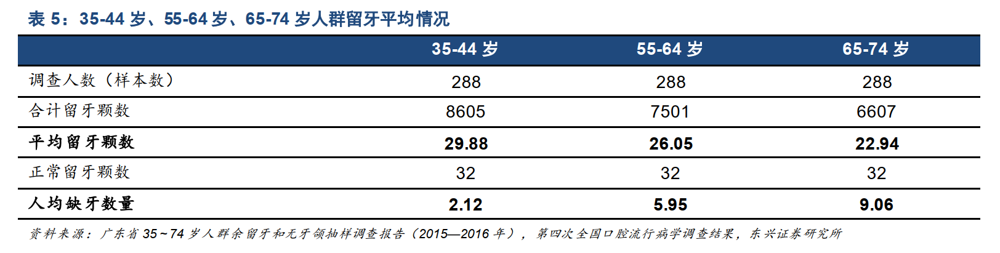

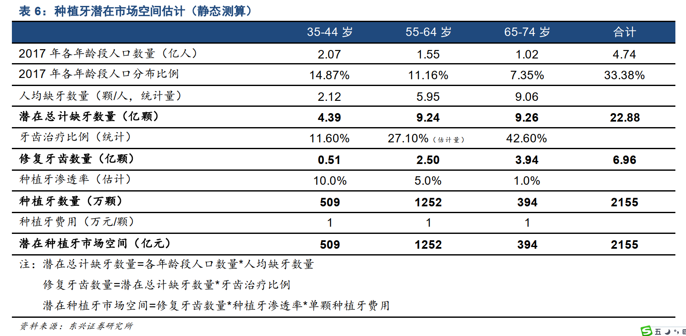

#### (五) 牙科医生供给 

​	通过比较专科民营医院的利润率与人力成本占比指标，口腔医院的人力成本占收入比例最高，达到 44.3%， 但利润率约为 12.5%， 位列第二， 仅次于眼科医院，这表明口腔医院对医生的依赖度大，需要保证相关科室医生的供给以满足医疗服务需求，且口腔科医生的人均盈利高，给口腔医院培养医生、扩张业务提供较大动力。 

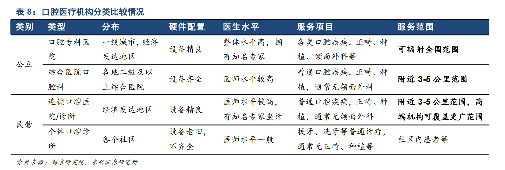

### 二、产业格局

#### (一) 产业链： 核心种植体由外资垄断，修复材料加速国产渗透，检测设备实现低端替代 

​	通过单颗种植牙的费用占比来看，产业链上游费用占比 75%，其中种植体费用占比为 40%，修复材料费用占比 16%，下游的诊疗手术费用占比 25%，估计上游市场空间约 1616 亿元，下游诊疗服务市场空间为 539 亿元。 

#### (二) 核心种植体

​	核心种植体由外资垄断，国产品牌跟随渗透。 根据 Straumann 统计来看， 2018 年全球种植牙行业上游的种植体的市场格局中 CR5=71%，其中 Straumann 市占率第一，高达 25%。在中国上游种植体的市场中，进口品牌占比约 90%以上，国产品牌为 10%左右，但是国产品牌不断进行研发、追赶国际领先技术，获批上市的种植体系数量逐渐增多。 

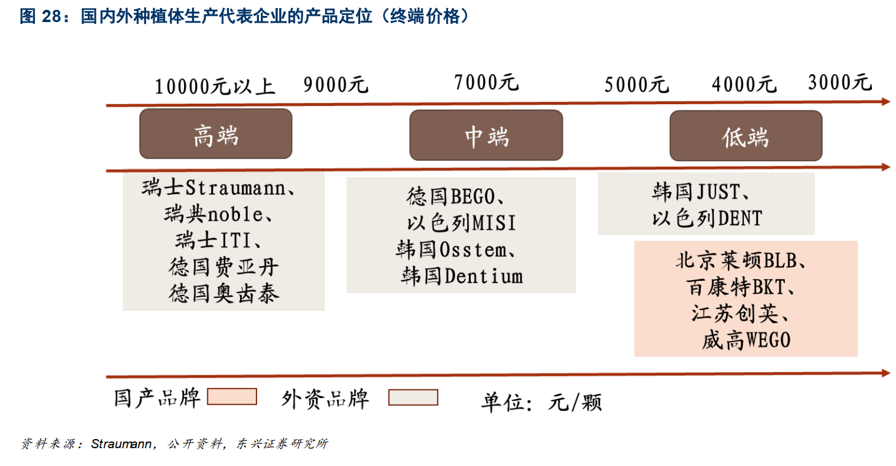

#### (三) 口腔修复膜 - 正海生物

​	国内市场中瑞士盖氏的修复修复膜占比达 70%，正海生物的独家海奥口腔修复膜市场占比约 10%以上，鉴于临床疗效不劣于进口产品，产品价格远低于进口产品，进口替代空间充足。 

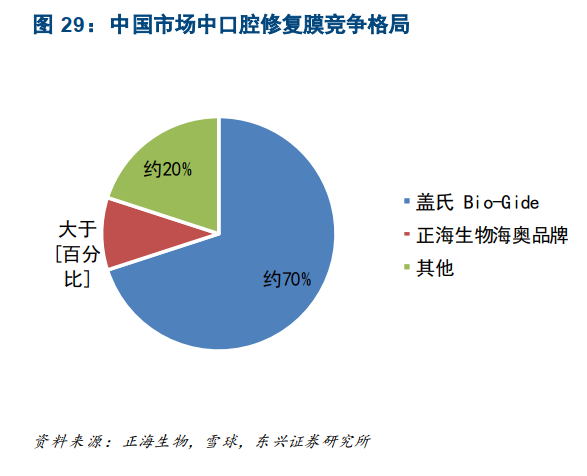

#### (四) 国产检测设备 CBCT - 美亚光电

​	长期以来，口腔 CT 市场由外企垄断。德国卡瓦盛邦、德国西诺德，芬兰普兰梅卡等国际品牌占据国内高端市场，产品质量过硬、售价高昂。国产品牌经过多年技术积累，已经基本占据低端市场，逐渐向中高端渗透。 

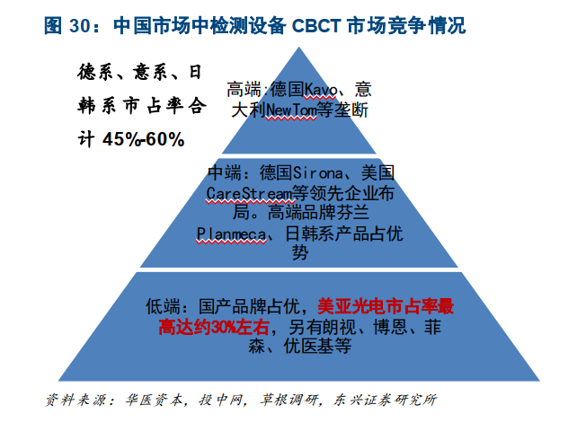

### 三、重点关注

#### (一) 正海生物 - 国产独家口腔修复膜继续分享种植牙行业高成长红利 

​	引导骨再生术治疗骨量不足，口腔修复膜可提高种植牙成功率。 在临床种植牙手术中，患者骨量充足实现种植体固位是手术成功的关键因素之一。引导骨组织再生术（Guided Bone Regeneration, GBR）作为增加牙齿或种植体周围骨量的成熟技术，其中口腔修复膜对营造骨再生有利的环境不可或缺，根据临床研究来看，使用修复膜的实验组患者的骨厚度、骨生长效果、种牙成功率明显高于对照组。  

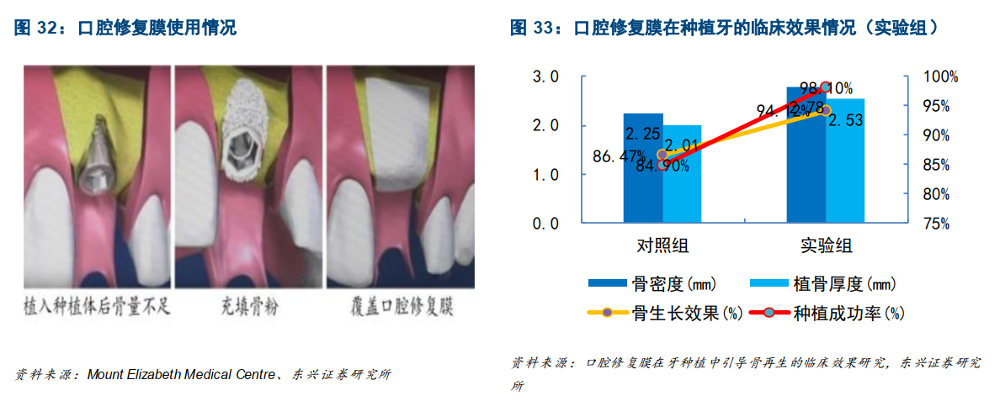

#### (二) 通策医疗：大连锁模式深耕牙科医疗服务领域 

​	可复制的大连锁发展模式，内生外延双轮驱动。 公司深耕牙科医疗服务，通过精准的市场定位，采取差异化定价策略，形成可复制的成熟连锁发展模式。通过打造医生集团，实现人才团队建设；以浙江为出发点，深耕优势区域，牙科服务不断向外辐射，通过成熟医院模式持续实现专业医疗机构的外延建设。 

#### (三) 美亚光电：优秀的国产 CBCT 生产企业 

​	CBCT 为口腔科必要工具，高检测精准度，低辐射剂量。 CBCT 能从三维角度，矢状位、冠状位、水平位来显示病变组织和正常组织，可以克服二维平片的图像不清晰、图像重合的缺点，且能够定量确认种植位置。 

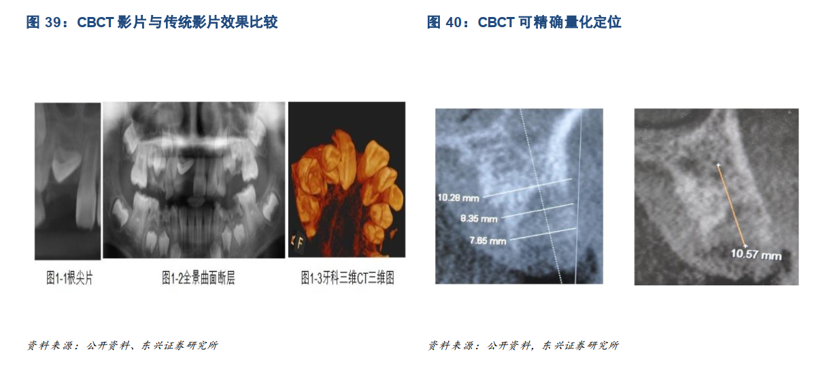

​	国内 CBCT 销量增长迅速，美亚光电市占率达到 30%。 CBCT 可应用于口腔全领域，随着口腔行业的蓬勃发展， CBCT 的销量受口腔医疗机构的需求拉动，自 2013 年-2017 年， CBCT 销量由 682 台增加到约 3000 台，年复合增速 44.82%；公司的 CBCT 产品由 61 台增加到 1040 台，公司市占率约为 32%左右。 