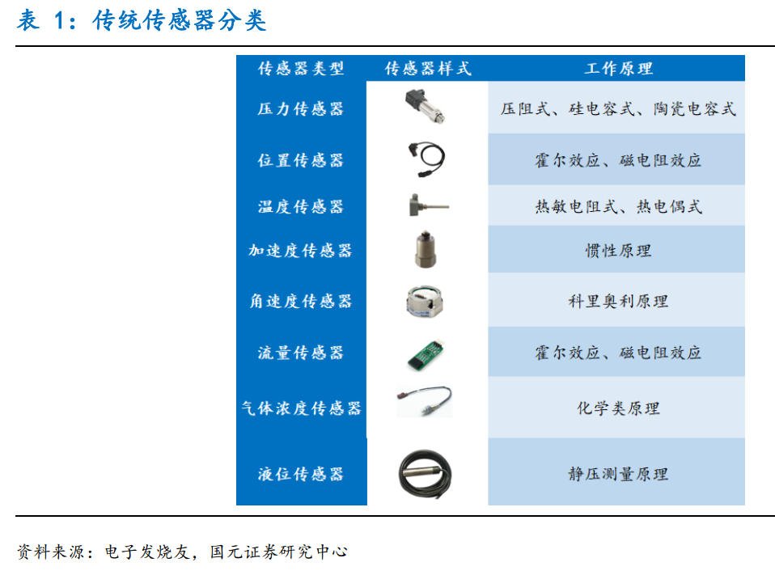
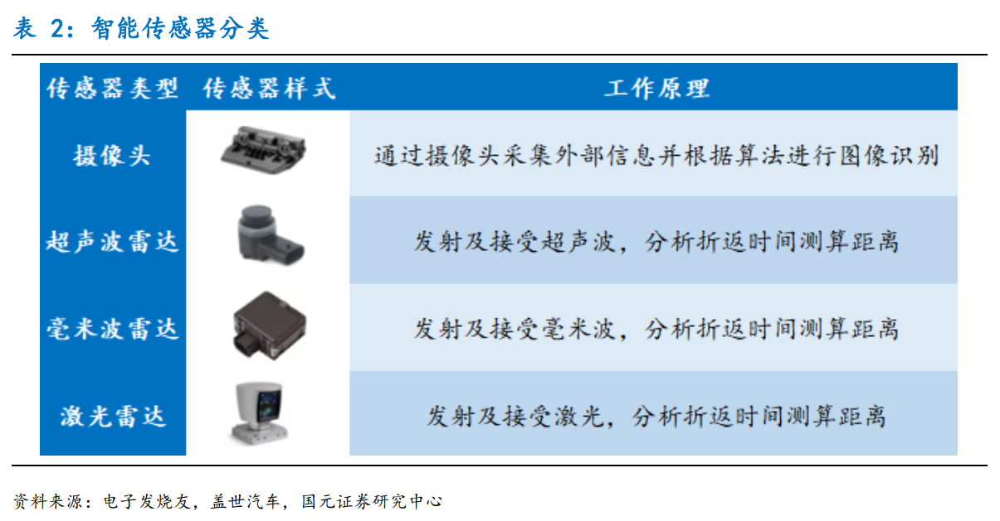
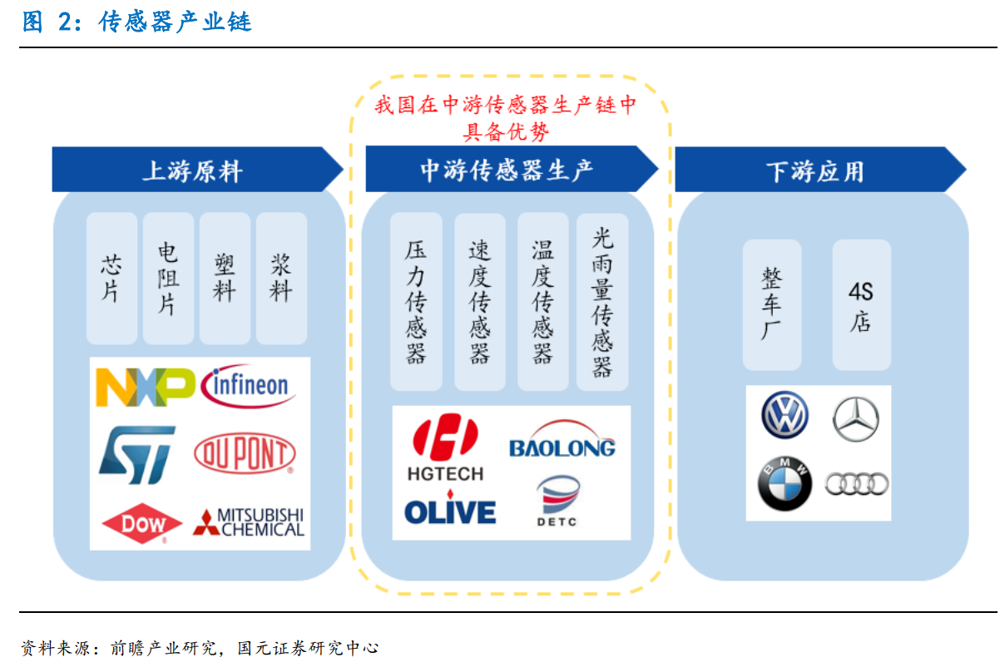
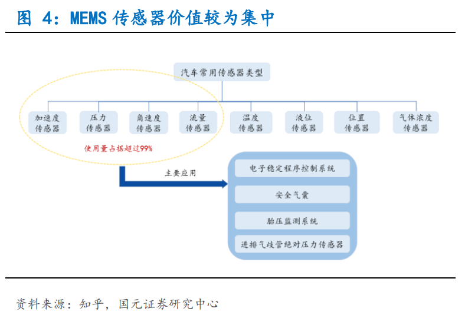
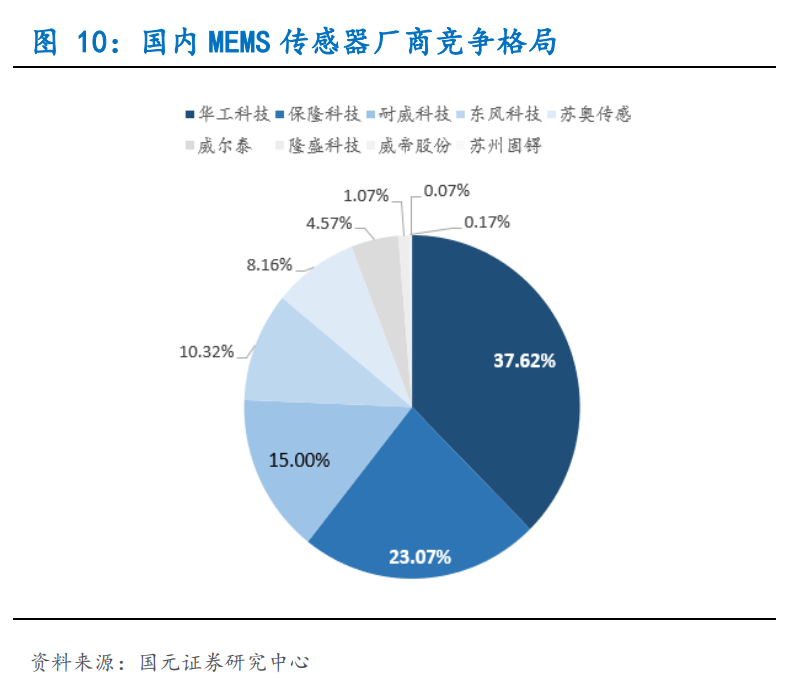

# 传感器(20200301)

### 总结

### 一、传感器

### 二、汽车智能传感器

从目前汽车传感器装备的目的不同，可以分为提升单车信息化水平的传统微机电传感器和为无人驾驶提供支持的智能传感器两大类。 

#### 1. 传统传感器 

各个系统控制过程依靠传感器，进行信息的反馈，实现自动控制工作；是汽车的“神经元”。 **汽车传统传感器依照功能可以分为压力传感器、位置传感器、温度传感器、加速度传感器、角速度传感器、流量传感器、气体浓度传感器和液位传感器等 8 类。**

汽车传感器主要应用于动力总成系统，车身控制系统以及底盘系统中。汽车传感器在这些系统中担负着信息的采集和传输功用，它采集的信息由电控单元进行处理后，形成向执行器发出的指令，完成电子控制。 

#### 2. 智能传感器 

智能传感器是无人驾驶车辆的“眼睛”。 随着汽车无人驾驶技术的突破，汽车电子开始注重传感器的智能化发展；汽车正在向一台安全联网的自动驾驶机器人快速演进，进行环境感知、规划决策，最终实现安全抵达目的地。**目前应用于环境感知的主流传感器产品主要包括激光雷达、毫米波雷达、超声波雷达和摄像头等四类。** 

#### 3. 汽车智能传感市场

从目前汽车智能传感器的发展来看，毫米波雷达、激光雷达、超声波雷达和摄像头传感器将是未来发展的主要方向。其中，

超声波雷达在倒车领域的搭载率已经达到 45.2%，且国内部分头部企业具备相应的技术实力。

摄像头与毫米波雷达正在被我国逐步攻破；

全球摄像头市场有 50%以上被台湾大立光电、舜宇光学和玉晶光电占据；

毫米波雷达随着近年国内研发的突破，供应链开始稳定，并出现了一批新兴挑战者，如华域汽车、保隆科技、德赛西威等。

我们预计到 2025 年，我国智能传感器市场将直逼 800 亿元，其中毫米波雷达 80 亿元、激光雷达与超声波雷达192 亿元、摄像头传感器 315 亿元。 

#### 4. 多传感器融合将是未来必然趋势 

单种传感器特性突出，均不能形成完全信息覆盖，多传感器融合是未来发展必然趋势。目前自动驾驶环境感知的技术路线主要有两种：

一种是以特斯拉为代表的视觉主导的多传感器融合方案，

另一种是以低成本激光雷达为主导，典型代表如谷歌 Waymo。 

而国内大部分车企选择“摄像头+毫米波雷达+超声波雷达”融合方案，仅少数方案预留或安装激光雷达位置。 

#### 5. 国内在中游传感器生产环节具有优势 

汽车传感器产业链可大致分为上游原料、中游生产、下游应用等三大部分，国内在中游生产中具备优势： 

1）上游原料主要有芯片以及电阻片、塑料、浆料等电子材料。上游芯片对技术水平要求高，行业集中度较高，主要被外国厂商如英飞凌、恩智浦、意法半导体等垄断，国内企业面临着较高的进入门槛。

上游电子材料对试验检测设备和制作工艺的要求高，国内大陆电子材料产品多在中低端领域，高端市场基本上由欧美、日本、韩国以及台湾地区的厂商所垄断，如杜邦公司、陶氏化学、默克集团、三菱化学等 

2）中游厂商进行传感器生产，中游环节国内厂商基于成本优势和自主车企的客户群优势，存在极大的成长机会。国内主要厂商如华工科技、保隆科技、东风科技等与比亚迪、东风日产、一汽等主机厂具有良好的合作关系。

3）下游市场将传感器应用于整车厂和 4S 店。 

#### 6. MEMS 是获取信息和执行控制的重要汽车电子元件 

MEMS 传感器是在半导体制造技术基础上发展起来，采用微电子和微机械加工技术制造出来的新型传感器。 MEMS 传感器广泛应用于电子车身稳定程序(ESP)、防抱死(ABS)、电控悬挂(ECS)、胎压监控(TPMS) 等系统。其中，压力传感器、加速计、陀螺仪与流量传感器是汽车中使用最多的 MEMS 传感器，占汽车 MEMS 系统的 99%。 

#### 7. 国内 MEMS 传感器厂商竞争格局 

国内传感器供应市场呈现外商垄断格局，高端汽车传感器严重依赖进口。 外资利用电控系统打包传感器；掌握了汽车电子产品的核心技术，垄断高技术、高附加值新品。民族企业更多的在中低端、售后市场比拼价格。 中国的汽车传感器产品与国外同类产品相比，技术水平相差较大，高端汽车传感器严重依赖进口。从国内传感器厂商格局来看，华工科技市场占有率达到 37.62%、保隆科技因其 TPMS 业务的快速发展，市场份额有所提升，达到 23.07%、耐威科技（15%）和东风科技（10.32%%）也在国内也有一定的市场份额。 

