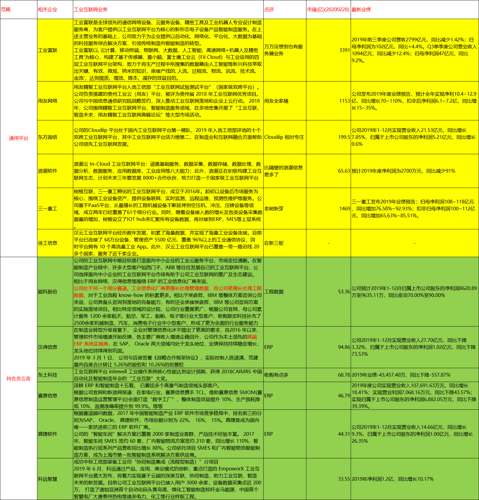
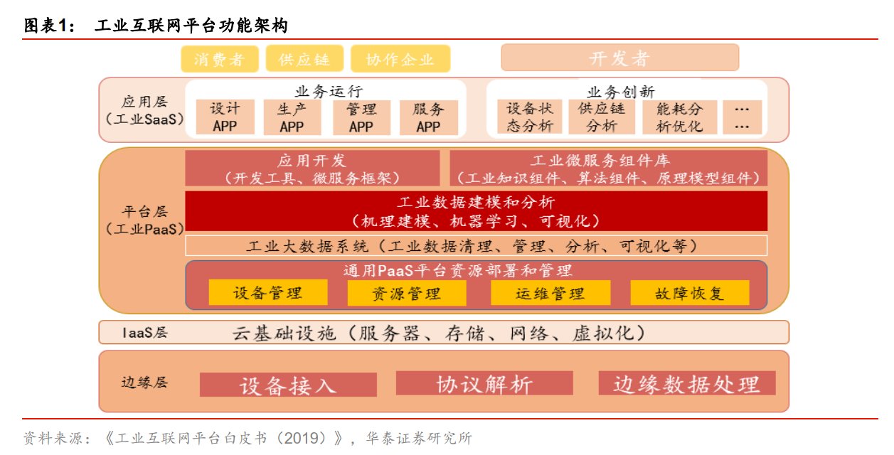
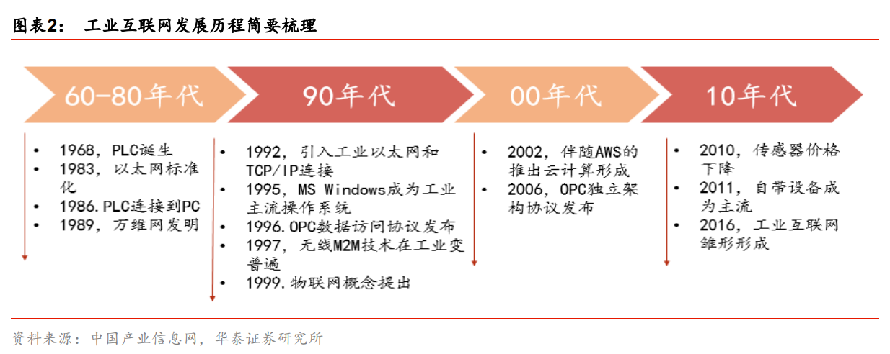
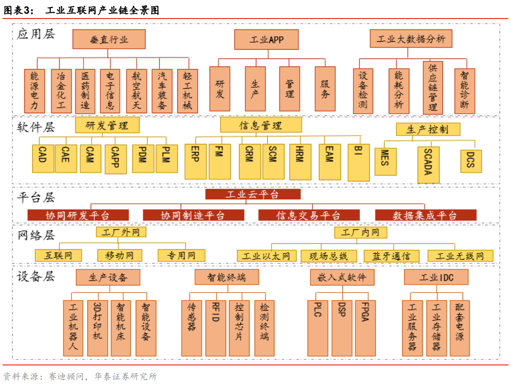
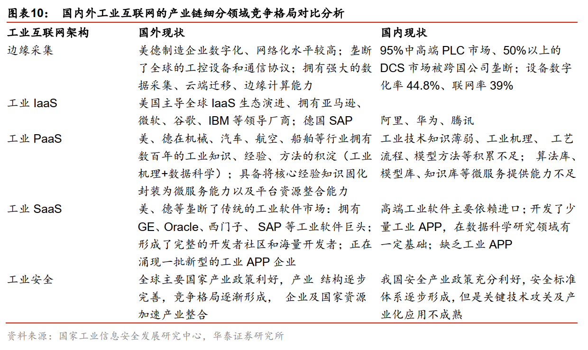

# 工业互联网(20200229)

### 总结

工业互联网其实也是非常大，非常泛的一个范畴，像我们之前研究的无线模组，云计算，这些很多也是适用的

总要用传感器采集各种数据，总要用无线模组传输数据，总要用服务器来存储边缘数据等，再接入工业平台(现在指的大部分是这一层的争夺)，最后到达下游的应用层进行各种数据治理和应用，而这中间呢，总要保障安全，各环节加强。

工业互联网的实质内涵是：数据+模型=服务。以实现制造资源的优化配置为目的，通过物联网+传感器+大数据采集数据。工业互联网平台的核心价值是通过机理模型和数据驱动模型的软件化，实现云端部署的操作系统。
目前工业互联网的主要服务展现形式有工业 APP，提供生产过程优化、全生命周期服务、制造资源配置等。 

总的逻辑就是这样一条链，大家的焦点主要是在工业平台这一层。

下面是提取的概览

### 一、政策加码

2020年2月25日，工信部公布2019年工业互联网试点示范项目，网络、平台、安全三个层面共81个项目。

来自天风的观点：

对比 2019 和 2018 年的试点示范项目可以发现，2019 年的项目内涵有所提升。首先，“5G+工业互联网”的方向是首次提出；第二，平台层面更细化为新技术融合应用、数据集成应用、模式创新三大方向；第三，安全层面项
目数量同比大幅增长。我们认为，5G、平台、安全将是工业互联网行业未来最重要的三大方向。 

### 二、行业概况

#### 1. 工业互联网 

工业互联网是个宽泛的概念， 通常是指能够满足工业智能化发展需求，具有低时延、 高可靠、广覆盖特点癿关键网络基础设施，是新一代信息通信技术与先进制造业深度融合所形成的新兴业态与应用模式。  

#### 2. 产业发展历史 

工业互联网发展大致分为四个阶段：

第一阶段为 60-80 年代，实现网络的发明以及机器与机器的互联；

第二阶段为 90 年代， 实现工业网络协议以及操作系统的发布，以及物联网概念的提出，工业设备逐渐联网；

第三阶段为 2000 年初，云计算以及通信独立架构协议的形成，工业互联网支撑体系逐步形成； 

第四阶段为 2010 年至今，工业互联网雏形形成与发展。 

#### 3. 产业链梳理 

工业互联网产业链包括六个层面： 

（ 1） 设备层—包括智能生产设备、生产现场智能终端、嵌入式软件及工业数据中心；

（ 2） 网络层—包括工厂内部和外部的通信；

（ 3） 平台层—包括协同研发、协同制造、信息交易和数据集成等工业云平台；

（ 4） 软件层—包括研发设计、信息管理和生产控制软件，是帮助企业实现数字化价值的核心环节；

（ 5） 应用层—包括垂直行业应用、流程应用及基于数据分析的应用；

（ 6） 安全体系—安全体系渗透于以上各层中，是产业重要的支撑保障。 

#### 4. 国内外工业互联网的产业链细分领域竞争格局对比分析 

