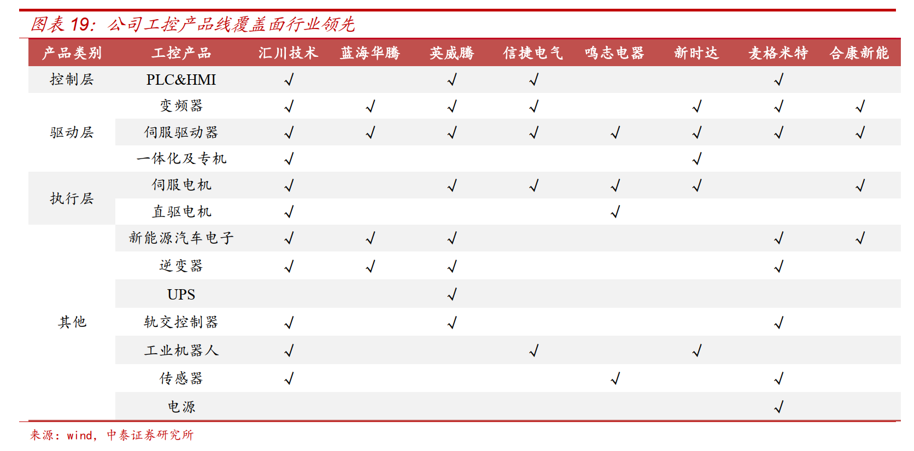
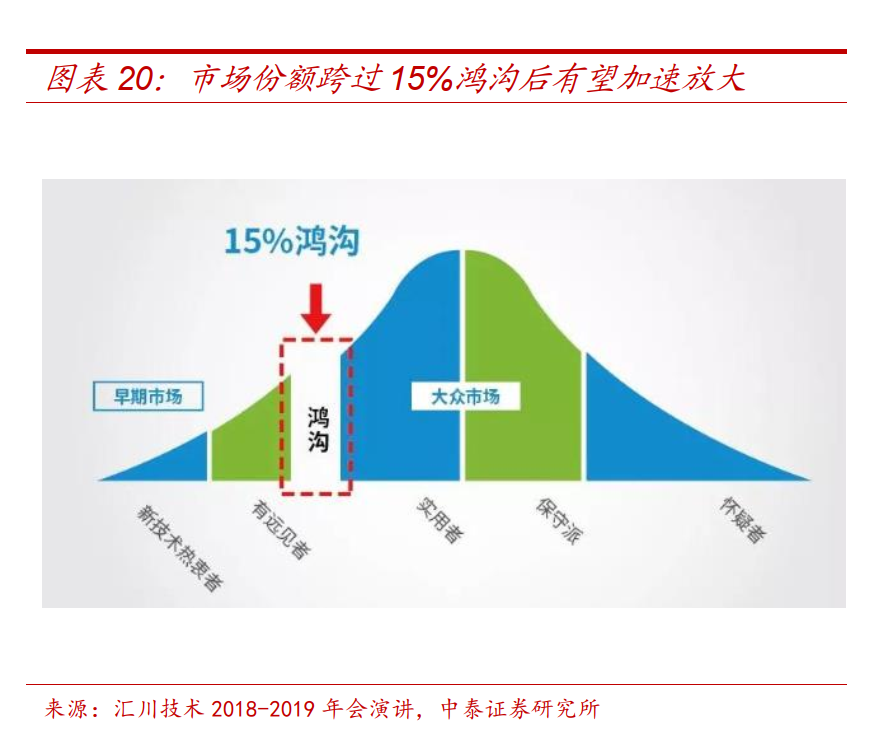
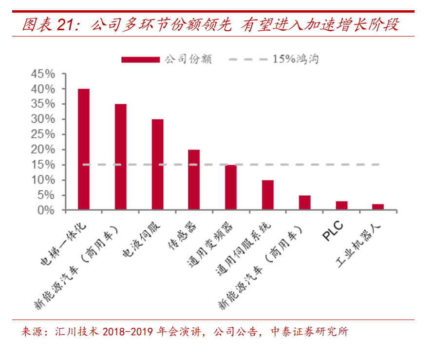
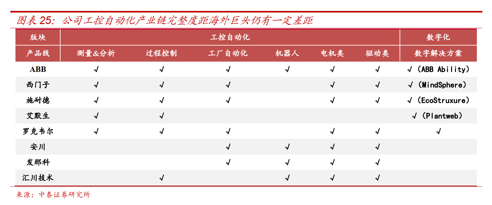

# 工业控制(20200721)

### 总结

汇Chuan技术作为国内工控龙头，在产品布局、技术实力、研发创新能力及管理组织等环节具备显著优势。 2020 年为公司组织变革深化年，运营效率及制造费用有望持续优化，人均产值将进入新一轮增长阶段；疫情催化下，公司品牌影响力凸显，多领域份额加速提升，全年业绩将迎高增 

新能源电动车

全球电动化布局加速， 国内外新能源汽车销量有望进入高增长阶段，配套电机电控需求空间将迎爆发。 公司布局较早，电机电控及动力总成产品性能行业领先，持续积累丰富的国内一二线车企客户，且 2019 年以来海外定点陆续落地，全球范围内影响力显著提升。 

工业控制机器人

国内工业机器人密度仍有较大提升空间，在疫情催化及国产化替代进程加速背景下，国产工业机器人将迎来广阔需求空间。公司工业机器人产品布局较为完善，核心技术及关键部件行业领先，有望借助品牌影响力及深厚的工控客户资源持续提升工业机器人市场份额 

电梯电气

并购贝思特完成， 基于协同效应有望迎来本土品牌、跨国品牌及海外品牌客户份额的持续提升， 并将受益于大配套需求与维保后市场需求爆发 

轨道交通

2020 年轨交投资有望逆周期增长，新增轨交线路配套牵引系统需求有望超预期。 公司为国内稀有掌握轨交牵引系统自主设计、制造及验证能力的供应商， 2018 年以来业务已走出苏州、突破全国 

### 一、工控产品线竞争格局

### 二、工控行业

工控行业具备长期成长性： 人口红利收缩、产业链趋于高端， 制造业转型升级迎来加速。

改革开放以来国内制造业快速扩张， 核心驱动力之一在于国内人口红利带来的低廉劳动力成本， 随着宏观经济增速放缓、人口结构变化、产业转型升级加速， 近年来制造业人数规模逐渐下行， 且制造业人均工资持续抬升， 人口红利加速收缩，劳动力相对自动化的性价比迅速减弱；另一方面，技术进步与新兴产业爆发式增长，中国制造业逐步走向高端，产品工艺、一致性及附加值要求提升， 制造业亟待转型升级， 长期来看工控自动化产品及服务需求具备广阔发展空间。 此外，2020 年疫情显著影响制造业企业复产复工，成为自动化升级改造进程的催化剂 

