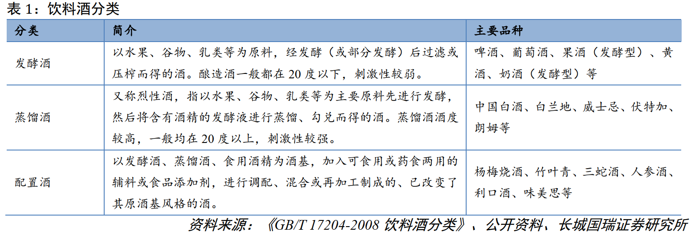
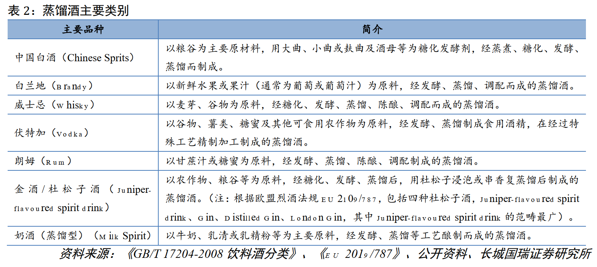
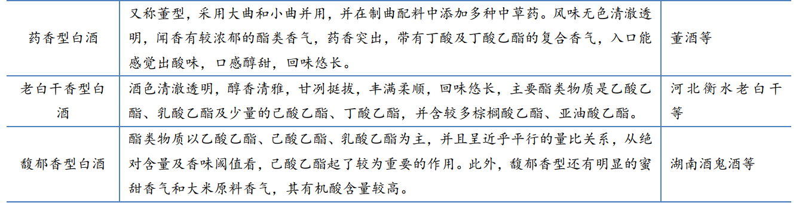
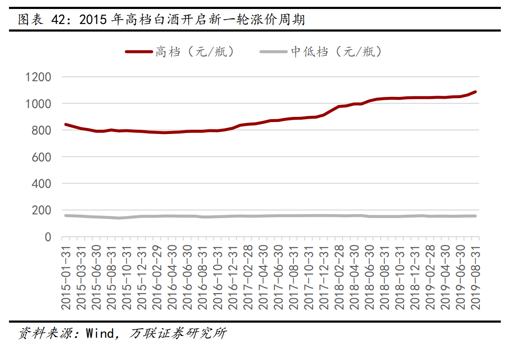
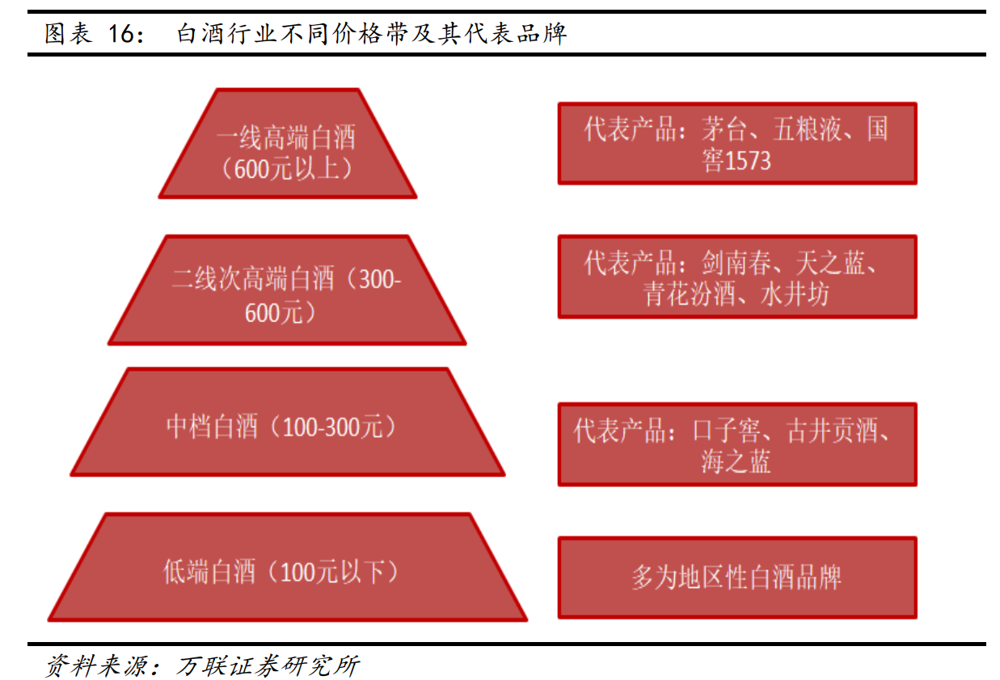

# 白酒印象(20200308)

### 总结

对酒的认知，从小时候开始，只记得夏天，如果特别热了，晚上时候家里有时会开一瓶啤酒，然后家里四个人一人一杯，这是我最早对酒的接触了。后面冬天时候，我爸妈自己会酿些米酒，他们俩喝，我自己没喝过。在外面工作，我的工作性质基本也不用接触那些商务类的，只有夏天偶尔和朋友撸串之类的喝点啤酒，偶尔宴席上喝点红酒。

总之，非常苍白的酒的认知。以后自己会不会喝白酒之类的不知道，但目前还没有吧，现在只是从投资角度来学习学习这一块的知识。

在学习股票投资的认知过程，自己对酒的认知，也是从一个楞到现在半楞吧。其实之前2016年看唐朝的手财时，他用的例子就是茅台，当然，对我来说，认知也仅仅是茅台两个都认识的字而已。当时的认知水平是，我们年轻人不喝白酒的。。。。后面学习陶博士时，看他做的是牛二，非常经典的净利润断层一战，那时，有点难以置信，这酒还能这么牛B。。。到后面茅台登顶千元时，才感觉到，我咧了个去的这么牛。。。然后慢慢的偶尔也看些资料，但认知还是比较苍白，去年纯属看图形做了一波酒鬼酒，然后运气般的躲开了那波下跌。

认知的转折点，是在看了各式各样的商业模式的书籍，然后慢慢的研究了其他各行业的一些知识，这部分在公众号上也大家都看到了，在看了其他那么多差的行业后，我才反过来意识到，白酒是一个多么优质的赛道和商业模式。

现在对白酒谈不上多好的认知，雪球上咖位大的好多，大家可以看研报，也可以看看那些牛人的发言。像乐趣，A股只买贵州茅台，茅台03(冯柳)从茅台到汾酒到牛二一路从高端吃到中端到低端，等等，好多大牛在前，值得我们学习。

以下是对白酒的初识印象记录罢了，慢慢积累，知识复利，这行业值得长期跟踪。

目前的白酒市场，高端白酒享量价齐升，为“最优赛道”； 次高端白酒紧随高端白酒， 价格有上涨预期， 市场规模有提升空间，为“次优赛道”；中低端白酒竞争激烈，市场空间被高端和次高端挤占而萎缩，生存状况最差，但低端酒龙头受益于集中度快速提升。  

**白酒行业的品牌格局，目前市场情况如下，**

**一线高端白酒主要以飞天茅台、五粮液、国窖1573 为主，占据绝对强势地位；**

**次高端白酒主要由全国名优酒构成，包括剑南春、郎酒、水井坊、汾酒、沱牌舍得（品味舍得）、酒鬼酒、洋河等；**

**地方强势品牌白酒基本以各地方龙头企业构成，包括古井贡酒、今世缘，口子窖等。** 

投资策略上，确定性比较高的高端白酒茅五泸及低端顺鑫，弹性空间可能大一点的汾酒古井今世缘，困境反转的洋河。

都说白酒是**A股最好的商业模式**，简单归纳一下(其他地方摘抄的)

**1、白酒行业竞争格局清晰，行业短期供需变化不剧烈，相对容易预测。**

**2、产品具有差异性，有情感归属的成分，不容易陷入价格战泥潭，产品差异性吸引市场消费者。（高端、次高端、中端、低端全部涨价，是唯一一个行业所有层次都能涨价的板块）**

**3、先收钱后给货，付款多用现金或者银行承兑汇票，基本没有应收账款，营收和利润含金量高，2C端霸道定价权的体现。**

**4、产品不担心挤压，存货几乎不会贬值，不存在过期一说，白酒越有年份越值钱，简直无敌的模式，酒越陈越好喝。没有哪个行业卖不出去的东西还更值钱的。**

**5、产品简单，基本没有研发投入，高档白酒销售费用极低，费用不搞资本化处理。**

**6、超高毛利率，超高净利润，成本占比低，分红比率奇高。**

**7、文化底蕴深厚，另外文；化输出意味着白酒还有国际化空间，增量市场可期**。

### 一、白酒认知

#### 1. 酒分类

根据《GB/T 17204-2008 饮料酒分类》 ，饮料酒（Alcoholic Beverages/Alcoholic Drinks） 指酒精度（注：即乙醇/酒精含量） 在 0.5%vol 以上的酒精饮料（酒精度低于 0.5%vol 的无醇啤酒也属于饮料酒） ，饮料酒（酒）按照制造方法可以分为发酵酒、蒸馏酒、配制酒。 

酒精在酒液中的含量用酒度来表示，通常有公制和美制两种表示法。 按公制表示， 酒精饮料的酒精含量通常在 0.5％～75.5％之间。
（1）公制酒度。公制酒度以百分比或度表示，是指在 20℃条件下，酒精含量在酒液内所占的体积比例。如某种酒在 20℃时含酒精 38％，即称为 38 度。
（2）美制酒度。美制酒度以 Proof 表示，在 20℃条件下，酒精含量在酒液内所占的体积比例达到 50％时，酒度为 100Proof。如某种酒在 20℃时含酒精 38％，即为 76Proof。 

#### 2. 白酒及分类

白酒特指中国白酒，是以粮谷为主要原料，用大曲、小曲或麸曲及酒母为糖化发酵剂，经蒸煮、发酵、蒸馏而制成的饮料酒。 

白酒的主要成分是乙醇(食用酒精)和水，白酒具备蒸馏酒的高度数特点， 通常酒度为 35~65度。 除酒精和水外，白酒还含有酸、酯、醇、醛等种类众多的微量有机化合物，它们作为白酒的呈香、呈味物质，决定着白酒的风格和质量。 

白酒分类有各式的，我们主要从市场的熟悉的香型来区分一二。

浓香型、酱香型、清香型是我国白酒市场的主要香型品种，三种香型合计销售额占比将近80%。  

#### 3. 白酒水源 

#### 4. 白酒生产周期

#### 5. 口感和品牌是高端白酒消费的主要考虑因素 

白酒消费体现出消费者的物质精神需求。  《论中国传统文化价值观对白酒品类消费动机的影响》（龚艳萍， 向鑫）将白酒消费动机概况为六种类型： “自然养生”型（生理需求） 、“医疗保健”型（安全需求） 、“共享天伦”型、“礼尚往来”型、“人情关系”型（社交需求） 、“文化体验”型（尊重需求）。 胡润百富也归纳出除了满足“口腹之欲”外，酒类消费者愈发重视的社交、品牌和收藏价值 

根据《中国居民白酒消费的影响因素研究》（《食品与发酵科技》 2019 年第二期），影响居民白酒消费量的因素包括收入水平、替代品消费、偏好、年龄等，其中收入是影响白酒需求的决定性因素，对白酒消费量存在先增后减的影响，中等收入群体白酒消费量最大；年龄也是重要影响因素， 白酒消费量与年龄存在近似正态分布的关系，各年龄阶段中，年轻人（30 岁以下）消费量最少，随着年龄增长，白酒消费量逐步上升，到 50-60 岁右达到峰值，之后消费量逐步下降 

根据调查显示，在我国白酒的重度消费群体中，主要消费群体的年龄分布为 25 至 54 岁，其中 35-44 岁的人群占比最高，达到 30.7%，是白酒消费的主要人群；而年轻人更倾向于饮用葡萄酒、啤酒 

### 二、白酒行业产业链 

白酒行业的上游行业主要是包装材料行业、粮食种植业、白酒生产设备供应行业等；

包装材料包括酒瓶、纸箱、纸盒、瓶盖、酒标等；

基酒包括凤香型基酒、酱香型和浓香型等调味基酒；

原粮包括高粱、大麦、豌豆、稻皮、碎米、小麦等。 

下游销售渠道主要为：经销商、超市、商场、酒店、电商平台。 

### 三、白酒行业 

#### 1. 白酒行业发展

#### 2. 2015年至今： 白酒产销总量下降，酒企分化加剧，盈利提升 

白酒产量进入产销下行阶段。 这一阶段宏观经济增长速度有所下降， GDP增速维持在6.5%-7%，投资活动热度下降。从产业背景来看，我国白酒产量进入到产销总量下行阶段， 白酒产量从2016年1358万千升减至2018年的817万千升， 2019年1-10月进一步减至635万千升。 

高档酒停止降价，开启新一轮涨价周期。 与此同时，我国经济结构逐渐转型，消费对GDP的贡献占比增加，居民人均收入快速提升，中高收入人群的数量增加给高端白酒消费的复苏带来了新的推动力，高档酒停止降价，开启新一轮涨价周期。  

#### 3. 龙头扩大份额

行业分化加剧， 龙头企业挤压式增长。 行业总体规模下降，存量市场竞争加剧。 全国名酒开始加快推进品牌，产品，渠道和组织等全方位的市场下沉，极大地挤压了全国大范围的区域性品牌的生存空间， 一些中小酒企退出了市场或是被大酒企收购，龙头企业的市场份额逐步扩大。规模以上白酒企业数量从2015年的1563个下降到2018年的1445个。 

虽然白酒行业整体销售规模下降，但龙头提价以及集中度提升，行业总体盈利能力提升。 由于高端白酒提价，以及集中度向头部集中， 规模以上酒企的利润总额从2016年的797亿元增加至2018年1251亿元， 利润增速重回两位数， 2017年、 2018年的同比增速分别为29.1%和21.6%。 

#### 4. 需求端：大众消费取代三公消费，次高端以上白酒具备需求支撑 

我国酒精类饮品消费中，白酒消费占比为24.6%。 根据WHO的数据，目前我国的酒精类饮品消费结构中，以白酒为代表的烈酒占比为24.6%，啤酒和红酒的占比分别为71.7%和3.7%， 

根据波士顿咨询公司预测，未来中国上层中产（家庭可支配月收入为 1.25-2.4万元）和富裕人群（家庭可支配月收入在 2.4 万以上）总数将会持续扩容，预计总数将从 2015 年的 5300 多万户上升到 2020 年的接近 1 亿户，复合增速达 13.5%， WHO 的报告显示，人均酒精消费量和经济发展水平有非常明显的相关关系，未来中国中产及以上阶层人数的增长会给白酒市场带来新的发展空间。同时，根据尼尔森最新研究数据显示，高端白酒消费者年龄段为 30-35 岁， 80 后开始成为高端白酒消费的主流群体，白酒消费年龄层次开始年轻化，其中 18-25 岁年龄段白酒消费者占比已接近 8%，高端和次高端白酒消费具备可观的消费者梯度支撑。 

#### 5. 白酒行业不同价格带及其代表品牌 

