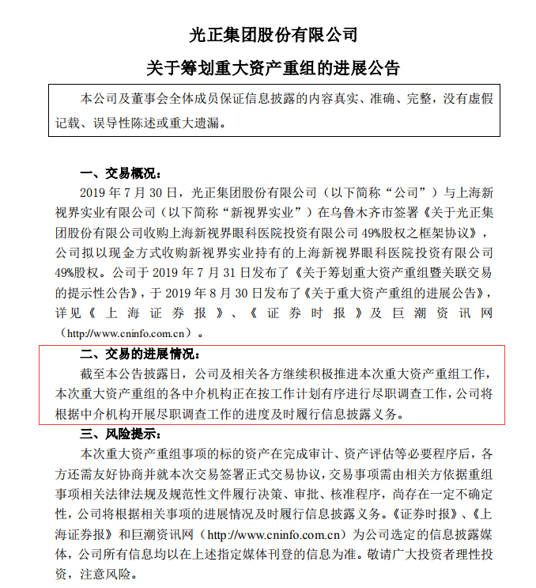
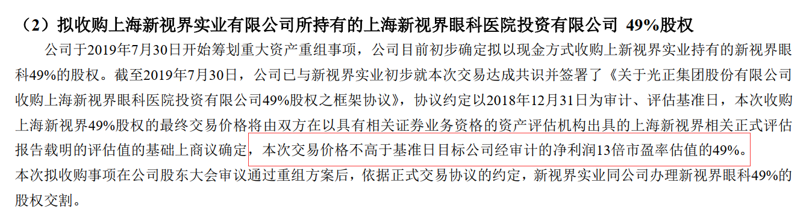
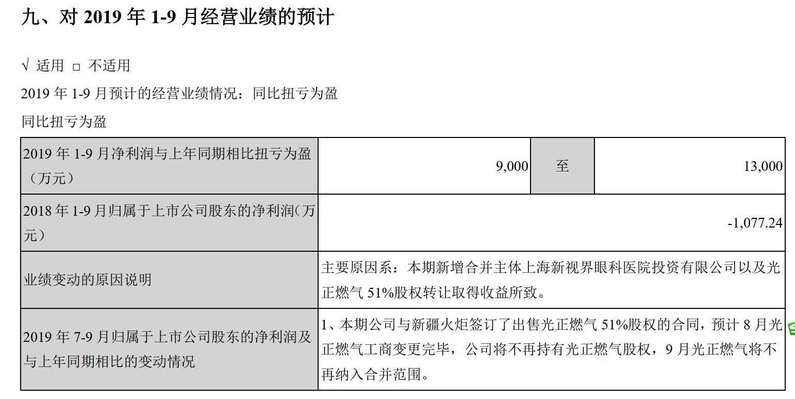
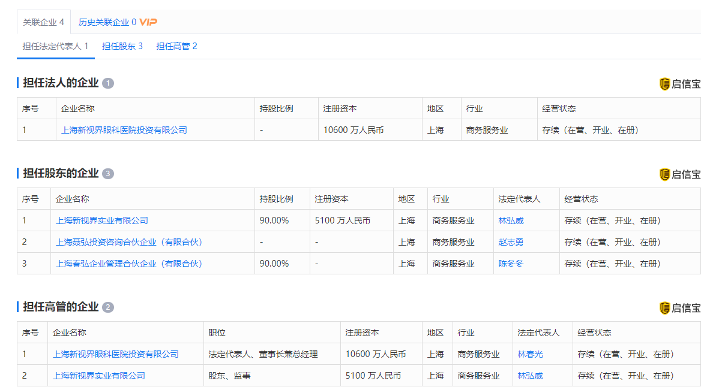

# 光正集团(首次覆盖20190927)

### 一、结论

​	光正的资料实在少，也没看到任何研报，只能从年报等来探寻一些信息。

​	光正和新视界的联姻，从客观上，眼科是一个非常好的赛道，但是我们也要客观的看到，光正的原有业务和新业务之间的明显是完全不搭边的，双方的化学反应能到什么程度，目前也是未知，但林春光持有5%左右的光正股份倒是有一定的绑定。

​	从新视界本身出发，2018年上海新视界眼科的营收为9.22亿元，净利润为1.16亿元，作为第二家在资本市场的眼科企业，确实收到了相当多的关注，最近的机构调研我们可以看到，不少基金券商还是比较有兴趣的。当然，兴趣是不能当饭吃的。

​	目前新视界的运营模式，主营收入构成，医院的培育等，都只是幼儿园级别，和爱尔完全没有可比性。因此，长逻辑上来看，新视界值得跟踪，但存在巨大的不确定性。从中线看，资产重组后，光正和新视界的化反能到什么程度，谁也不知道，也许借助资本市场能发展壮大也说不定。但比较确定的是，100%收购新视界的确定性目前比较大，中线的重组逻辑，业务承诺等都是比较确定的。我已经先放入自选跟踪。

### 二、公司概况

​	公司其他业务基本可以忽略不看，只关注收购的新视界眼科。

​	公司作为专业的眼科连锁医疗企业，主要从事眼科医院的投资、管理业务。目前已经在上海、呼和浩特、南昌、郑州、青岛、成都、重庆、无锡等9个中心城市开设12家专业眼科医院，向全国各地的广大患者提供眼科相关的覆盖全病种的专业性诊疗服务，技术水平及业务规模均处于民营眼科行业中领先地位。公司眼科业务专注于大、中型城市眼科医疗服务细分市场，精耕细作，不断提高诊疗服务品质，通过优化运营体系、创新渠道建设，壮大人才队伍，持续增强集团的整体竞争实力，为进一步发展开拓奠定坚实基础。 

#### 1. 2019年9月18日的调研记录

我摘录了一些自己兴趣的信息记录作为备忘。

调研地点：上海新视界中兴眼科医院有限公司二楼会议室 

问题 1：新视界目前确定了以上海、青岛为中心的区域布局，希望可以从宏观层面，谈谈新视界未来的具体规划和定位。另外，从具体业务运营层面看，行业内各个眼科集团都在进行结构调整，新视界是如何规划发展节奏？
答：业务布局方面，眼科业务会继续围绕上海、山东胶东半岛、西南片区作为核心区域发展，坚持区域深耕的发展思路，争取在核心区域做到最好；同时在核心区域外延性拓展，形成区域连锁优势。
业务运营方面，眼科业务早期做白内障的主要原因是基于地区市场需求，上海是全国老龄化程度最高的城市之一，白内障业务市场需求较高，同时上海政府十分关心老年人防盲治盲，基于有这样的市场需求和政策支持，新视界选择了白内障业务作为基础发展。近两年，白内障业务逐渐进入稳定发展阶段，屈光市场需求迸发，国家近视防控政策积极导向，未来公司眼科业务会在保持白内障业务稳定发展的同时集中资源开拓屈光和视光业务 

问题 2：2018 年新视界与光正正式合作，完成新视界眼科 51%股份的重组，想了解一下重组完成后关于光正集团与新视界眼科的职能分工情况；另外，看到半年报中有显示光正集团在北京成立了光正眼科医院，想了解一下具体如何筹划？ 

从上市公司的未来布局看，一方面，新视界眼科未来发展的重点区域是长三角区域，其中以上海为龙头，胶东半岛、西南片区进行区域的精耕细作；另一方面，公司考虑在一些区域实现重点突破，比如北京和深圳，包括光正集团总部所在地乌鲁木齐，考虑到眼科医院发展需要一定的培育周期，因此上市公司参股设立了北京光正眼科医院有限公司从侧面配合集团的发展布局 

问题 3；目前整个资本市场都看好眼科这个产品，请问新视界未来 3-5 年的愿景是怎么样？未来希望将新视界打造成什么样的企业？
答：眼科医疗行业的市场容量和发展空间非常大，依据相关统计数据，2021 年全国眼科的市场容量预计会增长到 1600 亿，目前民营眼科市场占比约 30%，整个眼科医疗市场还是以公立医院为主。目前眼科医疗行业民营机构领头爱尔已经成为千亿级的企业，我相信未来也还会不断刷新突破，新视界眼科 2018 年拥抱资本，作为进入 A 股市场的第二家眼专科医院，一直以来都以爱尔为目标在努力。未来会一如既往的认认真真把实体做好，相信未来民营医院的发展空间很大，是潜在的蓝海。 

问题 6：光正集团辅助业务的资产剥离计划？
答：首先要明确的是，实体经营是看长远不看短期。关于资产剥离，资产的剥离是与上市公司的战略发展有着高度的衔接和契合规划去执行的。我们已经明确了“聚力眼科医疗业务，加快整合辅助产业”的发展思路，目前已经进行了能源板块资产的剥离，后续会继续推动钢结构板块资产剥离，未来的上市公司会专注于眼科发展。 

问题 7：请问公司眼科业务与爱尔比较有什么优势？
答：公司眼科业务发展的核心区域与爱尔不同，立足于不同区域的特性，发展思路各有特点 

问题 11：想请问一下新视界未来的视光学科发展要如何做？是否存在什么困难？
答：1、目前行业的大视光业务是分为 18 岁以上的屈光矫正，比如全飞秒、ICL 等；以及 18岁以下的小儿斜弱视和配镜等等。目前新视界的屈光和视光业务今年都有较好的增长，通过内经营调整，新视界今年非医保类病种收入占比有较大幅度提高。
2、屈光业务的发展还是要坚持渠道细分，传统的口碑介绍结合当前的市场推广趋势，联动新媒体，如大众点评、抖音等。小儿视光，前期需要很长时间的市场沉淀和口碑沉淀，从去年国家近视防控政策的推行，新视界也是推动这项工作的其中一份子 

#### 2. 2019年9月27日资产重组公告

​	

​	半年报中提到的收购价格，13倍PE，算是一个比较正常的范围

#### 3. 业绩承诺

交易对方承诺，标的公司2018-2020年度的净利润（承诺净利润均为经审计的扣除非经常损益后归属于母公司的净利润）分别不低于11500万元、13225万元、15209万元。

#### 4. 股份绑定

2018年2月28日，光正投资有限公司与林春光签订《股份转让协议》，约定光正投资有限公司将其所持本公司25,166,640.00股股份（占本公司总股本5.00%）转让给林春光。本次股权转让已于2018年3月15日进行证券过户登记。 

#### 5.  2019年前三季度业绩预测

### 三、新视界眼科

#### 1. 官网信息

http://www.xsjyk.com/

上海新视界眼科医院集团始创于2004年，注册资本1.124亿元人民币，集团自成立以来，一直专注于眼科医疗事业的发展投资，历经10年形成了以医疗产业为龙头、房地产产业、文化产业互补的产业群，集团净资产达105亿元，总部位于中国上海。近年，新视界迅速扩张发展，形成以上海、重庆、西安、合肥、济南、北京、南昌、成都、呼和浩特等重要省会城市为主的眼科医疗网络，基本覆盖了眼科医疗保健的全部细分领域，它标志着新视界卓越的眼科医疗技术和充满人性关怀的医疗服务正式普及全国。

#### 2. 林春光

在光正之前，林春光出现在莎普爱思，鞍重股份等的市场信息中，从中我们可以看到，来自我大胡建的莆田系正在主动接触资本市场。

目前光正和新视界之间的收购，倒有另一番意思。

当然，有历史因素在，莆田系确实有些原罪，但是我自己有不少朋友童鞋都是莆田那边的人，倒也没大家想象中的那番。就像美迪西，在冲刺科创板，也是走CXO的一个玩家。

 

