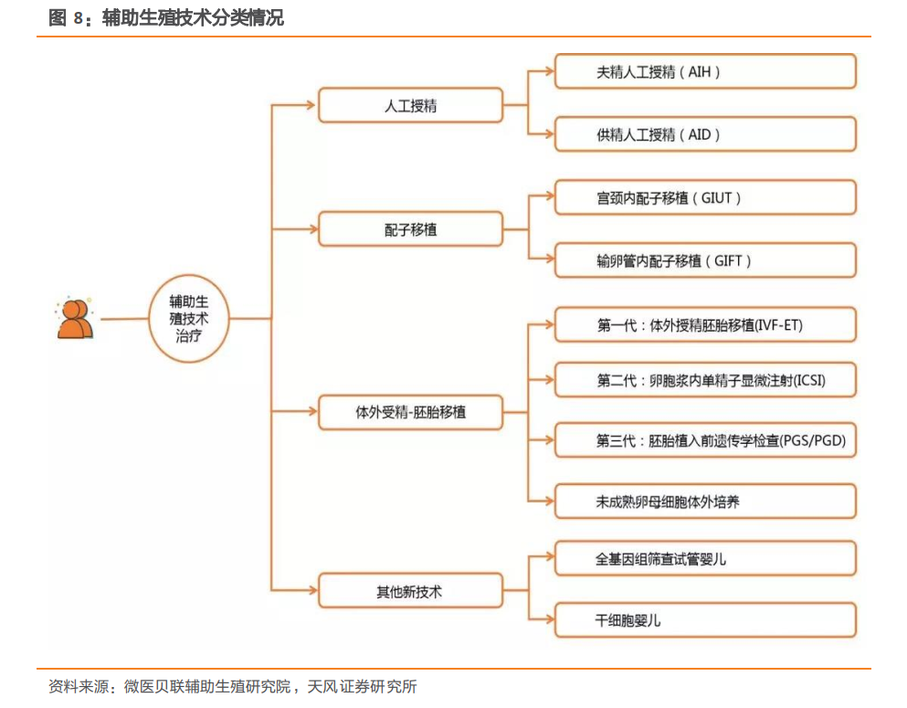
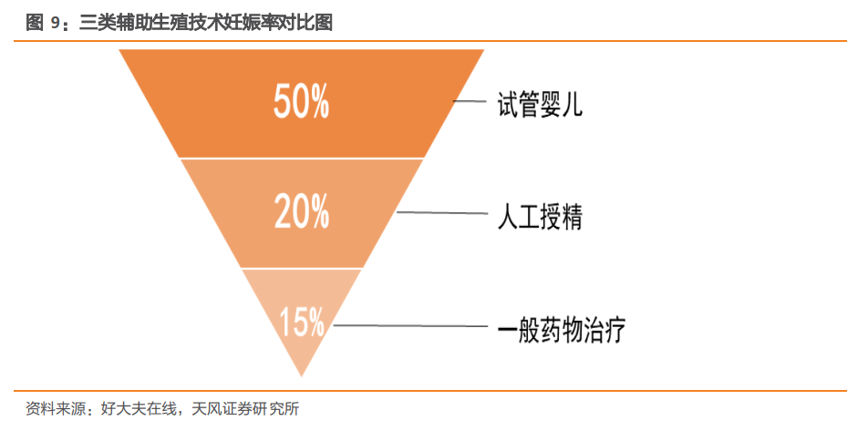
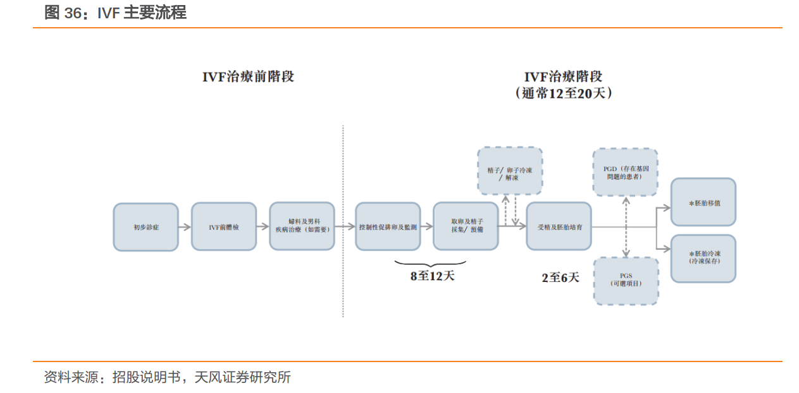
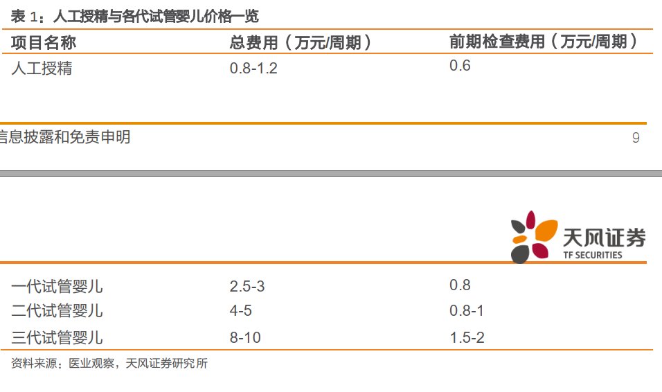
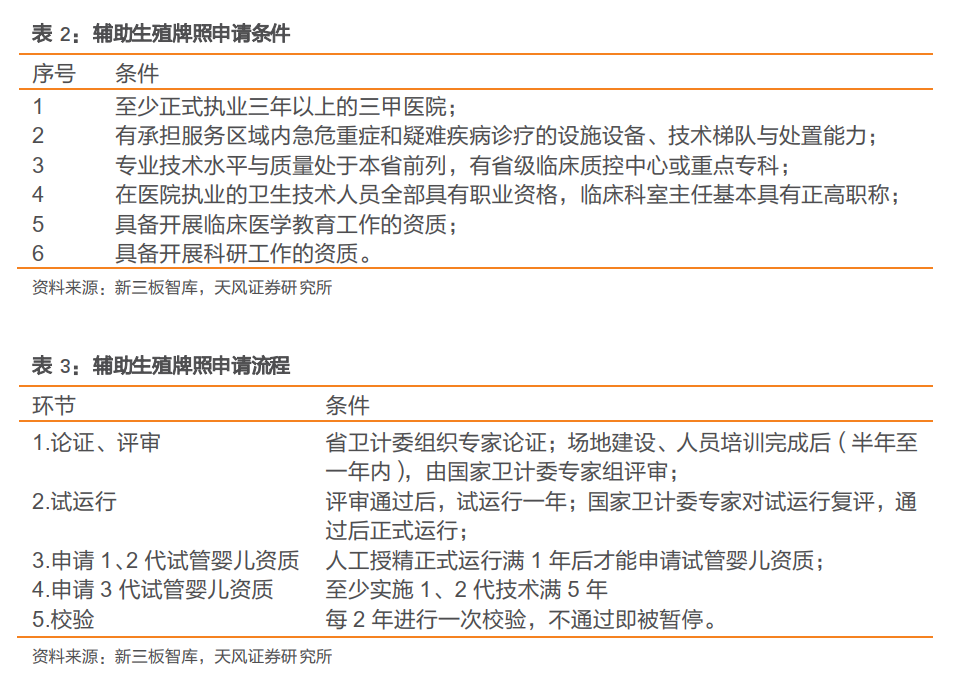
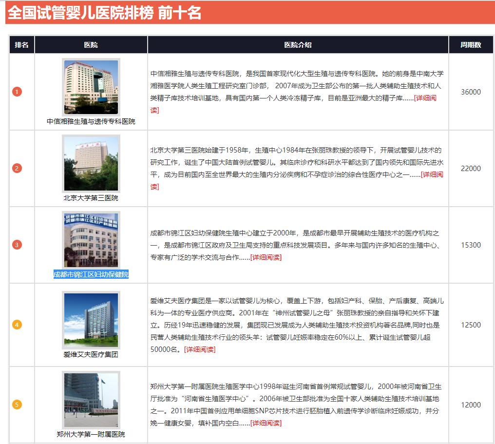
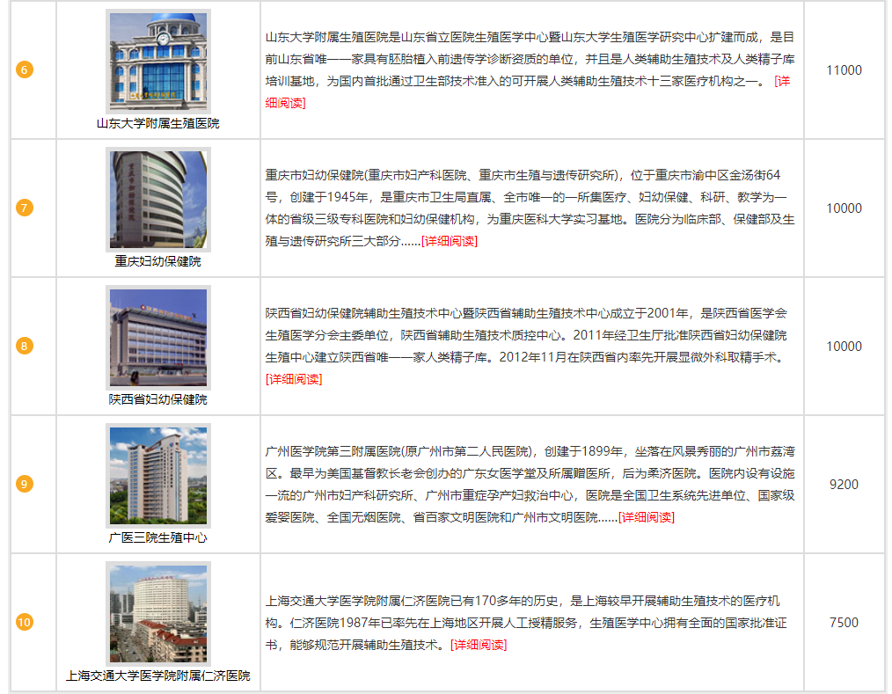
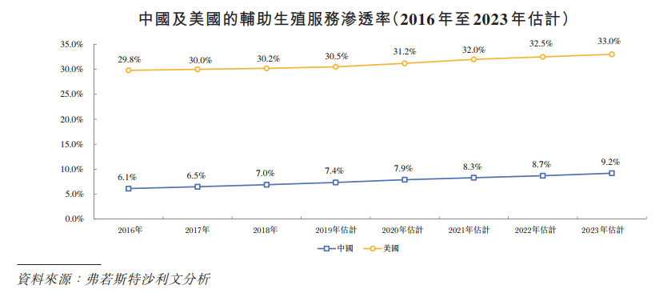
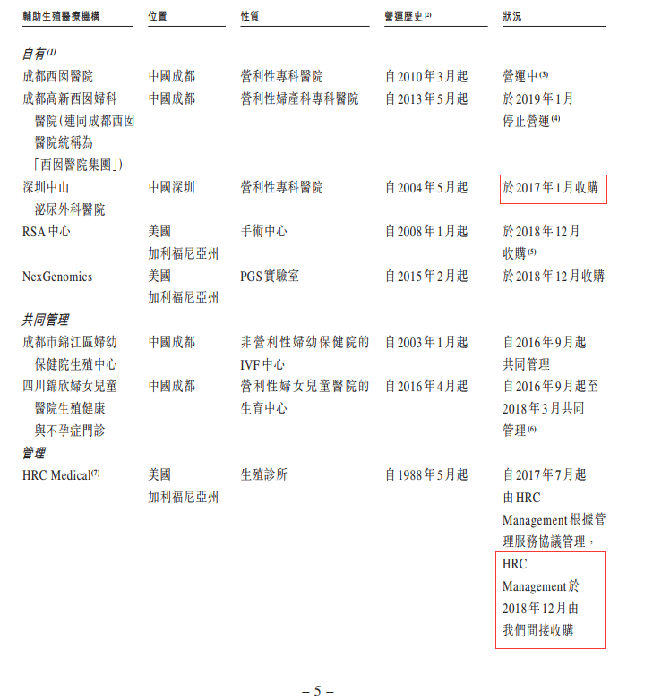

### 辅助生殖(20191129)-又一个曲奇模式的YY


### 总结

​	辅助生殖，光环是“中国非公辅助生殖第一股”，通俗的就是我们经常提起的不孕不育，目标群体除了正常的不孕不育夫妇外，在国外 LGBT 族群(女同男同双性跨性别)的婚姻增多，也延展了这块的活动周期。

​	锦欣在招股说明书中提到2017年中国大约有4770万对不孕症夫妇，预计到2023年，这一数字将增加至约5620万对，这有点违背我们常识的数据确实吓了人一跳，根据最新的人口统计数据，2018年末，全国育龄妇女人数为3.46亿人。如果采用上述数据来计算，这意味着，每100名育龄妇女中，就有近14人无法正常生育。

​	特意查了一下资料，比较有说法的引用是
​	

```
根据中国人口协会、国家卫健委发布的数据，中国育龄夫妇的不孕不育率从20年前的2.5%-3%攀升到近年12%-15%左右，不孕不育者约5000万。受环境污染、生育年龄推迟、生活压力等因素影响，不孕人数还在不断增加。
```

​	虽然自己身边没感受到这块的比例，但是从查看的资料来看，锦欣的数据可能偏差没那么大。

​	以下表格是我从各大公司的公告，年报，新闻，研报等整理而成的，不一定是全面的，但是足够窥探一二。

​	

| 相关企业 | 辅助生殖业务                                                 | 市值(20191129) | 盈利情况                                                     |
| -------- | :----------------------------------------------------------- | -------------- | ------------------------------------------------------------ |
| 锦欣生殖 | 主营辅助生殖                                                 | 289.7亿        | 2019上半年财务状况更是亮眼，营业收入同比增长92.09%,毛利同比增长100.31%，净利润同比增长64.8% |
| 通策医疗 | 2015 年，昆明波恩中心开始营业                                | 332.1亿        | 22018年昆明市妇幼保健生殖医学医院有限公司净利润-65万。       |
| 麦迪科技 | 收购海口玛丽医院 51%股权民营牌照稀缺， IVF 成功率领先，技术壁垒高筑，立足生育率最高的海南省已建立良好的口碑。 | 36.41亿        | 根据公司公告，2018年玛丽医院营收3016万元，净利润508万元，2019-2021年承诺净利润分别为510万元、688万元、720万元。 |
| 丽珠集团 | 丽申宝（注射用尿促卵泡素）                                   | 291.7亿        | 促性激素领域中的重点品种注射用醋酸亮丙瑞林微球和注射用尿促卵泡素分别实现销售收入人民币 760.70 百万元和人民币 592.61 百万元，同比增长分别为 40.34%和7.80%。 |
| 康芝药业 | 2018年康芝药业通过收购云南九洲医院有限公司51%股权及昆明和万家妇产医院有限公司51%股权，正式进军以生殖医学技术为核心的辅助生殖领域。 | 20.34亿        | 两家医院还做出了对未来业绩的承诺，其中云南九洲医院及和万家医院承诺在2018年-2020年3年累计净利润之和不低于1.15亿元。 |
| 万孚生物 | 2018年12月28日，由万孚生物子公司——广州万孚健康科技有限公司投资，新型专业互联网实体——金秀儿优孕中心在广州天河创展中心正式开业，旨在为广大适龄夫妇提供一站式优生优育解决方案及女性健康管理。 | 163.6亿        |                                                              |
| 华大基因 | 生育健康类服务,主要为检测报告、项目结题报告、相关测序分析数据、试剂产品等 | 237.2亿        |                                                              |
| 长春高新 | 注射用重组人促卵泡激素                                       | 746.8亿        |                                                              |


目前 A股总体通策比较早进入，但目前只是培育阶段，在浙江大本营因为牌照问题，也一直没有开展，麦迪科技算是新进入者，通过收购的方式获取了牌照。

​	最纯正的就是港股的锦欣生殖，2019年6月上市后下杀到8块后，走出反包，最高到15.3，接近翻倍，目前处在回落过程，后期值得跟踪。券商预计2019-2021年净利润4.87亿，5.89亿，7.12亿，增速总体上应该比较稳定在30%左右。

​	**谈谈锦欣**

​	**风险在哪？**

​	**前阵子的新闻预计2019年出生人口1100万，比2018年的1523万接近腰斩。**

​	**增长逻辑在哪？**

​	**国内横向并购扩大覆盖面，海外纵向并购拓宽服务类型；提升服务质量提高客单价；拓展新客**

​	**怎么看待股价？**

​	**目前的锦欣价格明显不在钟摆的极值，估值切换到2020年的近6亿，目前的50左右估值算中性，逻辑在，业绩相对确定，交易跟着市场走。**	


### 一、行业概况

#### (一) 辅助生殖定义

​	辅助生殖指采用医疗辅助手段使不育夫妇妊娠的技术，可分为人工授精、体外受精-胚胎移植（简称“试管婴儿”）、配子移植及其他新技术。目前运用的最广泛的技术为人工授精与试管婴儿。 

​	不孕症为生殖系统疾病， 特征是在经过 12 个月或更长时间经常性进行未有避孕的性行为后仍未能临床怀孕。女性不孕症的原因包括（其中包括）排卵问题、输卵管或子宫受损及子宫颈异常。男性不孕症原因包括（其中包括）精子不足、精子功能异常及精子传送受到阻塞。
​	不孕症在全球越来越普遍，主要是由于首次生育平均年龄上升，以及不健康生活方式和环境的因素所致。全球不孕症患病率由 1997 年的 11.0%上升至 2018 年的 15.4%，预计到 2023年将上升至 17.2%。全球不孕率上升，各种医疗服务涌现，包括(i)药物治疗、 (ii)手术和(iii)辅助生殖服务。 


#### (二) 辅助生殖技术分类



​	

​	以如今的科技发展情况来看，试管婴儿、人工授精、一般药物治疗的怀孕率以试管婴儿为首，成功率可达 50%， 人工授精成功率和一般药物治疗的成功率较低，分别为 20%、 15% 。 

#### (三) IVF主要流程




#### (四) 多因素促进辅助生殖行业发展，千亿蓝海爆发在即 

​	近年来， 中国辅助生殖服务市场增速明显，主要有三大核心驱动力：刚性需求推动辅助生殖产业发展、辅助生殖服务可负担性日趋提升、辅助生殖服务获投资机构青睐。 


##### 1. 刚性需求推动辅助生殖产业发展 

​		首先， 不孕率上涨催生刚性需求。 1990 年至 2017 年中国平均初婚年龄由 21.4 岁上升至25.7 岁，平均初育年龄由 23.4 岁上升至 26.8 岁。与此同时， 15-49 岁育龄妇女人数连年上涨，然而 2000 至 2018 年出生率却呈下降趋势， 2018 年的出生率仅为 10.94‰。 2017年不孕率已达到 15.5%。

​		随着不孕率的上涨，2017 年中国约有有 52.7 万名患者接受辅助生殖服务，且预期将于 2023年增长至 95.6 万名，复合年增长率为 10.4%。由此可见，不孕不育率的上涨推动了辅助生殖市场的发展。 

​		其次， 国家二孩政策亦是驱动力之一。 2013 年“单独二孩”政策开始，随后各地陆续推出相关政策； 2016 年， 我国“全面二孩”正式到来； 2017 年国家卫计委副主任王培安甚至表示可能探讨鼓励二孩的财政激励措施的可能性。从单独二孩到全面开放仅用了四年，也体现了我国人口老龄化问题迫在眉睫。目前人口结构老龄化、生育率低的危害短期也许较不明显，但是长期将会面临诸多危机，如养老金系统入不敷出，未来劳动力人口下降，国家经济状况恶化等。 

​	二孩政策的全面开放也为失独家庭带来了转机，并且此类家庭往往年龄较大，需要辅助生殖机构介入。二孩政策为辅助生殖机构带来的影响也许并非直接的，但其长期协同作用会为该行业带来新的机遇。 

​	第三， 对辅助生殖服务认知提升。近年来我国居民生活水平改善，辅助生殖服务的认识和使用也逐步提升。然而，目前中国的辅助生殖市场渗透率仅为 6.5%。根据弗若斯特沙利文分析显示， 2017 年不孕率为 15.5%，预计 2023 年将会上升至 18.1%；在中国，不孕症夫妇数量约有 4770 万对。以 6.5%的渗透率进行测算，中国约有 4460 万个家庭缺乏对辅助生殖的了解。 由此可见， 辅助生殖市场发展前景广阔。 


##### 2. 辅助生殖服务可负担性日趋提升 

​	人均可支配收入逐年上升，辅生服务不再难以企及。 2013 年至 2018 年我国人均可支配收入由 18310.76 元增长至 28228 元，每年增速不低于 8%。此外，目前国内辅助生殖服务定价大致为：单个周期人工授精总费用为 0.8-1.2 万元； 一代、 二代、 三代试管婴儿总费用分别为 2.5-3 万元、 4-5 万元、 8-10 万元。辅助生殖服务不再是遥不可及的高端消费，物质条件的改善让更多患者能够承担辅生服务价格。因此， 居民收入水平的提升也是辅助生殖市场发展的驱动力之一。 



##### 3.牌照严控，辅生生殖机构下游近乎处于半垄断状态 

​	辅助生殖牌照申请条件严、 周期长。申请辅生牌照可分为三条路径：第一条，从零开始组建， 最短的周期为： 执业 3 年获得三级医院资格；半年通过论证、评审环节；一年通过试运行环节；正式运营一年后开始申请 1、 2 代试管婴儿资质；运行 5 年后申请 3 代试管婴儿资质；仅仅获得人工授精牌照就需要 4.5 年， **如果想要集齐人工授精、试管婴儿 1、 2、3 代牌照共需要 10.5 年**。 如此长的申请周期让投资机构很难从零开始组建。 因而， 大部分机构都选择与公立医院进行合作， 帮助其获得牌照。
与公立医院合作的第二条路径优势在于公立医院牌照申请相对容易， 且公立医院本身有着流量基础； 缺点在于投资机构并不拥有牌照与核心资源。
第三条路径为收购民营医院牌照。该路径的优势非常清晰：直接获得牌照、投入期短，但是要求前期投入大并且民营牌照数量极为稀少。 **截至 2017 年国内拥有牌照的民营医院仅有 41 家，至 2016 年底我国共有三甲医院约 776 家，获试管婴儿牌照的医院占比 42.1%，共有民营医院数量约 15800 家，获试管婴儿牌照的民营医院占比不到 0.3%。** 2017 年国内试管婴儿医院按周期数排名前十的机构中， 仅有两家为民营机构。我国的辅生医疗服务机构仍处于以公立医院为主的局面。 因此该条路径适合资本雄厚的且希望快速进入该领域的投资机构。 








##### 4. 辅助生殖服务获投资机构青睐 

​	各大资本早早布局辅助生殖领域。最具前瞻性的中信早已布局辅助生殖领域，试管婴儿医院国内排名第一的中信湘雅生殖与遗传专科医院即为中信投资，中信湘雅 2017 年试管婴儿治疗周期达到 36000 个，是第二名爱维艾夫医疗集团的 2.17 倍，且其成功率高达 60%。另外诸如复星医药、康芝药业、思创医惠等也发力辅生领域，其吸引力可见一斑。
​	将辅助生殖纳入主营业务成为发展重点。除了上文提到的公司以外，通策医疗也是一家将辅生纳入自家版图的代表性公司。通策医疗是一家大型医院投资管理集团，其主营业务为口腔领域，截至 2018 年，通策医疗拥有不同规模的专科医院及医疗网点共 30 家。其转型
​	始于 2011 年，通策医疗由原来的单一口腔转向全方面专业医疗服务，其与昆明市妇幼保健院达成战略合作协议，开始在生殖中心建设上进行专项合作。近年来辅助生殖服务创业公司一览，可以看到不论是上游的辅生药物/器械、中游的服务商还是下游的辅生医疗服务机构， 整个辅生产业链均已初步打造完成。资金的涌入有助于引进先进技术，吸引精尖人才乃至建立辅生服务集团，推动辅助生殖市场的发展。 


### 三、行业空间

#### (一) 中国IVF市场空间

​	中國的輔助生殖服務市場同樣迅速增長，由2014年的人民幣140億元增加至2018年的人民幣252億元，複合年增長率為 15.8%。在2018年中國7.0%的相對較低輔助生殖服務滲透率、輔助生殖服務負擔能力上升及需求提高以及對輔助生殖技術服務的投資增加的推動下，預期中國輔助生殖服務市場將於2023年前增長至人民幣496億元，由2018年起計的複合年增長率為14.5%。 



​	於2018年，中國大約有47.8百萬對不孕夫婦，預期於2023年將增加至約50.3百萬對。相比之下，於2018年，約有568,000名患者在中國接受輔助生殖服務並預期將於 2023年增長至約855,000名，複合年增長率為8.5%。 


#### (二) 美國輔助生殖服務市場 

​	美國的輔助生殖服務市場由2014年的28.7億美元增加至2018年的37.1億美元，複合年增長率為6.6%，且預期於2023年前將進一步增長至49.3億美元，由2018年起計的複合年增長率為5.9%。此增長受到首次生育平均年齡上升、輔助生殖服務被更廣泛地接納支持及LGBT族群的婚姻增多推動。美國的輔助生殖技術服務滲透率相對較高，為 30.2%。由於先進的技術、高成功率及更高標準的服務等多項因素，越來越多的國際患者前往美國尋求輔助生殖服務。輔助生殖服務診所的數目大致穩定，由2012年的486家溫和增長至2016年的502家，當中大部分能進行PGD╱PGS治療。於2018年，美國約有4.5百萬對不育夫婦，其中0.7百萬對夫婦需要輔助生殖服務， 217,100名患者在美國接受輔助生殖服務。 

​	由於對輔助生殖服務有利的監管政策及大量頂級輔助生殖服務人才及機構等因素，加利福尼亞州已成為輔助生殖服務的三大州之一。相較其他州份，加利福尼亞州具有以下特點： 

​	代孕合法並受到規管，這意味著(i)對準父母或代孕者沒有任何限制，及(ii)可以在孩子出生前知情父母子女關係；
​	加利福尼亞州的輔助生殖服務診所多於美國任何其他州份，擁有全國1,500名生殖內分泌學家中的約230名，使患者能夠獲得代孕、卵子和精子冷凍保存以及PGD╱PGS等廣泛的服務；
​	有利氣候條件及地理位置；及成功率高於全國平均水平。 

​	


### 四、锦欣生殖

#### (一) 概览

​		根據弗若斯特沙利文報告，我們中國網絡內的輔助生殖醫療機構於2018年在中國輔助生殖服務市場中排名第三，進行了20,958個體外受精（「IVF」）取卵周期，市場份額約為3.1%。根據相同指標，該等機構亦在2018年**中國非國有輔助生殖服務供應商中排名第一**。

​		根據弗若斯特沙利文報告，HRC Fertility（包括由HRC Management根據管理服務協議管理的HRC Medical）於2018年在**美國西部輔助生殖服務市場中排名第一**，進行了4,500個IVF取卵週期，約佔美國西部總市場份額的7.5%。 

​	公司主营业务包括辅助生殖服务、管理服务和辅助医疗服务三个方面。以辅助生殖服务为主，公司依靠其优于同业其他竞争者的显著规模、高于同行业的成功率筑造进入壁垒，逐步实现行业全球领先，打造具备综合能力的全球辅助生殖平台的战略目标。公司大部分收益来自辅助生殖服务。 2016-2018 年，辅助生殖服务业务营收占总体营收比重为 93.1%、 79.7%和 86.9%。
​	公司主要为患者提供人工授精和 IVF 技术治疗这两种方案。 2016-2018 年辅助生殖服务营收 3.22 亿、 5.29 亿以及 8.01 亿元，其中 2017、 2018 年增速为 64.29%、 51.42%。高速度增长反映公司良好发展前景 


#### (二) 曲奇模式




#### (三) 旗下资产

##### 1. 锦欣

​	就IVF取卵週期而言，由於中國輔助生殖服務市場相對分散， 2018年，前10名和20名提供者分別佔市場份額的26%和36%。就所進行的IVF取卵週期和輔助生殖機構產生的收入而言，我們在中國的網絡分別排名第三及第二（市場份額分別為 3.1%及3.9%），在所有非國有輔助生殖服務機構中排名第一。 


##### 2. HRC Fertility

​	美國輔助生殖服務市場相對分散，主要由私營醫療機構組成。以2018年來自輔助生殖服務診所的收入及所進行的 IVF取卵週期計， HRC Fertility分別是美國市場的第二大及第五大參與者，市場份額分別為2.5%及1.9%。 


#### (四) 财务概况

​	公司上市前三年业绩均保持高速增长，并逐步完善了国内外市场布局。 2016 年公司的营收和净利润分别为3.46亿元、0.88亿元， 2018年则分别达到了9.22亿元， 1.67亿元， 2016-2018 年间营收与净利润年复合增长率分别达到了 63.53%、 37.76%。 2018 年公司营收增速下滑主要系其停止锦欣生物中心提供管理服务所致。综合来看，近三年来公司规模与业绩均维持了高速增长。
​	2019 年公司扩大运营，将美国业务纳入公司体内。上半年实现营收 7.95 亿元，同比增长91.33%，实现净利润 1.7 亿元，同比增长 152.25%。 


